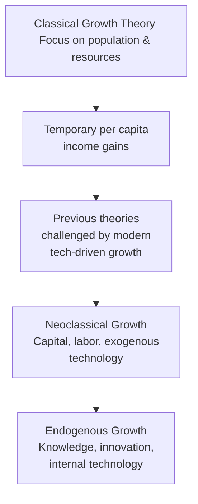

## 2.1 Economic Growth and Productivity Analysis

Economic growth is one of those big-picture topics that can, at first glance, seem a bit daunting—like staring at a massive puzzle you’re supposed to solve. But trust me, once we break it down, it all starts to feel almost intuitive. In a nutshell, economic growth captures how much more stuff—goods and services—an economy can produce compared to yesterday, last quarter, or five years ago. That “stuff” is typically measured as real GDP. And in finance, real GDP growth doesn’t just show up in government reports; it ripples through corporate earnings, interest rates, and even job opportunities.

Below, we’ll explore classic and contemporary growth theories, discuss why certain countries may be on different growth trajectories, and see how all this influences the investment landscape. We’ll also chat about the importance of productivity—basically, how well you and I (and everyone else in the workforce) turn inputs (time, resources, knowledge) into outputs (products, services, solutions). By the end, hopefully, you’ll see how a nation’s growth story can help shape your analytical and investment decisions.

## Defining Economic Growth and Its Importance

Economic growth refers to an economy’s increase in productive capacity over time, typically measured by the growth rate of real gross domestic product (GDP). But you know how companies talk about “earnings season” and everyone gets either excited or anxious about results? Countries experience a similar vibe in the macro sense. Economist watchers track growth rates because:

• Rising real GDP often implies rising household incomes and standards of living.  
• Companies are better positioned to increase revenue and profits in a healthier economy.  
• Strong growth can create new investment opportunities in both equity and fixed income markets.  

On the flip side, if growth slows or becomes negative (a recession), people tend to tighten their belts, corporate earnings can stumble, and asset valuations can wobble.

### Practical Impact

In everyday investing terms, if you anticipate that a country is on the verge of accelerating growth—maybe due to a surge in technology investments or favorable demographic trends—you might tilt your portfolio toward sectors most likely to benefit (like infrastructure, technology, or consumer discretionary). Conversely, if you foresee growth falling off a cliff, you might shift to defensive sectors or safer assets.

## Growth Theories

Understanding growth theories is kind of like unlocking the secret sauce behind why some countries boom while others struggle. Historically, there have been distinct schools of thought to explain this phenomenon. Let’s explore them.

### Classical Growth Theory

Classical growth theory, dating back to thinkers like Thomas Malthus, suggests that any rise in per capita income is temporary. Why? Because higher incomes lead to higher populations (more mouths to feed), which eventually eat up (no pun intended) the surplus, pushing incomes back down. In old agrarian economies, this made sense—land productivity was a big constraint, and population growth indeed often surpassed agricultural gains.

Of course, in today’s modern, technology-driven economies, we’ve mostly sidestepped these pitfalls with better farming technology, global distribution networks, and more advanced health and social systems. So, while classical theory paved the way, it’s not the final word.

### Neoclassical Growth Theory

Neoclassical growth theory focuses on three major drivers:  
• Capital Accumulation (things like factories, machinery, infrastructure)  
• Labor Growth (increased labor force)  
• Exogenous Technological Progress (productivity gains that magically appear from outside the system)

What’s neat here is the idea of diminishing returns: at some point, just adding more capital (or labor) yields fewer incremental gains. However, a boost in technology can offset those diminishing returns, maintaining or raising long-term growth potential.

In practice, governments often use policies—like subsidizing education, offering tax incentives for R&D, or investing in roads and bridges—to spur higher capital accumulation and, hopefully, higher growth. From a valuation perspective, analysts keep close tabs on these policies because they can reshape entire industries. An example might be the construction boom in an emerging economy that invests heavily in highways and high-speed rail.

### Endogenous Growth Theory

Endogenous growth theory keeps technology inside the system (i.e., technology is not just “handed down from on high”). It argues that innovation, the rate of entrepreneurship, and investment in knowledge capital (like R&D, universities, and patents) propel sustained growth. In other words, we humans are unstoppable idea machines that can keep pushing the frontier if the incentives are right.

One highlight of endogenous theory is the notion of reinforcing feedback loops. Maybe you’ve seen it in real life—once you have a thriving tech sector, you attract more tech startups, which produce spin-off innovations, which then boost your tech sector even further. Hello, Silicon Valley, right? Or consider a future scenario where Canada invests heavily in artificial intelligence—this could spark an AI ecosystem, leading to new AI-based industries, patents, training programs, and so on. As a finance professional, you’d then expect higher earnings from AI-driven companies, which in turn would appear in your valuation models.

## Convergence Hypotheses

Lots of folks wonder why some emerging markets grow super fast and whether they’ll eventually catch up with developed economies. That’s where convergence theories come in.

### Absolute Convergence

Also known as the “catch-up effect,” absolute convergence suggests that low-income countries should grow faster than high-income ones because they can adopt existing technologies and managerial know-how. They don’t need to reinvent the wheel; they just import it, tweak it, and run with it.

### Conditional Convergence

Then there’s conditional convergence, which says, “Sure, they’ll catch up—but only if they share similar institutional features as the high-income countries they’re chasing.” That means stable political systems, consistent savings rates, low corruption, decent property rights, and so forth. Without these, the growth gap can be stubborn to close.

From an investment standpoint, you might look for policy reforms (like anticorruption measures) or improving infrastructure (telecom expansions) as leading indicators that a particular emerging market is set for “catch-up” results.

## Key Drivers of Productivity

Thinking about productivity always brings to mind the phrase, “Work smarter, not harder.” Productivity is basically how much output we get for every unit of input (labor, capital). Below are the four main horsepower engines behind productivity.

### Capital Deepening

Capital deepening refers to increasing the amount of capital per worker. Imagine giving each worker in a factory more advanced tools, or a software developer a faster computer. If each worker is better equipped, total output per worker usually goes up.

### Technological Progress

This is the big game-changer. Technological progress implies ways to produce more output with the same (or fewer) inputs. Think of industrial robots in manufacturing or big data analytics in finance. These leaps forward are vital for sustaining growth, especially when additional capital or labor have limited returns.

### Human Capital and Education

I remember being astounded by how quickly East Asian economies, such as South Korea, moved up the value chain after heavily investing in education. Skilled and educated workforces don’t just do tasks better; they innovate, optimize processes, and become entrepreneurial. For analysts in the finance world, a country’s investment in education can be a leading indicator for future industries and corporate growth.

### Resource Management

Natural resources can be a blessing (if managed well) or a curse (if mismanaged). Having abundant oil reserves, for instance, can generate massive government revenue that can be reinvested in infrastructure or social programs to spike long-term productivity. Or it can lead to corruption and one-dimensional economic structures that falter when commodity prices drop. 

## Demographics and Labor Force Participation

Demographics shape the size and skills of the labor force:  
• Aging populations: This can reduce the overall labor force participation rate, especially if older adults retire and fewer young workers are net entrants. Many developed countries, including the U.S. and Canada, face these demographic headwinds.  
• Immigration policies: If a country welcomes high-skilled immigrants, it can mitigate some of the negative effects of an aging population.  
• Diversity and labor mobility: Ensuring individuals can move from lower productivity regions or sectors to higher productivity ones fosters overall economic growth.

In my opinion, these demographic shifts are a big deal. I recall reading how Japan has struggled with stagnating population growth for decades, and it’s affected everything from consumer markets to currency valuation. 

## Application in Analysis

So, how do you apply all this lofty economic talk to everyday financial analysis? Well, if you suspect that a country’s growth will be robust (based on strong capital investment, favorable demographic trends, or a big push into new tech), you might raise your earnings forecasts for companies operating there. This influences valuations, credit risk assessments, and even the selection of forward P/E ratios in equity analysis.

For example, let’s say you’re evaluating a Canadian tech firm. You see that the Canadian government is enacting supportive R&D tax credits and AI-friendly immigration policies that attract top talent. This context might lead you to project higher future cash flows. Indeed, your entire discounted cash flow (DCF) valuation could shift upward as your revenue growth assumptions rise.

Similarly, for bond investors, a stronger growth outlook might lead to expectations of higher interest rates (if inflation looms), compressing bond prices, or it might raise the attractiveness of corporate bonds if default risk seems lower due to stronger economic conditions.

## A Mermaid Diagram of Growth Theories

Here’s a simple visual map of the growth theories we discussed, just to bring it all together in a single snapshot:

## Incorporating Financial Standards and Ethical Dimensions

Measuring and reporting factors that drive productivity—like capital investment in intangibles—can be influenced by accounting frameworks. For instance, under IFRS and US GAAP, certain R&D expenditures might be expensed immediately, which can obscure the true level of investment in intellectual property. This often impacts how we measure and compare productivity across firms or countries with different accounting treatments.

Ethically, governments might be tempted to present rose-colored GDP data or manipulate statistics to appear more robust internationally. As an analyst, you should remain vigilant, cross-reference multiple data sources, and question anomalies in official numbers. In the CFA Program, we emphasize professional skepticism and thorough due diligence—especially in macroeconomic analysis, where data can get politicized.

## Best Practices, Pitfalls, and Challenges

• Best Practices:  
  - Use a wide range of data points—GDP, productivity indexes, labor force data—to form a holistic view.  
  - Incorporate scenario analysis (you probably remember the simulation methods from Chapter 1).  
  - Keep an eye on structural reforms (like judicial independence or property rights) that might boost conditional convergence.

• Common Pitfalls:  
  - Relying on official data without verifying its source or methodology.  
  - Overestimating growth potential if technology adoption is slow due to cultural or institutional barriers.  
  - Ignoring demographic time bombs, especially in developed countries with aging populations.

• Challenges:  
  - Political and policy uncertainty can drastically alter growth outlooks.  
  - Technological disruption can shift growth patterns in unpredictable ways (think about how quickly smartphones and the internet changed global commerce).  
  - Resource booms might hide underlying structural weaknesses.

## A Quick Look at a Simple Productivity Formula

Sometimes it helps to have a small formula in mind. One stylized approach is:


\text{Real GDP Growth} \approx \text{Labor Force Growth} + \text{Growth in Labor Productivity}.


And “Growth in Labor Productivity” might be broken down further into capital deepening and technological improvements. Keep in mind this is a simplified version—real economies are messy. Still, it’s a nice framework for thinking about how changes in each component can drive the overall growth rate.

## Conclusion and Final Exam Tips

Economic growth isn’t just a side note you read about in the news; it’s central to understanding market trends, sector rotations, corporate profitability, and even currency movements. By recognizing the interplay between capital, labor, technology, and institutions, you’ll gain a sharper lens through which to evaluate investment opportunities. 

Some final exam pointers:

• Stay sharp on the definitions. Know the difference between absolute and conditional convergence, and how each might impact emerging markets.  
• Understand the fundamentals of each growth theory—Classical, Neoclassical, and Endogenous—and how government policies can shift the trajectory.  
• Bring in real-world data. Expect the CFA exam or client-facing roles to test your ability to interpret growth numbers in a practical context.  
• Draw connections. For instance, how might a policy that encourages R&D also impact productivity, potential GDP, and corporate earnings?  

Let’s be honest, it can feel overwhelming. But with consistent practice (and maybe a few mental breaks here and there), you’ll start to see the bigger picture. 

## References and Further Reading

• Mankiw, N.G. (2019). “Macroeconomics.” Worth Publishers.  
• Barro, R.J. & Sala-i-Martin, X. (2004). “Economic Growth.” MIT Press.  
• Bank of Canada Publications: [https://www.bankofcanada.ca/research/](https://www.bankofcanada.ca/research/)  
• U.S. Bureau of Labor Statistics (Productivity): [https://www.bls.gov/productivity/](https://www.bls.gov/productivity/)  

---

## Test Your Knowledge: Economic Growth and Productivity Quiz



### Which economic theory posits that per capita income gains are often temporary due to population growth outstripping productivity gains?

- [x] Classical Growth Theory
- [ ] Neoclassical Growth Theory
- [ ] Endogenous Growth Theory
- [ ] Conditional Convergence

> **Explanation:** Classical Growth Theory, often associated with Malthus, argues that per capita income improvements are eroded by population increases.

### According to Neoclassical Growth Theory, which factors primarily drive long-term economic growth?

- [x] Capital accumulation, labor growth, and exogenous technological progress
- [x] Diminishing returns and government policies
- [ ] Population control and resource distribution
- [ ] Significantly high consumer debt levels

> **Explanation:** Neoclassical Theory highlights capital accumulation, labor, and external (exogenous) advances in technology. Government policies can facilitate capital and labor growth but are not the sole driver.

### Under Endogenous Growth Theory, which factor is considered endogenous in driving long-term growth?

- [x] Technology and innovation
- [ ] Foreign direct investment alone
- [ ] Strict population controls
- [ ] Classical land constraints

> **Explanation:** Endogenous Growth Theory incorporates technology and innovation as internally generated forces, not external to the model.

### Absolute convergence suggests:

- [x] Poorer economies can achieve higher growth rates than richer ones and catch up over time.
- [ ] Only countries with similar institutions grow at the same rate.
- [ ] Expansionary fiscal policy is the main impetus for growth.
- [ ] Rich countries will always continue to outpace poorer countries in growth.

> **Explanation:** Absolute convergence is the theory that low-income economies grow faster by adopting existing technologies, potentially catching up with higher-income economies.

### Which of the following statements about productivity is correct?

- [x] Productivity gains arise when the same inputs produce more outputs.
- [ ] Productivity gains have no bearing on overall economic growth.
- [x] Human capital investments can significantly improve productivity.
- [ ] Productivity improvements are not relevant in service-based economies.

> **Explanation:** Productivity represents how effectively inputs are turned into outputs. Improving worker skills, technology, and processes are critical for boosting productivity.

### How can age demographics negatively impact an economy’s long-term growth?

- [x] An aging population can reduce labor force participation and overall economic output.
- [ ] A younger population always leads to lower unemployment.
- [ ] Employment rates are unaffected by the number of retirees.
- [ ] Countries with aging societies typically have zero growth.

> **Explanation:** Older populations often place strains on pension and healthcare systems while withdrawing labor force participation.

### When analyzing a high-tech firm in a market with strong R&D tax incentives, which of the following might you reasonably adjust upwards?

- [x] The growth rate of future revenue due to favorable innovation policies
- [ ] The firm’s terminal value discount rate
- [x] The capital expenditures due to increased R&D spend
- [ ] The maturity of the firm’s existing debt

> **Explanation:** Favorable R&D tax incentives can boost innovation and revenue potential, thus affecting revenue growth assumptions and capital expenditures.

### Conditional convergence states that:

- [x] Economies converge in income levels only if they share similar structural characteristics.
- [ ] All countries will converge regardless of institutional differences.
- [ ] Technological progress is irrelevant for economic convergence.
- [ ] Population growth has no role in shaping convergence.

> **Explanation:** Conditional convergence recognizes that certain institutional factors (like savings rates, political stability, and property rights) must be similar in order for economies to catch up in per capita GDP.

### Which of the following is a potential pitfall in measuring economic growth cross-nationally?

- [x] Differences in accounting treatments (IFRS vs. US GAAP) for R&D can distort reported capital investment.
- [ ] GDP data is always standardized internationally.
- [ ] Demographic data is entirely irrelevant to macroeconomic modeling.
- [ ] Technological progress cannot be quantified at all.

> **Explanation:** Accounting differences—especially regarding intangible assets—can make it tricky to compare R&D and productivity investments across countries.

### True or False: Under Endogenous Growth Theory, innovation is considered an external factor that has little to do with government policy.

- [x] False
- [ ] True

> **Explanation:** In Endogenous Growth Theory, innovation is driven by factors within the economy (e.g., R&D, knowledge capital), and government policy can play a significant role in fostering or hindering it.


