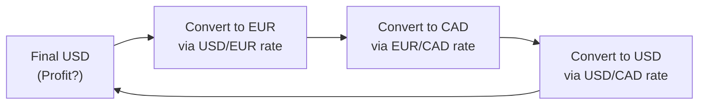

## 2.2 Exchange Rate Determination and Forecasting

Ever find yourself standing in an airport, scanning the big digital board of currency exchange rates, thinking, “Where do these numbers come from?” Maybe you’re heading to Vancouver for a fun skiing trip, or to New York for business, and you see the USD/CAD rate flash across the ticker. Well, exchange rates are more than just scoreboard figures — they’re deeply influenced by a variety of economic, political, and market-driven factors. In this section, we’ll dissect how exchange rates are determined, explore some core theoretical frameworks, and discuss methods to predict currency movements. Consider this your go-to guide for making sense of all those foreign-exchange (FX) abbreviations and towering equations.

----------------------------------
## Spot Rates vs. Forward Rates

Let’s start with the basics:

• A spot rate is the current exchange rate for immediate settlement, typically within two business days in major currency markets.  
• A forward rate is a contractual rate set today for an exchange of currencies to take place at a future date, say 30, 90, or even 180 days from now.

The difference between spot and forward rates often reflects anticipated changes in interest rates, supply-and-demand factors, or market expectations of risk. If you happen to see a forward rate quoted at a premium compared to the spot, that might mean the market expects the base currency (the currency you’re “buying”) to be stronger in the future. Conversely, if the forward rate is discounted relative to the spot, it might reflect expectations of depreciation.

### The Link Between Interest Rates and Forwards

There’s a classic relationship in FX that sets forward prices in line with interest rates of two currencies. The formula for the theoretically “no-arbitrage” forward price (on an annualized basis) is often expressed as:


F_{A/B} = S_{A/B} \times \frac{1 + i_{A}}{1 + i_{B}}


Here:  
• \\( S_{A/B} \\) is the spot rate (the price of Currency A in terms of Currency B).  
• \\( i_A \\) is the interest rate for Currency A.  
• \\( i_B \\) is the interest rate for Currency B.  
• \\( F_{A/B} \\) is the forward rate.  

This no-arbitrage condition is based on the idea that if forward rates deviate from this ratio, astute traders could make a riskless profit by borrowing in one currency, converting to the other, and locking in a forward contract to convert back.

Anyway, that’s the conceptual foundation explaining why forward and spot rates diverge and by how much.

----------------------------------
## Currency Parities and Theoretical Underpinnings

Economic theory provides a set of “parities” that reveal how exchange rates might move over different time horizons:

### Interest Rate Parity (IRP)

Sometimes, just hearing “Interest Rate Parity” is enough to make folks roll their eyes and recall some sleepless nights of studying. But IRP is basically the bedrock for forward rates. It states that the forward premium or discount on a currency should be equal to the interest-rate differential between two currencies. This can be in a covered sense (using forward contracts to lock in exchange exposure) or uncovered sense (no forward contract or hedge).

• **Covered IRP** states there should be no arbitrage if you fully hedge your foreign exchange exposure.  
• **Uncovered IRP** states that expected future spot rates are driven by those same interest-rate differentials — without the safety net of a forward or option contract.

To be honest, uncovered IRP can seem a bit more theoretical because actual markets are far from frictionless: capital controls, trade barriers, and risk premiums might mean currency movements deviate from that neat formula.

### Purchasing Power Parity (PPP)

Have you ever compared the price of a latte in New York to one in Toronto or Paris? If the idea of PPP holds, in the long run, exchange rates will adjust so that identical goods cost roughly the same across countries. Classic textbooks will show the “Big Mac Index” as an example of PPP in action. In practice, PPP is rarely perfect in the short run due to market frictions (like shipping costs, taxes, brand power, etc.). However, over a lengthy horizon, exchange rates do tend to reflect price differentials: higher inflation typically leads to currency depreciation, preserving real purchasing power across nations.

### International Fisher Effect

Remember Irving Fisher, the economist who gave us the Fisher Equation linking nominal interest rates, real interest rates, and inflation? The International Fisher Effect extends that logic to currency markets: currencies with higher nominal interest rates should experience higher expected inflation, which can lead to currency depreciation over time. So, if you see a country with sky-high nominal rates, you might guess they’ll face more inflation, eventually chipping away at their currency’s value.

----------------------------------
## Triangular Arbitrage

“Triangular arbitrage” might sound like some exotic martial art, but it’s actually a straightforward way to exploit small misalignments in currency quotes. It involves three currencies, say USD, CAD, and EUR. If the cross-rates among these three are not consistent, you could theoretically start with USD, convert to EUR, then convert EUR to CAD, and finally convert CAD back to USD. If at the end of this chain you end up with more USD than you started with (without risking your own capital in a directional bet), you’ve successfully performed a triangular arbitrage.

Here’s a simplified diagram:

Realistically, high-speed trading algorithms search obsessively for these tiny discrepancies in real time. Because markets are so interconnected, triangular arbitrage opportunities vanish quickly once discovered.

----------------------------------
## Factors Influencing Currency Values

Exchange rates ebb and flow like ocean tides, influenced by a mix of:

1. **Economic Indicators**  
   • Inflation: Higher inflation generally leads to depreciation.  
   • Interest Rates: Countries with higher interest rates often attract more capital inflows, supporting currency appreciation — at least in the short run.  
   • GDP Growth: Strong growth tends to bolster a currency, assuming inflation stays in check.  
   • Current Account Balances: Surplus countries often see upward pressure on their currencies; deficit countries might suffer the opposite.

2. **Political Factors and Policy**  
   Political stability, election outcomes, central bank independence, and fiscal/monetary policies all shape currency sentiment. For instance, if a government imposes capital controls, it can dramatically alter flows.

3. **Market Sentiment**  
   Sometimes, currency markets follow investor whims. When cracks of uncertainty appear in global markets, the U.S. Dollar often gains (safe-haven flows). Or if there’s optimism about emerging markets, capital might flee from the USD into higher-yielding currencies.

----------------------------------
## Forecasting Approaches

Unlike predicting the next Netflix show you’ll binge, forecasting exchange rates can be tricky. Currency analysts typically rely on a few major approaches:

### Fundamental Analysis

The fundamental angle uses economic data such as GDP growth, inflation, unemployment, trade balances, and interest rates to predict currency paths. Imagine you observe a spike in interest rates in Canada relative to the U.S. You might project the CAD to appreciate (assuming uncovered interest rate parity). But watch out: real markets are never that simple. One might also consider commodity cycles, trade relationships, and structural factors like government debt.

### Technical Analysis

Technical analysis involves dissecting historical price charts to find patterns or trends. Indicators like moving averages, RSI (Relative Strength Index), and MACD (Moving Average Convergence Divergence) can hint at overbought or oversold conditions. Personally, I find it fascinating how a simple moving average crossover can sometimes signal short-term momentum shifts in currency markets — though it’s definitely not foolproof. Remember: correlation is not causation.

### Carry Trade Analysis

A carry trade is when you borrow in a currency with a low interest rate (like the Japanese Yen historically) and invest in a currency with a higher interest rate (like the Australian Dollar). The profit is the interest-rate differential, provided the high-interest currency doesn’t depreciate too much or get hammered by a market shock. During times of global risk aversion, these trades can unravel quickly, precipitating sharp currency moves. In short, carry trades can be a sweet deal in stable markets but can go up in flames if volatility or risk aversion jump.

----------------------------------
## Example: USD/CAD Pair

Let’s look at the USD/CAD pair, which is often significantly influenced by relative interest rates and commodity prices:

• **Interest Rate Moves**  
  If the Bank of Canada suddenly raises rates more than the U.S. Federal Reserve, it may attract foreign capital, leading to CAD appreciation. But only if markets expect that interest-rate advantage to last.

• **Oil Prices**  
  Canada is a big energy exporter, so higher oil prices can boost Canadian exports and support the CAD. Conversely, a dramatic fall in oil prices can weaken the CAD.

• **Market Sentiment and Global Growth**  
  In times of severe global volatility, investors might jump to the U.S. Dollar for safety. That “flight to quality” can overshadow fundamentals, meaning USD/CAD can move as risk appetite fluctuates.

----------------------------------
## Glossary

• **Spot Rate:** The current exchange rate for immediate currency delivery.  
• **Forward Rate:** The agreed-upon exchange rate today for settlement at a specific future date.  
• **Interest Rate Parity (IRP):** Condition where currency forward premiums or discounts offset interest-rate differentials.  
• **Triangular Arbitrage:** Exploiting FX rate misalignments among three currencies to earn riskless profit.  
• **Carry Trade:** Borrowing in a lower-rate currency, investing in a higher-rate currency, hoping to pocket the interest differential.  
• **Safe-Haven Currency:** A currency that typically strengthens throughout market turmoil (e.g., USD, CHF, and occasionally JPY).  
• **Market Sentiment:** Collective psychology of market participants, influencing risk appetite and capital flows.

----------------------------------
## Final Exam Tips

1. **Understand the Formulas:** Make sure you really know the interest-rate parity and PPP equations. On exam day, you’ll likely see them in a vignette linking spot/forward quotes and interest rates.  
2. **Watch Out for Triangular Arbitrage:** You could be given multiple exchange rates in different formats. Always confirm that the cross-rates are consistent. If they aren’t, that’s your sign to do some quick math.  
3. **Distinguish Long-Run vs. Short-Run Theories:** PPP is more about the long haul, while interest rate parity can be relevant both short- and medium-term.  
4. **Keep an Eye on Practical Nuances:** The exam might slip in details about transaction costs or capital controls, which can disrupt these “textbook” relationships.  
5. **Practice Quick Conversions:** You may need to convert from direct to indirect quotes (e.g., USD/CAD to CAD/USD). Speed matters.

----------------------------------
## References and Further Reading

- Shapiro, A.C. (2013). “Multinational Financial Management.” Wiley.  
- Eun, C.S., & Resnick, B.G. (2018). “International Financial Management.” McGraw-Hill.  
- Federal Reserve Board:  
  <https://www.federalreserve.gov/>  
- Bank of Canada Exchange Rates:  
  <https://www.bankofcanada.ca/rates/exchange/>

----------------------------------

## Test Your Knowledge: Exchange Rate Determination and Forecasting Quiz



### 1. Which of the following statements best describes the relationship between spot and forward exchange rates?

- [ ] Forward rates are always lower than spot rates due to inflation expectations.  
- [x] Forward rates may be at a premium or discount relative to spot based on interest-rate differentials.  
- [ ] Spot rates are determined only by government regulation.  
- [ ] Spot rates are always higher than forward rates.  

> **Explanation:** Forward exchange rates reflect market expectations and interest-rate differentials. A currency’s forward premium or discount depends on the difference between its interest rate and that of the counterparty currency.

### 2. According to covered interest rate parity (IRP), which of the following should hold true in equilibrium?

- [x] No opportunities for riskless profit exist when using forward contracts to hedge.  
- [ ] Traders can earn unlimited profits if they pick the correct currency pair.  
- [ ] Higher interest rates always mean a currency will appreciate outright.  
- [ ] Currencies with lower interest rates always trade at a forward discount.  

> **Explanation:** Covered IRP posits that forwarding the currency position removes any arbitrage opportunity because the forward rate adjusts to offset interest-rate differentials.

### 3. A Canadian investor notices that the one-year interest rate in Canada is 2% while the one-year rate in the U.S. is 1%. Which statement about forward USD/CAD rates is most accurate under uncovered interest rate parity?

- [ ] The USD should trade at a forward premium vs. the CAD.  
- [ ] The CAD should trade at a forward discount vs. the USD.  
- [x] The CAD is expected to appreciate relative to the USD in one year if uncovered IRP holds.  
- [ ] The interest-rate difference predicts no change under uncovered IRP.  

> **Explanation:** Under uncovered IRP, the currency of the nation with the higher interest rate is expected to depreciate less or appreciate more slowly, although real-world complexities can cause deviations.

### 4. According to the International Fisher Effect:

- [ ] Higher nominal interest rates indicate undervalued currency.  
- [ ] Lower nominal interest rates always lead to currency depreciation.  
- [x] Higher nominal interest rates are typically associated with higher expected inflation and potential depreciation.  
- [ ] Nominal rates have no correlation with inflation expectations.  

> **Explanation:** The International Fisher Effect links higher nominal rates to higher expected inflation over time, implying possible currency depreciation.

### 5. Which of the following best describes a triangular arbitrage scenario?

- [x] Converting one currency to a second, the second to a third, then the third back to the first to exploit exchange-rate inconsistencies.  
- [ ] Purchasing gold in one country and selling it in another.  
- [x] Discovering misaligned FX cross-rates and executing trades for a riskless profit.  
- [ ] Engaging in forward contracts to offset uncovered interest rate parity.  

> **Explanation:** Triangular arbitrage takes advantage of inconsistent cross-currency quotes among three currencies, allowing for a riskless gain.

### 6. Which factor is least likely to significantly influence short-term currency value?

- [ ] Changes in market sentiment.  
- [ ] Central bank interest-rate decisions.  
- [x] Long-term demographic trends.  
- [ ] Political announcements or policy shifts.  

> **Explanation:** Demographic shifts often unfold over decades and generally do not cause immediate fluctuations in currency prices, whereas the other factors can affect currency values in the short run.

### 7. In fundamental analysis for forecasting exchange rates, which data points are typically considered most important?

- [x] Inflation, interest rates, GDP growth, and current account balances.  
- [ ] Historical chart patterns and moving averages.  
- [x] Employment data, trade deficits, and policy decisions.  
- [ ] Only capital controls.  

> **Explanation:** Fundamental analysis focuses on macroeconomic indicators such as inflation, interest rates, growth, trade balances, employment, and policy climate. Chart patterns and moving averages generally fall under technical analysis.

### 8. Which type of currency forecasting primarily relies on price patterns and historical trends?

- [ ] Fundamental Analysis.  
- [x] Technical Analysis.  
- [ ] Political Analysis.  
- [ ] Capital Control Analysis.  

> **Explanation:** Technical analysis uses price history, trends, and indicators (like moving averages, RSI) to predict future price movements.

### 9. An investor borrows JPY at 0.1% and invests in a currency with a yield of 3%. Which term best describes this strategy?

- [ ] Hedged trade.  
- [ ] Forward rate bias.  
- [x] Carry trade.  
- [ ] Triangular arbitrage.  

> **Explanation:** Borrowing low-yield currency to invest in higher-yield currency is a classic example of a carry trade.

### 10. True or False: Purchasing Power Parity (PPP) is generally regarded as a strong predictor of short-term currency movements.

- [ ] True  
- [x] False  

> **Explanation:** PPP often applies to long-run movements in exchange rates, not short-term fluctuations, which are more influenced by interest rates, capital flows, policy surprises, and investor sentiment.


