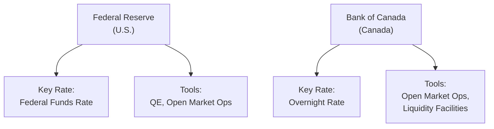
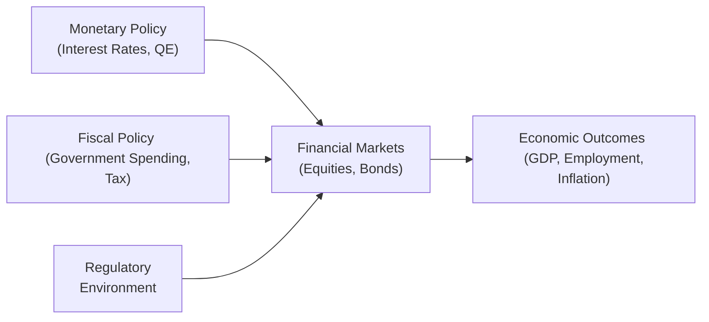

## 2.5 Canadian and U.S. Policy Perspectives

It’s funny, I still remember my first real “aha” moment with policy differences between Canada and the U.S. I was studying for an exam (a big one—not quite the CFA, but you get the idea), and I realized just how much central banks and governments can shape the economy’s ups and downs. In this section, let’s take a friendly tour through how the U.S. Federal Reserve and the Bank of Canada each operate, how their decisions ripple into exchange rates, investments, and growth, and how everything from harsh winters to corporate tax reform can shift entire economies. Cozy up, and let's dive right in.

---

### Central Banking Frameworks

Central banks control the monetary levers that (hopefully) keep inflation under control, maintain stable currency values, and influence employment levels. Both the Federal Reserve (the “Fed”) in the U.S. and the Bank of Canada (BoC) have unique mandates that guide their policy decisions.

#### The Federal Reserve (U.S.)

The Federal Reserve was established in 1913, and it targets two things—maximum employment and stable prices—often referred to as the “dual mandate.” If the economy is overheating, the Fed might raise interest rates or use other tools to slow things down. If the economy is slumping, the Fed can cut rates or engage in “quantitative easing” (QE), where it buys bonds and other assets to pump money into the system.

• Dual Mandate: The Fed tries to balance low unemployment with a healthy level of price stability.  
• Key Interest Rate: The federal funds rate is the primary policy tool. Market participants closely track it because it impacts the entire yield curve, from overnight loans to mortgages.  
• Quantitative Easing (QE): Used in extreme conditions (think the 2008 crisis). The Fed buys large quantities of government bonds or mortgage-backed securities (MBS), injecting liquidity into financial markets.

#### The Bank of Canada (BoC)

The Bank of Canada is a bit younger (established 1935) and has a somewhat simpler approach—essentially, to keep inflation around 2% (give or take 1%). That’s the sweet spot. Though it doesn’t talk as explicitly about employment as the Fed does, stable inflation is assumed to foster steady economic growth and job creation.  

• Primary Mandate: Promote economic and financial welfare, with a focus on hitting that inflation target (2% midpoint).  
• Overnight Rate: The BoC’s policy rate influences Canadian bank lending rates, mortgages, and (yes!) the Canadian dollar’s strength against foreign currencies.  
• Inflation Targeting: An explicit strategy to anchor expectations. If inflation drifts too high, the BoC may raise rates to cool the economy. If inflation is too low, it eases policy to encourage borrowing and spending.

Changes in either central bank’s key rates can lead to capital inflows or outflows. For instance, if Canada unexpectedly hikes rates, global investors might pour money into Canadian assets, strengthening the CAD (Canadian dollar).

---

### Monetary Policy Tools & Distinctions

It’s helpful to see how these tools fit together. Here’s a simple diagram comparing the Fed and the BoC in terms of policy actions:

When the Fed cuts the federal funds rate, it’s signaling that it wants to lower borrowing costs and spur economic activity. Similarly, the BoC adjusts the overnight rate to keep inflation on target and the economy stable. Both can use Open Market Operations (e.g., buying or selling government bonds) to hit these interest rate targets.

---

### Monetary and Fiscal Policy Differences

If you’re feeling a little overwhelmed, remember that in the U.S., we have a large federal system, while Canada’s structure divides a lot of responsibilities between federal and provincial levels. Both, however, rely on a mix of monetary and fiscal policies to steer their respective economies.

#### United States Fiscal Policy

The U.S. government’s fiscal policy is primarily determined by Congress and the President. This includes setting federal tax rates, adjusting spending, and managing deficits. States also have autonomy, issuing municipal bonds, levying taxes, and managing budgets independently. For instance:

• Federal-Level Deficits: The U.S. can run a large federal deficit. This might raise concerns about long-term debt sustainability or push interest rates higher if investors demand a premium.  
• Local Influence: States and municipalities can affect local bond markets. A municipal bond interest rate might differ from the federal government’s bond yields due to credit risk, tax treatments, or a host of other factors.

#### Canadian Fiscal Policy

Canada’s fiscal policy is set at the federal level, with the Parliament and the Department of Finance guiding overall budgets, taxation, and spending. Provincial governments also have significant autonomy, especially in areas like healthcare and education, which can lead to differences in tax levels and public services across provinces.

• Federal Budget: Canada’s federal government runs deficits or surpluses (though surpluses have been rare in recent decades) and manages the federal debt.  
• Provincial Budgets: Provinces can issue their own bonds, manage healthcare expenditures, and set provincial taxes. For example, Alberta once had a “resource boom” that funded lower tax rates, while Quebec invests heavily in social services.

#### How Fiscal Deficits Affect Bond Yields and Exchange Rates

Bigger deficits can mean more government borrowing. In the U.S., large Treasury issuances can push up yields if demand doesn’t keep pace. Conversely, when investors flock to “safe havens”—like U.S. bonds in times of global crisis—yields can actually fall, even if deficits are large. It’s a bit counterintuitive, right?

In Canada, the bond market reacts similarly, but on a smaller scale. If the federal or provincial deficits widen too much, bond yields might creep higher, and some investors could worry about credit-rating downgrades. Also, currency values often shift based on perceived government stability: a safer environment can strengthen the currency, while concerns about debt can weaken it.

---

### Regulatory Environments Affecting Macroeconomic Outcomes

Regulatory structures influence how markets function and how quickly capital flows from one avenue to another. If regulators in either country tighten capital requirements or change financial rules, that can impact lending, borrowing, and investment decisions.

• U.S. Regulation: The Securities and Exchange Commission (SEC) enforces federal securities laws, ensuring transparency in capital markets. American banks also face federal oversight from entities like the Office of the Comptroller of the Currency (OCC) and the Federal Reserve itself.  
• Canadian Regulation: There isn’t a single Canadian securities regulator at the federal level. Instead, each province (Ontario, Quebec, Alberta, etc.) has its own securities commission, all loosely coordinated by the Canadian Securities Administrators (CSA). This can lead to subtle differences in market rules and oversight across provinces.

Stricter capital requirements for banks (in line with Basel III, for instance) can ripple through the economy: banks approve fewer loans or demand higher interest rates, shaping economic growth dynamics. Policy watchers track these changes closely—especially in an exam setting—because they dramatically affect credit conditions and investor sentiment.

---

### Examples of Policy Impacts

#### Harsh Winter Effects in Canada

Imagine a harsh winter that clobbers Canada’s manufacturing output in southern Ontario. If production levels drop and GDP data looks weak, the Bank of Canada might step in with a rate cut—especially if it suspects this slowdown is more than a brief blip. Now, ironically, if the winter is so bad that energy demand soars, oil and gas producers in western Canada may experience higher revenues, partially offsetting the manufacturing slump. So, the BoC has to tease apart transient weather patterns from deeper, structural issues.

#### U.S. Tax Policy Changes

Now let’s hop across the border: suppose the U.S. Congress enacts a big corporate tax break. Suddenly, after-tax profits for Fortune 500 companies may rocket, which can boost stock prices and attract global investors. With that capital surging into the U.S. equity markets, the dollar might strengthen. At the same time, foreign companies might consider relocating or launching bigger operations in the U.S. to take advantage of favorable corporate tax rates. This can lead to a longer-term shift in capital flows and potential job growth in certain regions, changing the macroeconomic landscape.

---

### Practical Financial Examples and Case Studies

Let’s say you’re an investment analyst covering cross-border stocks between the U.S. and Canada:

• You notice the Fed is expected to raise rates by 25 basis points next quarter, while the BoC is likely to hold steady. Higher U.S. rates could nudge investors to buy U.S. dollar-denominated assets, possibly pushing the USD/CAD exchange rate higher (the Canadian dollar weakens).  
• You see Canada’s federal government is planning a stimulus program that will bump up spending in infrastructure. That might increase economic growth in the short term but also push federal deficits a bit higher. Yields on Canadian bonds could shift in response—maybe creeping higher to reflect increased borrowing or staying stable if foreign demand for safe credit is strong.

From a portfolio management standpoint, you’d likely factor these macro policies and expectations into your asset allocation decisions. Are you overexposed to interest-rate-sensitive Canadian bonds? Might it be a good time to buy U.S. equities, anticipating a tax-related boost to earnings?

---

### Glossary

• Quantitative Easing (QE): A monetary policy in which a central bank buys government bonds or other financial assets to inject liquidity into the economy.  
• Inflation Targeting: A central bank policy aiming to keep inflation around a set target, commonly around 2%.  
• Federal Funds Rate: The U.S. key interest rate target used by the Federal Reserve to influence monetary policy.  
• Provincial Regulators (Canada): Securities Commissions in each province (e.g., Ontario Securities Commission, Autorité des marchés financiers in Quebec) that oversee market conduct.  
• Dual Mandate (U.S.): The Federal Reserve’s statutory objectives of maximum employment and stable prices.  
• Fiscal Deficit: The shortfall when government expenditures exceed revenues during a given time period.

---

### Using Diagrams to Visualize Macro Interactions

Below is a simplified illustration showing how monetary and fiscal policies, plus regulatory changes, might converge to affect an economy:

• A rate hike (A) impacts bond yields and equity valuations (B).  
• Changes in government spending or corporate tax rates (C) move the stock and bond markets (B).  
• Regulatory shifts (D) can affect risk-taking or capital allocation (B).  
• All these eventually show up in macro indicators like GDP, employment, and inflation (E).

---

### Common Pitfalls and Best Practices

• Overlooking Provincial vs. State Nuances: Don’t lump Canada’s provinces and U.S. states into one bucket—there are real differences in autonomy and budgeting authority.  
• Ignoring Regulatory Changes: A new SEC rule or a provincial regulator shift can curb certain types of trading or encourage new market entrants, altering liquidity and valuations.  
• Misreading Monetary Policy Signals: Sometimes, central banks send signals about future decisions (“forward guidance”). Don’t be fooled by short-term headlines alone; look for official commentary and economic data trends.

---

### Encouraging Critical Thinking

It helps to ask open-ended questions:

• How might an unexpected policy pivot by the Fed disrupt a global carry trade (borrowing in a currency with low rates and investing in a higher-yielding currency)?  
• Would a shift in Canadian consumer behavior (say, a real estate slowdown in Toronto) be big enough to affect national GDP data, thereby prompting a BoC rate cut?  
• If the U.S. tightens bank regulations significantly, would that push financial companies to expand more aggressively in other countries, including Canada?

These sorts of questions can open up deeper layers of understanding, which is precisely what the CFA Level II exam might target.

---

### Conclusion

Canadian and U.S. policy perspectives are fascinating—not least because they differ in structure, mandates, and regulatory intricacies. The Fed’s dual mandate contrasts with the Bank of Canada’s near-singular focus on inflation targeting, and each country’s fiscal policy operates within distinct federal and provincial/state frameworks. Markets respond quickly to these signals, whether through interest rates, currency moves, equity valuations, or bond yields. By staying alert to these policy shifts and understanding how they intertwine with broader macroeconomic conditions, you’ll be well on your way to making more informed investment decisions and nailing those trickier exam questions.

---

### Final Exam Tips

• Stay Alert to Federal Communications: Fed speeches (like the FOMC press conferences) and BoC’s Monetary Policy Reports can be crucial signals.  
• Monitor Exchange Rate Movements: A rate differential often influences currency movements. Practice connecting policy changes to exchange rate fundamentals.  
• Understand Regional Influences: In Canada, watch for key provincial budget announcements. In the U.S., keep an eye on big federal spending bills or tax reforms.  
• Apply Macroeconomic Concepts to Real Cases: Examples are often tested in a practical, scenario-based manner.  
• Practice Comparative Analysis: The exam might ask you to contrast the Fed’s dual mandate with the BoC’s singular inflation-targeting.  

---

### References & Further Reading

• [Bank of Canada Monetary Policy Reports](https://www.bankofcanada.ca/publications/mpr/)  
• [Federal Reserve Economic Data (FRED)](https://fred.stlouisfed.org/)  
• [Government of Canada Department of Finance](https://www.fin.gc.ca/)  
• [Congressional Budget Office (U.S.)](https://www.cbo.gov/)  

---

## Canadian and U.S. Policy Perspectives Exam-Style Questions



### Which central bank explicitly follows a dual mandate of maximum employment and stable prices?

- [ ] Bank of Canada
- [ ] European Central Bank
- [x] Federal Reserve (U.S.)
- [ ] Bank of England

> **Explanation:** The Federal Reserve has a dual mandate under U.S. law to promote maximum employment and maintain price stability.  

### Under an inflation-targeting framework, what is the typical target used by the Bank of Canada?

- [ ] 0% inflation
- [ ] 3% inflation
- [x] 2% inflation (±1%)
- [ ] 2.5% inflation

> **Explanation:** The Bank of Canada aims to keep inflation as close as possible to 2%. The target range is usually between 1% and 3%.  

### A surprise rate hike by the Bank of Canada is most likely to do which of the following in the short term?

- [ ] Weaken the Canadian dollar
- [x] Strengthen the Canadian dollar
- [ ] Depreciate the U.S. dollar
- [ ] Lower bond yields globally

> **Explanation:** A higher Canadian policy rate can attract foreign capital, increasing demand for the Canadian dollar and thus appreciating its value.  

### When the U.S. federal government continues to run large fiscal deficits, which of the following can be an immediate effect on Treasury bond yields?

- [x] Yields may rise if supply outstrips demand
- [ ] Yields may always fall
- [ ] Yields cannot be influenced by deficits
- [ ] Yields solely depend on credit ratings

> **Explanation:** Persistent deficits increase the supply of Treasury bonds. If demand from investors doesn’t keep up, yields can move higher to attract buyers. However, safe-haven demand can sometimes offset this effect.  

### Which of the following is a key difference between the Bank of Canada and the Federal Reserve?

- [x] The Federal Reserve has a dual mandate, while the Bank of Canada primarily focuses on inflation targeting.
- [ ] The Bank of Canada is a private institution, while the Federal Reserve is fully government-owned.
- [x] The Federal Reserve directly controls provincial budgets, while the Bank of Canada does not.
- [ ] The Bank of Canada sets federal spending levels, unlike the Federal Reserve.

> **Explanation:** The Fed’s dual mandate contrasts with the Bank of Canada’s inflation-targeting framework. Also, neither central bank directly controls sub-federal budgets.  

### Which of the following factors can lead the Bank of Canada to reduce interest rates?

- [x] Structural weakness in export-driven manufacturing data
- [ ] Persistent currency strength above target
- [ ] A budget surplus in the federal government
- [ ] A trade surplus with the U.S.

> **Explanation:** If GDP or exports are structurally weak, it may indicate a broader economic issue. The Bank of Canada might cut rates to stimulate economic activity.  

### Which regulatory body oversees U.S. securities markets at the federal level?

- [x] Securities and Exchange Commission (SEC)
- [ ] FINRA
- [x] Canadian Securities Administrators (CSA)
- [ ] European Securities and Markets Authority (ESMA)

> **Explanation:** In the U.S., the SEC oversees securities markets. FINRA is a self-regulatory organization, and the CSA operates in Canada.  

### In Canada, who primarily regulates securities markets?

- [ ] A single federal regulator
- [ ] The Federal Reserve
- [x] Provincial securities commissions
- [ ] The World Bank

> **Explanation:** Canada does not have a single federal securities regulator. Instead, each province (and territory) has its own commission, coordinated through the CSA.  

### A corporate tax cut in the U.S. often leads to:

- [x] Potentially higher after-tax earnings for corporations
- [ ] Reduced investment by firms
- [ ] Weakness in U.S. equities
- [ ] Automatic appreciation of the Canadian dollar

> **Explanation:** A corporate tax cut can boost corporate profits and encourage capital investment. That can lift U.S. equity markets and potentially strengthen the dollar.  

### The Federal Reserve has a dual mandate; true or false?

- [x] True
- [ ] False

> **Explanation:** The Federal Reserve is legally required to promote maximum employment and price stability, reflecting its dual mandate.  


