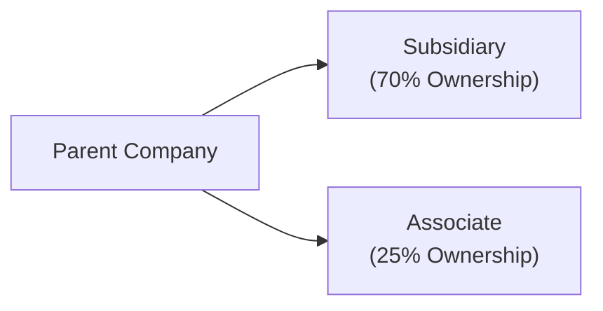

## 3.1 Intercorporate Investments, Mergers & Acquisitions

Have you ever stared at a company’s balance sheet—maybe late at night, coffee in hand—and wondered why a tiny line item labeled “Investment in Associate” looks so huge relative to the company’s other assets? I still remember the first time I saw that. It was like, “Wait, the parent’s only got 30% of the voting rights, but is somehow carrying a big chunk of the associate’s net assets?” That’s when it all clicked for me: intercorporate investments can be sneaky-powerful in shifting how a firm’s financials look.

This section unravels the mysteries of intercorporate investments under IFRS and US GAAP, and then takes a deep dive into Mergers & Acquisitions (M&A). If you’re studying for the CFA Level II exam, I promise that mastering the rules around classification, measurement, and disclosure will save you from that dreaded wave of confusion mid-question.

## Key Considerations for Intercorporate Investments

Intercorporate investments come in all shapes and sizes, from small stakes in another firm’s equity to full-blown acquisitions. Accounting standards have these handy thresholds for ownership that help determine which accounting method you’ll use. Generally:  
• Less than 20% ownership: Fair value method (unless you can prove significant influence).  
• 20%–50% ownership: Equity method (significant influence).  
• More than 50% ownership: Consolidation (control).

Under IFRS, the classification for debt and equity instruments rests on two big questions: (1) What’s your business model (trading, holding to sell, etc.)? (2) Are the contractual terms of the financial asset consistent with receiving principal and interest? You might see these categories:  
• Fair Value Through Profit or Loss (FVTPL)  
• Fair Value Through Other Comprehensive Income (FVOCI)  
• Amortized Cost

Under US GAAP, equity securities (without significant influence) get recorded at fair value, with changes spoofing your income statement. For debt securities, you’ll typically see categories like:  
• Trading  
• Available-for-Sale (AFS)  
• Held-to-Maturity (HTM)

And here’s the fun part: US GAAP now also uses something called the CECL (Current Expected Credit Loss) model for impairment, which is somewhat similar in spirit to IFRS’s expected credit loss approach—though there are detailed differences that can affect how you measure allowance for credit losses.

### Quick Snapshot: IFRS vs. US GAAP Classification

|                    | IFRS Categories                    | US GAAP Categories                 |
|--------------------|------------------------------------|------------------------------------|
| Debt Instruments   | Amortized Cost, FVOCI, FVTPL       | HTM, AFS, Trading                  |
| Equity Instruments | FVOCI or FVTPL                     | Fair value (income statement) or Equity Method (if significant influence) |
| Impairment Model   | Expected Credit Loss (one approach)| CECL (ASC 326)                     |

## Impact of Classification Choices on Financials

Let’s be real, these technical classifications matter because they shape your financial statements and favorably (or unfavorably) tilt ratios. For instance:

• Fair Value Method: Changes in fair value go through profit or loss (IFRS and US GAAP, with some differences). You’ll see more volatility in your net income.  
• FVOCI/AFS: Changes in value go to Other Comprehensive Income (OCI). This can be kinder to your net income, but watch out—if you sell these securities, the previously recognized gains/losses in OCI come back into the income statement (US GAAP has reclassification from OCI to income upon sale of AFS securities, while IFRS can differ depending on the debt/equity classification).  
• Amortized Cost/HTM: Minimizes volatility in the income statement (because you’re basically booking interest income and ignoring fair value swings), but impairment rules can bite unexpectedly.

## The Equity Method

When you’re in that sweet spot of 20%–50% ownership, you typically have “significant influence.” IFRS and US GAAP both say: “Use the Equity Method.” Under this approach, you start with the cost of your investment, and each period you increase or decrease that carrying amount by your share of the investee’s net income or net loss, plus any adjustments for dividends received. So, if you invest $100 in Company X for a 30% stake, and Company X reports net income of $50 in the next period, you recognize $15 (i.e., 30% of $50) in your own income statement, and your carrying amount in Company X jumps to $115.

But watch out. Under IFRS, the share of the investee’s income is recognized in your operating results (sometimes right there in operating income). This can really inflate your margins if you’re not careful when comparing to peers who might account for a similar stake differently. US GAAP might show it as non-operating or operating, depending on the nature of the business. The key is to note how it can distort certain performance ratios:  
• Return on Equity (ROE) can be pushed up because the investment asset is on the balance sheet, profits flow through net income, but you might not consolidate the liabilities.  
• Leverage Ratios can be understated because you don’t see the investee’s debt on your own books.

### Diagram of Parent-Associate Relationship

Here’s a quick illustration of a parent company with one subsidiary (which is consolidated) and one associate (20–50% stake, equity method):

When you own 25% (an associate), you typically do equity method. Own 70% (subsidiary), you consolidate B fully and present a Non-Controlling Interest for the 30% you don’t own.

## Consolidation: More Than 50% Ownership

If you control the other entity, IFRS 10 says you must consolidate its financial statements into your own. US GAAP is quite similar, although it also focuses on the concept of Variable Interest Entities (VIEs) under ASC 810—these are structures like special-purpose entities (SPEs) you might consolidate even without owning a majority stake, if you’re deemed the “primary beneficiary.”

When you consolidate, you add all of the subsidiary’s assets and liabilities to your balance sheet, and combine revenues and expenses on your income statement. Then you carve out a “Non-Controlling Interest” for the portion you don’t own. This can make your company look bigger and more leveraged, which might surprise folks who merely glance at your total liabilities. So if you’re doing ratio analysis, sometimes you’ll want to “deconsolidate” that portion to get a sense of the core entity’s leverage.

## Mergers & Acquisitions in Focus

M&A can be absolutely exhilarating. You see large sums of money thrown around, headlines screaming “Mega Deal,” and, somewhere in the footnotes, accountants quietly debate the intangible asset valuations. IFRS 3 (Business Combinations) and ASC 805 (Business Combinations) under US GAAP both revolve around the purchase (acquisition) method. Step one in an M&A is to identify who’s the acquirer. Sometimes that can be obvious—one big fish swallowing a smaller fish. Other times it’s a bit tricky if two similarly sized fish merge. 

### Purchase Method (Acquisition Accounting)

• Measure the consideration transferred (the purchase price).  
• Identify the fair value of net identifiable assets.  
• Recognize intangible assets separately from goodwill if they meet certain criteria (e.g., separable or arising from contractual/legal rights).  
• Any excess of the purchase price over fair value of net assets is recognized as goodwill on the balance sheet.  
• IFRS and US GAAP for intangible items in a business combo are broadly aligned, but you might see differences in practice regarding which intangible assets get recognized separately.

### Goodwill and Impairment

Goodwill’s basically that intangible premium you pay for synergies, brand names, loyal customers, technology, or even “just because” you wanted to outbid a competitor. Under IFRS, you have to test goodwill for impairment at least annually. If the recoverable amount of the underlying cash-generating unit (CGU) is below carrying value, you impair it—one-step approach, and you can’t reverse prior impairments on goodwill. US GAAP used to have a two-step approach, but it has since introduced a simpler test (though not entirely identical to IFRS). Either way, you check if the fair value of the reporting unit is below its carrying amount. If it is, that difference is an impairment, up to the amount of goodwill allocated to that unit.  

### Post-Merger Integration

After the dust settles on the acquisition, you might spend months or years integrating the acquired company. You could see:  
• Restructuring charges or synergy-related outflows.  
• Amortization of intangible assets (e.g., customer lists, patents).  
• Changes in organizational structure that could lead to reclassifications or dispositions.  

All these factors can affect future earnings quality, and as a savvy analyst, you want to keep an eye on what’s recurring vs. one-time.

## Example: Partial Acquisition Under IFRS

Let’s suppose BigCo acquires 40% of SmallCo for $200 million. SmallCo’s net assets at fair value are $400 million on acquisition date, and you have no intention to just trade that stake quickly. IFRS rules suggest you use the Equity Method. So:  
• Record your initial investment at $200 million (that’s 40% of $500 million total hypothetical value? Wait, maybe you paid a premium, but we’ll ignore that for the sake of simplicity).  
• Each period, you’ll update that carrying amount for your share of SmallCo’s income. If the next year’s net income for SmallCo is $50 million, your share is $20 million (40%), which gets added to your investment carrying value, and recognized as income in your P&L.  

With US GAAP, it’s basically the same approach if you’ve got significant influence. The main differences might appear in line-item location (operating vs. non-operating).

## How These Methods Affect Ratios

• Return on Equity (ROE): The equity method can increase net income without proportionally increasing your reported debt load, making ROE potentially higher than if you fully consolidated.  
• Debt-to-Equity: Consolidation lumps in the subsidiary’s debt, so your leverage can balloon.  
• Net Profit Margin: Gains from associates might boost net income but not always inflate your top line revenue.

## Special Purpose Entities (SPEs) / Variable Interest Entities (VIEs)

Occasionally, a company might create an SPE (IFRS) or VIE (US GAAP) for financing or risk management. IFRS uses the concept of control under IFRS 10—if you effectively control the entity, you consolidate it. US GAAP focuses on whether you’re the primary beneficiary of the VIE (i.e., you absorb most of its gains/losses). If yes, you consolidate. If not, you don’t. It’s basically about who’s got the real exposure, not strictly the ownership percentage.

## Practical Tips for CFA Candidates

• Understand how ownership thresholds influence the accounting method: <20% (fair value), 20–50% (equity method), >50% (consolidation). But be aware of exceptions! Sometimes you can have less than 20% ownership but still use the equity method (e.g., board seats or other signs of influence).  
• Be prepared to recast statements. When comparing a firm using IFRS to one using US GAAP, try to see if different classification categories might be artificially inflating or deflating income or equity.  
• Watch out for intangible assets from business combinations. They can lead to large amortization charges that reduce net income but might be excluded in some non-GAAP measures.  
• Goodwill is not amortized—only impaired. Keep track of how impairment might trigger big hits to earnings, often in lumps.  
• Non-Controlling Interests are separated in the equity section under IFRS and US GAAP. So be sure to read the footnotes and see if they are burying some interesting “minority interest” changes.  
• Practice identifying the right classification for a given scenario. The exam loves to test if you can justify why an investment is FVOCI vs. FVTPL under IFRS or AFS vs. Trading under US GAAP.

## Personal Anecdote on M&A Surprises

I once saw a mid-sized company that acquired a competitor. Everyone cheered about cost synergies, but nobody realized the newly recognized intangible assets would produce a huge ongoing amortization expense. So the next couple of years’ earnings looked weaker than expected—partly offset by synergy benefits, but the net effect wasn’t as magical as management had promised. If you’re analyzing or modeling M&A deals, dig into those intangible asset assumptions.

## Diagram: Acquisition Accounting Overview

## References and Further Reading

• IFRS 9, 10, and 3 available at <https://www.ifrs.org>  
• ASC 320, ASC 810, ASC 805 accessible at <https://fasb.org>  
• Revsine, Collins, Johnson, Mittelstaedt, “Financial Reporting and Analysis,” a solid in-depth read on these issues.

## Final Exam Tips

• Practice walking through examples—especially partial acquisitions where the line between equity method and consolidation can be murky if there are variable interests involved.  
• Don’t forget to keep track of intangible assets. The exam often tests how intangible recognition and subsequent amortization or impairment flow through the statements.  
• Goodwill tests can show up in multiple-choice or item set questions, so be super clear on the difference between IFRS’s single-step impairment approach vs. US GAAP’s approach.  
• Finally, learn to parse footnotes quickly. The test might give you a short summary of an entity’s classification choices, and you must decide how they pertain to net income or OCI.

## Test Your Knowledge: Intercorporate Investments and M&A



### Which of the following most accurately describes the equity method of accounting?

- [ ] The investor consolidates 100% of the investee’s assets and liabilities, then records non-controlling interest.
- [ ] The investor records the investment at acquisition cost and does not update the carrying value.
- [x] The investor initially records the investment at cost and subsequently adjusts for its share of the investee’s profits or losses.
- [ ] The investor recognizes fair value changes in Other Comprehensive Income (OCI).

> **Explanation:** Under the equity method, the carrying amount of the investment is adjusted for the investor’s share of the investee’s net income or loss, which flows through the investor’s income statement.

### Under IFRS, an equity instrument can be classified as Fair Value Through Other Comprehensive Income (FVOCI) if:

- [x] Management has elected irrevocably at initial recognition, and the instrument is not held for trading.
- [ ] The fair value changes are recorded in retained earnings by default.
- [ ] The instrument has a maturity date and fixed cash flows.
- [ ] The instrument is consolidated on the parent’s balance sheet.

> **Explanation:** IFRS allows an irrevocable election at initial recognition to present fair value changes in OCI (FVOCI) for certain equity instruments not held for trading.

### A parent holds 65% of a subsidiary. Which of the following best describes the impact on the parent’s consolidated financial statements?

- [ ] Equity method is applied, and Non-Controlling Interest is shown in the footnotes.
- [x] All of the subsidiary’s assets, liabilities, income, and expenses are combined with the parent’s, and Non-Controlling Interest is presented in equity.
- [ ] Only 65% of the subsidiary’s net assets are recognized, and the remainder is ignored.
- [ ] No consolidation occurs unless the parent holds 100% of the subsidiary.

> **Explanation:** With a controlling interest (more than 50%), the parent must fully consolidate the subsidiary in its financial statements, with Non-Controlling Interest shown in the equity section.

### In comparing IFRS with US GAAP classification for debt securities:

- [x] IFRS’s FVOCI category is conceptually similar to US GAAP’s AFS category.
- [ ] IFRS only allows amortized cost for all debt instruments.
- [ ] Under US GAAP, all changes for debt securities flow through net income.
- [ ] IFRS has identical categories: HTM, AFS, and Trading.

> **Explanation:** Under IFRS, debt instruments can be classified as amortized cost, FVOCI, or FVTPL, which roughly align with US GAAP’s HTM, AFS, and Trading, respectively.

### When performing goodwill impairment under IFRS:

- [x] A one-step approach compares the carrying amount with the recoverable amount of the CGU (cash-generating unit).
- [ ] A two-step approach first compares carrying amount to fair value, then determines implied goodwill.
- [x] Goodwill previously written down cannot be reversed.
- [ ] Goodwill is amortized annually over its estimated useful life.

> **Explanation:** IFRS uses a one-step test; if carrying value exceeds recoverable amount, an impairment is recognized. IFRS does not allow reversals of goodwill impairment.

### Which item is most likely to increase volatility in reported net income?

- [x] Fair value through profit or loss (FVTPL) classification for equity investments.
- [ ] Held-to-maturity classification for debt investments.
- [ ] Consolidation of a subsidiary in which you hold a 60% stake.
- [ ] A partial goodwill impairment recognized in OCI.

> **Explanation:** FVTPL means gains or losses on valuation changes flow directly through net income, increasing volatility.

### A company has 45% ownership in an investee but no significant influence. Which accounting method is typically appropriate?

- [x] Fair value method, unless the company can demonstrate significant influence.
- [ ] Consolidation is required because it exceeds 20%.
- [x] Equity method if there are indicators of significant influence.
- [ ] Held-to-maturity accounting if it’s a debt security.

> **Explanation:** Ownership in the 20–50% range typically suggests equity method; however, lacking significant influence may result in the fair value method. The key is whether “significant influence” truly exists.

### Under US GAAP, a debt security classified as Available-for-Sale (AFS):

- [x] Is measured at fair value with unrealized gains and losses recognized in OCI until sold.
- [ ] Is carried at amortized cost and tested for impairment only at maturity.
- [ ] Flows directly through net income for all fair value changes.
- [ ] Is consolidated in the parent’s financial statements.

> **Explanation:** An AFS debt security stays at fair value on the balance sheet, and changes in value are recorded in OCI until the security is sold, at which point gains/losses are reclassified to net income.

### Which statement regarding variable interest entities (VIEs) is correct under US GAAP?

- [x] The primary beneficiary of a VIE must consolidate it, even if ownership is under 50%.
- [ ] VIE consolidation is optional so long as disclosures are provided.
- [ ] IFRS requires consolidation of VIEs only when ownership exceeds 20%.
- [ ] VIEs are exempt from all forms of consolidation.

> **Explanation:** US GAAP requires consolidation by the primary beneficiary of a VIE (the entity that absorbs most of the risks/rewards). This can occur even with less than 50% voting control.

### Equity method investments must be assessed for impairment. True or False?

- [x] True
- [ ] False

> **Explanation:** Under both IFRS and US GAAP, equity method investments should be evaluated for impairment if there are indicators that the carrying amount may not be fully recoverable.


