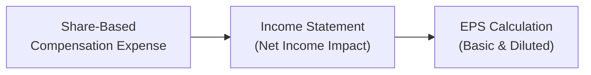

## 3.2 Employee Compensation and Post-Employment Benefits

Employee compensation is one of those topics that can feel like a tangled web of terms, calculations, and accounting treatments. I’ll admit, the first time I encountered share-based compensation and pension remeasurements, I was, well, a little overwhelmed. But once you break down the key concepts—like how we determine the fair value of a stock option or how changes in actuarial assumptions shift pension liabilities—it starts making more sense. In this section, we’ll walk through everything from salaries to stock options to retirement benefits. We’ll also highlight how seemingly small changes in assumptions can have big impacts on the financial statements you’re analyzing. 

By the end, you’ll feel confident about approaching any question on employee compensation and post-employment benefits, whether it’s for the CFA Level II exam or your daily leak-proof financial analysis at work.

---

### Overview of Employee Compensation

Employee compensation comes in many forms. Some of us have a straightforward base salary. Others might enjoy hefty bonuses, stock options, commissions, or maybe even a fancy onsite gym membership. In Canada, for instance, health insurance might be part of a government-backed arrangement supplemented by the employer. In the U.S., healthcare compensation is typically more employer-driven. You might see variations in how social security or pension deductions are handled, but the overarching principle is that total compensation encompasses both direct (e.g., salary, bonuses) and indirect benefits (e.g., pensions, health insurance, share-based plans).

Common types of compensation include:  
• Fixed Salary and Wages  
• Variable Pay (Bonuses, Commissions)  
• Share-Based Compensation (Stock Options, Restricted Shares, Performance Shares)  
• Other Benefits (Healthcare, Life Insurance, Retirement Contributions)

While the basic categorization is consistent across regions, the funding mechanisms, disclosure requirements, and tax treatments can differ (especially when crossing the U.S.-Canada border).

---

### Share-Based Compensation

Share-based compensation is popular among companies that want to align employee incentives with shareholder interests. After all, employees granted stock options or restricted shares might be more motivated to drive the share price up. However, from an accounting perspective, the devil is in the details—particularly concerning how to measure and recognize these expenses under IFRS (IFRS 2) and US GAAP (ASC 718).

Before we dive into the specifics, let’s visualize a simplified flow of how share-based compensation eventually hits the financial statements:

When the company grants share-based awards, the fair value is calculated at the grant date and recognized as compensation expense over the vesting period. This reduces net income and can also affect basic and diluted EPS due to the potential increase in the number of outstanding shares.

#### Stock Options

Stock options give employees the right—but not the obligation—to buy shares at a predetermined price (the exercise price) after a certain vesting period. Under both IFRS 2 and US GAAP (ASC 718), the fair value of the option is typically computed using options pricing models like the Black-Scholes or a binomial/lattice model. Key inputs include:  
• Exercise price  
• Expected volatility  
• Risk-free interest rate  
• Expected dividend yield (if any)  
• Time to maturity / expected holding period  

The recognized expense is spread over the vesting period. Once the option vests, and if the employee decides to exercise, the employer might issue new shares (diluting existing shareholders) or deliver shares previously repurchased.

To put this into a simple numeric example:  
• Company X issues 10,000 stock options with a grant-date fair value of $5 per option.  
• Vesting period: 2 years.  

Annual compensation expense = (10,000 × $5) / 2 = $25,000 per year.  

This $25,000 expense is recognized in the income statement, reducing net income by that amount annually, and it will also affect diluted EPS, since the options may eventually boost the total share count.

#### Restricted Shares and Performance Shares

Restricted shares (and performance shares) often come with conditions (e.g., remaining employed for a certain length of time, meeting financial targets). Under IFRS 2 and ASC 718:  
• The fair value is measured at the grant date based on the market price of the shares (adjusted for any transfer restrictions).  
• The expense is recognized over the vesting period, typically straight-line if there are no performance tranches or specific performance-based milestones.

If performance conditions exist, the accounting can get trickier: you might need to revisit your assumptions each period, adjusting for the probability of those performance conditions being met. Once again, these awards can cause dilution if new shares are issued after vesting. 

---

### Forecasting Share-Based Compensation and Shares Outstanding

As a financial analyst, it’s not just about historical numbers. You also need to forecast these expenses. The future compensation expense corresponds to grants you expect the company to issue in upcoming periods (perhaps the company has a policy of granting stock options each year). You might average out historical equity grants, factor in new plans, or consider changes in share price volatility. 

When it comes to forecasting diluted earnings per share (EPS), you must incorporate the likely exercise or vesting of shares. This forecast can be more art than science because it involves assumptions about how employees behave (do they tend to exercise early?), along with volatility and share price growth.

• Projected Expense: Use historical data on grant size, vesting schedules, and plan details (including expected volatility).  
• Diluted Shares: Incorporate estimated option exercises or restricted share vesting to adjust the share count in your pro forma EPS calculations.  

From a Canadian perspective, IFRS 2 is the standard. The fundamental measurement approach mirrors that of US GAAP, though some disclosure specifics differ.

---

### Post-Employment Benefits (Pensions & Other Post-Retirement Benefits)

Pensions and retiree health benefits often represent major long-term obligations. If you’ve ever tried to read the pension section of a large corporation’s financial statements, you might have scratched your head over the wide range of assumptions that feed into the final liability number. Under IFRS, the relevant standard is IAS 19 (Employee Benefits). Under US GAAP, it’s ASC 715 (Compensation—Retirement Benefits).

Let’s illustrate the basic flow of pension payments in a defined benefit plan:

The difference between the plan assets (B) and the plan obligations (the present value of those future benefits) can create a surplus or a deficit on the sponsor’s (employer’s) balance sheet.

#### Defined Benefit (DB) Plans

A DB plan promises a specific retirement income (e.g., 2% of final salary for each year of service). The employer bears the investment and actuarial risk. The cost recognized in the employer’s accounts includes:  
• Service Cost (the accruing cost of benefits earned in the current period)  
• Net Interest on the Net Defined Benefit Liability/Asset (the discount rate times the net liability/asset)  
• Remeasurements (IFRS typically takes these directly to OCI, while US GAAP has historically used the corridor approach, though more recent guidelines allow immediate recognition in OCI)

Remeasurements arise from changes in actuarial assumptions—like discount rates, salary growth, mortality rates—and from differences between actual and expected returns on plan assets. Under IAS 19, these remeasurements go to OCI and remain there (not recycled to profit or loss). Under US GAAP, it’s similar in many respects nowadays, although you might still see references to the older corridor approach in some companies’ statements or certain transitional provisions.

#### Defined Contribution (DC) Plans

In a DC plan, the employer contributes a set amount. Employees typically invest these funds in various asset classes. The big difference? There’s no big liability on the employer’s books beyond making the contributions. So, from an analysis perspective, if you see a company with predominantly DC plans, you don’t usually worry too much about huge pension liabilities creating potential solvency or liquidity concerns.

#### Valuation Considerations for Pensions

Actuarial assumptions can significantly change the size of pension obligations. For instance, a 1% change in the discount rate might produce tens of millions of dollars in difference for a large plan. Because these assumptions are forward-looking estimates, IFRS and US GAAP require extensive disclosures so that analysts can gauge the sensitivity of the plan obligation to changes in assumptions.

If you’re analyzing a Canadian public sector employer, you’ll likely notice DB plans are still fairly common. Disclosures might reveal large deficits, requiring higher future contributions. That means potentially lower free cash flow for the entity. Under IFRS, you’ll see these obligations recognized on the balance sheet, net of plan assets. Also watch out for changes in discount rates prescribed by regional regulatory guidelines.

#### Impact on Ratios

Big pension deficits may inflate a company’s leverage ratio if the net pension liability is included as part of total debt or total liabilities. Additionally, certain equity analysts will adjust their valuation metrics by considering net pension liabilities as “debt-like.” This can shift everything from enterprise value (EV) calculations to coverage ratios.

---

### Detailed Instructions for Candidates (Applied Examples)

At this point, you might be thinking: “So how do I handle a question that shows me all these different assumptions and partial data sets?” This is exactly the kind of scenario you’ll face in a real CFA exam vignette.

• Calculating Share-Based Compensation Expense:  
  Suppose you have a stock option grant of 5,000 options with a grant-date fair value of $4 each, vesting over 4 years. The annual expense is ($4 × 5,000) ÷ 4 = $5,000. If the question changes the vesting schedule, you have to recalculate carefully.  

• Changing Actuarial Assumptions for a DB Plan:  
  If discount rates decline, the projected benefit obligation (PBO) increases, which may also increase annual service cost. The difference is recognized in the remeasurement portion, going to OCI under IFRS and typically to either OCI or the standard corridor approach (if still applied) under US GAAP.  

• Presentation Differences for Pension Remeasurements:  
  A cross-border firm might record remeasurements in OCI under IFRS, while in the U.S. segment’s statements, you see them recognized in a different line item or systematically amortized. Knowing how to interpret these differences is key to performing like-for-like comparisons.

---

### Common Pitfalls

• Forgetting the Vesting Period: Don’t overlook that compensation expense doesn’t pop up the same day the option is granted—it’s spread out.  
• Mixing Up DB and DC Plans: They sound similar in name, but the liability and risk structures are entirely different, which heavily impacts the financial statements.  
• Overlooking Sensitivities: A minor tweak in discount rates can drastically change PBO. Always check footnotes for sensitivity analyses.  
• Dilution in EPS: Whether from options or restricted shares, remember to adjust for the potential new shares when you’re calculating diluted EPS.

---

### Best Practices

• Keep a Checklist: Always begin by identifying the type of compensation arrangement—stock option, restricted shares, or other client shares. Then systematically list your inputs (fair value, vesting period, expected forfeitures, etc.).  
• Watch for Changes Over Time: Annual disclosures often update the prior year’s assumptions.  
• Don’t Ignore the Notes: This is especially true for pension plans. The footnotes frequently contain gold mines of data on discount rates, mortality tables, and plan asset allocations.  
• Adjust for Cross-Border Differences: With IFRSs in Canada and US GAAP in the U.S., be mindful that the language used or lines in the statements may differ, even if the underlying economics match.

---

### Personal Reflections

I remember the first big pension footnote I wrestled with. It was jam-packed with references to everything from “service cost” to “unrecognized actuarial gains.” Frankly, I was lost. Eventually, I realized you just have to go line by line, carefully matching each concept to how it gets recognized (or not) in net income vs. other comprehensive income. Over time, that big footnote lost its intimidation factor, and I even started to enjoy the detective work.

---

### References for Further Study

• IFRS 2 (Share-Based Payment), IAS 19 (Employee Benefits) – ifrs.org  
• ASC 718 (Compensation—Stock Compensation), ASC 715 (Compensation—Retirement Benefits) – fasb.org  
• “International Financial Statement Analysis” by Thomas R. Robinson et al.  

---

### Final Exam Tips

• Practice with Vignette-Style Questions: The CFA exam loves scenarios with partial data sets for a DB plan or a share-based compensation footnote.  
• Remember to Distinguish Between IFRS and US GAAP: Focus on remeasurement treatment for pensions and fair value measurement for share-based awards.  
• Show Your Work: In a time-pressured exam environment, write down your formulas and assumptions clearly. It helps you keep track and prevents silly mistakes.  
• For Pension-Related Items: Keep the main components (service cost, net interest, remeasurements) fresh in your mind.  
• For Share-Based Compensation: Immediately check the vesting period and fair value measurement approach (e.g., Black-Scholes).  

---

## Test Your Knowledge: Employee Compensation & Post-Employment Benefits



### In share-based compensation, the fair value of stock options is typically measured at:

- [ ] The exercise date
- [ ] Each reporting period
- [x] The grant date
- [ ] The settlement date

> **Explanation:** Both IFRS and US GAAP measure stock options at grant-date fair value and recognize the resulting expense over the vesting period.

### Under IFRS 2, the expense for restricted shares is recognized:

- [x] Over the vesting period based on the grant-date fair value
- [ ] Only when the shares vest
- [ ] Gradually beginning at the exercise date
- [ ] After the entire vesting period is complete

> **Explanation:** IFRS 2 requires that the fair value at the grant date be spread over the service/vesting period.

### Which of the following plan types generally does not create a long-term liability for the employer?

- [ ] Defined benefit plan
- [ ] Hybrid plan
- [ ] Deferred compensation plan
- [x] Defined contribution plan

> **Explanation:** In a defined contribution plan, the employer’s obligation is limited to making contributions. Employers do not bear the investment or actuarial risk, so no large long-term liability remains on the employer’s balance sheet.

### Under IFRS, remeasurements of a defined benefit obligation (due to changes in actuarial assumptions) are recognized in:

- [x] Other comprehensive income
- [ ] Retained earnings
- [ ] Net income
- [ ] Deferred taxes directly

> **Explanation:** Remeasurements under IAS 19 are recognized in OCI and are not reclassified to profit or loss in later periods.

### When forecasting share-based compensation expense, analysts often adjust for:

- [x] Expected volatility
- [ ] Historical dividends only
- [x] Historical grant patterns
- [ ] A universal forfeiture rate of zero

> **Explanation:** Volatility and historical grant patterns are key to modeling future share-based compensation. Dividends may also matter, but the question highlights expected volatility and historic patterns as standard inputs for forecasts.

### A decrease in the discount rate for a defined benefit plan typically results in:

- [x] An increase in the projected benefit obligation (PBO)
- [ ] A decrease in service cost
- [ ] No change to the PBO
- [ ] A decrease in pension expense

> **Explanation:** Lower discount rates increase the present value of future obligations, thereby increasing the PBO.

### Under US GAAP (ASC 718), the grant-date fair value of a stock option is recognized:

- [x] Straight-line over the vesting period
- [ ] In full at the grant date
- [x] On an accelerated basis if graded vesting is used
- [ ] Only when the option is exercised

> **Explanation:** Typically, under ASC 718, the total fair value is recognized over the vesting period. If there is graded vesting, an accelerated recognition approach is permitted or required (depending on the company’s policy).

### Under IFRS (IAS 19), service cost in a defined benefit plan is recognized:

- [x] In profit or loss
- [ ] In other comprehensive income
- [ ] Directly against equity
- [ ] Through retained earnings only

> **Explanation:** Service cost (including current service cost) for an IFRS-defined benefit plan is recorded in profit or loss. Remeasurements go to OCI.

### Which of the following most accurately describes the corridor approach under older US GAAP for defined benefit plans?

- [x] An approach that amortizes certain actuarial gains/losses over time
- [ ] An accelerated recognition of remeasurements in net income
- [ ] Immediate recognition of gains/losses in retained earnings
- [ ] Recognition of all actuarial gains/losses in OCI without recycling

> **Explanation:** The corridor approach amortizes actuarial gains/losses to the income statement over time. Although many companies have moved to immediate recognition, corridor approach might still appear in older statements or transitional provisions.

### True or False: Under a defined benefit plan, employees bear the primary investment risk because their return depends on contributions they make.

- [x] False
- [ ] True

> **Explanation:** Under a defined benefit plan, the employer bears the investment risk. Employees bear the investment risk under a defined contribution plan.


