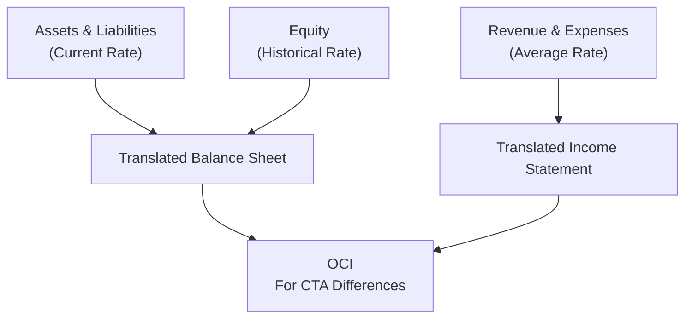

## 3.3 Multinational Operations and Currency Translation

So, I’ll be honest—this topic can be a bit of a beast the first time you see it. The idea of juggling local currency, functional currency, and presentation currency, all while trying to nail down how everything flows into consolidated financial statements, might sound intimidating. But fear not. In this article, we’ll walk through everything step by step, hopefully making it feel less overwhelming. I remember the first time I dealt with currency translation. It felt like I was back in a language class but with more numbers than verbs. Anyway, let’s dive into the essential building blocks.

---

### Local, Functional, and Presentation Currency

Let’s start with some definitions that set the stage for the entire discussion:

• Local currency: The currency of the country in which a subsidiary operates. If you run a business in Canada, your local currency is the Canadian dollar (CAD).  
• Functional currency: The primary currency of the subsidiary’s economic environment. This can be the CAD if you’re in Canada—but only if that is truly the currency that drives sales prices, major expenses, and financing for the biz. IFRS (IAS 21) and US GAAP both require analyzing factors like where the subsidiary procures labor, which currency denominates sales, and how it finances its operations.  
• Presentation currency: The currency in which you present your consolidated financial statements. Usually, this is the parent’s currency. So if you’re a U.S. multinational, your presentation currency is likely USD, even if your subs operate all over the world.

It’s pretty crucial to figure out the functional currency correctly, because that drives the way you translate foreign statements in consolidation. You can think of it as: “Which currency truly affects the underlying business—like pricing, wages, and daily financial decisions?” Once that’s sorted out, you’ll know how to apply the translation guidelines.

To visualize these relationships, see the flowchart below:

Understanding each “stop” in the flow helps you see how numbers move from local accounting books to the final, global set of statements you present to shareholders.

---

### Foreign Currency Transaction Exposure

Now, let’s talk about one of the sneaky ways foreign exchange rates can play games with your income: transaction exposure.

• Foreign receivables/payables: If your subsidiary in Canada sells to U.S. customers in USD, that amount is a foreign currency transaction from CAD’s perspective. The local statements might reflect an asset or liability in USD that must be remeasured each reporting period at the current exchange rate until settlement. Any resulting gains or losses show up in net income.  
• Long-term obligations: If the sub has significant foreign currency debt—say they financed some equipment in EUR—unrealized changes in the exchange rate can have big impacts on leverage and interest coverage ratios.

My personal story: A friend who manages finance for a small subsidiary once told me about how a quarter’s earnings could get pummeled by even a minor shift in currency values on a short-term payable. He half-joked that the CFO used to watch the EUR/USD quotes more than the sales figures. That’s an exaggeration, but you get the idea—transaction exposure can really create volatility if not hedged or planned for.

---

### Translation Methods

Ah, the crux of the matter: Which method do you use, and how does it affect reported results? Let’s break down the two main methods.

#### Current Rate Method

• When it’s used: If the subsidiary’s functional currency is the same as its local currency. In other words, the subsidiary is a self-contained entity using the local currency for all critical transactions.  
• Translation approach:  
  – Assets and liabilities: Translate at the current (end-of-period) exchange rate.  
  – Equity: Translate at historical rates. Because equity generally accumulates over different periods, each relevant portion uses the rate at the time it was contributed or earned.  
  – Revenue and expenses: Typically translated at the average rate over the reporting period.  
  – Resulting translation adjustments: Recognized in Other Comprehensive Income (OCI). They bypass net income, so they don’t rattle your earnings number. Instead, they get parked in a separate component of equity called cumulative translation adjustment (CTA).

Here’s a quick numeric example:  
• Let’s say your Canadian subsidiary has end-of-year assets of CAD 2,000,000, and the exchange rate at year-end is 0.75 USD/CAD. Then the translated asset figure is 0.75 × 2,000,000 = USD 1,500,000.  
• Income for the period is CAD 400,000. The average rate was 0.77 USD/CAD. Then translated income is 0.77 × 400,000 = USD 308,000.  
• The difference that arises from applying different rates to the balance sheet vs. the income statement ends up going to translation adjustments in OCI.

#### Temporal Method

• When it’s used: If the subsidiary’s functional currency is not the same as its local currency. Often, this means the parent’s currency is the functional currency. A scenario might be a foreign operation that’s heavily reliant on the parent for financing, raw materials, and product pricing.  
• Translation approach:  
  – Monetary assets and liabilities: Translated at the current rate (i.e., period-end rate).  
  – Non-monetary assets and liabilities: Translated at historical rates. If you purchased equipment over several years, each portion is at the exchange rate in place when you bought it.  
  – Revenue and expenses: If they’re related to non-monetary items (like depreciation of equipment), use the historical rate of that asset. Otherwise, use average or appropriate rates for the period.  
  – Gains/losses: Flow directly into the income statement. This is the big difference from the current rate method. Under the temporal method, you’ll see remeasurement gains or losses pop up in net income, which can cause additional volatility.

Here’s a mini example for the temporal method. Suppose the Canadian sub now uses USD as its functional currency even though it reports locally in CAD. It purchased some inventory (a non-monetary asset) when the exchange rate was 0.80 USD/CAD. At the end of the year, the exchange rate is 0.75. That inventory remains in the books at 0.80 for translation. But a monetary asset, such as a bank loan, would be remeasured at 0.75. The difference flows into net income as a remeasurement gain or loss.

---

### Hyperinflationary Economies

This is a special situation. If the foreign operation is in a hyperinflationary environment—think of inflation rates hitting triple-digit territory—then normal translation rules get overshadowed by special treatments:

• IFRS (IAS 29): Requires restating non-monetary items for inflation before applying the usual translation method (often the current rate method). Together with IAS 21, the financial statements are effectively expressed in “constant” currency terms prior to translation.  
• US GAAP (ASC 830): If a subsidiary operates in a highly inflationary environment (cumulative inflation ~100% or more over 3 years), you treat that environment as if the functional currency is the parent’s currency. Effectively, you apply the temporal method. This often leads to large and unexpected remeasurement gains/losses in net income.

Practical tip: If you see an economy with persistently 20%+ annual inflation rates and no sign of improvement, start thinking hyperinflation. That’s a quick rule of thumb. In practice, whether something hits 100% over three years is a matter of official stats, but it’s not always cut-and-dry.

---

### Tax Implications and Effective Tax Rate

I remember a colleague once sighing after she realized foreign currency translation adjustments rarely match up with actual taxes paid to local authorities. Why? Because translation adjustments assigned to OCI under IFRS or US GAAP might not show up as taxable income in the parent’s home country.

• Translation adjustments typically do not affect taxable income in the parent’s jurisdiction. You may see a difference in “book vs. tax” basis, which can affect deferred tax calculations.  
• If you rely on cross-border dividend remittances, it’s important to consider withholding tax treaties. For instance, between Canada and the U.S., there are rules that might reduce or eliminate withholding taxes if certain criteria are met, which can influence how you structure your financing.

Basically, the tax piece doesn’t always flow nicely with the accounting piece. This can lead to a mismatch that must be carefully documented to keep tax authorities (and your internal compliance folks) satisfied.

---

### Detailed Instructions for Candidates

If you’re prepping for the CFA Level II exam, you’ll likely encounter a scenario or two about currency translation. You want to pay attention to how each method affects net income vs. OCI, and the resulting changes in equity. A common exam question: “Under the current rate method, which amounts are translated at historical vs. current exchange rates, and where do the gains/losses go?” Let’s list some quick pointers:

• Perform a step-by-step currency translation under each method. Start with identifying the functional currency.  
• Calculate the correct amounts:  
  – For current rate method, apply year-end rates to assets and liabilities, average rates to income. Spot the difference in equity.  
  – For temporal method, separate monetary from non-monetary items, track historical rates carefully, and see how remeasurement gains or losses flow through net income.  
• Watch for how significant changes in exchange rates can shift your reported net income, especially under the temporal method.  
• Remember hyperinflationary environment triggers special rules. IFRS vs. US GAAP differ, so be mindful of which standard applies.

In an exam setting, clarity and consistency are your best friends. Also, keep some mental or written “cheat sheets” for equity translation rates and how to record translation adjustments. It’s easy to get lost in the details if you’re rushing.

---

### Glossary

• OCI (Other Comprehensive Income): Kinda the “Detour” for certain changes—like foreign currency translation adjustments under the current rate method—so they don’t directly affect net income.  
• Remeasurement: Converting local currency amounts into an entity’s functional currency using the temporal method. Gains/losses from remeasurement can swing net income up or down.  
• Hyperinflation: Extremely high inflation that kills a currency’s purchasing power, leading to special accounting treatments (e.g., restatement or using the temporal method).  
• Functional Currency: The currency that most significantly influences sales prices, labor, and other production costs in the environment where the entity operates.  
• Exchange Rate Exposure: The risk that currency fluctuations will create swings in the consolidated financial statements.

---

### Potential Pitfalls and Strategies

• Pitfall: Mixing up the current rate vs. temporal method—especially which items get translated at historical vs. current rates.  
• Pitfall: Forgetting to handle nonmonetary depreciation charges from historical cost items under temporal method.  
• Strategy: Use a systematic approach (like a short “cheat table”) so you know exactly which rate to apply for each line item.  
• Strategy: Look out for whether the question indicates the subsidiary is self-contained or integrated with the parent. That’s your big clue on which method to use.

---

### Best Practices and Practical Examples

A real-world practice is to hedge transaction exposures by using derivatives. Companies often enter into forward contracts or currency swaps to lock in exchange rates for short-term payables/receivables. While that’s not always tested in detail at CFA Level II, it’s worth knowing that treasury departments typically do this to smooth net income volatility.

Another everyday scenario: A U.S. parent invests in a Canadian sub that has CAD as both its local and functional currency. It uses the current rate method. Suppose, from one year to the next, the CAD weakens by 10% relative to the USD. Your net income in USD might fall even though CAD net income rose, and there will be a negative CTA in OCI. As a finance person, you need to explain to management that the sub’s operational performance is strong in local terms, but the consolidated result is lower in USD terms. No one is messing up; it’s just the currency effect.

---

### Additional Diagrams: Translation Overview

To help visualize how the current rate method splits items between historical rates and current rates, here’s a brief diagram:

---

### References & Further Reading

• IAS 21 (Effects of Changes in Foreign Exchange Rates) and IAS 29 (Financial Reporting in Hyperinflationary Economies), available at ifrs.org  
• ASC 830 (Foreign Currency Matters), available at fasb.org  
• “Multinational Financial Management” by Alan C. Shapiro

---

### Final Exam Tips

• Always determine the functional currency before applying a translation method.  
• For the current rate method, remember: Assets/Liabilities at current rates, Equity at historical rates, Revenues/Expenses at average rates, and translation adjustments go to OCI.  
• For the temporal method, keep separate track of monetary vs. nonmonetary items, and remember remeasurement gains or losses go to net income.  
• If you see big inflation numbers, think hyperinflation. IFRS remeasures everything into a constant currency first; US GAAP usually reverts to the temporal method.  
• Watch out for potential pitfalls in applying historical rates to nonmonetary items, especially for intangible assets and depreciation.  
• Practice a couple of quick examples from your favorite question bank or textbooks. Time yourself—exam time pressure can lead to mistakes.

And maybe pause to take a breath! This section is tricky but definitely manageable once you get the hang of the steps and rates.

---

## Test Your Knowledge: Multinational Operations and Currency Translation Quiz



### Which of the following statements best describes local, functional, and presentation currencies?

- [ ] Local, functional, and presentation currencies must all be the same in order to apply the current rate method.  
- [ ] Local, functional, and presentation currencies can be chosen arbitrarily so long as management discloses their rationale.  
- [x] The local currency is the currency of the country where the subsidiary operates, the functional currency is the subsidiary’s primary economic currency, and the presentation currency is the one used for consolidated reporting.  
- [ ] Only the functional and presentation currencies affect financial statements, while the local currency does not matter.  

> **Explanation:** The local currency is the currency of the locale where the sub operates, functional currency is what basically drives the entity’s economics, and presentation currency is what the parent uses for consolidated statements.

### Under the current rate method, which line items are translated at the historical exchange rate?

- [ ] All income statement items.  
- [ ] All balance sheet items.  
- [ ] All assets, liabilities, and equity.  
- [x] Equity items, such as common stock and retained earnings from prior years.  

> **Explanation:** Only equity items, typically common stock and retained earnings, use the historical rate. Everything else on the balance sheet is translated at the current rate, and income statement items at average rates.

### Under the temporal method, where are remeasurement gains or losses generally reported?

- [ ] Other Comprehensive Income (OCI).  
- [x] Net Income.  
- [ ] As a direct adjustment to equity, bypassing net income.  
- [ ] They are not recognized under U.S. GAAP.  

> **Explanation:** The key feature of the temporal method is that remeasurement gains or losses run directly through net income, unlike the current rate method which routes them to OCI.

### Which of the following best describes the IFRS treatment for hyperinflationary economies?

- [ ] Use the current rate method without any price-level adjustments.  
- [x] Restate non-monetary items for inflation before applying normal translation rules.  
- [ ] Convert from the local currency to the parent’s currency using historical rates for all items.  
- [ ] Eliminate the use of translation adjustments in consolidated statements.  

> **Explanation:** IFRS (IAS 29) says first restate financials for inflation (in constant currency terms) and then apply your usual translation method (e.g., current rate).

### When determining the functional currency, which factor is least relevant?

- [ ] The currency primarily used to denominate labor and materials.  
- [ ] The currency that influences sales prices for products.  
- [ ] The currency in which financing activities are denominated.  
- [x] The currency in which the parent’s shareholders receive dividends.  

> **Explanation:** While the currency in which dividends are received might be relevant in certain contexts, it’s not a primary factor in determining the functional currency. Functional currency is generally evaluated based on sales prices, cost structure, and financing.

### A Canadian subsidiary’s functional currency is CAD, but the parent’s presentation currency is USD. Under the current rate method, an increase in CAD/USD from 0.75 to 0.80 will generally:

- [x] Increase the USD value of the subsidiary’s assets.  
- [ ] Decrease the USD value of the subsidiary’s assets.  
- [ ] Have no effect on the USD value of the subsidiary’s assets.  
- [ ] Be recorded as an expense in net income.  

> **Explanation:** If the CAD appreciates (more USD per CAD), the translated USD value of the CAD assets increases under the current rate method. The offsetting entry goes to OCI (CTA).

### Under US GAAP, if a subsidiary operates in a hyperinflationary economy, what method is typically required?

- [x] Temporal method.  
- [ ] Current rate method with inflation adjustments.  
- [ ] Any method chosen by management, provided it’s disclosed.  
- [ ] Current rate method with no adjustments.  

> **Explanation:** ASC 830 states that in a hyperinflationary environment (roughly 100% inflation over three years), the subsidiary’s functional currency is treated as the parent’s currency, and the temporal method is applied.

### When translating property, plant, and equipment under the temporal method:

- [ ] Always use end-of-period rates.  
- [ ] Always use average exchange rates.  
- [x] Use historical exchange rates corresponding to acquisition dates.  
- [ ] Use a blend of historical and current rates.  

> **Explanation:** Under the temporal method, non-monetary assets like PP&E use historical rates, meaning the rate that was in effect on the dates those assets were acquired.

### A company translates retained earnings using the current rate. Which method is the company most likely employing?

- [ ] Temporal method.  
- [x] Current rate method.  
- [ ] Hyperinflationary method.  
- [ ] Speculative translation method.  

> **Explanation:** Under the current rate method, retained earnings are derived using a combination of historical rates for prior periods and the translated net income (at average rates). But if you see a direct mention of “retained earnings translated at current rate,” it’s typically a reference to the final step of balancing the translation. By contrast, the temporal method individually remeasures items impacting retained earnings at historical rates.

### Under the current rate method, gains or losses from translation adjustments appear in:

- [x] Other Comprehensive Income (OCI).  
- [ ] Net income.  
- [ ] Deferred income taxes only.  
- [ ] No statement, as they’re unrealized.  

> **Explanation:** Translation adjustments using the current rate method appear in OCI, bypassing net income altogether.


