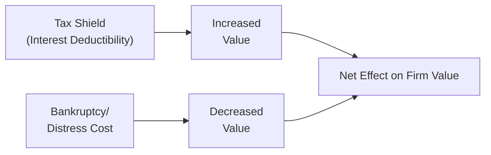
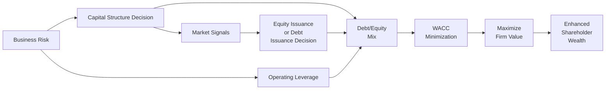

## 4.1 Capital Structure and Leverage Analysis

It seems that capital structure can sometimes feel like a puzzle—how much debt, how much equity, and how all that influences firm value. Years ago, I remember sitting with a friend who was launching a startup: They were excited about raising equity, and yet they had this nagging feeling that maybe they could have used more debt for a tax advantage. We ended up having a lively chat about trade-offs, potential signals that new equity might send to investors, and the risk of going bust if the company took on too much leverage. This chapter covers those sorts of tricky decisions in detail and helps clarify the theories, practical considerations, and calculations you need to master.

Capital structure, in essence, is how a firm finances its operations and growth through a mix of equity (like common shares) and debt (like bonds or bank loans) and, in some cases, hybrid securities. At the root of many investment decisions is the concept that each source of capital has its own cost, which feeds into the Weighted Average Cost of Capital (WACC). Get WACC right—by nailing the balance between debt and equity—and, well, you might optimize firm value. Miscalculate, and your cost of capital could soar, or your business risk might get out of hand.

Below are the main areas we'll cover:

- Capital Structure Theories (Trade-Off, Pecking-Order, Signaling)  
- Optimal Capital Structure and WACC  
- Leverage and Firm Performance  
- Cross-Border Comparisons (U.S. vs. Canada)  
- Practical Examples, Best Practices, Pitfalls  
- Glossary and References  

Let’s dive in.

---

Capital structure is a major concern for corporate finance managers and investors alike. In previous chapters (particularly in Corporate Finance, Governance, and Valuation discussions), we discussed the interplay between financing decisions and governance. Now, let's hone in on the theories and real-world applications.

## Capital Structure Theories

### Trade-Off Theory
The Trade-Off Theory posits that firms balance the tax advantages of debt against the risk of financial distress and bankruptcy costs. Debt creates an interest expense that is usually tax-deductible, so it lowers taxable income—a “tax shield.” However, if the company relies too heavily on debt, the possibility of default increases. That’s the see-saw: the benefit of a tax shield on one side and the potential bankruptcy cost on the other.

#### A Visual Overview
Here’s a quick mermaid diagram to illustrate this balancing act:

In an ideal world, you keep adding leverage until the marginal benefit of the tax shield is just offset by the marginal cost of distress. Thing is, nobody knows exactly where that point lies. So you often see firms adopt target ranges based on capital structure benchmarks, industry norms, and management’s tolerance for risk.

### Pecking-Order Theory
Pecking-Order Theory stems from the notion of asymmetric information. Managers know more about the firm’s true value and prospects than outside investors do. Because of that, they prefer to use internal funds first (like retained earnings), then debt, and finally equity as a last resort. If you’ve ever wondered why some profitable companies with plenty of cash flows rarely sell new equity, Pecking-Order Theory might explain that. Issuing new shares can be perceived as a negative signal, implying the stock is potentially overvalued or that management sees trouble ahead (more on signaling next).

### Signaling Effect
Have you ever had the feeling that a company raising equity suggests management might not be super confident about the prospects of the firm’s stock price? That’s basically the signaling effect. If you’re the CFO at a corporation and believe your stock is underpriced, you probably wouldn’t want to issue more shares at a “discount.” So the decision to issue new equity might signal to markets that management thinks the shares are not undervalued (and may be fairly priced or overvalued). Conversely, firms might avoid equity issuance when they suspect their share price is low, relying instead on internal funds or debt.

## Optimal Capital Structure

### Definition
The optimal capital structure is basically the mix of debt (D) and equity (E) that minimizes a firm’s WACC and maximizes the market value of the company. If you recall your formula for WACC:


\text{WACC} = w_d \times r_d (1 - T) \ + \ w_e \times r_e


Where:  
• \\( w_d \\) = proportion of debt in the capital structure  
• \\( r_d \\) = cost of debt (often the yield on newly issued bonds or the interest on loans)  
• \\( T \\) = corporate tax rate  
• \\( w_e \\) = proportion of equity in the capital structure  
• \\( r_e \\) = cost of equity (e.g., from CAPM or DDM)

A lower WACC often correlates with a higher net present value (NPV) of future cash flows, all else held constant. In other words, the cheaper your financing, the more valuable the firm’s projects and the higher the overall firm value.

### Determinants
There’s no universal recipe for an optimal capital structure—it’s shaped by several factors:
• Business Risk: Firms in stable industries (like utilities) can typically handle more debt.  
• Tax Environment: Where interest expenses are tax-deductible, debt becomes more appealing.  
• Financial Flexibility: Firms might keep capacity to issue debt in times of need, so they don’t max out leverage before it’s really necessary.  
• Growth Opportunities: High-growth firms might avoid high debt because they prefer to reinvest or keep their powder dry for future expansions.  
• Market Conditions: If interest rates are low, it might be cheaper to finance with debt. During bullish stock markets, equity might be easier (and cheaper) to issue.  

### Empirical Observations
In practice, many firms maintain a target leverage range. They don’t stare at their debt-to-equity ratio daily in some misguided attempt to keep it constant. Instead, they’ll say something like, “We aim for a 30–40% debt ratio, max.” Then they let it float within that zone, adjusting occasionally through repurchases, new debt issues, or equity offerings.

## Leverage and Firm Performance

Leverage is best understood as a “magnifier.” When times are good, the chunk of the returns that’s financed by debt can really supercharge your ROE. But if revenues shrink or you hit a bump in the road, those interest obligations don’t magically disappear—meaning that losses get magnified as well.

#### Impact on Profitability
So, say your company’s total capital is \$100 million, with \$50 million in equity and \$50 million in debt at 5% interest. If you earn 10% on assets, that’s \$10 million in operating profit. Subtracting \$2.5 million in interest leaves \$7.5 million in profit. Compared to the \$50 million equity base, that’s a 15% return on equity. Not too shabby. But if your operating return dips to 4%, you make \$4 million, pay \$2.5 million in interest, and get \$1.5 million in net profit—only 3% ROE. You can see the amplification up and down.

#### Effect on Risk
The risk side of the coin: more leverage means financial obligations must be met. In good years, that’s not too big a deal. But in a downturn, inability to pay interest or principal can lead to restructuring, potential default, or bankruptcy. If rating agencies see a capital structure that’s too aggressive, they might downgrade the firm’s debt—raising its cost of capital further. 

### Operating vs. Financial Leverage
• Operating leverage is related to fixed business costs like rent, salaries, and overhead. The higher the proportion of fixed costs, the more operating income fluctuates with changes in revenue.  
• Financial leverage is about having interest expenses (or principal repayments) that are also fixed. Both can amplify returns and risks. If you pile on a lot of both (high operating leverage plus high financial leverage), you can imagine how volatile your net income might become.

## Cross-Border Capital Structure Comparisons (U.S. vs. Canada)

Though the core theory behind capital structure is pretty universal, the practical details can vary from one country to another. 

### Regulatory Environment
In the U.S., the Securities and Exchange Commission (SEC) sets disclosure and accounting standards for publicly traded companies. In Canada, we have the Canadian Securities Administrators (CSA) plus provincial regulators like the Ontario Securities Commission (OSC). Both environments require transparency, but the nuances of compliance can differ.

### Market Norms
U.S. markets tend to be deeper, with large institutional bond markets. This sometimes means even mid-sized U.S. firms can tap capital on attractive terms. In Canada, big banks play a key role—leading to a somewhat more concentrated lending environment. However, large Canadian issuers do access international markets, and cross-border listings are not uncommon.

### Tax Treatment
Both jurisdictions provide tax deductions on interest expenses, generally encouraging use of debt. Small differences exist—for instance, how interest is treated in specific industries or how thin capitalization rules are enforced. You’ll want to be aware of local nuances when analyzing a multinational’s capital structure. Under IFRS or U.S. GAAP, interest expense is recorded similarly, but note that disclosures and classification might vary slightly. 

---

## Practical Considerations, Best Practices, and Pitfalls

• **Stick to a Reasonable Leverage Target:** While the math and theory are helpful, no formula will precisely tell you your “magic” debt level. Keep an eye on industry benchmarks and consider the firm’s risk tolerance.  
• **Beware Interest Rate Environments:** If rates rise (like the Federal Reserve’s rate hikes) you might see your cost of debt balloon. So plan ahead—maybe lock in longer maturities when rates are low.  
• **Monitor Covenants:** Debt obligations can come with restrictive covenants that constrain what management can do. A breach can trigger serious penalties, so watch out.  
• **Signaling and Timing Issues:** If your firm’s shares are high (maybe you’re at a record P/E ratio), it might be a good time to raise equity. But watch that it doesn’t create negative signals if your corporate messaging is inconsistent.  
• **Operating Leverage Interplay:** If you’re already highly sensitive to revenue swings (think airlines or certain cyclical manufacturers), layering on big debt might be trouble in a recession.  
• **Sustainable Practices/ESG:** More and more, investors pay attention to how capital structure decisions tie into ESG (Environmental, Social, and Governance) frameworks. Over-levering might hamper your firm’s ability to invest in sustainable initiatives.  

---

## Mermaid Diagram of Key Relationships

This bigger snapshot might help visualize how capital structure decisions intersect with firm value, risk, and the theories we’ve discussed:

---

## Glossary

WACC (Weighted Average Cost of Capital): The average rate of return a firm expects to pay its providers of capital, weighted by each component of its capital structure. Essentially the “blended” cost from both debt and equity sources.

Tax Shield: The benefit of reducing taxable income via interest deductions (or other deductibles). 

Financial Distress: Occurs when a firm struggles to meet financial obligations, heightening the risk of default or bankruptcy.

Trade-Off Theory: Balances tax benefits of debt and the costs of financial distress to find an “optimal” leverage point.

Pecking-Order Theory: States firms prefer internal financing → debt → external equity, to minimize negative market signals and manage asymmetric information.

Operating Leverage: How sensitive operating income is to changes in sales due to a firm’s fixed cost structure.

Financial Leverage: The degree to which a firm relies on debt financing (and must service interest costs).

Capital Mix: The ratio (or proportion) of debt to equity in a firm’s capital structure.

---

## References and Further Reading

• “Financial Management: Theory & Practice” by Eugene F. Brigham and Michael C. Ehrhardt — foundational concepts of capital structure.  
• CFA Institute’s Level II Curriculum, Corporate Finance readings — official guidelines and practice questions.  
• “The Journal of Finance” — numerous empirical studies on leveraging and capital structure decisions.  

---

So we’ve covered the theoretical underpinnings, the see-saw logic of the Trade-Off Theory, the impetus behind the Pecking-Order approach, and the potential signals your financing can send to the market. We also discussed how all that might vary between the U.S. and Canada because, believe it or not, local norms and regulations can shape a firm’s cost of capital (and thereby its decisions).

Take it from me: capital structure is a fundamental area that demands not just knowledge of formulas but good judgment. You must view it through a variety of lenses—tax advantages, risk tolerance, market conditions, and your firm’s strategic plan. This is the kind of topic that, well, might show up on your exams with multi-layer scenarios blending firm valuations, cash-flow forecasts, and cost of capital calculations. So practice your WACC computations and carefully parse through any vignettes describing a company’s financing choices and how they align with management’s goal to maximize shareholder value.

Below are a few tips for the exam and your general career:

• Keep a step-by-step approach to WACC calculations.  
• Watch for any clues about a company’s corporate tax rate, target D/E ratio, or CFO statements on financing needs.  
• Distinguish between operating and financial leverage, particularly in scenarios involving cyclical firms.  
• Read carefully how different theories might apply to a specific question—like a manager preferring to issue debt even at moderate rates because they don’t want to “signal” the market.  

Good luck, and keep building that framework for optimal capital structure decisions!

---

### Final Exam Tips

• Know your formulas: WACC, cost of equity models (CAPM, Dividend Discount Model), cost of debt.  
• Understand the interplay between interest expenses, taxes, and net income.  
• Be clear on why companies might not strictly follow a single theory (Trade-Off or Pecking-Order). Interview questions and exam vignettes often ask for real-life nuance.  
• Pay attention to industry-specific factors and cross-border differences.  
• Practice problem sets that integrate forecasting future cash flows with varying leverage.  

---

## Test Your Knowledge: Capital Structure and Leverage Analysis



### Which theory suggests that firms prioritize internal funds, then debt, and only issue new equity as a last alternative?

- [ ] Trade-Off Theory
- [x] Pecking-Order Theory
- [ ] Signaling Theory
- [ ] DuPont Analysis

> **Explanation:** The Pecking-Order Theory posits a financing hierarchy starting with internal funds, then debt, and finally equity as a last resort. This is often driven by concerns about asymmetric information.

### What is the primary benefit that debt financing can provide from a tax perspective?

- [ ] Lower dividend payouts
- [x] Interest tax shield
- [ ] Easier regulatory reporting
- [ ] Greater access to equity markets

> **Explanation:** The interest tax shield arises from the deductibility of interest expense, which reduces taxable income and boosts after-tax cash flows.

### If a firm increases its financial leverage, which outcome is most likely?

- [x] Greater fluctuation in net income due to higher interest obligations
- [ ] Lower insolvency risk
- [ ] Lower market valuation
- [ ] A guaranteed improvement in credit rating

> **Explanation:** Higher financial leverage can magnify returns but also increases the firm’s risk, causing greater fluctuations in net income.

### According to the Signaling Theory, why might a firm be reluctant to issue additional equity?

- [x] It might signal to the market that management perceives the stock to be overvalued
- [ ] It is always more expensive than debt
- [ ] It does not require regulatory approval
- [ ] It automatically leads to credit downgrades

> **Explanation:** Managers typically issue equity if they believe the stock price is fairly or overvalued. If they thought it was undervalued, they would be less inclined to issue additional shares.

### Which factor is NOT generally considered a determinant of a firm’s optimal capital structure?

- [x] Independent auditor fee schedules
- [ ] Business risk
- [x] Tax environment
- [ ] Market conditions

> **Explanation:** While auditing fees may affect operating costs, they don't play a direct role in determining a firm's target debt vs. equity mix.

### A company has high fixed operating costs and also uses substantial debt. How can we describe its overall leverage?

- [x] High operating leverage plus high financial leverage
- [ ] Low operating leverage and high financial leverage
- [ ] High operating leverage and low financial leverage
- [ ] High operating leverage but zero financial leverage

> **Explanation:** High fixed operating costs drive up operating leverage, and significant debt usage intensifies financial leverage. This can create substantial variability in net income.

### Which regulatory entity primarily oversees securities markets in Canada?

- [x] The Canadian Securities Administrators (CSA)
- [ ] The Financial Industry Regulatory Authority (FINRA)
- [x] The Ontario Securities Commission (OSC)
- [ ] The Commodities Futures Trading Commission (CFTC)

> **Explanation:** In Canada, the CSA is the umbrella organization; the OSC specifically regulates Ontario. FINRA and the CFTC are U.S. bodies.

### In the U.S., which regulatory body enforces and oversees disclosure standards for publicly traded companies?

- [x] The Securities and Exchange Commission (SEC)
- [ ] The Public Company Accounting Oversight Board (PCAOB)
- [ ] The Federal Reserve
- [ ] The Department of Commerce

> **Explanation:** The SEC is the main regulatory body handling disclosures, financial reporting, and investor protection in the U.S.

### What does “financial distress” mean in the context of corporate finance?

- [x] The firm struggles to meet its financial obligations
- [ ] Higher dividend payouts than peer firms
- [ ] Excessive internal funds for reinvestment
- [ ] A negative tax shield

> **Explanation:** Financial distress occurs when a company cannot easily meet—or is on the verge of failing to meet—its obligations such as interest or principal repayments.

### A firm has a debt-to-equity ratio of 1:2. This means:

- [x] For every $1 of debt, the firm has $2 of equity
- [ ] The firm’s debt is twice its equity
- [ ] The cost of equity must be twice the cost of debt
- [ ] The debt is risk-free

> **Explanation:** A 1:2 debt-to-equity ratio means $1 in debt for every $2 in equity, not the other way around.


