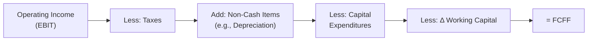

## 4.3 Valuation of Corporate Issuers

Valuing a corporate issuer—whether it’s a small Canadian energy firm or a massive multinational tech company—can feel downright intimidating when you first dive in. I remember my initial attempts at modeling a mid-sized energy company in Saskatchewan (yes, I was a bit in over my head) and realizing that exploration expenses, tax credits, and intangible assets all had unique treatments that weren’t quite straightforward. But fear not. Once we break it down into digestible steps, the whole valuation process becomes more of a methodical journey (with a few detours) rather than a daunting labyrinth.

Below, we’ll explore the main approaches and considerations for valuing corporate issuers. We’ll stick to an easy-to-follow format: first, a review of free cash flow valuation techniques, then an overview of relative valuation methods, a look at the Adjusted Present Value (APV) framework, and finally, some special cases and adjustments. We’ll close with a glossary, references, and a quick set of exam tips, followed by some practice questions. Let’s get started.

---

### Free Cash Flow Valuation

Free Cash Flow (FCF) is at the heart of the discounted cash flow approach. The main versions you’ll see are:

• Free Cash Flow to the Firm (FCFF)  
• Free Cash Flow to Equity (FCFE)

While FCFF is the cash flow available to all providers of capital (both debt and equity), FCFE is the cash flow remaining after accounting for interest payments and any necessary debt repayments. In other words, FCFE belongs exclusively to the equity holders. 

Below is a high-level look at how FCFF is built up from operating income:

#### FCFF vs. FCFE

Just to recap the conceptual difference:

• FCFF is calculated before taking into account the impact of capital structure and interest expenses.  
• FCFE is calculated after interest and debt flows.

For the sake of a formulaic refresher, we can write a simplified version of FCFF as:

$$
\text{FCFF} = \text{EBIT}(1 - t) + \text{D&A} - \text{CAPEX} - \Delta \text{NWC}
$$

Where:
- EBIT is Earnings Before Interest and Taxes,  
- \\( t \\) is the effective corporate tax rate,  
- D&A is Depreciation and Amortization,  
- CAPEX is Capital Expenditures,  
- \\(\Delta\text{NWC}\\) is the change in Net Working Capital.

From FCFF, you can derive FCFE if you subtract after-tax interest and incorporate net borrowing:

$$
\text{FCFE} = \text{FCFF} - \text{Interest} \times (1 - t) + \Delta \text{Net Borrowings}
$$

#### Forecasting Cash Flows

Forecasting cash flows often starts with the income statement and then moves to the balance sheet for working capital adjustments. You’ll estimate:

- Revenue (top line growth, price assumptions, volumes, etc.)  
- Operating expenses (cost structure, including labor, raw materials)  
- Non-cash charges like depreciation and amortization  
- Capital expenditures (both maintenance and expansionary)  
- Changes in net working capital (inventory, receivables, payables)

Once you have a forecast of FCFF or FCFE over a period (say 5 or 10 years), you’ll discount them to the present value using a discount rate. For FCFF, we use the Weighted Average Cost of Capital (WACC). For FCFE, we use the required rate of return on equity.

#### Estimating the WACC

The Weighted Average Cost of Capital (WACC) is the blended rate of return expected by both equity and debt investors. Under a target capital structure:

$$
\text{WACC} = \left(\frac{E}{E + D}\right) r_e + \left(\frac{D}{E + D}\right) r_d (1 - t)
$$

Where:
- \\( E \\) is the market value of equity,  
- \\( D \\) is the market value of debt,  
- \\( r_e \\) is the cost of equity, often estimated by the CAPM or a multifactor model,  
- \\( r_d \\) is the cost of debt, typically the yield on the firm’s debt,  
- \\( t \\) is the corporate tax rate.

Keep in mind that if your firm’s capital structure is in flux, you’ll want to use an iterative approach or rely on the target capital structure implied by management guidance or the industry norm.

#### Example (Canadian Context)

Suppose we have Maple Leaf Exploration, a mid-sized energy firm based in Alberta. Its major revenue source comes from upstream oil production, and it gets some exploration tax credits from the provincial government.

Here’s a highly simplified snapshot for one forecast year (all figures in millions of CAD):

- Revenue = \$300  
- Operating Expenses (excluding depreciation) = \$180  
- Depreciation & Amortization = \$25  
- Exploration Expenses (expensed under IFRS 6) = \$10  
- Capital Expenditures = \$35  
- Change in Net Working Capital = \$5  
- Corporate Tax Rate = 25% (federal + provincial)  
- Cost of Debt = 6%  
- Cost of Equity (CAPM) = 10%  
- Target Debt/Total Capital = 30%  

First, calculate EBIT. Let’s say EBIT includes exploration expenses for simplicity (though some exploration costs may be capitalized under certain conditions). If we assume EBIT is Revenue - Operating Expenses - Depreciation - Exploration Expenses:

• EBIT = 300 - 180 - 25 - 10 = \$85

Then FCFF might be:

1. \\( \text{EBIT}(1 - t) \\) = \$85 × (1 - 0.25) = \$63.75  
2. Add back D&A of \$25 = \$63.75 + \$25 = \$88.75  
3. Subtract CAPEX of \$35 = \$88.75 - \$35 = \$53.75  
4. Subtract \\(\Delta\text{NWC}\\) of \$5 = \$53.75 - \$5 = \$48.75  

So our forecasted FCFF is ~\$48.75 million for that year.

To discount that back at WACC:

1. Let E = 70% and D = 30% of total capital (based on the target structure).  
2. \\( r_d = 6\% \\), \\( r_e = 10\% \\), \\( t = 25\% \\).  

Then

$$
\text{WACC} = 0.70 \times 0.10 + 0.30 \times 0.06 \times (1 - 0.25) 
= 0.07 + 0.30 \times 0.06 \times 0.75 
= 0.07 + 0.0135 
= 0.0835\text{ or }8.35\%
$$

Use that 8.35% to discount your future FCFF numbers. This is obviously a super-simplified example, but I hope it shows how we might approach a Canadian energy issuer. You’d extend this approach across multiple forecast years and a terminal value, then sum the present values to get the total firm value.

---

### Relative Valuation Methods

Sometimes, you’ll hear busy analysts say, “I don’t have time for a full-blown DCF—let’s just do a multiple.” Relative valuation uses price multiples (like Price-to-Earnings or EV/EBITDA) to benchmark a firm against its peers. 

• P/E (Price/Earnings): Perhaps the most common ratio. It’s quick, but is heavily affected by earnings management and capital structure differences.  
• P/B (Price/Book): Focuses on equity’s historical cost, but intangible-heavy firms might find this ratio less meaningful.  
• P/S (Price/Sales): Use with caution because sales do not reflect cost efficiencies or debt usage.  
• EV/EBITDA (Enterprise Value / Earnings Before Interest, Taxes, Depreciation & Amortization): Usually considered “capital-structure neutral” since it uses enterprise value. 

#### Peer Group Comparisons

The real trick with multiples is picking the right peer set. You want firms of similar size, growth prospects, and risk profiles. If you’re appraising a niche Canadian energy firm that invests heavily in exploration, compare it with other explorers in similar geographies, not an integrated super-major with midstream and downstream operations.

#### Challenges with Cross-Border Comparisons

When we look at U.S., European, or Asian peers, local accounting standards and country-specific tax rules can throw off profitability ratios. Exchange rate fluctuations can also distort the underlying multiples, especially if your functional currency differs from that of the reported financial statements.  

One typical pitfall is ignoring differences in IFRS (common in Canada and Europe) vs. US GAAP (in the U.S.). For instance, intangible assets or exploration expenses might be capitalized differently, generating disparities in both balance sheet and income statement numbers.

---

### Adjusted Present Value (APV) Approach

When a firm’s capital structure is expected to change significantly—like in a leveraged buyout (LBO) or large-scale acquisition—the APV method can be a lifesaver. Instead of trying to adjust WACC dynamically year by year, you can break the valuation into two major buckets:

1. **Base Value of the Unlevered Firm:** The firm’s value as if it were financed entirely with equity.  
2. **Present Value of Financing Side Effects:** For instance, the tax shield from interest payments.

Mathematically, a simplified representation looks like:

$$
\text{APV} = \text{Unlevered Value} + \text{Present Value of Tax Shield} + \text{Other Financing Side Effects}
$$

Where the unlevered value is typically:

$$
\text{Unlevered Firm Value} = \sum \frac{\text{FCFF}_u}{(1 + r_u)^t} 
$$

Here, \\( r_u \\) is the cost of equity for an all-equity firm (i.e., the unlevered cost of capital), and \\(\text{FCFF}_u\\) is the free cash flow to the firm assuming no leverage.

The value of the interest tax shields can be discounted at \\( r_d \\) (if the debt is viewed as risk-free in the APV framework) or at a rate reflecting the default risk. This is especially relevant for big transactions or step-up acquisitions where the debt load evolves over time.

---

### Special Cases and Adjustments

Valuations rarely happen in a vacuum. You’ll often find all sorts of adjustments are necessary to reflect the true economic reality of a firm’s finances.

#### R&D and Intangible Assets
Under IFRS, some research and development costs can be capitalized (once certain technical feasibility criteria are met), whereas under US GAAP, R&D is typically expensed. This can lead to large differences in asset bases and reported net income. Consider normalizing these if you’re comparing cross-border peers or trying to unify two sets of financial statements.

#### Non-Recurring Items and Normalization
You might see big one-time gains or losses (like restructuring charges, litigation expenses, or an unusual currency revaluation). These can distort “headline” net income. It’s often wise to strip them out or adjust them so you can measure the company’s truly recurring performance. 

A common practice is “normalizing” EBITDA or earnings to remove non-operational items that you don’t expect to recur. This is crucial in situation-specific valuations, such as if you suspect a firm’s near-term or historical results are not reflective of its ongoing potential.

#### Regulatory Environment Influences
Canadian firms might follow IFRS, while U.S. firms might use US GAAP. Different reporting can change items like lease recognition, revenue recognition, or intangible asset valuation. If you’re comparing two companies, or if the firm you’re analyzing operates abroad, you’ll definitely need to do some adjustments for consistency.  

With energy firms especially, regulations around exploration, environmental obligations, and tax credits can significantly affect cash flows. Don’t forget to factor these in—especially if you’re picking a discount rate or evaluating possible future scenarios.

---

### Glossary

**FCFF (Free Cash Flow to the Firm):** Cash flow available to all investors (both debt and equity), typically before interest expenses.  
**FCFE (Free Cash Flow to Equity):** Cash flow available only to equity holders, after interest and principal debt payments.  
**APV (Adjusted Present Value):** A valuation method where a firm’s unlevered value is calculated first, and then financing side effects (like interest tax shields) are added.  
**EV/EBITDA (Enterprise Value/EBITDA):** A relative valuation multiple comparing a firm’s enterprise value (market cap + net debt) to its EBITDA, offering a measure of how the market values the firm’s cash-generating ability before interest, taxes, depreciation, and amortization.  
**Normalization:** The process of adjusting earnings or cash flows to remove one-time or non-recurring items.  
**Cross-Border Comparisons:** Valuations for firms in different countries. Accounting standards, tax regimes, and exchange rates can complicate direct comparisons.  
**Exploration Expenses (Canadian Context):** Costs associated with finding new oil, gas, or mineral resources. The treatment of these costs (expensed vs. capitalized) can significantly affect net income and asset values.  

---

### References and Further Reading

• McKinsey & Company, “Valuation: Measuring and Managing the Value of Companies.”  
• Aswath Damodaran, “Damodaran on Valuation.”  
• “Canadian Oil and Gas Evaluation Handbook” for specialized resource sector valuation.  
• CFA Institute resources on financial statement analysis and corporate finance (use your CFA Institute login for official white papers and references).  

---

### Final Exam Tips

• Know the difference between FCFF and FCFE cold. In exam vignettes, the trick often lies in adjusting for after-tax interest and net borrowing.  
• Practice your WACC calculations, especially in multi-part questions involving capital structure changes.  
• For relative valuation, be ready to interpret and adjust multiples to reflect differences in accounting standards.  
• Understand the rationale for APV vs. standard DCF, particularly if the question explicitly mentions changing leverage or unusual capital structures.  
• Keep an eye out for non-recurring items, intangible assets, or R&D adjustments. The exam might slip in a “normalization” question to see if you detect anomalies in the data.  

Alright, let’s wrap up with some practice questions to test your knowledge.

## Key Concepts in Corporate Issuer Valuation: 10 Practice Questions



### Which of the following best describes FCFE?

- [ ] Cash flow to both employees and suppliers.
- [x] Cash flow available to equity holders after accounting for interest and debt repayments.
- [ ] Cash flow before taxes are deducted.
- [ ] Cash flow only to bondholders.

> **Explanation:** FCFE includes cash remaining after interest and debt principal payments, making it relevant for equity investors.

### When constructing a peer group for relative valuation, which factor is most critical?

- [ ] Geographic proximity.
- [x] Similar industry, size, and risk profile.
- [ ] Same currency exposure.
- [ ] Same accounting standards.

> **Explanation:** The key to fair peer comparisons is selecting companies that are similar in competitive dynamics, market size, and financial risk.

### What is the main purpose of the Adjusted Present Value (APV) method?

- [ ] To compare two firms’ price multiples directly.
- [ ] To calculate only a firm’s intangible asset value.
- [x] To separately identify the unlevered firm value and the financing side effects (like tax shields).
- [ ] To avoid discounting cash flows altogether.

> **Explanation:** APV breaks down the valuation into the firm’s base (unlevered) value plus the impact of financing, which is particularly helpful if leverage changes significantly.

### In a discounted cash flow model, which discount rate is used when we calculate the present value of FCFF?

- [ ] The firm’s cost of equity.
- [ ] The interest rate on 10-year government bonds.
- [ ] The risk-free rate.
- [x] The Weighted Average Cost of Capital (WACC).

> **Explanation:** FCFF is discounted at the WACC because it represents the required return by both debt and equity holders.

### When performing a valuation of a Canadian energy firm, which additional expense consideration is commonly unique compared to other industries?

- [x] Exploration expenses that may be accounted for under IFRS 6.
- [ ] Overfunded pension obligations.
- [x] ESG compliance fees.
- [ ] Stock option expense under Black-Scholes assumption only.

> **Explanation:** Exploration expenses can be treated differently depending on accounting rules, making them a critical component for Canadian resource valuation.

### Under which scenario is it least appropriate to use relative valuation techniques?

- [ ] When comparable companies exist with well-defined market prices.
- [ ] When the subject company’s data is incomplete.
- [ ] When the subject company’s growth and risk profiles are stable.
- [x] When there are no truly comparable firms in the market.

> **Explanation:** Relative valuation depends on finding a reliable set of “comps,” and it’s less reliable if no comparable peers exist.

### Which of the following would typically be added back during the normalization of earnings?

- [ ] Ongoing production costs.
- [ ] Recurring selling and administrative expenses.
- [x] One-time restructuring charges.
- [ ] Regular interest payments.

> **Explanation:** Normalization adjusts for non-recurring charges or gains to better reflect true earnings capacity.

### Which of the following is the correct formula for the Weighted Average Cost of Capital (WACC)?

- [ ] r_d = E / (E + D) + r_e * D / (E + D) (1 – t).
- [ ] (E + D) / E × r_e + (E + D) / D × r_d (1 – t).
- [x] (E / (E + D)) × r_e + (D / (E + D)) × r_d (1 – t).
- [ ] E = r_e, D = r_d(1 – t).

> **Explanation:** The standard WACC formula is the proportion of equity times the cost of equity plus the proportion of debt times the after-tax cost of debt.

### When might APV be preferable to using a standard WACC-based DCF?

- [ ] If the company has a stable capital structure and minimal debt financing.
- [x] If the firm’s capital structure is expected to change significantly over time.
- [ ] If the firm intends to issue equity only.
- [ ] If the firm is in a regulated industry.

> **Explanation:** APV is especially important in scenarios (like LBOs) where leverage changes substantially, making a constant WACC approach less reliable.

### True or False: Cross-border valuations require no adjustments as IFRS and US GAAP have been fully harmonized.

- [x] True
- [ ] False

> **Explanation:** This statement is false. IFRS and US GAAP continue to differ in many areas (e.g., R&D, intangible capitalization, revenue recognition), so adjustments are often necessary.




