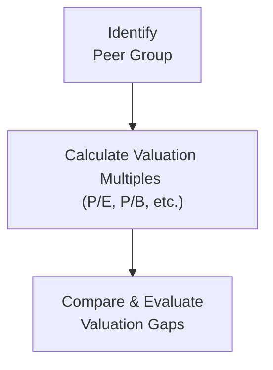

## 5.3 Market-Based Valuation and Relative Valuation

Market-based valuation—often referred to as relative valuation—plays a central role in equity analysis. If you’ve ever heard someone say, “This stock looks cheap compared to its peers,” chances are they’re invoking some form of market-based valuation. In my early days as an analyst, I remember poring over dozens of price-to-earnings (P/E) ratios, convinced they were the holy grail. But, as you’ll see, relativity can be a double-edged sword: It’s surprisingly quick to apply yet easily misleading if you ignore some subtle but essential considerations.

Below, we’ll cover the fundamentals of relative valuation, its main tools and ratios, and how to interpret them thoughtfully. We’ll also discuss best practices, highlight common pitfalls, and tie in references to US GAAP vs. IFRS considerations that can make your comparisons more accurate and relevant.

## Rationale Behind Market-Based Valuation
Market-based valuation (or the “method of comparables”) rests on the idea that similar companies should trade at similar multiples, all else being equal. If Company A and Company B are in the same industry, with fairly comparable growth prospects and risk profiles, their valuation metrics—like price-to-book (P/B) or enterprise value-to-EBITDA (EV/EBITDA)—should be roughly in line. If not, there might be a trading opportunity or an unrecognized fundamental difference.

At a high level, the technique looks like this:

1. Identify a relevant peer group (or “comp set”).  
2. Calculate or gather each company’s metrics and multiples.  
3. Compare multiples and interpret any differences based on fundamentals and intangible factors (e.g., brand strength, intangible assets).  

## Method of Comparables: Practical Steps
The approach typically involves:

• Defining the Peer Universe: Look for companies with similar business models, capital structures, and market exposures (needless to say, there’s a bit of subjectivity here). When analyzing Canadian energy firms in the oil sands region, for example, you’d probably skip a global integrated oil giant with robust downstream operations if your focus is purely on upstream production.  

• Gathering Data Carefully: Standardize the data as much as possible. Differences in reporting standards—US GAAP vs. IFRS—could shift the definition of “operating income” or “intangible assets,” so you might need to adjust.  

• Checking for Outliers: Sometimes a company shows “weird” results because of unique circumstances (maybe a large lawsuit settlement or a major write-down). Think about whether to include or exclude such data in your analysis.  

By the end of this process, you’ll have an array of multiples. Then you’ll interpret them according to the business environment, the company’s growth potential, and the broader market sentiment.

## Key Price Multiples
The first family of multiples focuses on price-based metrics. These are denominated by the price per share (or market cap) and typically use some measure of shareholder-level performance, like earnings or book value.

### Price-to-Earnings (P/E)
P/E is the most iconic.  
• Formula: P/E = (Price per share) / (Earnings per share)  
• Interpretation: High P/E relative to peers might suggest optimism about future growth… or it could mean overvaluation. A lower P/E can signal undervaluation or, perhaps, fundamental problems.  

A mini anecdote: The first time I looked at P/E for a cyclical mining company, the ratio was sky-high. Later, I realized it was near the bottom of the commodities cycle, so the earnings denominator was depressed. This is exactly why cyclical earnings can play havoc with this ratio.

### Price-to-Book (P/B)
P/B is useful, especially for financial institutions:  
• Formula: P/B = (Market price per share) / (Book value per share)  
• Interpretation: High P/B might mean the market expects robust ROE or intangible advantages. A low P/B often indicates a company in distress or subject to negative sentiment.

### Price-to-Sales (P/S)
P/S is less prone to accounting quirks about expenses.  
• Formula: P/S = (Market price per share) / (Sales per share)  
• Interpretation: Often favored when earnings fluctuate or when the firm is not profitable. But watch out for leverage or margin issues that might not show up here.

### PEG Ratio
The PEG ratio attempts to incorporate growth expectations.  
• Formula: PEG = (Price/Earnings) / (Expected Earnings Growth)  
• Interpretation: A ratio near 1.0 might be considered “fairly valued.” However, “expected earnings growth” is subject to analyst assumptions, so watch out for differences in consensus forecasts. Plus, intangible investments (like R&D) can cause big differences in reported earnings, especially when there are IFRS vs. US GAAP distinctions in how intangible assets are expensed or capitalized.

## Enterprise Value Multiples
Enterprise value (EV) is supposed to represent the total value of a firm’s operations. By including debt and subtracting cash, EV-based multiples can neutralize differences in capital structure. For cross-border comparisons—say, a Canadian energy firm vs. a U.S. energy firm—EV multiples are often considered more reliable:

### Enterprise Value (EV)
• Computation: EV = Market Cap + Total Debt – Cash  
• The goal is to measure the firm’s total market value, including debt holders, equity holders, and any cash offsets.

### EV/EBITDA
Maligned by some as a “crude approximation,” but extremely popular in practice.  
• Formula: EV/EBITDA = (Enterprise Value) / (EBITDA)  
• Interpretation: EBITDA strips out interest, taxes, depreciation, and amortization. Essentially, EV/EBITDA can provide a sense of how much the market is paying for the company’s cash flow from operations.  
• Watch out for intangible asset or depreciation anomalies. For instance, IFRS might categorize certain expenses differently, affecting your calculations.

### EV/EBIT
• Formula: EV/EBIT = (Enterprise Value) / (Earnings Before Interest & Taxes)  
• Interpretation: Similar to EV/EBITDA, but after depreciation and amortization. Potentially more accurate if you care about the firm’s reinvestment requirements.  

## Normalized Earnings and the Business Cycle
Want to see how cyclical industries can wreak havoc on straightforward price multiples? Enter normalized earnings! In cyclical sectors—energy, materials, industrials—earnings can seesaw year to year. Normalizing tries to remove the cyclical ups and downs to show a “through-the-cycle” picture.

A quick example:  
• Let’s say the average commodity price in your cycle is $100 per unit (over 5–10 years), but the current price is $60. That means today’s earnings are depressed. The P/E ratio might look really high, but it might not reflect the future if commodity prices revert to the mean.  
• Analysts use average earnings over a full cycle or a concept called “mid-cycle” pricing to compute an adjusted, or “normalized,” EPS.  

In Canada’s mining sector, you might see an analyst say, “We’ll assume the price for potash returns to $350/ton next year,” and recalculate the P/E ratio accordingly. The key is avoiding over-reliance on a single snapshot in time when cyclical forces are at play.

## Interpreting Comparative Ratios and the PEG
Once you have the multiples for each of your peers, how do you interpret them? Simple: Look at each company’s multiples and see if the target firm seems relatively expensive or cheap.

But it’s not that trivial. Weaknesses in relative valuation often arise from ignoring differences like:

• Growth Rates: Is the “cheap” company also the one with the lowest growth? Possibly, and that’s why the PEG ratio is so appealing: P/E over growth.  
• Accounting Distortions: IFRS vs. US GAAP. For instance, IFRS may allow revaluation of fixed assets in certain circumstances, while US GAAP generally does not. The same intangible brand can be recorded differently.  
• Risk Profiles: Even within the same industry, companies can have very different debt loads, operational risk exposures, or geographic footprints.  

The PEG ratio tries to control for growth but does nothing for risk differences. A high PEG might be justified if the company has intangible investments that reduce short-term earnings but boost long-term potential. Meanwhile, a low PEG might be a sign of trouble, not an opportunity.

## Momentum Indicators
It might sound like heresy to mention momentum in a fundamental analysis context, but many analysts, especially hedge funds, blend the two. For instance, if a stock looks cheap on EV/EBIT but also has rising relative strength or positive earnings revisions, that might be a green light. Conversely, a stock that looks cheap yet has negative price momentum might be a “value trap.”

Common momentum measures include:
• Price Momentum (e.g., 12-month change in share price).  
• Analyst Earnings Revisions.  
• Technical Indicators like RSI (Relative Strength Index) or MACD.

## Limitations and Adjustments
Relative valuation is quick and widely used, but there are pitfalls:

• Differences in Accounting Standards: A mining company that capitalizes more exploration costs under IFRS can show different EBITDA from a peer that expenses them under US GAAP. Adjust accordingly!  
• One-Off Items: If a company had a major asset sale or legal settlement last year, its reported EPS might not be representative. Usually, you’d exclude such items or treat them as non-recurring.  
• Temporarily Distorted Prices: Sometimes the entire sector is overpriced or underpriced. Relative analysis won’t protect you from a full-blown market bubble or meltdown.  
• Subjectivity in Peer Selection: “Comparable” is in the eye of the analyst. Use caution and transparency in revealing your criteria.

## A Quick Numerical Example
Let’s do a small hypothetical scenario to see how these numbers might come together.

Suppose you have four peers—two Canadian E&P (Exploration & Production) firms: “CanOil1” and “CanOil2,” and two U.S. E&P firms: “USOil1” and “USOil2.”

| Company  | Price/Share (USD) | EPS (Trailing) | P/E   | Debt ($B) | Cash ($B) | Mkt Cap ($B) | EV ($B) | EBITDA ($B) | EV/EBITDA |
|----------|--------------------|----------------|-------|-----------|-----------|--------------|---------|-------------|-----------|
| CanOil1  | $30.00            | $2.00          | 15.0  | $5.0      | $1.0      | $50.0        | $54.0   | $6.0        | 9.0       |
| CanOil2  | $25.00            | $2.50          | 10.0  | $6.0      | $0.5      | $40.0        | $45.5   | $5.0        | 9.1       |
| USOil1   | $45.00            | $3.00          | 15.0  | $3.0      | $2.0      | $70.0        | $71.0   | $8.0        | 8.9       |
| USOil2   | $55.00            | $5.00          | 11.0  | $7.0      | $1.0      | $110.0       | $116.0  | $12.0       | 9.7       |

A few observations:  
• On average, the P/E across the group is around 13–13.5. USOil2’s relatively low P/E of 11 could suggest value—or it might also suggest higher leverage risk.  
• EV/EBITDA multiples center around 9.0–9.7. USOil2 is the highest at 9.7, which could be justified by its scale, or it might indicate a slight premium.  
• Adjustments: If USOil2 experiences a non-recurring write-down in the next quarter, watch for how that changes the reported EPS or EBITDA.

This is a simplified table, but in reality, you’d toggle these metrics in a financial model, adjusting for any differences in IFRS vs. US GAAP, intangible asset recognition, and so forth.

## Best Practices to Keep in Mind
• Always Cross-Check: If your P/E signals undervaluation, confirm it with EV/EBITDA or other metrics.  
• Normalize Where Appropriate: For cyclical industries, consider multi-year averages.  
• Reconcile with Intrinsic Valuation: Market-based analysis is great but try to pair it with Dividend Discount Models (DDMs) or Free Cash Flow (FCF) models if possible.  
• Factor in Macro Trends: If commodity prices or interest rates change rapidly, your multiples may indicate a “cheap” valuation when the fundamentals are actually shifting.

## Conclusion and Final Exam Tips
Market-based valuation and relative valuation remain some of the most commonly employed approaches in equity analysis because they provide quick, real-time metrics on how the market is pricing a company relative to its peers. However, do keep in mind the differences in accounting policies, capital structures, and fundamental growth prospects. Relative valuation is a map, not a territory—helpful but incomplete on its own.

For the CFA® Level II exam, expect vignette-style questions that combine financial statement data, ratio analysis, and subtle differences in IFRS vs. US GAAP. You might be asked to calculate adjusted multiples after removing a non-recurring charge or to evaluate the reasonableness of a PEG ratio. Practice normalizing earnings for a cyclical firm. And don’t forget the interplay with momentum or intangible investment.

• Watch for special adjustments: Non-recurring items, intangible assets, cross-border differences in tax or depreciation.  
• Understand the logic behind each multiple (P/E vs. EV/EBIT, etc.) and their sensitivities.  
• Be prepared to defend your peer group selection and highlight any fundamental differences that might cause artificial discrepancies.

## References and Further Reading
- CFA Institute. (Current Edition). “Equity Investments: Market-Based Valuation.”  
- UBS Research. (n.d.). “Global Energy and Mining Industry Reports.”  
- Fabozzi, F. (2007). “Equity Valuation: Science, Art, or Craft?”  
- Bloomberg.com “Equity Screening and Comparative Valuation Tools.”  

-----------------------------------------

## Test Your Knowledge: Market-Based and Relative Valuation Quiz



### Which best describes the primary rationale behind market-based valuation (method of comparables)?

- [ ] It relies solely on cash flow projections for a single company over time.  
- [x] It assumes companies with similar characteristics should trade at similar valuation multiples.  
- [ ] It values a company based on pure historical cost data of its assets.  
- [ ] It is solely focused on intangible asset valuation techniques.  

> **Explanation:** The core assumption of market-based valuation is that comparable companies with similar growth and risk profiles should have similar valuation multiples.

### When using the P/E ratio to value a cyclical firm, which pitfall might an analyst encounter?

- [ ] The P/E ratio underweights debt levels of the company.  
- [ ] The P/E ratio can only be used during an economic expansion.  
- [x] Volatility in earnings can distort the ratio, making it misleading at certain points in the cycle.  
- [ ] The P/E ratio is not allowed under IFRS for cyclical firms.  

> **Explanation:** Cyclical firms often see their earnings swing dramatically with the business cycle. A low phase in earnings can inflate the P/E ratio, and a high phase can understate it.

### Which of the following is an advantage of using EV/EBITDA over P/E ratios?

- [x] EV/EBITDA captures differences in companies’ capital structures by factoring in debt and cash.  
- [ ] EV/EBITDA is unaffected by accounting differences between IFRS and US GAAP.  
- [ ] EV/EBITDA is always lower than P/E, making valuations more conservative.  
- [ ] EV/EBITDA does not use any market-based inputs.  

> **Explanation:** EV/EBITDA takes into account the entire capital structure (equity and net debt), making it more comparable across firms with different leverage levels.

### What is the main purpose of normalized earnings for valuation in cyclical industries?

- [ ] To only use one year of unusually high or low earnings.  
- [x] To smooth out earnings across the cycle and avoid misleading valuation signals from peak or trough years.  
- [ ] To eliminate all taxes and interest charges from the analysis.  
- [ ] To provide an adjusted measure of free cash flow for intangible asset companies.  

> **Explanation:** Normalized earnings in cyclical industries aim to capture a mid-cycle or average view of profitability, reducing the impact of short-term fluctuations.

### For a firm with extensive intangible R&D investments, how might the PEG ratio be misleading?

- [x] Current earnings can be understated if R&D is expensed, making the P/E portion higher.  
- [x] Growth assumptions for R&D are always recognized as intangible assets, reducing the PEG.  
- [ ] The ratio ignores the capital structure, causing overstatement of intangible assets.  
- [ ] The ratio automatically adjusts to IFRS standards for intangible Assets.  

> **Explanation:** Because IFRS or US GAAP might require R&D expenses to be written off immediately, reported earnings can be suppressed, inflating the P/E portion of the PEG ratio.

### If a Canadian mining firm’s IFRS-based financials allow for revaluation of its mineral reserves, while a U.S. peer must stick to historical cost under US GAAP, which action is most appropriate when doing a comparables analysis?

- [x] Adjust one or both sets of statements to ensure consistent treatment of mineral reserves.  
- [ ] Rely solely on the IFRS numbers because IFRS is more globally recognized.  
- [ ] Disregard the U.S. peer from the analysis as it uses a different standard.  
- [ ] No adjustments are necessary since the P/E ratio will absorb these differences.  

> **Explanation:** Differences in accounting standards can significantly affect reported assets (and thus equity and earnings). Normalizing or adjusting for these differences is crucial.

### Which of the following often supplements fundamental comparables analysis?

- [x] Price momentum indicators like relative strength.  
- [ ] Black-Scholes model outputs for stock options.  
- [x] Analyst earnings revisions data.  
- [ ] A strict ban on using technical signals.  

> **Explanation:** Many institutional investors combine fundamental analysis with momentum or technical indicators (e.g., RSI, earnings revisions) to refine investment decisions.

### A company’s P/E ratio is lower than its industry average. All else being equal, what might explain this discrepancy?

- [x] The company faces higher perceived risk or lower growth prospects.  
- [ ] The entire sector is undervalued, so the company must have been mispriced upwards.  
- [ ] Investors prefer stocks with a lower ratio due to IFRS regulations.  
- [ ] The PEG ratio always trumps the P/E ratio, making P/E ratio comparisons irrelevant.  

> **Explanation:** A relatively low P/E could be due to higher risk, weaker growth, or the market anticipating a downturn in earnings.

### Which of the following should an analyst remove from earnings when constructing a normalized metric?

- [x] Non-recurring litigation settlements.  
- [ ] Salaries of the executive management.  
- [ ] Breakeven analysis for a new product.  
- [ ] Interest expense from standard borrowings.  

> **Explanation:** Typically, non-recurring charges (like lawsuits, major disasters, or temporary booms) are stripped out from earnings to form a clearer picture of recurrent profitability.

### When analyzing a peer group, is it true that adding more comparable companies is always beneficial for accuracy?

- [x] True
- [ ] False

> **Explanation:** Generally, a larger, more representative peer group can dilute the influence of outliers and capture a broad range of market conditions—though you still need to ensure these peers are genuinely comparable.


