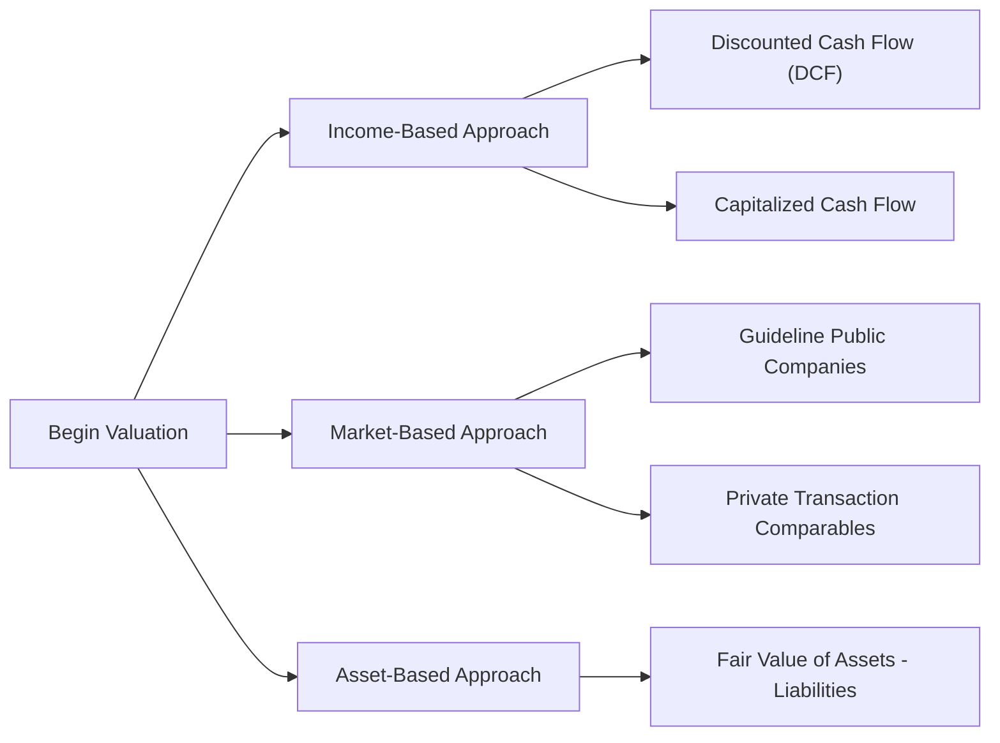

## 5.4 Private Company Valuation

Picture this: you’re sitting down with the founder of a small, family-run manufacturing business. Her company isn’t publicly traded, so there’s no visible stock price to rely on. She wants to expand and is thinking about bringing in outside investors, or maybe she’s thinking of passing the reins to her children eventually. But here’s the kicker: how do you figure out what her business is “really” worth with no active market to give you real-time price quotes?

That’s precisely where private company valuation steps into the spotlight. Honestly, if you’ve dealt with family businesses or up-and-coming tech start-ups, you know these valuations can feel a bit trickier (or fuzzier) than public company appraisals. So let’s delve into the “how,” “why,” and “which method” of private company valuation, weaving in a few personal stories and insights along the way.

## Why Private Company Valuation?

Private companies don’t have an official share price flashing across a ticker. Instead, their value is derived from a handful of analyses. The big reasons for private company valuations include:

• Mergers and Acquisitions (M&A): Whether it’s a family-owned chain of bakeries getting snapped up by a larger conglomerate or a startup’s partial buyout, you need a reasonable sense of the target’s worth.  
• Estate Planning and Taxation: Let’s say a founder wants to pass on shares of her business to heirs. Tax authorities usually don’t accept “I think it’s worth X” without some rigorous analysis.  
• Private Equity Investments: Investors in private ventures want to negotiate how many shares to get for their capital, so they need to put a value (or at least a range) on the company.  
• Internal Strategic Decision-Making: The company might want to track its “market value” for management performance or to allocate capital more effectively.

Essentially, we can’t rely on a daily public stock quote. That means we have to get creative—while staying logical and consistent with valuation principles.

## Methods

Broadly, private company valuation can be broken into three major approaches: 
• An Income-Based Approach  
• A Market-Based Approach  
• An Asset-Based Approach  

Each has its own quirks, and what you pick often depends on the business model. For instance, a tech-driven services startup might find that an Income-Based Approach using forecasted cash flows is more appropriate than an Asset-Based Approach (which might undervalue intangible assets like intellectual property).

### Income-Based Approaches

This is where you forecast future cash flows and then discount them back to the present value. In a private company setting, the two popular formats are:

• Discounted Cash Flow (DCF) Analysis. You might project Free Cash Flow to the Firm (FCFF) or Free Cash Flow to Equity (FCFE) over several years and then apply a terminal value approach (like a perpetuity growth model or exit multiple method). Then you discount it all back at a rate that accounts for the firm’s risk, which can be a bit more “custom” than a standard CAPM for large public companies.  

• Capitalized Cash Flow (CCF). This is often called the single-period capitalization technique. It’s handy for companies with relatively stable growth and predictable earnings patterns. You take an expected cash flow for, say, the next year, and “capitalize” it using a capitalization rate (essentially a discount rate minus a sustainable growth rate).

I remember a friend’s coffee shop we tried to value a while back: we used a simple CCF approach because the business had a fairly consistent earnings base. We basically took next year’s projected owner-verified cash flows, deducted a portion for ongoing capital expenditures to keep the machines and store in prime shape, and then applied a discount rate that included a small-business risk premium. That got us to a rough but workable figure for negotiations.

### Market-Based Approaches

If you lean more toward a relative valuation style, you can look for comparables. It’s trickier with private companies, but you can do two things:

• Use Publicly Traded Comparable Companies (with adjustments). You’d compute metrics like Price/Earnings, EV/EBITDA, or Price/Sales for a set of publicly traded peers, then discount for size, liquidity, and other factors. Because private companies typically face higher risks (smaller scale, more concentrated customer bases), you often add a small discount to these traded multiples.  

• Use Private Transaction Data. Here, you look at actual M&A deals or private equity transactions in the same industry. The data might come from specialized databases. Be mindful, though, because private deals can vary widely in terms of deal structure, synergy potential, or intangible asset transfers. There’s also a difference in access to such data—some deals remain confidential.

### Asset-Based Approaches

Sometimes, a firm’s value might just be all about its net identifiable assets. This approach sums up the fair values of assets (often requiring appraisals, especially for intangible assets, equipment, or real estate) and deducts liabilities. The surplus is your equity value. This approach is frequently relevant for:

• Investment Holding Companies. Because you’re essentially adding up the market values of investments and netting out any liabilities.  
• Asset-Intensive Businesses like real estate or natural resources. You might rely on an updated market value of land, buildings, or mineral rights.  

That said, if a firm’s intangible value is big or its growth potential is robust, the asset-based approach can understate the “true” going concern value. So always think carefully about the context of the business model.

## Discounts and Premiums

We can’t talk about private company valuations without discussing discounts and premiums:

• Lack of Marketability Discount (LOMD): Because you can’t just sell shares in a private company with a single click, the shares are obviously less liquid. That illiquidity translates into a discount, often 10% to 30%—depending on the specific market. In the U.S., you frequently see case-law references in estate and gift tax contexts that help quantify this discount.  

• Control Premium (or conversely, Minority Discount): If you’re buying a controlling stake, you usually pay a premium because control has inherent value (like deciding on dividends or major strategy deals). Minority holdings may see discounts because they don’t get those control perks. In Canada, it’s not unusual for different share classes to have drastically different voting rights, so you need to be super careful here.  

A funny anecdote: I once interviewed a family-run trucking business in Canada that had Class A voting shares and Class B non-voting shares. The father insisted that the Class A shares should have double the value of Class B shares purely because of control. But after some analysis, we ended up with a control premium of only around 20% above the baseline—still material, but not as high as the father’s initial guess.

## Estimating Required Rate of Return

Valuing a private company means pinning down a discount rate that reflects the business’s real risk. Two common ways to do that:

• Build-Up Method: Start with a risk-free rate (say, a 10-year Government of Canada bond yield), add an equity risk premium (maybe from historical market studies), tack on a size premium for smallness, then sprinkle in industry risk or specific-company risk as you see fit. This is widely used in the U.S. too, especially in smaller private firm valuations.  

• Expanded CAPM: Begin with the standard CAPM (risk-free rate + beta × market risk premium) and then add a size premium and a company-specific premium. The company-specific premium might capture the extra volatility or “key-person” risk—like if the founder is a critical part of every major business function.

The discount rate is crucial. A small difference can surprisingly change the valuation a lot. If you’re evaluating passenger airline startups, that discount rate might be pretty high (think uncertain demand, cyclical markets). If it’s a stable, mature family-run grocery store, that might call for a slightly lower required return, but still possibly higher than you’d use for a giant public consumer staples stock.

## Canadian vs. US Considerations

It’s not just about the narrower liquidity issues; the structure of the company and local tax rules matter too:

• Canadian-Controlled Private Corporations (CCPCs): If the company meets certain criteria—like being controlled by Canadian residents—it can enjoy preferential tax rates on active business income. So the actual cash flows that flow to equity can differ from an otherwise identical U.S. corporation. This affects your projected after-tax earnings and might reduce the discount rate if there’s consistent beneficial tax treatment.  

• US-Based S-corporations or LLCs: These are pass-through structures for tax purposes, which means the profits “pass through” to the owners, who are taxed individually. So you often need to adjust your discount rates or look at the company’s “owner-level” taxation rather than corporate tax structures.

In practice, you’ll want to ensure you’re capturing actual after-tax free cash flows. In Canada, watch out for additional tax complexities if the company invests in passive income streams that exceed certain thresholds. In the U.S., watch out for S-corp limitations on the number of shareholders or ownership types.

## Practical Example: Valuing a Private Microbrewery

To illustrate, imagine there’s a small microbrewery in Vancouver, BC, that’s also distributing to some U.S. states. Let’s say you want to estimate its fair market value for a potential partial buyout:

• For the Income Approach, you project the firm’s FCFE for five years, factoring in expansions to new markets plus standard overhead. Because it sells to both Canada and the U.S., you might face exchange rate assumptions (see Chapter 2.2 on Exchange Rate Determination). If the owners plan to remain for day-to-day management, consider whether key-person risk is material. Then, discounted at the build-up discount rate.  

• You might then check the Market Approach by looking at small, publicly listed breweries on the TSX or NASDAQ. (Keep in mind, a well-known brand like Molson Coors is far too large to be a good direct comparable!) You might glean that similar microbreweries have sold at, say, 10× EBITDA. Considering the relative smallness of this local brewery, you knock that down to 7× or 8×.  

• For the Asset Approach, maybe the brewery invests heavily in specialized brewing equipment—some of which might have limited secondary market value. You’d examine its net book values, fair market revaluations, plus intangible assets (brand name, unique recipes, local loyalty). It might turn out the intangible brand is the biggest driver of value, so the net “hard” asset approach could understate the firm’s going concern worth.

In the end, you might weigh each approach, see the differences, and finalize your best estimate. Then you might also apply a discount for lack of marketability if these shares can’t be readily sold. If the buyer is seeking control, factor in a control premium.

## Glossary

• Build-Up Method: A technique to derive the discount rate by summing a base risk-free rate with various risk premiums (equity, size, industry, etc.).  
• CCPC (Canadian-Controlled Private Corporation): A private corporation controlled by Canadian residents, enjoying certain tax advantages on active business income.  
• Lack of Marketability Discount (LOMD): A discount reflecting the illiquidity of shares in a private firm.  
• Asset-Based Valuation: Summing up the fair market value of a company’s assets and deducting liabilities to arrive at equity value.

## References and Further Reading

• Hitchner, J. R. (2017). “Financial Valuation: Applications and Models.”  
• Pratt, S. P. (2013). “Valuing a Business: The Analysis and Appraisal of Closely Held Companies.”  
• Deloitte Canada. (n.d.). “Private Company Valuation Insights.”  
• CFA Institute. (Current Edition). “Private Company Valuation” curriculum readings.  

For a more in-depth perspective, also consider cross-referencing with the earlier chapters in this text—for instance, Chapter 1.6 on simulation methods if you want to run scenario tests on your private projection assumptions, or Chapter 3.4 regarding evaluating financial reporting quality if the private firm’s statements are less standardized.

## Final Exam Tips

• Master the interplay between different valuation approaches. The exam loves to see whether you can choose the right approach given a firm’s characteristics or weigh the pros and cons of each.  
• Understand how to estimate discount rates, especially around the Build-Up Method or Expanded CAPM. If they toss you some obscure “company-specific risk factor,” make sure you know how to incorporate it into your discount rate.  
• Memorize key definitions—like the difference between control premiums vs. minority discounts or the rationale behind LOMD.  
• Watch for small but significant details when reading vignettes—maybe a special tax status or an intangible brand that drastically changes the final valuation.  
• Practice calculating and applying discounts. They might give you a “raw” value from a multiple-based approach, and you’ll have to apply a minority discount and a lack of marketability discount to get the final equity value.

Remember, private company valuation often involves more subjective assumptions compared to publicly traded equity valuations. Stay logical, consistent, and mindful of the particular nuances of each scenario. That’s usually what the exam (and real-life situations) reward!

--------------------------------------------------------------------------------------

## Test Your Knowledge: Private Company Valuation Essentials



### Which of the following is often the biggest challenge in valuing a private company?

- [ ] Lack of any accounting records
- [x] Inability to observe an active market price for the shares
- [ ] Overreliance on government subsidies
- [ ] Excessive institutional ownership

> **Explanation:** Private companies don’t have stocks traded in public markets, so you can’t look at a market price as a reference. Other aspects—like accounting records—may pose challenges, but the absence of a public market price is a defining issue.

### In a Capitalized Cash Flow (CCF) approach, which of the following is most likely used?

- [x] A single period of expected cash flow and a capitalization rate
- [ ] The sum of all historical earnings
- [ ] A direct ratio between market price and EPS
- [ ] Earnings weighted heavily by intangible assets

> **Explanation:** The CCF method typically capitalizes a single period’s cash flow at an appropriate rate, making it a simpler approach compared to multi-year DCF forecasts.

### A Control Premium is relevant in a private company valuation when:

- [x] The buyer aims to acquire a majority stake
- [ ] The company’s shares trade frequently on a public exchange
- [x] The buyer demands significant operational influence
- [ ] The firm’s intangible assets drive most of its value

> **Explanation:** Control premiums arise when a potential owner can gain direct control over corporate decisions, such as setting strategy or dividends. Minority positions do not enjoy this privilege, and thus might be discounted.

### The Build-Up Method for determining the discount rate typically starts with:

- [x] The risk-free rate and adds equity and size premiums
- [ ] Average industry risk premiums only
- [ ] A premium for intangible assets that aren’t recorded
- [ ] The Weighted Average Cost of Capital (WACC) from a public peer

> **Explanation:** The Build-Up Method adds layers of premiums on top of the risk-free rate (equity risk premium, size premium, specific-company premium, and so on) to find the overall required return.

### In a private company valuation using market multiples, why might you apply a discount compared to a similar public company's multiple?

- [x] Due to lower liquidity and higher risk in private firms
- [ ] Because analysts dislike private firms intrinsically
- [x] Because smaller firms typically earn higher P/E ratios
- [ ] Because public firms always have more intangible assets

> **Explanation:** Private companies are often smaller and riskier with illiquid shares, so a discount to the multiples of public peers is common. The final discount rate or multiple adjustment is situation-dependent.

### Lack of Marketability Discount (LOMD) primarily addresses:

- [x] The difficulty in selling private shares quickly
- [ ] The inability to raise additional debt
- [ ] The excessive overhead in private firms
- [ ] The limited brand awareness of a private firm

> **Explanation:** LOMD is all about recognizing how illiquid private shares can be. It compensates for the challenge of converting those shares into cash on short notice.

### Which of the following could significantly lower the discount rate for a Canadian-Controlled Private Corporation (CCPC)?

- [x] Favorable tax rates on active business income
- [ ] Larger free float in public markets
- [x] Multi-year lock-up agreements for shareholders
- [ ] Comparable private transactions with high valuations

> **Explanation:** CCPCs enjoy tax advantages, effectively boosting after-tax cash flows and potentially lowering the required discount rate. Share lock-ups or high comparable valuations don’t directly reduce the discount rate itself.

### A strong intangible brand value might reduce reliance on:

- [x] The Asset-Based Approach
- [ ] The DCF Approach
- [ ] The Market Approach
- [ ] The Weighted Average Cost of Capital

> **Explanation:** An Asset-Based Approach doesn’t always capture intangible brand value adequately, so if a firm’s intangible assets are key drivers, you may move away from a strict asset-based calculation.

### When applying a Minority Discount, the rationale is that:

- [x] Smaller stakes with fewer control rights are less attractive
- [ ] Minority owners have more influence on dividend policy
- [ ] Larger shareholders receive fewer rights
- [ ] Small blocks of shares are always easier to sell

> **Explanation:** A minority stake lacks control over key decisions, thus typically fetching a lower price per share compared to a controlling interest. That discount reflects the diminished benefits and influence.

### Private firm valuations generally include additional subjective adjustments compared to publicly traded companies. True or False?

- [x] True
- [ ] False

> **Explanation:** Valuing a private firm involves greater uncertainty and subjective judgment (e.g., applying discounts for lack of marketability, estimating personalized discount rates, selecting the right comp set, etc.).


