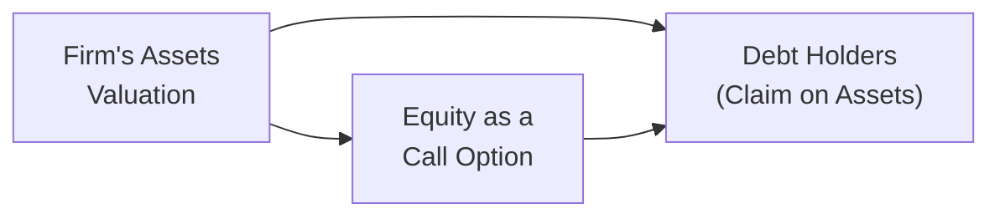

## 6.2 Credit Analysis and Credit Risk Modeling

Credit analysis is at the heart of fixed income investing and risk management—it’s all about making sure you get paid on time. I remember feeling slightly overwhelmed the first time I saw all these acronyms (PD, LGD, EAD) flying around. But once you get the hang of them, it becomes pretty intuitive and, dare I say, a little interesting. In this section, we’ll dig into the building blocks of credit risk, compare modeling approaches (structural and reduced-form), and see how these ideas play into credit valuation, credit spreads, and credit default swaps. Let’s jump in.

## Foundations of Credit Analysis

Banks, bondholders, and even everyday investors base many decisions on credit analysis. The core concept is simple: If you've lent money (through a bond or a loan), there's a risk the borrower might fail to pay you back or might make you wait a really long time while you wrestle with legal tangles. Assessing that risk means figuring out how likely a borrower is to default (probability of default), how much you might lose if the borrower defaults (loss given default), and how big the exposure is at the time of default (exposure at default).

Credit analysis doesn’t just matter for corporate bonds; it also matters for municipal issuers, structured products (like mortgage-backed securities), and even for slightly more exotic instruments like collateralized loan obligations. Credit risk is basically everywhere. So yeah, let’s get comfortable with it.

## Probability of Default, Loss Given Default, and Expected Loss

One of the pillars of credit analysis is the distinction between Probability of Default (PD), Loss Given Default (LGD), and Expected Loss (EL). You might hear these terms tossed around as if they’re the same thing, but they measure different slices of the credit risk puzzle.

• Probability of Default (PD): This is the likelihood (over a given horizon, say one year) that the borrower will fail to meet its debt obligations.  
• Loss Given Default (LGD): This is the fraction of the exposure that is likely to be lost if default occurs. If the firm goes under, how much can you reasonably recover from its assets? LGD accounts for that.  
• Exposure at Default (EAD): The amount actually at risk at the time default happens.  

Often in credit risk contexts, the shorthand is:

$$
\text{EL} = \text{PD} \times \text{LGD} \times \text{EAD}.
$$

That’s it. For instance, if I have a $1 million bond (EAD = \$1{,}000{,}000$), and I expect a 5% chance of default (PD = 0.05) with a 60% loss rate (LGD = 0.60), then my expected loss is:

$$
\text{EL} = \$1{,}000{,}000 \times 0.05 \times 0.60 = \$30{,}000.
$$

This $30,000 is the average loss I can expect each year if my estimates are spot on. In reality, default events can be lumpy and non-linear, but this formula provides a simple yardstick to measure the credit risk magnitude.

## Structural Models vs. Reduced-Form Models

When it comes to credit risk modeling, you will often see two major schools of thought:

• Structural Models  
• Reduced-Form Models  

### Structural Models

Structural models come from the idea that the firm’s equity behaves like a call option on its assets. In the classic Merton model, the logic goes like this:  
- Think of a firm’s total assets on one side of the balance sheet.  
- The debt holders have a claim that is effectively the “strike price,” because if the firm’s assets are worth more than the debt, the firm can repay and remain solvent.  
- Equity holders get whatever is left after paying off the debt. If the assets are below the debt, the firm defaults, and the equity holders get zip.  

In a structural model, you explicitly track the firm’s asset value and volatility. Then, by comparing the firm’s total value to the face value of its debt, you can estimate the probability the assets will drop below the debt threshold. It’s kind of like looking at a call option and assessing the likelihood that it ends up worthless at expiration.  

Below is a simplified mermaid diagram to visualize the flow:

It’s a beautiful conceptual model, but it also requires good estimates of the firm’s asset values and volatilities. Conducting a structural model in practice can be challenging, especially for firms with complex capital structures, intangible assets, or big strategic shifts. Still, many financial institutions use a variant of Merton’s approach or adapt it heavily.

### Reduced-Form Models

Reduced-form models don’t fuss with the nitty-gritty of a company’s assets. Instead, they use statistical methods and market data (like bond spreads, equity prices, or even macroeconomic data) to estimate the probability of default. Think of them more like “empirical approach meets big data.”  

In a reduced-form model, you often see a hazard rate (intensity of default) that can be estimated from observed yields or credit spreads. Because you don’t have to track the firm’s entire balance sheet, it’s sometimes easier to implement, especially across large portfolios. The trade-off? You lose the interpretation of what’s happening at the asset level.  

Banks, insurance companies, and rating agencies often blend aspects of both modeling approaches—structural for the conceptual grounding and reduced-form for real-time calibration using market spreads.

## Credit Ratings, Transition Matrices, and Migration Risk

If you’ve ever read through the ratings of agencies like Moody’s, S&P, or DBRS Morningstar, you might’ve wondered, “How do they stamp a letter grade on a company’s creditworthiness?” These agencies use their own proprietary methodologies that combine both quantitative (balance-sheet analysis, coverage ratios, etc.) and qualitative factors (like corporate governance or the track record of management).

### Transition Matrices

One key tool is the transition matrix. A transition matrix indicates the probability that an issuer will move from one rating category to another over a specified period—usually a year. For instance, a transition matrix might say that a BBB-rated issuer has a 3% probability of being downgraded to BB, a 2% probability of falling down to B, and, say, a 0.1% chance of defaulting over the upcoming year, etc.  

### Migration Risk

Migration risk is the risk that your bond or issuer moves from one credit rating to another. This can have a direct effect on your bond’s price or yield. For example, if a bond is downgraded from investment grade to high yield, it may trigger forced selling by funds restricted to investment-grade debt. That can push the bond’s price down more sharply, which hurts current holders. On the other hand, an upgrade can tighten the credit spread and cause a price rally.  

Ratings aren’t perfect predictors, but they remain a powerful market signal. Keep in mind that rating agencies can lag the market. Sometimes credit spreads might widen, reflecting trouble ahead, while official ratings remain the same for a while.

## Credit Spreads and Interpreting Their Changes

A bond’s credit spread is basically the yield difference between a risky bond and a comparable risk-free bond (often a government bond). So if a corporate bond has a yield of 5% and a Treasury of the same maturity yields 3%, then the credit spread is 2% (or 200 basis points).  

Why do we care about credit spreads?  
- They represent the market’s best guess at how risky the bond is—both default risk and compensation for illiquidity or uncertain future rating changes.  
- Widening spreads (like from 200bp to 300bp) may signal growing concerns about credit or macroeconomic headwinds.  
- Tightening spreads often reflect improving conditions, or a “risk-on” mood among investors.  

Credit spreads are dynamic and can be influenced by global events, monetary policy changes, or even investor sentiment. You might see them bounce around quickly in times of market stress (e.g., the 2008 financial crisis or the onset of COVID-19 uncertainties).

## The Term Structure of Credit Spreads

Just like the yield curve for Treasuries, credit spreads can vary by maturity. You might see a credit spread curve that’s steeper at the short end if short-dated obligations are perceived as less safe due to near-term uncertainty. On the other hand, a longer-dated bond might have higher spreads if the market sees long-run challenges for the issuer.

Sector considerations come into play too. For instance, commodity-focused companies might see more volatility at longer maturities when markets anticipate cyclical downturns. Meanwhile, stable industries (like utilities) might have a flatter spread curve.

Understanding the term structure helps with:  
- Maturity selection: Do I want short-dated bonds with lower absolute yield but less risk, or do I want longer maturities with higher yields but greater economic uncertainty?  
- Relative value: Possibly you can spot mispricings along the maturity spectrum if you have good insights into future default and liquidity conditions.

## Incorporating Macroeconomic Factors

Macroeconomic variables—like GDP growth, unemployment rates, interest rate trends—affect corporate health. As a general rule, higher GDP growth might reduce defaults (yay, good times); rising unemployment often signals recession risk and potential defaults (not so great). Central bank policies—such as interest rate cuts—can lower overall yields, impacting how investors perceive credit spreads.

In Canada, you want to pay close attention to provincial economic health. For instance, energy-dependent provinces could see more stress if oil prices fall. In the U.S., municipal bonds might hinge on state-level tax revenue or pension obligations. A more localized slowdown can have a big effect on local issuance default risks, even if the broader national metrics look decent.

## Pricing Corporate Bonds and Structured Products

Once you’ve got a handle on PD, LGD, and the macro backdrop, you can try to price bonds or structured products more accurately.

• Expected return measures: You account for default risk by deducting the expected loss. So if a bond yields 7% but has an expected loss of 2%, the “fair” realized yield might be closer to 5%.  
• Recovery rates and liquidity: Even if you’re comfortable with a bond’s default probability, you have to assess how quickly you can offload that bond if you need cash. High-yield or distressed debt sometimes trades in illiquid markets, making it a challenge to exit at a fair price.

Structured products (like mortgage-backed securities, asset-backed securities, collateralized debt obligations) often have “tranching,” which prioritizes cash flows so that senior tranches get repaid first, while junior tranches take losses first. This structure is a way to slice and dice credit risk. But it can get complicated—each tranche has its own PD, LGD, and correlation to macro factors. Careful analysis is definitely required.

## Role of Credit Default Swaps in Credit Risk Management

Credit Default Swaps (CDS) let you offload (or take on) credit risk without actually selling (or buying) the underlying bond. If you own a bond issued by Company X and you’re nervous about a default, you can buy a CDS that pays you if Company X defaults. Of course, you pay a premium (the CDS spread) to the seller of protection for that coverage.  

Interestingly, CDS spreads often move faster than credit ratings, and some investors believe they are a better gauge of real-time market sentiment about an issuer’s default risk. CDS also function as a way to hedge or to speculate—for instance, if you think a company is on shaky ground, you could buy CDS protection (even without holding the underlying bond) to potentially profit if the company’s condition worsens.

---

## Best Practices and Common Pitfalls

• Don’t Over-Rely on Past Data: Credit events are rare, often clustering in crises. Simply plugging in historical data might not reflect future dynamics.  
• Watch for Correlations: Especially in structural models, correlations among asset classes can shift dramatically during downturns.  
• Rating Agency Lag: Agencies do thorough analyses, but they don’t always update swiftly. Market spreads can signal changes earlier.  
• Liquidity Gaps: Sometimes, a bond looks attractively priced until you realize the market for it is extremely thin.  
• Complex Capital Structures: For large issuers, watch out for layering of senior debt, subordinated debt, covered bonds, etc. Recovery assumptions can vary drastically.

---

## Tips for the Exam

1. Master the Key Definitions: Make sure you’re crystal clear on PD, LGD, EAD, and the concept of expected loss. Watch how the exam might slip in a question that wants the formula or tries to trick you with partial data.  
2. Know the Intuition Behind Structural vs. Reduced-Form Models: You should be able to explain how the Merton model conceptually works, and how a reduced-form model might rely on observed credit spreads or hazard rates.  
3. Interpret Transition Matrices: Practice reading a transition matrix and calculating probabilities of rating migrations or default.  
4. Understand Spread Movements: You might see a question about what happens if credit spreads widen or narrow. Be sure to connect those changes to potential shifts in perceived PD or macro conditions.  
5. Analyze Bond Pricing with Credit Risk: Focus on how expected loss concepts feed into yield or fair value calculations.  
6. Don’t Ignore Macroeconomics: The exam loves linking broad economic variables to default rates. A question might ask about the effect of rising unemployment on credit spreads.  
7. Know the Role of CDS: Understand how a CDS is structured, how the premium works, and how spread changes reflect new information.

---

## References and Further Reading

• Altman, E. “Corporate Financial Distress and Bankruptcy: Predict and Avoid Bankruptcy, Analyze and Invest in Distressed Debt.” Wiley.  
• Jobst, A. “A Primer on Structured Finance,” IMF Working Paper.  
• Moody’s and S&P websites for rating methodologies and default research reports.  
• Notes from the CFA Level II Curriculum on “Credit Analysis Models” for more examples and deep dives.

---

## Assessing Your Knowledge of Credit Analysis and Credit Risk Modeling



### Which of the following best defines Probability of Default (PD)?

- [ ] The fraction of exposure that is lost if default takes place.  
- [x] The likelihood that a borrower fails to meet debt obligations.  
- [ ] The interest rate premium demanded by investors for holding a risky bond.  
- [ ] The final measure of credit exposure after netting collateral.  

> **Explanation:** PD specifically refers to the chance that the issuer will fail to meet its debt obligations. It does not directly relate to the fraction lost (LGD) or a risk premium (credit spread).

### If a bond has a Probability of Default of 3%, an LGD of 40%, and an Exposure at Default of $500,000, what is its Expected Loss (EL)?

- [ ] $6,000  
- [x] $6,000.00  
- [ ] $60,000  
- [ ] $400,000  

> **Explanation:** EL = PD × LGD × EAD = 0.03 × 0.40 × \$500,000 = \$6,000.

### In structural credit risk models (e.g., Merton model), a firm’s equity is most commonly viewed as:

- [ ] A put option on the firm’s bond.  
- [x] A call option on the firm’s underlying assets.  
- [ ] A futures contract on the firm’s stock price.  
- [ ] A credit default swap on the firm’s debt.  

> **Explanation:** In the Merton model, the firm’s equity can be seen as a call option on the firm’s assets, with the strike price equal to the debt’s face value.

### Which of the following is a key assumption of structural models?

- [ ] Credit spreads are modeled purely from historical transition matrices.  
- [x] The firm’s asset value follows a stochastic process with known volatility.  
- [ ] Default occurs at random times regardless of firm asset value.  
- [ ] Ratings transitions are the primary determinant of default timing.  

> **Explanation:** Structural models assume the firm’s asset value follows a stochastic process; default is triggered when asset value falls below debt obligations.

### In reduced-form models, the default intensity or hazard rate is generally derived from:

- [ ] The unobservable asset value process of the firm.  
- [ ] The gap between the firm’s assets and its outstanding obligations.  
- [x] Observed market data such as bond spreads or macroeconomic factors.  
- [ ] A purely deterministic function of rating agency announcements.  

> **Explanation:** Reduced-form models rely on statistical inputs and market data, such as credit spreads, to estimate default probabilities or hazard rates. They do not require explicit modeling of the firm’s asset process.

### Which of the following statements about credit ratings is correct?

- [ ] Credit ratings are perfect predictors of default.  
- [ ] Credit ratings focus only on quantitative data.  
- [x] Credit ratings can lag changes in market perception.  
- [ ] Credit ratings never change once assigned.  

> **Explanation:** Rating agencies often take time to gather data and conduct reviews, so credit ratings can lag real-time market shifts. Additionally, agencies use both quantitative and qualitative inputs, and ratings can be upgraded or downgraded over time.

### A transition matrix indicates:

- [ ] The market price for credit default swaps.  
- [ ] The spread between AAA and BBB bonds.  
- [x] The probability of an issue migrating from one rating to another over a given time.  
- [ ] The expected bond price if the issuer defaults.  

> **Explanation:** A transition matrix shows the probability of moving from one rating class to another (e.g., from BBB to BB) in a specific time frame, often one year.

### When credit spreads widen, which of the following interpretations is most accurate?

- [ ] The bond becomes risk-free.  
- [ ] The market perceives lower default risk.  
- [x] Investors require more premium for taking on perceived credit risk.  
- [ ] Investor demand for the bond has risen sharply.  

> **Explanation:** Widening credit spreads typically imply investors see greater risk in the bond and demand a higher yield to compensate, thus a bigger “premium” over the risk-free rate.

### What is a primary advantage of using CDS (Credit Default Swaps) in credit risk management?

- [x] They allow investors to hedge default risk without selling the underlying bond.  
- [ ] They eliminate all price risk of the underlying bond.  
- [ ] Their spreads never change once the contract is initiated.  
- [ ] They are exclusively used by rating agencies for assessing default risk.  

> **Explanation:** A CDS lets the bondholder buy protection on a reference entity without having to divest the bond. CDS spreads do fluctuate, and rating agencies do not exclusively rely on CDS for their analyses.

### The shape of the term structure for credit spreads generally can be influenced by:

- [x] Sector-specific risk factors and investor outlook on the issuer over different maturities.  
- [ ] Only short-term Treasury yields in national markets.  
- [ ] The volume of equity trading in the issuer’s stock.  
- [ ] Overnight federal funds rates exclusively.  

> **Explanation:** Credit spread curves may reflect near-term vs. long-term risk factors, often differing by sector dynamics, market sentiments, or issuer fundamentals.


