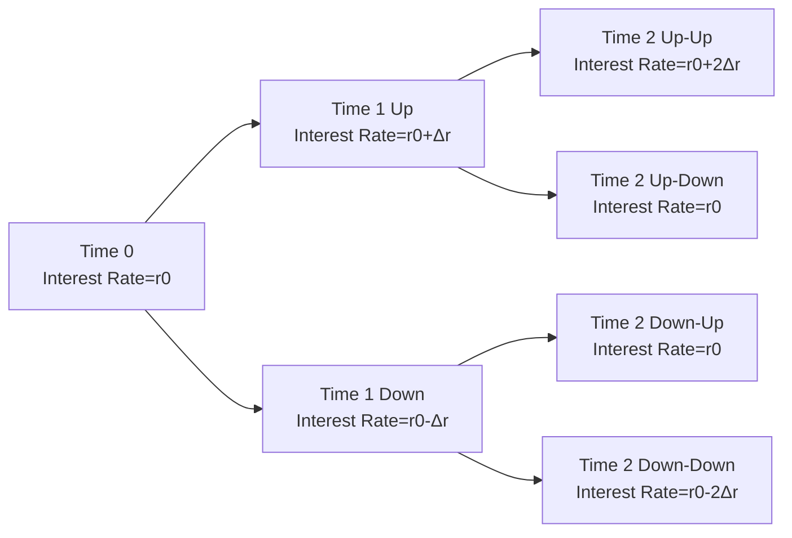

## 6.3 Valuation of Bonds with Embedded Options

Sometimes you encounter something in finance that just makes you pause and go, “Wait, did I see that right?” That was me when I first stumbled upon callable bonds years ago. I remember thinking: Why would an issuer ever want to call back a perfectly good bond? But you know what, it makes total sense once you factor in changing interest rates and the flexibility these embedded options offer. So let’s step right in and explore the world of bonds with embedded options, a topic that can feel intimidating but—believe it or not—turns out to be quite fascinating.

## Key Embedded Bond Options

Before we dive into the nitty-gritty of valuation, we need to understand the basic structures of embedded options and how they relate to bonds.

Callable Bonds  
A callable bond gives the issuer the right (but not the obligation) to redeem the bond before it matures, typically after a certain lockout period. Issuers most often exercise this call feature when market interest rates have gone down, allowing them to refinance at a lower cost—kind of like paying off a high-interest mortgage early.

Putable Bonds  
Putable bonds do the opposite, granting the investor (that could be you) the right to “put” the bond back to the issuer—forcing the issuer to buy it back at a set price. Investors typically exercise this put option when interest rates climb, so they can exit the bond and reinvest at higher yields.

Convertible Bonds  
Convertible bonds are interesting hybrids. They allow the bondholder to convert the bond into a specified number of shares of the issuing company’s stock. If the stock price rises significantly, the bondholder can switch from being a lender earning coupon payments to being a shareholder enjoying the upside potential of equity.

## Decomposing the Embedded Option Bond

To really wrap your head around an embedded option, imagine dissecting the bond into two parts: a plain-vanilla “straight” bond and an option component.

- Value of a Callable Bond is expressed as:


\mathrm{Value_{callable}} = \mathrm{Value_{straight}} - \mathrm{Value_{call\ option}}


Because that call option belongs to the issuer, it reduces the value of the bond for investors—nobody pays you full price if they can “call” you away.

- Value of a Putable Bond is expressed as:


\mathrm{Value_{putable}} = \mathrm{Value_{straight}} + \mathrm{Value_{put\ option}}


This time, the investor owns the put option outright. That extra advantage naturally adds to the bond’s value.

- Value of a Convertible Bond typically is:


\mathrm{Value_{convertible}} = \mathrm{Value_{straight}} + \mathrm{Value_{conversion\ option}}


The conversion feature is beneficial for you, the bondholder, so it adds to the total price.

## Binomial Tree or Lattice Models

One of the most frequently used methods to value these types of bonds is the binomial (or lattice) model. You know how it is: You build an interest rate tree with possible up and down movements, and then at each node you figure out what the bond is worth, factoring in whether the option would be exercised.

If you’re thinking, “Hmm, that sounds complicated,” you’re not alone. It’s a bit like traveling through a choose-your-own-adventure book: at each step (or node), rates can go up or down, and we see what the bond payoff is. But, I promise, once you see the structure visually, it’s not as bad.

Here’s a simple (very simplified!) version of a two-period binomial tree to illustrate the concept:

At each node, you’d simulate the bond’s possible values. For a callable bond, you check if the issuer would call it (if it’s cheaper to repurchase the bond than to continue paying coupons). For a putable bond, you see if the investor would put it (if it’s better for the investor to get the put price right now). Those decisions flow backward through the tree in a process called backward induction, allowing you to arrive at a “fair” price today.

## Interest Rate Volatility and Negative Convexity

Ever wonder why volatility matters so much? Well, if volatility (σ) is high, the value of the embedded option is higher. That means:

- For callable bonds, a higher-valued call option further reduces the bond’s overall value.
- For putable bonds, a higher-valued put option further increases the bond’s overall value.

Additionally, callable bonds often exhibit negative convexity when yields are low. That basically means that as interest rates drop, the price of the bond won’t rise as much as a similar straight bond—because the increased likelihood of a call coming from the issuer caps the bond’s upside price appreciation.

## Option-Adjusted Spread (OAS)

Another important concept with these embedded-option bonds is the Option-Adjusted Spread (OAS). If you see a bond trading at a spread over the benchmark curve, that nominal spread might be a little skewed because of the embedded option. OAS is basically the spread that makes the bond’s model price match its market price once you “remove” the cost of that embedded option. It’s the spread over the risk-free curve that you’d earn if the bond behaved like a vanilla instrument.

In practice, you’ll see:

- A callable bond typically has a higher nominal spread relative to an equivalent straight bond. But if you “pull out” the effect of the call option, you often see that the OAS is smaller than the nominal spread.
- A putable bond might have a lower nominal spread, but once you adjust for the put feature, the OAS might be higher than it appears at first glance.

It can be a bit counterintuitive, but once you run the numbers, it usually clicks.

## One-Sided Durations and Effective Convexities

Let’s be real: in a normal bond, we typically calculate a single measure for duration, maybe get a sense of convexity, and call it a day. But once you have embedded options, the bond’s price path can behave very differently when rates go up versus when rates go down. That’s why we talk about one-sided durations:

- Up-duration measures how much the bond’s price changes when rates rise.  
- Down-duration measures how much the bond’s price changes when rates fall.

Because the call option tends to be exercised when rates drop significantly (or it becomes more in-the-money when yields decline), the bond’s price reaction to downward moves in rates differs from that of a normal bond. Meanwhile, for a putable bond, the presence of a put option can significantly alter the bond’s response to upward movements in rates.

Effective convexity refines the second derivative of the price-yield relationship for these bonds, helping measure how curvature in the price-yield profile changes once optionality is considered. This is super important if you’re dealing with large swings in rates or if you’re deploying advanced portfolio strategies.

## Valuing Convertible Bonds

Convertible bonds are a bit like a Swiss Army knife: part debt, part equity, and occasionally a conversation starter. The gist of it:

- Treat the bond as a straight bond.
- Add a call option on the company’s stock.

If the stock jumps in value, that call option portion of the convertible bond can become very valuable. If the stock remains lackluster, you’re still (hopefully) getting your coupon payments like a regular bond. Corporate actions—like dividends and share buybacks—can nudge the conversion feature’s value too.

From a valuation standpoint, a lattice model can handle convertible bonds by adding another branch or dimension for the changing stock price. You track bond value at each node, factor in conversion if it’s optimal, and then fold all that back to present value. It can feel like juggling, but with practice, it gets easier.

## Region-Specific Considerations

While the fundamental pricing concepts hold true everywhere, local market conventions can influence both the structure and popularity of embedded options. In the U.S., you’ll see a healthy amount of municipal bonds with call features. In Canada, certain corporate bond issues might come with sinking-fund provisions or special redemption rights. Tax treatments also vary: if you exercise a call (or forced to have your bond called away), you might have certain capital gains or income tax implications, depending on your local regulations.

In many emerging or smaller markets, embedded options may be rarer or have unique conditions. Always be sure to check the fine print in the bond indenture.

## Putting It All Together in a Real-World Example

Let’s walk through a simplified numeric example to highlight how binomial tree valuation might work. Suppose we have a 2-year callable bond with a coupon rate of 5%, annual payments, and face value of $100. The issuer can call it at par ($100) at the end of Year 1. We’ll do a two-step tree:

- At Time 0, the yield is 5%.  
- It can go up by 1% or down by 1% in each period.  

Imagine we label these up (U) and down (D) states. If at Time 1 the rate moves down to 4%, the issuer will consider calling the bond if it’s cheaper to refinance. For instance, let’s say the price of the bond if it were not called is $104. If the issuer can call at $100, they’ll do that. This might cap the bond’s price at $100 in that down-rate scenario.

You then compute expected payoffs in each node at Time 2. In the up-rate scenario (6%), higher yields generally reduce the bond’s price. We push these payoffs back to Time 1, then back again to Time 0 using the appropriate discount factors. The final result is a “fair” theoretical price that incorporates the potential call.

This example is obviously abbreviated, but it shows how you’d incorporate the call decision at each relevant node in the interest rate tree. For a putable bond, you’d do the same but from the investor’s perspective—would the investor exercise the put?

## Best Practices and Pitfalls

• Pay close attention to interest rate volatility assumptions. If you get the volatility input wrong, you can put your entire valuation off.  
• Watch out for changes in issuer credit quality. If the issuer’s credit deteriorates, it can affect the decision to call or not to call, as well as yield-level assumptions.  
• For convertible bonds, keep an eye on corporate actions (share buybacks, stock splits, dividend changes). These can shift conversion ratios or the effective value of conversion.  
• Don’t ignore transaction costs: If you’re on a large trading floor, factoring in actual bid-ask spreads can matter when determining real-world prices.

## Conclusion

Bonds with embedded options can feel a little tricky at first, but once you get the hang of how the options factor into valuation, you’ll see they’re not so mystical after all. Callable bonds favor the issuer in a falling-rate environment. Putable bonds give you a bit of a safety net if yields spike. Convertible bonds let you sneak a foot in the door of a stock’s upside potential. Modeling these bonds often boils down to building a decent interest rate tree, analyzing optional exercise decisions carefully, and adjusting for volatility. And if you can compute it, you can measure it—through OAS, one-sided durations, and effective convexities.  

I think the bottom-line is that these bonds, for better or worse, let you see how real-life financial decisions (like calling or putting a bond) impact prices in dynamic markets. And that’s what makes them so genuinely interesting.

## Final Exam Tips

• Practice building binomial trees. Don’t just read about them—work through at least one or two examples.  
• Remember the sign on the option value: a call reduces bond value to the investor, a put increases bond value.  
• Understand how negative convexity can pop up in callable bonds.  
• Keep an eye on the difference between nominal spread and OAS. The exam loves to test your comprehension of how option cost distorts observed spreads.  
• For convertible bonds, be sure you know how changes in the underlying stock price and corporate actions might affect the conversion value.

## References

- Hull, John. “Options, Futures, and Other Derivatives.”  
- Tuckman, Bruce. “Fixed Income Securities: Tools for Today’s Markets.”  
- CFA Institute Level II Curriculum, “Valuation of Bonds with Embedded Options.”  
- Bloomberg Help Guides (OAS calculations and convertible bond analysis).  

## Test Your Knowledge on Bonds with Embedded Options



### A callable bond typically benefits which party the most when interest rates decline?

- [ ] The bondholder, because the bond’s price goes up without limit.  
- [x] The issuer, because they can refinance at a lower cost.  
- [ ] The bondholder, because the coupon rate increases automatically.  
- [ ] Neither party benefits when interest rates drop.  

> **Explanation:** A callable bond gives the issuer the right to redeem the bond early, which they typically do when interest rates fall, allowing them to refinance at a lower rate.  

### How do you decompose the value of a callable bond?

- [ ] Value of callable bond = Value of straight bond + Value of call option.  
- [ ] Value of callable bond = Value of straight bond + Value of put option.  
- [x] Value of callable bond = Value of straight bond – Value of call option.  
- [ ] Value of callable bond = Value of putable bond – Value of call option.  

> **Explanation:** The value of a callable bond is the value of a straight bond minus the value of the embedded call option, which the issuer owns.  

### Which measure specifically removes the impact of the embedded option to provide a comparable spread?

- [ ] Yield to maturity (YTM).  
- [ ] Nominal spread.  
- [x] Option-adjusted spread (OAS).  
- [ ] Z-spread.  

> **Explanation:** OAS extracts the cost or value of the embedded option, allowing a more apples-to-apples comparison of the bond’s spread.  

### Why do callable bonds usually exhibit negative convexity at low yields?

- [ ] Because the bond’s price rises significantly as yields drop.  
- [ ] Because investors receive a premium for taking on more duration.  
- [x] Because the call feature caps the bond’s price appreciation when rates fall.  
- [ ] Because the issuer benefits from higher coupon payments.  

> **Explanation:** Negative convexity arises because the price of the callable bond does not continue rising at the same rate as a straight bond once a likely call scenario comes into play.  

### Which of the following is true regarding higher interest rate volatility?

- [x] It increases the value of both call and put options.  
- [ ] It decreases the value of both call and put options.  
- [ ] It only increases the value of put options.  
- [ ] It has no impact on option values.  

> **Explanation:** Greater volatility means higher potential gains from either the call or put option, so both become more valuable.  

### In a binomial tree model for a callable bond, when is the call feature typically assumed to be exercised?

- [x] When the value from calling is cheaper for the issuer than continuing to pay coupons.  
- [ ] When the bond’s market price is below par value.  
- [ ] Whenever interest rates go up.  
- [ ] Never exercised in a binomial tree model.  

> **Explanation:** The call feature is exercised if it’s financially advantageous for the issuer—usually meaning the present value of redeeming at the call price is better than continuing to pay the existing coupons.  

### When interest rates rise, which bond typically benefits more in terms of price behavior?

- [ ] A callable bond, because the issuer will call the bond.  
- [x] A putable bond, because the investor can exercise the put.  
- [ ] A straight bond, because there is no optionality involved.  
- [ ] A convertible bond, because of the conversion to equity.  

> **Explanation:** The putable bond holder can sell the bond back to the issuer at a set price if rates go up and the bond price falls substantially, mitigating potential losses.  

### How does one-sided duration help in analyzing embedded-option bonds?

- [x] It measures price sensitivity differently for upward vs. downward rate moves.  
- [ ] It replaces convexity as the only measure of interest rate risk.  
- [ ] It is not used when analyzing options on bonds.  
- [ ] It completely ignores embedded option effects.  

> **Explanation:** One-sided duration shows how a bond’s price might react asymmetrically, particularly when an embedded option may be exercised in one direction of rate movement but not the other.  

### Which of the following is an example of negative convexity in bonds?

- [x] A callable bond’s price rising at a slower rate than a straight bond when yields fall.  
- [ ] A putable bond becoming worthless as rates rise.  
- [ ] A convertibility feature that never adds to the bond’s value.  
- [ ] A bond’s price always rising with no upper limit.  

> **Explanation:** A callable bond’s call feature can limit price appreciation in a falling rate environment, which is an example of negative convexity.  

### Valuing a convertible bond usually requires:

- [x] Considering both the bond component and an embedded call option on the issuer’s stock.  
- [ ] Treating it the same as a bond with no optionality.  
- [ ] Ignoring the issuer’s equity altogether.  
- [ ] Only using the yield to worst approach.  

> **Explanation:** A convertible bond is typically priced as the sum of a straight bond plus the value of a call option on the stock, reflecting both debt and equity characteristics.  


