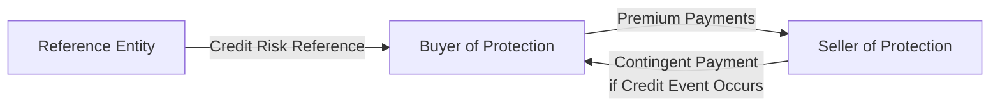

## 6.4 Credit Default Swaps and Structured Finance

Have you ever had that moment where you realize, "Um... I'm basically buying insurance on a company's credit risk, right?!" Well, guess what—that’s exactly what a Credit Default Swap (CDS) is like. It’s not insurance in the strictest regulatory sense, but it sure looks and behaves like it. Of course, the official distinction is what keeps the attorneys busy. Before we dive headfirst into the details, let’s get a quick overview of what’s coming your way:

• We’ll talk about the nitty-gritty of CDS mechanics—who pays whom, why, and when.  
• We’ll explore how these instruments reflect market sentiment on credit quality.  
• We’ll check out single-name CDS vs. index CDS.  
• We’ll discuss how folks use CDS for hedging and speculation—because, you know, finance loves a good speculation strategy.  
• We’ll also meander into structured finance territory, especially MBS, ABS, CDOs, CLOs—basically everything that was (in)famous during the financial crisis.  
• You’ll see how securitization magically transforms pools of mortgages or loans into little “tranches” with varying risk/return profiles.  
• Finally, we’ll talk about prepayment and extension risk, and how these factor into both U.S. and Canadian regulatory frameworks.

Let’s jump in!

---

### Introduction to Credit Default Swaps

Credit Default Swaps (CDS) are derivative contracts that let parties transfer the credit risk of an underlying entity—often a corporate or government bond issuer—from one party to another. The contract always references a “credit event,” which, if it occurs, triggers a payout from the “Seller of Protection” to the “Buyer of Protection.” 

A quick personal note: The first time I encountered CDS, I remember thinking, "Wait, so you're paying a small stream of cash to avoid a potentially massive loss if the bond issuer goes belly-up?" That’s exactly the idea. And it can sound super appealing if you expect trouble on the horizon.

---

### Mechanics of a CDS

A CDS contract has two main players:

• Buyer of Protection: Pays a periodic premium (often quoted in basis points) over the contract’s life.  
• Seller of Protection: Receives these premiums in exchange for compensating the buyer if a specified credit event occurs.

Let’s visualize this in a simple diagram:

When the reference entity defaults—bankruptcy, restructuring, or failure to pay according to the International Swaps and Derivatives Association (ISDA) definitions—the seller compensates the buyer either through physical settlement (the buyer delivers the defaulted bond and receives its par value in cash) or through a cash settlement (the seller pays the buyer the difference between par and the bond’s recovery price). The exact definitions of what constitutes "default" or "credit event" are spelled out meticulously in ISDA documentation. In practice, the triggers usually include:

• Bankruptcy  
• Failure to pay  
• Restructuring (which can get complicated with partial restructures and so forth)

---

### CDS Spreads and Market Perception

The annualized premium the buyer pays on the notional amount is known as the CDS spread. If a company’s creditworthiness deteriorates (everyone’s worried they might default soon), the CDS spread will likely go up (“widen”), reflecting the increased cost of protection. In other words, you might see a CDS spread jump from 150 bps to 300 bps practically overnight if the market is spooked about the reference entity. Why does it move so fast? Traders in the CDS market often respond more quickly to rumors and news than in the underlying bond markets, so CDS spreads are sometimes considered a leading indicator for changes in credit risk.

In exam terms, remember that a widening CDS spread signals a higher perceived default risk, and a tightening spread suggests the market believes the credit risk is lower. This is also relevant for risk managers who want real-time signals.

---

### Single-Name vs. Index CDS

• Single-Name CDS: This type references the credit risk of one specific entity. For example, protection on the senior unsecured bonds of a single corporation or government entity.  
• Index CDS: This type references a basket (or index) of entities, such as the CDX index in North America or the iTraxx in Europe. Tracking an index can simplify diversification. Instead of analyzing individual issuers, you can take a broad view on an entire sector’s or region’s credit risk.

In practice, index CDS often have high liquidity, which can make them attractive for macro hedging or speculation: you’re betting on or against the overall credit performance of a group of companies.

---

### CDS Strategies for Portfolio Adjustments

Let’s say you’re a corporate bond manager or maybe just a super-savvy investor. You have a portfolio of corporate bonds across various issuers, but you’re worried about one specific issuer that might not make it. One approach is to “buy protection” via a CDS on that issuer. If the issuer defaults, your CDS contract compensates you, offsetting your bond losses. That’s the hedging side.

On the other hand, if you believe a firm’s credit profile is way better than the market consensus, you might “sell protection.” By doing so, you collect the periodic premiums, effectively taking on the risk that the firm defaults. If the firm’s credit situation improves, you can close out that position at a profit. Of course, if the issuer defaults unexpectedly, you’d be on the hook for a potentially large payout, so speculating with CDS can be high-stakes.

---

### Introduction to Structured Finance

Structured finance is a broad field, but at its core, it’s about packaging various financial assets (like mortgages, loans, credit card receivables) into tradable securities. This process is known as securitization. You might recall the subprime mortgage meltdown back in 2008—structured finance products (particularly CDOs) got quite a reputation then. However, they remain an essential part of global capital markets because they free up capital for banks, provide diversification for investors, and can lower financing costs if done prudently.

Common structured finance products:

• Mortgage-Backed Securities (MBS)  
• Asset-Backed Securities (ABS)  
• Collateralized Debt Obligations (CDOs)  
• Collateralized Loan Obligations (CLOs)

Let’s map out a high-level picture of basic securitization flows:

---

### Securitization and Tranching

Securitization bundles cash flows from the underlying assets and slices them into different layers (called “tranches”). Each tranche has a unique risk/return profile:

• Senior Tranche: Least risky (in theory). It’s the first in line to receive principal and interest, but also typically offers the lowest yield.  
• Mezzanine/Mezz Tranche: Middle layer that offers higher yield but takes on more risk than senior.  
• Equity or Junior Tranche: Bears the highest risk. Often any losses hit the equity tranche first, but it can offer the highest potential return in favorable conditions.

This tranching can make sense for investors with different risk appetites. For example, if you want stable, relatively low-risk income, you might pick the more senior tranches. If you feel adventurous—and can handle potential significant losses—you’d go for the equity tranche.

---

### Mortgage-Backed Securities (MBS) and Their Valuation

MBS are asset-backed securities backed by a pool of mortgage loans. Two key considerations for MBS investors are prepayment risk and extension risk.

• Prepayment Risk: Borrowers might pay off their mortgages early, especially if interest rates drop and refinancing becomes more attractive. That can accelerate the return of principal for MBS holders, which means they may have to reinvest in a lower interest rate environment.  
• Extension Risk: If interest rates rise, fewer borrowers refinance, so MBS repay more slowly. Extensions reduce the pace of principal repayment and can effectively lock investors into lower-yielding securities while new securities may offer higher market yields.

That might sound a bit nerve-wracking, but it’s super important for fixed-income portfolio managers. If you expect interest rates to fall significantly, you have to be mindful of the potentially higher prepayments.

---

### U.S. and Canadian Regulatory Frameworks

In the U.S., you’ll hear about Fannie Mae, Freddie Mac, and Ginnie Mae—these are government-sponsored enterprises (GSEs) or government agencies that guarantee or insure MBS, effectively reducing the credit risk for investors. Then there are private-label mortgage-backed securities that lack these government guarantees, so credit analysis is more critical.

In Canada, you have Canada Mortgage Bonds (CMBs) and NHA MBS guaranteed by the Canada Mortgage and Housing Corporation (CMHC). This guarantee means investors face minimal credit risk. But just like their U.S. counterparts, they still have to consider prepayment and extension risk in analyzing these securities.

Canadian mortgages often have different structures (and typically shorter terms with renewal features) than many standard 30-year mortgages in the U.S., so the prepayment behavior might vary. That said, the same broad MBS concepts apply in both markets.

---

### Exam Tips and Practical Insights

• Pay special attention to definitions of credit events per ISDA standards. The exam might test whether you understand the nuances of “failure to pay” vs. “restructuring.”  
• When analyzing CDS spreads, factor in liquidity and market sentiment in addition to actual default risk. Spreads can overreact to market rumors.  
• For structured products, keep in mind how the seniority of tranches affects risk and return. The “waterfall” concept of cash flows is a key point in exam questions.  
• Understand how changes in interest rates affect MBS pricing through prepayment risk. Watch out for extension risk in rising-rate environments.  
• Don’t forget that Canadian MBS differ slightly from U.S. MBS in terms of underlying mortgage structures, but they follow broadly similar principles.  
• Remember the difference between hedging (buying protection) and speculating (selling protection) in the CDS market. The exam might frame a question around portfolio managers looking to offset credit risk or attempt to profit from an anticipated upgrade/downgrade.  
• Keep an ear out for those specific terms: “credit events,” “recovery rate,” “notional amount,” “basis points,” “premium,” “physical vs. cash settlement,” and “subordination levels” (for structured finance).  

If you can connect these dots, you’ll be in solid shape for any CFR/credit/derivatives question that pops up on the exam.

---

### References and Suggested Reading

• Choudhry, M. “An Introduction to Credit Derivatives.” Butterworth-Heinemann.  
• Tavakoli, J. M. “Structured Finance and Collateralized Debt Obligations.” Wiley.  
• ISDA website:  
  → <https://www.isda.org/>  
• CFA Institute Level II curriculum on “Credit Default Swaps and Structured Products.”

---

## Test Your Knowledge: Credit Default Swaps and Structured Finance Quiz



### Which party pays periodic premiums in a standard Credit Default Swap (CDS)?
- [x] The Buyer of Protection
- [ ] The Seller of Protection
- [ ] A government-sponsored enterprise
- [ ] None of the above

> **Explanation:** The Buyer of Protection pays the regular (often quarterly) premium to the Seller of Protection in exchange for coverage if a credit event occurs.

### Which of the following events is most commonly recognized as a “credit event” in a CDS contract according to ISDA?
- [x] A failure to pay interest or principal on the underlying debt
- [ ] A minor covenant breach
- [ ] A reduction in bond coupon due to market interest rates
- [ ] General market volatility

> **Explanation:** “Failure to pay” is one of the standard credit events triggering a CDS payout. The others often include bankruptcy and restructuring.

### A CDS spread widens from 150 bps to 400 bps over a few days. What does this most likely indicate?
- [ ] Decreasing credit risk of the reference entity
- [x] Increasing credit risk perceived by the market
- [ ] A rise in overall equity market volatility
- [ ] A shift in U.S. Treasury yields

> **Explanation:** A jump in CDS spread reflects the market’s growing concern about the reference entity’s ability to meet its obligations.

### Which of the following is a key difference between single-name CDS and index CDS?
- [x] Single-name CDS references one issuer; index CDS references a basket of issuers
- [ ] Single-name CDS always has a lower notional amount than index CDS
- [ ] Index CDS can only be traded by large institutions
- [ ] Index CDS is purely used for hedging, never for speculation

> **Explanation:** Single-name CDS involves protection on one specific issuer, while index CDS provides protection on a group of issuers (like iTraxx or CDX).

### In a synthetic optimization strategy, why might an investor choose to sell CDS protection?
- [x] The investor anticipates an improvement in the reference entity’s credit quality
- [ ] The investor wants to hedge an existing credit exposure
- [x] The investor hopes to collect periodic premiums and benefit from stable credit
- [ ] The investor has no view on the market but needs liquidity

> **Explanation:** Selling protection is effectively going “long” the credit. The seller believes credit risk is overestimated and aims to profit from premium income.

### What is one of the primary risks associated with mortgage-backed securities (MBS)?
- [x] Prepayment risk
- [ ] Inflation risk only
- [ ] Liquidity risk only
- [ ] No risk—MBS are fully guaranteed and risk-free

> **Explanation:** MBS are subject to prepayment risk when borrowers refinance or pay off loans early. Extension risk is another critical issue.

### When interest rates rise sharply, MBS investors may face higher extension risk. What does extension risk imply?
- [x] Slower prepayments, resulting in longer maturity
- [ ] Faster prepayments, returning principal sooner
- [ ] No impact on MBS valuations
- [ ] Increased issuer default risk

> **Explanation:** Extension risk refers to a slowdown in prepayments, which effectively extends the bond’s maturity.

### Which of the following best describes a senior tranche in a structured finance deal?
- [x] It has the highest priority claim on principal and interest but typically the lowest yield.
- [ ] It has the lowest priority claim and the highest yield.
- [ ] It never receives interest until all mezzanine tranches are paid.
- [ ] It is only issued by government agencies.

> **Explanation:** Senior tranches receive payments first (lowest credit risk), so they offer lower yields compared to mezzanine and equity tranches.

### Which type of MBS is guaranteed by the Canada Mortgage and Housing Corporation (CMHC)?
- [x] NHA MBS
- [ ] All MBS in Canada by default
- [ ] Private-label MBS
- [ ] U.S. Government Agency MBS

> **Explanation:** NHA MBS are backed by CMHC, minimizing credit risk for investors.

### In structured finance, the process of creating tradable securities from pools of illiquid assets (e.g., mortgages or loans) is called:
- [x] Securitization
- [ ] Derivative layering
- [ ] Tranche inflation
- [ ] Liquidity provision

> **Explanation:** The term “securitization” refers to pooling and repackaging of illiquid assets into marketable securities.


