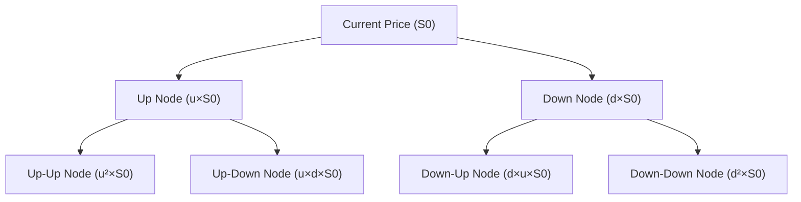

## 7.2 Options Valuation and Strategies

Sometimes, I can’t help but smile when thinking back to my first trade involving a simple call option. I didn’t fully appreciate the elegance—and the complexity—behind that small purchase. But wow, options can be transformative tools for managing risk and pursuing return in a portfolio, especially when you unlock the math and mechanics underneath. This section aims to help you understand how options work, why they’re not as frightening as they might look, and how to apply them responsibly in real-world portfolio settings.

### Understanding Calls and Puts

Let’s start with the basics: calls and puts. A call option gives the buyer the right (but not the obligation) to buy an underlying asset at a specific strike price before or at expiration. Conversely, a put option gives the buyer the right to sell. So, if you believe a stock will rise in value, you might buy a call. If you think it will drop, you might buy a put.

• Calls: Right to buy the underlying.  
• Puts: Right to sell the underlying.

That’s it—no rocket science here! The neat part is that you’re paying a premium for the right to do something, but if it’s not profitable to exercise, you simply won’t. The person who sold (or wrote) you that option is effectively taking on the opposite side of that bet.

### Payoff Diagrams: Visualizing Risk and Return

Payoff diagrams are like storyboards for how your profits or losses evolve based on the underlying’s price at expiration. They’re super helpful, especially if you’re a visual learner like me. Let’s take a look at some of the fundamental payoff profiles.

Long Call (Buy a Call)
• Upside: Potentially unlimited if the underlying price soars above the strike.  
• Downside: Limited to the premium paid, no matter how low the price goes.  

Short Call (Sell a Call)
• Upside: You collect the premium right away.  
• Downside: Potentially unlimited if the price spikes above the strike.  

Long Put (Buy a Put)
• Upside: Significant upside if the underlying collapses below the strike.  
• Downside: Limited to the premium—if the underlying stays above the strike, you just lose the premium.  

Short Put (Sell a Put)
• Upside: You get the premium in your pocket upfront.  
• Downside: If the underlying falls below the strike by a lot, you face losses that can be substantial.

Let’s use a quick Mermaid diagram to visualize the basic payoff for a long call. Remember, we’re simplifying the shape to help you see the concept:

You can imagine the big upward slope once the underlying’s price exceeds the strike plus premium, confirming that the call buyer starts to gain significantly there.

### Binomial Option Pricing Model

Now, let’s dig a bit deeper into how we might value an option. One popular way is via the Binomial Option Pricing Model. The idea is to view the underlying asset’s price evolving in discrete increments (“up” or “down”), then discount the option payoffs back to the present using risk-neutral probabilities. I remember being both confused and excited the first time I saw a binomial tree—like, “Wait, what do you mean we assign a probability such that investors expect to earn the risk-free rate?”

But don’t worry—this model is quite intuitive once you catch the rhythm:  
• Assume two possible prices at each step (an up move or a down move).  
• Assign risk-neutral probabilities that yield no arbitrage opportunities.  
• Calculate the option payoff at each final node.  
• Discount those payoffs back up the tree until you arrive at the present value.

Below is a simple mermaid diagram illustrating a two-step binomial tree structure. It can handle both American and European-style options because you can check at each node whether early exercise is optimal (for American options):

Each path leads to a future price. We compute option payoffs at the final nodes (in this diagram: D, E, F, G), then discount them backward step by step.

### Black–Scholes–Merton (BSM) Model

When people talk about continuous-time modeling of options, they’re typically referring to the Black–Scholes–Merton (BSM) model. It’s a big name in finance—like the celebrity of option pricing. Some key assumptions:  
• The underlying price follows a lognormal distribution.  
• No arbitrage, no transaction costs.  
• Continuous trading is possible.  
• Constant risk-free rate and volatility (in the simplest version).

The BSM formula for a European call option is:

(1)  
C = S₀Φ(d₁) – K e^(–rT) Φ(d₂)  

where:  
• S₀ is the current underlying price.  
• K is the strike price.  
• r is the risk-free rate.  
• T is the time to maturity (in years).  
• Φ(·) is the cumulative distribution function for a standard normal distribution.  
• d₁ and d₂ are given by:

(2)  
d₁ = [ln(S₀ / K) + (r + σ²/2)T] / [σ√T]  

(3)  
d₂ = d₁ – σ√T  

Here, σ is the volatility of the underlying’s returns. The stronger your handle on these variables, the better you can interpret an option’s fair price. A put option price can then be found using put–call parity or directly via its own formula.  

### The Greeks: Delta, Gamma, Vega, Theta, Rho

Once you’re comfortable with the BSM formula, you’ll likely run into the “Greeks,” which measure the sensitivity of option values to different factors. It’s like a dashboard of signs telling you how an option might behave if the market changes.

• Delta (∆): Measures how much the option price changes for a small change in the underlying’s price. A call typically has a positive delta (between 0 and 1); a put has a negative delta (between -1 and 0).  
• Gamma (Γ): Tells you how delta itself changes as the underlying’s price shifts. Larger gamma can mean bigger shifts in risk if the underlying moves.  
• Vega (ν): Sensitivity to volatility. If volatility jumps, an option’s price often rises—especially if it still has decent time until expiration.  
• Theta (Θ): The time decay measure. Options lose value as they approach expiration, all else equal, because there’s less time for the underlying price to move in your favor.  
• Rho (ρ): Sensitivity to changes in the risk-free rate. Typically, an increase in the interest rate raises call values slightly while lowering put values, at least in the classical sense.

### Implied Volatility and Volatility Smiles

Implied volatility is basically the volatility that, when plugged into the BSM formula, matches the current market price of the option. Market participants often track implied volatility—it’s like scanning the emotional temperature of the market. If implied volatility is high, it might reflect fear or uncertainty about big price movements.  

In reality, implied volatility isn’t constant across different strikes or maturities. You might see a volatility smile or skew in the market, where out-of-the-money options carry higher implied volatilities than at-the-money ones, especially for equity puts (traders often pay extra for downside protection).

### Option Strategies

Now for the fun part: you can combine basic calls, puts, and sometimes the underlying asset itself, to create endless payoff structures that meet your exact risk-return preferences. Let’s briefly highlight some of the most common strategies:

Spreads (Bull or Bear Spreads)  
• Typically involve buying one option and simultaneously selling another with a different strike and/or expiration.  
• Bull Spread Example: Buy a call at a lower strike, sell another call at a higher strike. You expect moderate upside but want to reduce net cost.  
• Bear Spread Example: Buy a put at a higher strike, sell a put at a lower strike. You expect moderate downside.

Straddles and Strangles  
• Straddle: Buy (or sell) a call and put at the same strike price and expiration. A long straddle profits if the price moves significantly in either direction. A short straddle profits if the price stays fairly stable.  
• Strangle: Similar to a straddle, but the strikes are different (usually out-of-the-money). You lose some near-the-money sensitivity but pay (or receive) a smaller premium.

Collars  
• Involves buying a put (for downside protection) and simultaneously selling a call (to pay for that put) while holding the underlying.  
• Limits losses on the downside, but it also caps your upside potential if the underlying skyrockets.

### Early Exercise Considerations: American vs. European Options

American options can be exercised any time up to expiration, while European options can only be exercised at expiration. If you own an American call, you might think about exercising early to capture a dividend, because once the stock goes ex-dividend, that money isn’t flowing to you unless you hold the underlying. With puts, sometimes being deep in the money justifies early exercise to grab intrinsic value. However, it’s not always straightforward; time value can be valuable, and letting that optionality expire prematurely can be a costly mistake if the underlying moves further in your favor.

### Practical Example: Hedging a Portfolio

It’s one thing to theoretically talk about options; it’s another to see them in action. Let’s say you’re a Canadian investment manager holding a portfolio of TSX-listed stocks. You think the stock market is looking shaky, so you purchase puts on the S&P/TSX 60 index. If the market crashes, your put options (which gain value as the index falls) can offset your portfolio losses. It’s sort of like an insurance policy: you’re paying a premium to protect your portfolio.  

Or, if you’re in the U.S. with a portfolio of large-cap equities, you might decide to write covered calls on your positions. You own the underlying stocks, and by selling calls, you collect premium income. If the market goes sideways or modestly down, you keep that premium. But your upside is capped if the stock climbs above the strike price, at which point your shares could be called away. It’s a popular strategy among investors who want extra cash flow and are okay sacrificing some upside potential.

### Glossary

• Strike Price (K): The pre-agreed price at which you can buy (call) or sell (put) the underlying.  
• Premium: The cost of purchasing an option. For the option writer, it’s the income received.  
• In-the-Money (ITM): Calls with strike < current price, or puts with strike > current price.  
• At-the-Money (ATM): Strike very close to current price.  
• Out-of-the-Money (OTM): Calls with strike > current price, or puts with strike < current price.  
• Put–Call Parity: A fundamental relationship linking call and put prices to the underlying price, strike, time to maturity, and the risk-free rate.  
• Covered Call: Holding the underlying while selling a call on it.  
• Protective Put: Holding the underlying while buying a put to hedge downside.

### Regulatory and Reporting Aspects

Under IFRS and U.S. GAAP, the accounting for options (especially if used for hedging) can be subject to hedge accounting rules. Be sure to check the specific local regulations, as some strategies might be recognized differently in financial statements. In portfolio management, especially in countries like Canada or the U.S., there may also be tax implications when options expire worthless or are exercised, so keep an eye on your capital gains or losses.

### Best Practices and Pitfalls

• Understand All Payoffs: Before initiating an option strategy, map out payoff diagrams. This step ensures you know exactly what risk profile you’re taking on.  
• Watch Time Decay: Selling options can be attractive for premium income, but be cautious about potential large losses if the market moves against you.  
• Mind Liquidity: Some options (especially OTM or certain maturities) can be illiquid. Wide bid–ask spreads add cost.  
• Be Prepared for Volatility Shifts: Greeks like Vega matter. A large jump in implied volatility might actually boost the value of your option—if you’re long.  
• Check Rebalancing: If you hold many options, keep track of your directional exposure (Delta), as well as Gamma. Delta can shift dramatically when the underlying price moves.

### Final Exam Tips

• Master the Binomial Model: Be ready to perform a two- or three-step binomial valuation under exam pressure. Practice discounting payoffs in a risk-neutral world.  
• Know The BSM Inputs: For exam questions, watch for details on volatility, time to maturity, risk-free rate, and how they affect option values.  
• Practice Payoff Calculations: The exam frequently includes problems requiring you to figure out maximum profit, maximum loss, and breakeven points for each strategy.  
• Understand Early Exercise Logic: Particularly for American-style puts and for calls on dividend-paying stocks.  
• Option Greeks: You don’t need to memorize every formula but know conceptually how each Greek influences the option price.

### References and Further Reading

• Hull, John. “Fundamentals of Futures and Options Markets.” Pearson.  
• CFA Institute Level II Curriculum, Option Strategies Readings.  
• McDonald, Robert. “Derivatives Markets.” Pearson.

––––––––––

## Test Your Knowledge: CFA Level II Options Valuation and Strategies



### Which of the following best describes the maximum possible loss for a long call position?

- [x] The loss is limited to the premium paid for the call.
- [ ] The loss is the strike price plus the premium.
- [ ] The loss is unlimited.
- [ ] The loss is capped at the difference between the strike price and the underlying price.

> **Explanation:** A long call has a maximum loss equal to the premium, because if the underlying price stays below the strike until expiration, the option expires worthless.

### Under the binomial option pricing model, risk-neutral probabilities are used primarily to:

- [x] Eliminate any arbitrage opportunities in the pricing.
- [ ] Reflect real-world investor risk preferences in the pricing model.
- [ ] Ensure option prices do not depend on the risk-free rate.
- [ ] Guarantee that options are always priced at par value.

> **Explanation:** Risk-neutral probabilities produce a fair value for the option without arbitrage opportunities. They do not directly reflect subjective risk appetites.

### In the Black–Scholes–Merton framework, which assumption is most closely tied to deriving the model’s closed-form solution?

- [x] The underlying follows a lognormal price process with constant volatility.
- [ ] Dividends are paid continuously on the underlying.
- [ ] Markets are perfectly illiquid.
- [ ] The interest rate is time-varying.

> **Explanation:** The BSM model heavily relies on the assumption of continuously compounded returns following a lognormal distribution with constant volatility (and a constant risk-free rate).

### If an investor writes a covered call (i.e., they own the underlying stock and write a call on it), the investor’s potential upside:

- [x] Is capped by the strike price of the call.
- [ ] Remains unlimited.
- [ ] Is reduced only if the underlying is unregulated.
- [ ] Does not exist because the investor bears all downside risk.

> **Explanation:** A covered call strategy involves selling a call while holding the underlying. The underlying’s appreciation above the call’s strike is effectively “given up.”

### A protective put strategy:

- [x] Combines holding the underlying with buying a put option.
- [ ] Is identical to a short put plus a long call.
- [x] Limits the downside risk of the underlying.
- [ ] Eliminates all volatility risk entirely.

> **Explanation:** A protective put involves owning the underlying asset and buying a put for downside protection. This strategy limits losses but does not eliminate volatility risk altogether.

### Implied volatility:

- [x] Is the volatility implied by the market price of the option, assuming the BSM model.
- [ ] Is the realized volatility of the underlying price movements over the last 10 days.
- [ ] Refers to interest rate uncertainty in the risk-neutral world.
- [ ] Is set by the exchange to ensure stable option prices.

> **Explanation:** Implied volatility is the volatility number baked into the current option price based on the BSM assumption, not historical or realized volatility.

### Which of the following “Greeks” captures the rate of change of Delta with respect to changes in the underlying price?

- [x] Gamma (Γ)
- [ ] Theta (Θ)
- [x] Vega (ν)
- [ ] Rho (ρ)

> **Explanation:** Gamma measures how much Delta changes when the underlying price moves, while Vega measures sensitivity to volatility.

### Early exercise of an American call option on a dividend-paying stock may be optimal just before:

- [x] The ex-dividend date.
- [ ] The stock’s earnings announcement date.
- [ ] The current interest rate changes.
- [ ] The underlying price declines.

> **Explanation:** If a stock pays a dividend, the option holder might exercise early to capture the dividend (which wouldn’t be earned by holding the option alone).

### A long straddle strategy typically involves:

- [x] Buying a call and a put with the same strike and maturity.
- [ ] Selling a call and a put with the same strike and maturity.
- [ ] Buying a call and selling a put with different maturities.
- [ ] Concurrently buying the underlying to hedge against volatility.

> **Explanation:** A long straddle is formed by purchasing both a call and a put on the same underlying, with the same strike and expiration, to profit from large moves in either direction.

### When the risk-free rate increases, the value of a European call option tends to:

- [x] True
- [ ] False

> **Explanation:** A higher risk-free rate decreases the present value of the strike price that would be paid at maturity, which generally benefits calls (increases their current value).


