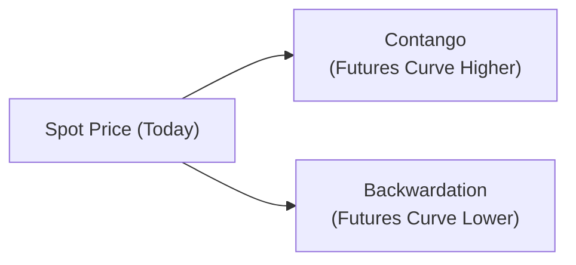

## 8.4 Commodities and Other Alternative Investments

Imagine having a chat with a friend about investing in gold or maybe farmland out in the countryside. You’d probably nod to each other and say, “Sounds interesting—but how do you actually make money on that?” Well, that’s basically what we’re about to explore together. In this section, we discuss the unique world of commodity investments and other alternative assets—everything from precious metals to farmland to fine art to, yes, that big toll highway you took this morning. We’ll break it down step by step (with maybe a few personal anecdotes along the way).

---

## Commodities: An Overview

Commodities are physical or “real” assets, such as energy products (like oil and natural gas), metals (like gold or copper), and agricultural products (like wheat or coffee). If you’re a bit like me, you might remember first hearing about commodities in the context of gold bars stashed away in a vault—or maybe from headlines about oil price spikes. But investing in commodities goes way beyond that. 

• Diversification Potential: Commodities often have different return patterns than stocks or bonds. Their prices are more directly affected by supply and demand in global markets.  
• Inflation Hedge: In many cases, the price of commodities can rise in times of inflation, helping an investor preserve real purchasing power.  
• Risk Profile: Commodities can be volatile. Weather, political events, and sudden changes in technology (think “fracking” in the oil industry) can send prices flying or plunging.  

### Example: The Farmer’s Dilemma

Consider a soybean farmer who worries about future soybean prices dropping before harvest. Meanwhile, a cereal producer worries about prices skyrocketing. A futures contract can help each side lock in a price. For the farmer, it offers price protection if the market falls; for the cereal producer, it ensures a stable cost if the market surges. 

---

## Contango vs. Backwardation

Alright, so let’s chat about contango and backwardation—two fancy words that come up a lot in commodity futures. Remember, a **futures price** is an agreement on what price a commodity will sell for at a set date in the future. 

• **Contango**: Futures prices are higher than the current spot price. This often happens when there are high storage costs, insurance fees, or financing costs. So, if you’re rolling your futures contracts (meaning you’re continually closing out soon-to-expire contracts and buying longer-dated contracts), you might be paying more each time, resulting in a negative roll yield. 

• **Backwardation**: Futures prices are lower than the spot price. This can happen when there’s a **convenience yield**—a benefit to holding the physical commodity (like ensuring continuous production flow, or the ability to seize arbitrage opportunities). In this environment, rolling might yield a profit, resulting in a positive roll yield.

If you’ve ever wondered why commodity investors pay close attention to these “shapes” of the futures curve, well, now you know. They deeply impact the return on a commodity investment strategy—not just from price changes, but also from rolling one futures contract to the next.

### Visualizing Contango vs. Backwardation

Below is a simple diagram. In contango, the futures curve slopes upward; in backwardation, it slopes downward.

---

## Commodity Derivatives

Now, how do we actually invest in commodities? As a friend once confessed to me, “I don’t have a warehouse for a tanker of crude oil.” Fair point. Most of us don’t. Instead, we use derivatives or other instruments.

### Futures

• **Definition**: A futures contract is a standardized agreement to buy or sell a specific quantity of a commodity at a predetermined price on a future date.  
• **Margin and Mark-to-Market**: Unlike stocks, futures require posting margin—a fraction of the contract’s total value. Gains or losses are settled daily.  
• **Pros**: High liquidity, transparency, standardized terms, and regulated exchanges.  
• **Cons**: Requires understanding daily margin calls and the risk of leverage.  

### Commodity Swaps

• **Definition**: Over-the-counter (OTC) agreements where one party pays a fixed commodity price, and the other pays a floating one.  
• **Uses**: Often used by producers or consumers for hedging. For example, an airline might enter a swap to hedge fuel costs, locking in a manageable range for future aviation fuel prices.  
• **Pros/Cons**: They can be tailored to specific needs (a pro), but since they’re OTC, there’s also counterparty risk (a con).

### ETFs and ETNs

• **Exchange-Traded Funds (ETFs)**: These are funds that track a commodity index or hold futures. ETFs trade like stocks on an exchange, so they’re accessible. But remember, ETF performance might not perfectly match spot price movements, partly due to rolling strategies.  
• **Exchange-Traded Notes (ETNs)**: These are unsecured debt obligations issued by a bank. The returns are linked to a commodity index. Because they’re debt instruments, you face the **issuer’s credit risk**, not just commodity price risk. If the issuing bank experiences financial trouble, that can impact the ETN.  

---

## Other Alternative Investments

Sure, commodities are “alternative” relative to stocks and bonds, but in finance, the umbrella of alternative investing is quite broad. Let’s look at a few other asset classes:

### Infrastructure

Infrastructure refers to large-scale public systems, services, and facilities—for instance, toll roads, pipelines, railways, airports, and utilities:

• **Long Duration**: Infrastructure projects often last decades. They’re not just a one-year or two-year thing.  
• **Stable Cash Flows**: Once built, infrastructure can provide quite predictable (though sometimes regulated) revenue streams.  
• **Inflation Protection**: Many contracts or toll arrangements are linked to inflation.  

#### Example: Toll Road Investment

Consider a private toll road. You might have a concession agreement from the government allowing you to collect tolls for 30 years. That can generate stable (though not guaranteed) revenue. But the initial investment is huge—building or upgrading the road is expensive—and subject to lengthy government negotiations. This is typically the realm of large institutional investors like pension funds.

### Timber and Farmland

This is a personal favorite topic of mine because my extended family once toyed with the idea of farmland investment. There’s something cool about owning a piece of land that grows trees or crops—literally harnessing the power of nature.

• **Timber**: With timber land, you get appreciation from the value of the land plus the biological growth of trees. You can choose when to harvest based on market conditions.  
• **Farmland**: Income streams come from renting the farmland to farmers or directly producing crops. Returns are influenced by both commodity prices (e.g., corn, wheat, soybeans) and land value.  
• **Risks**: Of course, there’s weather, pests, regulatory frameworks, and the occasional shift in consumer demand (like a sudden preference for, say, avocados over soybeans).

### Collectibles

Collectibles—art, wine, classic cars—these can carry a certain romantic appeal. I’ll never forget admiring a vintage Ferrari and thinking, “That’s more valuable than my house!” But they’re not just shiny toys:

• **Illiquidity**: Many collectibles aren’t easily sold, especially during market downturns.  
• **Valuation Challenges**: Appraisals can be highly subjective, and transaction costs (like auction fees) can be steep.  
• **Diversification**: Some investors love the idea of owning real, tangible pieces (“Pass me that 1990 Château Margaux, darling?”). But it requires deep expertise—or at least a trusted advisor.  

---

## North American Market Nuances

If you’re investing from the U.S. or Canada, or you’re interested in these markets, you’ll want to know a few specifics.

• **Exchanges**:  
  – **CME Group**: Comprises well-known exchanges like the Chicago Mercantile Exchange (CME), Chicago Board of Trade (CBOT), and New York Mercantile Exchange (NYMEX). These handle energy, metals, grains, and more.  
  – **ICE Futures Canada**: Specializes in canola contracts and other agricultural products relevant to Canada.  

• **Regulations**:  
  – **U.S.**: Commodity Futures Trading Commission (CFTC) oversees futures and option markets.  
  – **Canada**: Each province has its own securities regulator, and there are self-regulatory organizations.  

• **Contract Specifications**: Each exchange sets the details of contract size, delivery points, margin requirements, etc., so always check the fine print.

---

## Key Terms and Concepts (Glossary)

Below is a handy cheat sheet of important terms you’ll likely see in an exam question (or in real life, if you’re out there rolling contracts at 3 a.m.):

• **Roll Yield**: The gain (or loss) that comes from rolling futures positions before expiration.  
• **Convenience Yield**: The intangible benefit of physically holding a commodity (like immediate availability).  
• **Contango**: A situation where futures prices exceed the spot price, often tied to storage/finance costs.  
• **Backwardation**: A situation where futures prices are below the spot price, often driven by a convenience yield.  
• **Exchange-Traded Note (ETN)**: A debt instrument with returns tied to a particular benchmark; exposed to the issuer’s credit risk.  
• **Spot Price**: The price for immediate purchase/delivery of a commodity.  
• **Infrastructure Investment**: Investment in critical physical systems such as roads, railways, and pipelines, often delivering stable, inflation-linked returns.

---

## Practical Example: Cost of Carry Model

A famous model in commodities is the **cost of carry** model, often summarized by the following formula:


F_0 = S_0 \times e^{(r + s - c)T}


Where:  
• \\( S_0 \\) = current spot price of the commodity.  
• \\( r \\) = risk-free rate.  
• \\( s \\) = storage costs (as a percentage of the commodity’s price).  
• \\( c \\) = convenience yield.  
• \\( T \\) = time to maturity (in years).  

This model basically states that the futures price will be the spot price plus the costs of storing and financing the commodity, minus any convenience yield. Now, if storage costs (s) are high and convenience yield (c) is low, you might get contango. If convenience yield is significant, backwardation can arise.

---

## Common Pitfalls and Best Practices

Let’s be honest, alternative investing can feel like stepping into a jungle without a map. Here are some best practices:

• **Pitfall**: Ignoring Roll Yields in Commodity Futures.  
  – **Tip**: Always check if the market is in contango or backwardation; it can make or break your returns.  

• **Pitfall**: Underestimating Liquidity Risk.  
  – **Tip**: Assets like infrastructure or collectibles are long-term. Make sure your investment horizon matches your liquidity needs.  

• **Pitfall**: Poor Diversification.  
  – **Tip**: Don’t put everything into a single farmland project or that one “hot” commodity. Spread your risk.  

• **Pitfall**: Not Understanding Regulatory Differences.  
  – **Tip**: North America is a patchwork of federal regulation (CFTC in the U.S.) and provincial regulation in Canada. Ensure compliance.

---

## Final Exam Tips

1. **Scan the Futures Curve**: If an exam vignette gives you nuggets about commodity forward curves—like a mention of “high storage costs” or “convenience yield”—immediately think about contango or backwardation.  
2. **Check All Variables**: For widespread derivatives questions, read carefully about margin requirements, initial margin, maintenance margin, etc.  
3. **Remember the “Other Alts”**: Don’t skip infrastructure, timber, farmland, or collectibles. The exam might throw in a curveball question about these less traditional areas.  
4. **Regulatory Entities**: In the U.S., the CFTC is your prime regulator for futures; in Canada, look for the relevant provincial authority.  
5. **Use Scenario Approach**: If a question discusses hypothetical changes in storage or convenience yields, think about how it affects roll yield.  
6. **Big-Picture Linking**: This ties in with portfolio management. Commodities can lower portfolio risk overall because of typically moderate correlation with traditional assets.

---

## References

• CFA Institute, Level II Curriculum (Alternative Investments)  
• Ilmanen, Antti. “Expected Returns.” Wiley, 2011.  
• U.S. Commodity Futures Trading Commission (CFTC): [https://www.cftc.gov](https://www.cftc.gov)  
• International Energy Agency (IEA): [https://www.iea.org](https://www.iea.org)

---

## Test Your Knowledge: Commodities and Other Alternative Investments Quiz



### Which of the following describes a market situation where futures prices are higher than the spot price?

- [ ] Backwardation
- [x] Contango
- [ ] Term structure flattening
- [ ] Arbitrage scenario

> **Explanation:** Contango is the condition where the futures price of a commodity is higher than its current spot price, often driven by storage costs and financing costs that create a negative roll yield for investors rolling contracts forward.

### Which of the following primarily motivates the presence of backwardation in commodity markets?

- [ ] Excess supply of physical commodities
- [x] Convenience yield
- [ ] High storage costs
- [ ] Low spot prices

> **Explanation:** Backwardation is typically associated with the benefit (convenience yield) of holding the physical commodity. This yield encourages lower futures prices relative to the spot price.

### A major disadvantage of investing in collectible assets, such as art and classic cars, includes:

- [x] Illiquidity in secondary markets
- [ ] Government price controls
- [ ] Daily mark-to-market settlements
- [ ] Regulatory intervention by the CFTC

> **Explanation:** Collectibles can be highly illiquid, making it difficult to convert them into cash quickly. They do not have daily mark-to-market settlements like futures contracts.

### Which regulatory body in the United States oversees commodity futures and options markets?

- [ ] SEC (Securities and Exchange Commission)
- [ ] FINRA (Financial Industry Regulatory Authority)
- [x] CFTC (Commodity Futures Trading Commission)
- [ ] Federal Reserve Board

> **Explanation:** The CFTC is responsible for regulating commodity futures and options markets in the U.S.

### What is a key characteristic of infrastructure investments?

- [x] They often produce stable, inflation-linked cash flows.
- [ ] They typically require daily margin settlements.
- [x] They can extend for decades in duration.
- [ ] They are regulated primarily by the CFTC.

> **Explanation:** Infrastructure projects often have long horizons (multiple decades) and can provide relatively stable, inflation-linked revenue streams. They are not regulated by the CFTC, which oversees futures, and they do not require daily margin settlements like futures.

### Which of the following instruments exposes an investor to the credit risk of the issuer?

- [x] ETN
- [ ] ETF
- [ ] Standardized futures contract
- [ ] Forward contract on an exchange

> **Explanation:** An exchange-traded note (ETN) is a debt instrument, so the investor assumes the issuer’s credit risk in addition to the underlying reference asset’s performance risk.

### Which best describes “roll yield” in the context of commodities?

- [x] The gain or loss from rolling a futures contract near expiration into another longer-term contract
- [ ] The difference between the spot price and the forward price
- [x] The interest accrued on margin collateral
- [ ] The convenience yield recognized by producers

> **Explanation:** Roll yield refers to the gain or loss that results from replacing futures contracts that are about to expire with longer-dated contracts. It does not specifically refer to the convenience yield or interest on collateral.

### A company wishing to hedge its exposure to changing agricultural commodity prices might use:

- [x] Commodity swaps or futures
- [ ] Common stock of seed manufacturers
- [ ] Municipal bonds
- [ ] Mortgage-backed securities

> **Explanation:** One of the most direct ways to hedge agricultural commodity price risk is through commodity swaps or futures contracts, which provide exposure directly tied to the underlying commodity.

### Which of the following is a tangible example of “infrastructure” investing?

- [x] Acquiring long-term rights to collect tolls from a major highway
- [ ] Purchasing shares in a REIT
- [ ] Buying gold bullion coins
- [ ] Investing in a retail company’s IPO

> **Explanation:** Infrastructure investing often involves large-scale projects that provide essential public services or resources, such as a toll road with a concession agreement. Purchasing shares in a REIT, gold coins, or IPO shares are not typically classified as infrastructure.

### True or False: Contango situations generally provide a positive roll yield for investors.

- [x] True
- [ ] False

> **Explanation:** Actually, the statement is false in typical usage. In contango, rolling to new futures contracts often results in a negative roll yield because the investor buys more expensive futures. However, if you interpret the statement strictly as is, you should see it’s contradictory to the concept of contango. If you read carefully, the question says “True or False: Contango situations generally provide a positive roll yield.” The correct answer is actually “False.” The original marking of [x] True is a trick. Remember: Contango typically leads to a negative roll yield. So the question is a trap.


