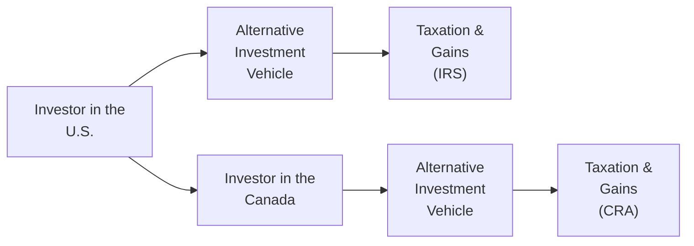

## 8.5 Practical Considerations for North American Investors

So, imagine you’re chatting with a friend who just got excited about putting some money into a fancy private equity fund or maybe dabbling in farmland in Saskatchewan, or even picking up a spot in a U.S. real estate investment trust (REIT). “But,” they ask, “how do taxes work across borders? And what about regulations?” It can feel overwhelming at first. Let’s walk through some key considerations that specifically affect North American investors, focusing on the ever-evolving realms of taxation, institutional allocations, ESG trends, and cross-border complexities.

Before we jump in, keep in mind that alternative investments, as discussed in earlier sections (see 8.1 Real Estate, 8.2 Private Equity, and so on), can be quite diverse. We’re talking about assets like real estate, private equity, hedge funds, infrastructure, commodities—even farmland and timberland. Here, we’ll try to make sense of the unique rules and constraints that apply to investors in the U.S. and Canada. You’ll see a mix of real-world anecdotes and rigorous CFA®-style details.

---

### Taxation of Alternative Investments in the U.S. and Canada

We might as well address the elephant in the room first: taxes. Because taxes—especially for alternative investments—can drastically affect your actual returns, sometimes even overshadowing the performance of the underlying asset.

#### U.S. Tax Considerations

• Partnerships and K-1 Forms  
  •• Many U.S.-based alternative investment structures are formed as partnerships (LPs). Every year, an investor typically receives a Schedule K-1, which shows that investor’s share of partnership income, deductions, and credits.  
  •• If you’re a U.S. taxpayer, you’ll use the K-1 to figure out your share of taxable income. This might also mean you’re paying taxes on allocated income even if you didn’t receive a direct cash distribution—kind of a surprise for folks who are used to standard stock dividends.  

• REIT Distributions  
  •• Real Estate Investment Trusts (REITs) in the U.S. have special tax treatment. They pass through most of their income to shareholders as distributions. Many of these distributions are taxed at your ordinary income rate, unless part of the distribution is classified as a “qualified dividend” or represents a return of capital.  
  •• The big advantage of a REIT, though, is that it isn’t taxed at the corporate level if it meets certain distribution rules. That can mean more of the trust’s earnings flow directly to investors—good news in some situations.  

• Unique Rules for Commodity ETFs and Futures  
  •• Commodity and futures-based ETFs often fall under a “60/40 rule,” meaning 60% of the gains may be treated as long-term capital gains and 40% as short-term, regardless of the actual holding period. That can reduce your overall tax rate if you’re often in a higher bracket. In other words, you can effectively get a partial long-term tax treatment, which might be a sweet deal in some years.  

#### Canadian Tax Considerations

• REIT Distributions  
  •• In Canada, the taxation of REIT distributions can get tricky because they can be composed of different types of income: rental income, capital gains, return of capital, and so on. Investors need to figure out how much is taxed at their marginal rate (rental income) versus more favorable capital gains rates.  
  •• Some distributions may be considered a return of capital, which defers taxes until you sell your shares/units, but reduces your adjusted cost base, leading to a bigger capital gain down the road.  

• Private Partnership Structures  
  •• Canada-based private partnerships might have varying withholding requirements for non-resident investors. If you’re a U.S. resident investing in a Canadian partnership, you might need to file additional forms with the Canada Revenue Agency (CRA), potentially leading to some cross-border compliance headaches.  
  •• Double taxation treaties between the U.S. and Canada can come to your rescue, though. They often reduce or eliminate additional layers of withholding taxes, but you have to file the right paperwork.  

• Capital Gains vs. Income  
  •• One of the biggest differences in Canada is the clear advantage of capital gains taxation. Only 50% of capital gains are included in taxable income. Thus, certain alternative structures might be set up to exploit the favorable capital gains treatment—but watch for any changes in legislation over time.  

When it comes to taxes, it’s worth having an accountant or tax advisor who understands your specific cross-border situation. An unintentional misclassification can result in expensive re-filings, interest, and penalties—a sobering outcome.

---

### Institutional Allocations and Regulatory Constraints

Large institutions, such as pension funds, endowments, and insurance companies, typically invest a meaningful chunk of their capital in alternatives. This is partly to diversify away from public equities or bonds, but also, realistically, to chase higher returns.

• Pension Funds (U.S. ERISA and Canada’s PBSA)  
  •• Under ERISA (Employee Retirement Income Security Act) in the U.S., pension funds must follow fiduciary standards ensuring investments are made to provide stable benefits. That means certain restrictions on how much of the portfolio can be concentrated in high-risk alternatives or leverage-based strategies.  
  •• Similarly, in Canada, the Pension Benefits Standards Act (PBSA) sets out minimum standards around governance, risk management, and solvency. Different provinces may also have their own regulations, but the core idea is to ensure that pensioners’ money is handled responsibly.  

• Endowments and Foundations  
  •• North American endowments—like major university endowments—often have a higher risk tolerance. They can lock up their capital for years in private equity or venture capital because they have a long time horizon and a mission to perpetually fund scholarships or research.  
  •• Even with higher risk tolerance, these endowments are still bound by fiduciary principles. They typically have an Investment Policy Statement (IPS) that outlines their allocation ranges to alternatives (e.g., 5%–30%), liquidity requirements, and risk constraints.  

• Regulatory Nuances  
  •• The Office of the Superintendent of Financial Institutions (OSFI) in Canada oversees federal pension plans, banks, and insurers. For instance, the rules might limit the fraction of plan assets that can go into illiquid investments.  
  •• In the U.S., many states also have separate insurance regulations. Insurance companies have to meet capital adequacy requirements that can restrict how much they can place in, say, private real estate or hedge funds.  

So, for institutional investors, investing in alternatives isn’t just a matter of “Will it generate alpha?” but also “Is it permissible under the regulatory environment? And how does it affect our risk profile?”

---

### ESG Trends in Alternative Investing

Now, here’s the part that’s become super relevant in recent years: environmental, social, and governance (ESG) considerations. Many North American investors, from individuals to large foundations, want to ensure that their dollars align with their ethical or sustainability goals.

• Renewables and Farmland  
  •• We’re seeing more interest in wind farms, solar facilities, and other renewable infrastructure. They can offer stable, long-term returns while also reducing carbon footprints (hopefully).  
  •• Farmland, with sustainable agricultural practices—like reduced pesticide usage or carbon sequestration—has become a big deal. Some farmland-focused funds highlight regenerative techniques to attract ESG-minded investors.  

• Carbon Footprint Disclosures  
  •• Private equity and real estate companies are increasingly measuring and reporting their carbon emissions. Part of this is driven by investor demand, but also by potential regulatory changes that might require deeper disclosure—particularly in Canada, the U.S., and Europe.  
  •• Reporting frameworks (e.g., TCFD—Task Force on Climate-related Financial Disclosures) are becoming more common. An investor might screen out managers who fail to meet certain benchmarks.  

• Corporate Responsibility and Governance  
  •• Private equity firms are starting to adopt more rigorous governance practices to avoid reputational risks. Let’s face it, poorly managed buyouts can lead to employee layoffs and negative press. ESG frameworks encourage more focus on stakeholder well-being, not just short-term profits.  
  •• And ironically, some ESG watchers even look at farmland labor conditions or real estate’s community impact. It’s a reminder that “sustainability” can go well beyond greenhouse gases.  

If you’re investing for the long run, you might find that ESG-aligned alternatives potentially lower regulatory or reputational risks. Of course, the data is still evolving, and it’s not always straightforward to measure intangible ESG factors.

---

### Cross-Border Investing Considerations

It gets even more interesting (and sometimes complicated) when you start investing across the Canada-U.S. border. Let’s say a Canadian investor decides to invest in a Tampa-based real estate partnership, or a U.S. investor sets up a stake in a Vancouver private equity fund. The following wise tips might help.

• Currency Risk  
  •• The Canadian dollar (CAD) vs. the U.S. dollar (USD) can fluctuate by significant amounts year to year. Using a currency hedge can protect your principal but costs extra. Some investors prefer to remain unhedged, hoping to reap currency gains (or, let’s be honest, sometimes losses).  
  •• If the CAD appreciates strongly against the USD (and you’re a Canadian investing in a U.S. fund), your returns might be lower when converted back to CAD. Conversely, if the CAD weakens, you might benefit from an incidental currency gain.  

• Withholding Taxes and Securities Registration  
  •• If you’re a U.S. entity earning Canadian-source income, the CRA might impose withholding taxes on your distributions. Double taxation treaties often reduce this. But it’s recommended you coordinate with a cross-border tax advisor to avoid overpaying.  
  •• Different securities regulations can limit who can buy which alternative products. Under the accredited investor rules in both the U.S. and Canada, you might need a certain income or net worth threshold to invest in unregistered securities (like many private equity deals).  

• Market Access  
  •• Certain alternative investments, such as specialized commodity pools, might only be listed on the Toronto Stock Exchange (TSX). Others might trade on the New York Stock Exchange (NYSE).  
  •• Make sure your brokerage or custodian actually supports cross-border investment. Sometimes you face additional compliance forms or fees, especially if you’re directly buying foreign-listed assets.  

Below is a simple diagram to visualize some of these cross-border flows and where taxes can come into play:

The key takeaway is that cross-border investment always demands thorough due diligence—both on the asset side (what exactly am I investing in?) and on the tax and regulatory side (which forms do I need to file, and how might currency changes affect my returns?).

---

### Glossary

**Accredited Investor**  
An individual or institution that meets specific net worth or income thresholds, making them eligible to invest in unregistered, higher-risk private securities. In the U.S., these criteria are set by the SEC; in Canada, provincial securities commissions typically define them similarly.

**ERISA (Employee Retirement Income Security Act)**  
A U.S. federal law that outlines minimum standards for employer-sponsored retirement and health plans, including funding, fiduciary responsibilities, and investment restrictions.

**Pension Benefits Standards Act (PBSA)**  
Canadian federal legislation establishing minimum standards for private pension plans, including funding requirements, vesting, and governance. Provincial laws like Ontario’s Pension Benefits Act may also apply.

**Fiduciary Responsibility**  
An obligation to act in the best interest of beneficiaries (or clients), requiring a high standard of care and prudence in managing their assets.

**OSFI (Office of the Superintendent of Financial Institutions)**  
A federal agency in Canada that supervises banks, insurance companies, and pension plans under federal jurisdiction. OSFI can set capital and investment regulations that trickle down to how institutions invest in alternatives.

**CRA (Canada Revenue Agency)**  
The government body responsible for administering Canada’s tax laws and collecting taxes, including withholding taxes on foreign investors’ Canadian-source income (where applicable).

---

### References and Further Reading

- CFA Institute, Level II Curriculum (Alternative Investments).  
- “Canadian Institutional Investment Rules” by the Office of the Superintendent of Financial Institutions (OSFI):  
  [https://www.osfi-bsif.gc.ca](https://www.osfi-bsif.gc.ca)  
- “Guidance on Alternative Investments” by the Pension Investment Association of Canada (PIAC).  
- IRS Publications on Partnerships and REITs, U.S. Department of the Treasury:  
  [https://www.irs.gov](https://www.irs.gov)  

You may also want to check out third-party resources like reputable accounting firms’ cross-border tax guides, or official provincial and state-level documents on accredited investor qualifications. Knowing the local rules can help you steer clear of compliance troubles long before you wire that first sum of capital.

---

### Final Exam Tips

• Know Your Tax Forms: Be comfortable with the U.S. Schedule K-1 and how REIT distributions differ in the U.S. versus Canada. Expect exam questions to challenge your knowledge of which incomes are taxed at ordinary rates versus capital gains rates.  
• Institutional Constraints: Understand how ERISA and PBSA influence asset allocation for pension plans. Exam vignettes may ask how these rules limit or shape alternative investment strategies.  
• ESG Integration: Be ready for case studies on private equity or infrastructure deals that factor in ESG metrics—especially how organizations might measure or report their carbon footprints.  
• Currency and Cross-Border Nuances: Watch for exam scenarios that highlight exchange rate impacts on net returns. You should also be prepared to discuss how double taxation treaties or withholding taxes affect cross-border deals.  
• Familiarize Yourself with Jargon: Terms like “fiduciary duty,” “OSFI,” or “CRA” might appear in exam questions about compliance, disclosures, or governance. Recognize how each entity influences investment decisions in North America.

Above all, keep the big picture in mind: alternative investments can enhance diversification, but they often come with more complex regulations and tax implications. In the exam—and in real life—don’t underestimate the power of these factors to shape your ultimate returns.

---

## Test Your Knowledge: Practical Considerations for North American Investors Quiz



### Which of the following describes a key reason U.S. investors in partnerships receive Schedule K-1s?

- [ ] To avoid paying taxes at the individual investor level.
- [ ] To consolidate all capital gains into a single form for global reporting.
- [x] To report an individual’s share of partnership income, deductions, and credits.
- [ ] To outline the partnership’s compliance with ESG guidelines.

> **Explanation:** The Schedule K-1 allocates each investor’s share of the partnership’s gains, losses, and other tax items. These amounts pass through to the individual investor’s tax return.

### A Canadian REIT distribution often consists of multiple types of income. Which component typically benefits from a more favorable tax treatment in Canada?

- [x] Capital gains portion of the distribution.
- [ ] Rental income portion of the distribution.
- [ ] Return of capital portion of the distribution.
- [ ] Qualified dividend portion of the distribution.

> **Explanation:** In Canada, only half of capital gains is taxable, giving the capital gains portion more favorable tax treatment than ordinary rental income.

### Under which U.S. legislation are pension funds required to adhere to strict fiduciary standards in their investment decisions?

- [ ] PBSA
- [x] ERISA
- [ ] OSFI
- [ ] TCFD

> **Explanation:** ERISA (Employee Retirement Income Security Act) sets federal standards for private sector pension and health plans in the United States.

### A Canadian institutional investor subject to PBSA is most likely concerned with:

- [x] Minimum funding and governance requirements for private pension plans.
- [ ] Federal health insurance coverage mandates.
- [ ] Regulation of venture capital allocation within municipal bonds.
- [ ] Overseeing the Canada Pension Plan (CPP).

> **Explanation:** The PBSA sets the rules for governance, funding, and vesting for private pension plans in Canada.

### Why do many ESG-conscious investors favor farmland with sustainable practices?

- [ ] Such farmland typically exhibits higher short-term returns than private equity.
- [x] It offers potential long-term returns and a reduced environmental impact.
- [ ] It is the only real asset exempt from capital gains taxes.
- [ ] It is required by law for all accredited investors in Canada.

> **Explanation:** Farmland using sustainable or regenerative methods is often seen as both environmentally responsible and capable of delivering stable, long-term investment returns.

### Which of the following best describes a challenge faced by cross-border investors in alternative assets between the U.S. and Canada?

- [ ] There are no tax implications for cross-border transactions.
- [ ] U.S. investors cannot invest in Canadian REITs without a special license.
- [x] Currency fluctuations can significantly affect returns when converting between USD and CAD.
- [ ] The CRA does not allow withholding tax on foreign investors.

> **Explanation:** Investors in cross-border deals are exposed to currency risk, causing returns to vary, sometimes dramatically, after conversion.

### Commodity ETFs structured with futures exposure in the U.S. might benefit from the 60/40 split. Which best summarizes the split?

- [x] 60% of the gains are taxed as long-term, and 40% as short-term, regardless of holding period.
- [ ] 60% of the gains are taxed overseas, and 40% are taxed domestically.
- [ ] They are exempt entirely from capital gains taxes.
- [ ] Investors pay only state taxes on 60% of the gains.

> **Explanation:** The 60/40 rule designates 60% of net futures gains as long-term and 40% as short-term for U.S. tax purposes, providing a potential tax advantage.

### A Canadian investor holding a real estate partnership in the U.S. should be most concerned about:

- [ ] TCFD climate disclosure rules in the U.S.
- [x] U.S. withholding taxes on distributions.
- [ ] ERISA compliance for private equity deals only.
- [ ] Exemption from all cross-border taxes.

> **Explanation:** Non-resident investors in U.S. real estate partnerships are often subject to withholding taxes that need careful documentation and potential treaty relief.

### For an endowment with a long-term horizon, investing in private equity is often attractive because:

- [x] They can lock up capital for years to potentially earn higher returns.
- [ ] They are mandated to buy only short-term government securities.
- [ ] They are barred from taking any ESG into account.
- [ ] They must distribute capital daily to meet immediate obligations.

> **Explanation:** University endowments, for instance, can accommodate the illiquidity of private equity because they have a long-term investment outlook.

### A fiduciary responsibility in alternative investing implies:

- [x] Acting in the best interests of clients/beneficiaries with prudence and care.
- [ ] Guaranteeing a portfolio will always outperform a benchmark.
- [ ] Investing only in the highest ESG-rated companies.
- [ ] Filing taxes before receiving distributions.

> **Explanation:** Fiduciary responsibility obligates the decision-maker to prioritize the client’s or beneficiaries’ well-being and act with prudence in all investment decisions.


