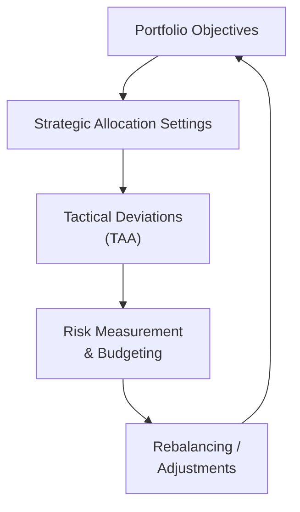

## 9.4 Risk Management and Asset Allocation

Risk management and asset allocation form the backbone of any successful investment strategy. After all, what good is a portfolio if it can’t handle the unforeseen twists and turns of the market? By thoughtfully combining different assets—equities, bonds, real estate, alternatives, or derivatives—and aligning them with your objectives, you can build a well-rounded portfolio that stands the test of time. 

You might remember from earlier portfolio theory discussions in this chapter that risk is not simply about avoiding potential losses; it’s also about balancing how much risk you’re willing to take to achieve a desired return. Indeed, risk management is an ongoing process that not only aims to minimize the downside but also to identify ways to optimize returns given an investor’s constraints. 

Sometimes I’ll think back to one of my first big investing “lessons.” I remember expecting my portfolio to grow at a steady rate, but I quickly discovered that markets can be more mercurial than we’d like. Anyway, that experience convinced me that asset allocation is one of the most critical decisions any investor makes, more so than choosing individual securities. And I’m not alone—academic research consistently finds that a broad chunk of portfolio returns can be attributed to decisions at the asset-class level rather than specific security selection.

Below, we’ll walk through key concepts: strategic asset allocation (SAA), tactical asset allocation (TAA), liability-driven investing (LDI), multi-asset strategies, diversification, and risk budgeting. Each plays an important role in constructing an effective and resilient portfolio. So let’s dive in.

### Strategic Asset Allocation: The Long-Term Blueprint

Strategic Asset Allocation (SAA) is essentially the long-term, policy-level blueprint that defines how much of each major asset class you’ll hold in your portfolio. Think of SAA as your “steady-state” or default system of investments—some big-picture approach you plan to stick to for years. SAA typically stems from the investor’s overall objectives, constraints, and risk tolerance. 

• Objectives might include target returns (e.g., “I want to earn 7% to 8% per year”).  
• Constraints often reflect liquidity needs, time horizon, unique personal or institutional considerations, relevant regulations, or liability profiles (particularly for pension funds and insurance firms).  
• Risk tolerance is generally about how comfortable you are with the possibility of loss or volatility.

You might formulate your SAA with a standard mix of stocks, bonds, real estate, and alternative investments (see Chapter 8 for more details on alternatives), each assigned a target percentage. Suppose you want 60% in equities, 30% in fixed-income instruments, and 10% in alternatives. That’s your strategic policy. From there, you regularly rebalance back to those weights to make sure your long-term risk-return posture remains consistent.

Just to illustrate the “formula-driven” approach to strategic allocation, you might express an expected returns calculation as follows in KaTeX:


\text{Expected Return} = w_{\mathrm{Equities}} \times E(R_{\mathrm{Equities}}) + w_{\mathrm{Bonds}} \times E(R_{\mathrm{Bonds}}) + \dots


where \\( w_{\mathrm{Equities}}, w_{\mathrm{Bonds}}, \dots \\) are the portfolio weights in each asset class, and \\( E(R_{\mathrm{Equities}}), E(R_{\mathrm{Bonds}}), \dots \\) are the expected returns of those classes. If you’re designing an SAA for a longer time horizon, you might lean more heavily on asset classes that are expected to deliver higher returns, like equities. But you’ll also have to weigh the added volatility—and your personal comfort with riding out short-term dips.

### Tactical Asset Allocation: Short-Term Tweaks

Tactical Asset Allocation (TAA) is more of a nimble move. Picture your strategic asset mix as the baseline, but you see a particularly hot opportunity in emerging market equities or a near-term slump looming in high-yield bonds. You might then tilt the portfolio away from the strategic weights to capitalize on what you (or your firm’s analysts) perceive as a temporary market condition. 

The difference between SAA and TAA can be visually depicted in a simple flowchart:

Here, you begin with your long-term investor profile (objectives, constraints, time horizon, etc.) and create your SAA. You then shift to TAA whenever you believe short-term market movements can be exploited. Eventually, you’ll circle back to your strategic baseline (or update it if your long-term assumptions change). 

However, TAA isn’t free lunch. It involves skill, timing, and transaction costs. If you’re frequently wrong about market direction or if you incur excessive trading fees, TAA might reduce portfolio returns. 

### Matching Portfolio Construction to Investor Objectives and Constraints

Whether you’re designing a portfolio for a young professional or a large pension fund, you need to keep the investment policy in tune with the investor’s situation. Some important constraints include:  
• Time horizon: Is the investor saving for retirement in 30 years, or does the investor need money in five years to open a business?  
• Liquidity requirements: A large endowment might need to distribute funds quarterly to support nonprofit activities, so it can’t lock up too much in illiquid alternatives.  
• Regulatory constraints: Some pension funds, for instance, face regulatory coverage requirements that cap how much risk they can take.  
• Tax considerations: Individuals or funds in higher tax brackets might prefer lower turnover or certain tax-efficient vehicles.  
• Ethical, environmental, or unique personal preferences: ESG factors can influence the allowable assets.  

In designing the portfolio, keep an eye on how each constraint might affect risk tolerance. A bigger liquidity need typically means you want less exposure to illiquid or volatile assets. Meanwhile, a longer time horizon might point to a higher equity weighting. Balancing these tradeoffs is a dance between the desire for returns and the unrelenting presence of risk. Always re-visit them when your life situation or the external environment changes.

### Liability-Driven Investing (LDI): A Real Game-Changer

For institutions like pension funds or insurance companies, asset allocation is often dictated by known future payouts—liabilities, in other words. In Liability-Driven Investing, you pick assets whose cash flow or duration characteristics match your liabilities as neatly as possible. 

Let’s say a pension fund anticipates paying retirees a certain amount over the next 20 years, and that payoff schedule can be mapped out. By holding long-duration bonds and certain derivatives, the pension fund can hedge interest rate risk and ensure (as best as possible) that the future value of the assets tracks the present value of the liabilities. This approach, while typically lowering upside potential a bit, locks in greater certainty about meeting future obligations.  

In practice, LDI might combine a set of duration-matched bonds with more return-seeking “growth” assets. The growth bucket aims to boost returns above the discount rate, while the LDI (or hedging) bucket makes sure the liabilities are largely covered even if interest rates fluctuate.  

### Multi-Asset Strategies: Combining Different Plates at the Buffet

A multi-asset strategy invests in a broad range of asset classes all in one solution. These strategies are often designed to achieve better risk-adjusted returns than a portfolio with fewer asset classes. Because different assets (think equity, bonds, commodities, real estate, hedge funds, private equity) often don’t move in tandem, the overall volatility of the portfolio could be reduced. 

Occasionally, I like to think of multi-asset investing as going to a world-class buffet. Stocks are your tasty prime rib, bonds are the stable salad or side, real estate invests you in the dessert station (hopefully fat and sweet returns!), and so on. Each dish offers something different. Sure, they might all be food, but combining them in the right proportions helps achieve a more balanced meal. 

Plus, for institutional investors, a multi-asset approach might mean having separate managers for equities, fixed income, private markets, etc., all under the umbrella of one overarching risk budget or policy. Over time, managers coordinate to ensure that the total portfolio’s risk and return objectives remain aligned with the investor’s long-term goals.

### Diversification: Don’t Put All Your Eggs in One Basket

Okay, so we’ve all heard the saying, “Don’t put all your eggs in one basket.” Diversification is about combining securities and asset classes that exhibit less-than-perfect correlations. (See also Chapter 5 and Chapter 6 for more on equity and fixed income valuations, respectively, which can influence correlation assumptions.)  

If everything in your portfolio shoots up and down together, that might feel exhilarating in the good times—until a downturn arrives. That’s precisely where diversification can help by smoothing out returns. In a well-diversified multi-asset portfolio, certain segments might lag while others lead, keeping you afloat overall.  

However, watch out for “false diversification.” In times of crisis, correlations among risk assets tend to converge (i.e., many asset classes move downward together). So, it’s important to monitor those correlations in both normal and stressed market conditions.

### The Concept of Risk Budgeting

One of the best ways to think about controlling portfolio risk is risk budgeting. Instead of simply worrying about how much money you’re allotting to each asset class, you worry about how much risk (or volatility contribution) you’re allotting. 

Risk budgeting often involves:  
1. Estimating how each asset contributes to the total portfolio variance or Value-at-Risk (VaR).  
2. Setting limits (or “budgets”) for each asset.  
3. Monitoring to ensure you stay within those risk budgets.

You might find that some “high-volatility” assets consume a disproportionate share of the risk budget. So you’d carefully size your positions, ensuring no single asset or strategy dominates your risk profile. For instance, you might realize that an allocation to emerging market equities contributes a bigger chunk of total risk than a similarly sized chunk of investment-grade bonds. In that case, you might decide to reduce the emerging market portion to keep overall volatility in check.

One standard approach uses the idea of marginal contribution to risk (MCTR) and risk contributions. Here’s a simplified formula for an asset’s contribution to portfolio volatility using KaTeX:


\mathrm{RC_i} = w_i \times \frac{\partial \sigma_p}{\partial w_i}


where \\( w_i \\) is the weight of asset \\( i \\) in the portfolio, \\( \sigma_p \\) is the portfolio standard deviation, and \\( \frac{\partial \sigma_p}{\partial w_i} \\) is the marginal contribution to the portfolio’s standard deviation from holding a bit more of asset \\( i \\). Summing \\(\mathrm{RC_i}\\) across all assets recovers total portfolio risk. That’s risk budgeting in action.

### Putting It All Together: An Illustrative Case Study

Imagine you’re the portfolio manager for XYZ Pension Fund. Your liabilities are well-defined, and you have a moderately high risk tolerance due to the demographics of your plan participants (average age is mid-40s, which means you have time before major payouts are due). Let’s see how you might combine approaches:

• Step 1: Analyze Liabilities  
  You discover that your biggest outflows will start hitting in 15 to 20 years. So you want some portion of your assets matched to those liabilities and immunized from interest rate risk.  

• Step 2: Set a Strategic Asset Allocation  
  You decide on a baseline: 40% equities (with a global tilt), 40% fixed income (with some long-duration bonds to hedge liabilities), and 20% alternative investments (such as real estate and private equity for potential higher returns).  

• Step 3: Develop a Tactical Plan  
  If global equity valuations appear cheap or if you foresee a near-term rise in interest rates, you might tweak your SAA to hold, for instance, 45% in equities and 35% in bonds, anticipating that interest rates could damage bond values. Once markets move in the predicted direction—or if your outlook dampens—you shift back toward the strategic target.  

• Step 4: Diversify Thoroughly and Revisit  
  You ensure your 40% equity sleeve includes multiple geographies and styles (e.g., small-cap, large-cap, growth, value) to spread risk. You also rebalance at least quarterly (or when any asset’s weight diverges significantly from your baseline).  

• Step 5: Manage Through Risk Budgeting  
  You measure the marginal contribution to risk from each subdivision of your portfolio, ensuring, for instance, that your private equity investment doesn’t push your overall risk profile above the plan’s tolerance.  

By combining SAA, TAA, LDI, diversification, and risk budgeting, you’re more likely to meet obligations while safeguarding against big portfolio drawdowns—particularly in those critical years before retirees expect their checks!

### Best Practices and Potential Pitfalls

Even the most well-constructed plan can fail if you don’t manage it correctly. Here are a few best practices and pitfalls to watch:

• Clarify Your Mandate: Make sure everyone in the organization (senior management, trustees, stakeholders) aligns on the investment policy and risk tolerance.  
• Stay Disciplined With Rebalancing: “Selling winners and buying losers” may go against your instincts, but it’s key to maintaining your strategic mix.  
• Avoid Overreliance on TAA: Tactical moves can help, but short-term perspectives are notoriously difficult to get right. Proceed cautiously, or you may slip into market-timing temptation.  
• Don’t Confuse Diversification With Diworsification: While spreading out is beneficial, adding too many correlated assets or paying for overpriced alternative strategies might reduce returns without mitigating risk meaningfully.  
• Monitor Correlations: During calm markets, certain asset classes look uncorrelated, but watch out for “correlation spikes” in volatile times.  
• Regularly Review Assumptions: Markets shift, and so do personal or organizational objectives. Keep an eye out for changes in your liabilities or the macro environment.  

### Tools and Diagrams for Monitoring

Because risk management is dynamic, a few helpful tools and diagrams can guide your day-to-day or month-to-month reviews:

• A risk dashboard that tracks volatility, VaR, and tail risk measures for the entire portfolio.  
• Correlation matrices to see if relationships between asset classes are changing.  
• Scenario testing and stress testing (see also Section 9.6 about measuring and managing market risk—VaR and Beyond).  
• Performance attribution showing how each asset or manager is contributing to returns (see Section 9.3 for deeper insights).  

Below is a simple mermaid diagram showing how these processes interact:

By flowing through each step and looping back to the top, you ensure an ongoing alignment of risk management with strategic investment goals.

### References for Further Exploration

• CFA Institute Program Curriculum, Level II, Readings on Asset Allocation  
• Maginn, J. T., Tuttle, L. E., Pinto, J. E., & McLeavey, D. W. (2007). Managing Investment Portfolios: A Dynamic Process  

These resources delve even deeper into the methodology, mathematics, and best practices of both strategic and tactical asset allocation, as well as risk management in professional settings.

### Final Exam Tips

• Remember the Distinctions: Know the core differences between SAA (long-term policy allocations) and TAA (short-term tilts based on market views).  
• Focus on the “Why” of LDI: Liability-driven investing’s essence is all about matching assets to liabilities. Be prepared to articulate durations, cash flow matching, and how interest rate movements affect the funding ratio.  
• Diversification vs. Correlation: Understand how correlation changes in different market regimes.  
• Calculate Risk Contributions: Be comfortable with the math of risk budgeting, including the idea that the sum of marginal contributions to risk equals total portfolio risk.  
• Read Carefully for Constraints: Vignette questions often revolve around constraints—pay close attention to time horizons, liquidity needs, and regulatory requirements. They often hold the key to the “most appropriate” answer.  

And yeah, the exam vignettes love to throw in short “market predictions” or “breaking news.” Don’t be thrown off. Just systematically apply TAA logic if it’s relevant.

---

## Test Your Knowledge: Risk Management and Asset Allocation Fundamentals



### Which of the following best describes Strategic Asset Allocation (SAA)?

- [ ] It refers to short-term adjustments based on market timing.  
- [x] It is the long-term, policy-level asset mix based on investor objectives and constraints.  
- [ ] It is the process of rebalancing the portfolio on a monthly basis.  
- [ ] It is a method focused solely on matching liabilities with fixed income securities.  

> **Explanation:** SAA is the long-term blueprint used by investors to align their portfolio with objectives, risk tolerance, and constraints.

### Which approach is most often used by pension funds to match assets with anticipated benefits payouts?

- [ ] Tactical Asset Allocation (TAA)  
- [ ] Long-Short Equity Strategy  
- [x] Liability-Driven Investing (LDI)  
- [ ] Passive Indexing  

> **Explanation:** LDI focuses on reducing funding-level volatility by matching asset duration and cash flows with anticipated pension liabilities.

### In Tactical Asset Allocation, investors generally aim to:

- [x] Exploit short-term mispricing or market opportunities.  
- [ ] Adjust to new long-term strategic policies.  
- [ ] Permanently eliminate specific asset classes from the portfolio.  
- [ ] Match the portfolio directly to liability durations.  

> **Explanation:** TAA involves active shifts from the strategic benchmark allocation to capture near-term market movements.

### Which of the following best describes the goal of diversification?

- [ ] Ensuring all assets move together.  
- [ ] Maximizing exposure to a single profitable asset.  
- [x] Reducing overall portfolio risk by combining assets with low correlation.  
- [ ] Eliminating all risk through a single asset class.  

> **Explanation:** Diversification aims to combine uncorrelated assets to achieve a more stable return profile.

### Risk budgeting within a portfolio primarily involves:

- [x] Allocating risk across different asset classes based on desired risk levels.  
- [ ] Using a single index to match regulatory requirements.  
- [x] Identifying each asset’s contribution to the overall portfolio risk.  
- [ ] Buying only safe-haven assets.  

> **Explanation:** Risk budgeting is about understanding and allocating each asset’s or strategy’s contribution to total portfolio risk, so two of the listed statements are correct.

### Which statement accurately captures a potential disadvantage of TAA?

- [x] Frequent trading might erode returns due to transaction costs.  
- [ ] It guarantees outperformance in all market conditions.  
- [ ] It is a purely passive approach.  
- [ ] It replaces the strategic allocation altogether.  

> **Explanation:** An investor may incur high transaction costs and/or make inaccurate short-term predictions, thus eating into returns.

### In Liability-Driven Investing, a key principle is to:

- [x] Match the duration of the assets to the duration of the liabilities.  
- [ ] Maximize short-term capital gains only.  
- [x] Focus on stable cash flows corresponding to liability schedules.  
- [ ] Shift frequently between equity and bond segments based on market sentiments.  

> **Explanation:** To hedge interest rate and reinvestment risk, LDI typically matches asset duration and cash flows with liabilities. Two statements are correct.

### When building a multi-asset portfolio, the primary benefit is:

- [x] Achieving diversification by investing in multiple asset classes.  
- [ ] Fully eliminating risk from the portfolio.  
- [ ] Optimizing a single security’s alpha.  
- [ ] Adhering to index-only strategies.  

> **Explanation:** Multi-asset strategies aim to reduce portfolio volatility and enhance risk-adjusted returns through broad diversification.

### Which of the following is an example of false diversification?

- [x] Holding several assets that are all highly correlated with each other in times of crisis.  
- [ ] Holding a blend of equity, fixed income, and real estate with varied exposures.  
- [ ] Using different investment managers with distinct approaches.  
- [ ] Owning a mix of short-term and long-term bonds.  

> **Explanation:** If assets are correlated in stressful periods, the portfolio might not be as diversified as it appears during calm markets.

### True or False: Monitoring correlation changes over time is a key component of effective flexible asset allocation.

- [x] True  
- [ ] False  

> **Explanation:** Correlations between asset classes can shift dramatically in different market episodes, so monitoring them is critical for proactive portfolio adjustments.


