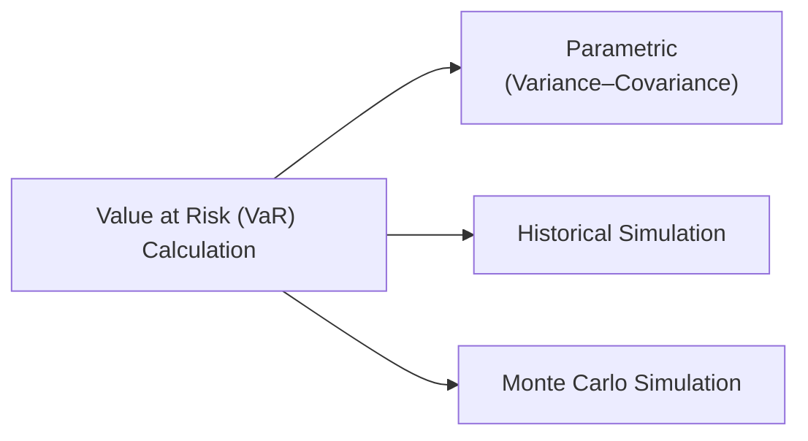
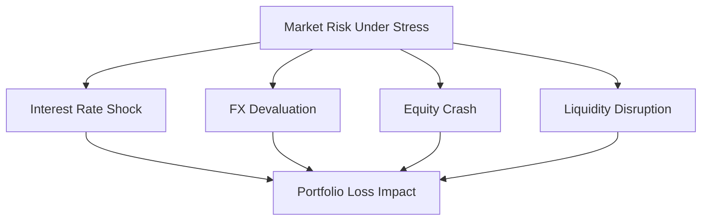
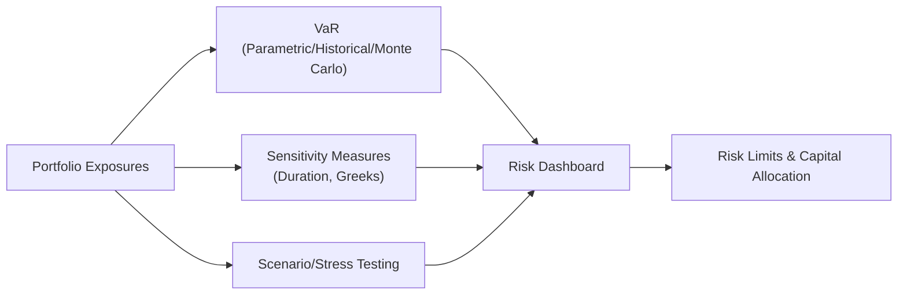

## 9.6 Measuring and Managing Market Risk (VaR and Beyond)

Market risk can feel like a roller coaster ride sometimes—one moment everything is calm and predictable, and then, out of nowhere, volatility shoots through the roof. When I was first learning about market risk, I remember being pretty anxious about all the complicated formulas and probability distributions. But the more I dug into it, the more I appreciated having systematic tools to capture those “what if” moments. Value at Risk (VaR) is one of those tools. It’s become almost synonymous with “market risk measurement” in the finance world, and it appears all over the place—from banks’ internal risk systems to regulatory frameworks like Basel III.

The trouble is, VaR isn’t perfect. It makes assumptions about distributions (often normal), correlations, and liquidity that might not hold in real markets, especially in a crisis. So, it has its share of critics who argue it can blind us to worst-case scenarios if we rely on it blindly. That’s why risk managers combine a bunch of complementary approaches, like scenario analysis, stress testing, tail-risk metrics such as Conditional VaR (CVaR), and sets of sensitivity measures (duration, delta, gamma, vega) that help us see how the portfolio might behave under different assumptions.

This article walks through the main VaR methodologies (parametric, historical simulation, and Monte Carlo), their strengths and weaknesses, and how advanced methods like scenario analysis and stress testing can complement them. We’ll also talk about risk budgeting, stop-loss limits, and how institutions piece together these methods to keep risk at bay. Let’s get started.

### The Concept of Value at Risk (VaR)

In plain English, VaR answers the question: “Over a given time horizon, what is the maximum loss I should expect to exceed only X% of the time?” A stylized definition might be:

• VaR at the 95% confidence level over one day = “There is only a 5% chance that the portfolio will lose more than the VaR amount on a given day.”

If you’re more comfortable with formulas, here’s a parametric expression for VaR using a normal distribution assumption. Assuming we have a portfolio with an expected return of μ and standard deviation σ, then the VaR at an α (e.g., 95% or 99%) confidence level over a one-day horizon can be expressed as:


\mathrm{VaR}_{\alpha} = -\left(\mu - z_{\alpha}\,\sigma\right),


where zₐ is the z-score corresponding to the chosen confidence level (e.g., about 2.33 for 99%, about 1.65 for 95%). Note that this formula might slightly differ depending on conventions, but the main idea is the same: we’re capturing the worst loss within a certain probability range, assuming a normal distribution.

### Major VaR Approaches

Although VaR is built conceptually the same way, you can estimate it using different techniques. Let’s break down the three main approaches:

#### Parametric VaR (Variance–Covariance Method)

In the variance–covariance approach, we assume asset returns follow a certain distribution (commonly normal) with a mean and standard deviation. The portfolio’s variance–covariance matrix is also used to capture correlations between assets. Once you have the overall portfolio mean (μᵨ) and volatility (σᵨ), you use the standard normal distribution to figure out the VaR.

• Pros:  
  – Straightforward, especially for large portfolios.  
  – Computationally light.  
  – Easy to implement in Excel or basic software systems.

• Cons:  
  – Relies heavily on the assumption of normally distributed returns.  
  – Correlations can change drastically in a crisis.  
  – Doesn’t capture tail “fatness” if returns show higher kurtosis than normal.

#### Historical Simulation VaR

Here, you essentially say, “Let’s look at how the portfolio would have performed over historical periods, reorder those returns from worst to best, and pick the cutoff loss for the VaR confidence level.” For example, if you need a 5% one-day VaR and you have 1,000 days of historical returns, you’d look at the worst 5% of daily returns in that sample. The 5% cutoff is your VaR.

• Pros:  
  – Less reliant on distribution assumptions.  
  – Captures real-world fat tails if your historical data includes them.  
  – Straightforward in concept—just reorder historical returns.

• Cons:  
  – Backward-looking (depends heavily on your chosen historical window).  
  – Assumes that past patterns repeat (a bit questionable in times of substantial regime shifts).  
  – If major crises aren’t in your sample, you might underestimate risk.

#### Monte Carlo Simulation VaR

The Monte Carlo approach simulates a large number of possible return outcomes using a chosen stochastic process (e.g., random draws from a distribution, or something more advanced to incorporate dynamic volatility, correlations, etc.). After generating thousands or even millions of scenarios, you reorder the simulated portfolio P&L outcomes and pick the VaR threshold that corresponds to your chosen confidence level.

• Pros:  
  – Highly flexible: can capture non-normal distributions, time-varying volatilities, and correlation structures.  
  – Gives you an entire distribution to study, not just a single risk measure.  
  – Great when you have complex derivatives or path-dependent instruments in your portfolio.

• Cons:  
  – Computationally heavy.  
  – Very sensitive to the assumptions you feed into your simulation (e.g., correlation structures, volatility processes).  
  – Might be overkill for simpler portfolios and smaller firms without the resources to maintain robust simulations.

### Limitations of VaR

As I hinted, VaR isn’t some magical risk fortress. It has real limitations:

• Normality Assumption in Parametric VaR: Real returns often exhibit fat tails—big moves happen more frequently than the normal distribution would suggest.  
• Lack of Tail Insight: If you’re only told there’s a 1% chance of losing more than $X million, you don’t know if that “more than $X million” could be just $X+1 or $X+100 million.  
• Liquidity Constraints: VaR doesn’t necessarily factor in that you might not be able to exit positions at the prices you see today, especially under stressed market conditions.  
• Historical Data Issues: Historical simulation depends on the window of data. You might “miss” a catastrophic event that happened out of sample or never happened before.  
• Regulatory Blind Spots: In the 2008 financial crisis, some banks were blindsided because correlation structures changed dramatically under stress. VaR was incorrectly reassuring.

### Beyond VaR: Stress Testing and Scenario Analysis

An old mentor once jokingly told me, “All models are wrong, but some are useful.” VaR is super useful, but it can fail to capture extreme tail events. That’s where scenario analysis and stress testing come in.

#### Scenario Analysis

Scenario analysis imagines what might happen in specific hypothetical or historical conditions. For instance, you could test how your portfolio would behave if the 2008 financial crisis or the 2020 pandemic shock repeated itself. Or maybe you want to construct a hypothetical scenario where interest rates spike by 300 basis points while equity markets drop 20%. You simply recalculate what your portfolio would be worth under those conditions.

• Pros:  
  – Focus on big disasters or structural shifts that aren’t well-represented in your normal historical data.  
  – Helps you “stress” the portfolio systematically.  
  – Flexible and can include hypothetical events (like a major geopolitical conflict) that haven’t happened yet.

• Cons:  
  – Heavily reliant on expert assumptions for constructing scenarios.  
  – Hard to know if you picked the right or “worst-case” scenario.

#### Stress Testing

While scenario analysis might be broad, stress testing tends to push variables to extremely adverse levels to see how far the portfolio might fall. For example, you might push volatility inputs to historically extreme levels or correlations to 1.0 across the board. The point is to see the portfolio’s potential meltdown points. 

Remember, in 1998, Long-Term Capital Management (LTCM) famously discovered that the “once-in-a-lifetime” meltdown can happen more often than you think. Stress tests often combine historical worst conditions with hypothetical extremes, giving management a sense of how catastrophic it might get.

### Conditional Value at Risk (CVaR) and Other Tail Measures

If you want to capture tail risk more directly, look at metrics like Conditional VaR (also known as Expected Shortfall or Expected Tail Loss). In a nutshell, CVaR is the average loss you incur given that you exceeded the VaR threshold. It’s basically telling you, “When things are worse than you hoped, on average, how bad do they get?”

Mathematically, in a continuous distribution setting, you can think of CVaR as:


\mathrm{CVaR}_{\alpha} = \text{E}\big[L \mid L \geq \mathrm{VaR}_{\alpha}\big],


where L denotes losses, and VaRᵅ is the loss threshold at the α confidence level.

Because it’s an average of losses beyond the VaR boundary, CVaR does a better job than VaR at showing you the severity of true tail events. Other tail-oriented measures and risk frameworks (like the concept of “drawdown risk” for hedge funds) exist to get at the same question: “How awful does it get if everything goes south?”

### Sensitivity Measures: Duration, Delta, Gamma, Vega, and More

VaR is great for summarizing the overall risk of a portfolio, but sometimes you want to see exactly which positions or exposures cause the biggest swings. That’s where sensitivity measures come in. 

• Duration (Fixed Income): Duration is basically how sensitive a bond’s price is to interest rate changes. If your bond portfolio has a duration of 5, that (roughly) means if interest rates rise by 1%, your portfolio’s value falls by about 5%.  
• Delta (Derivatives): Delta is the rate of change of a derivative’s value with respect to changes in the underlying asset’s price.  
• Gamma: Gamma is the sensitivity of delta to changes in the underlying price (second derivative).  
• Vega: Vega measures a derivative’s sensitivity to volatility changes in the underlying.

Aggregating these measures at the portfolio level can get tricky. But for risk management, it’s crucial to know if your overall portfolio is “net long volatility,” “net short interest-rate sensitivity,” or any number of complicated cross-relationships. Institutions often have specialized risk systems that aggregate these Greeks across the board and show a consolidated risk picture—like a big jigsaw puzzle that tries to reveal how the entire portfolio reacts to changes in multiple factors.

### Risk Limits, Risk Budgets, and Stop-Loss Limits

Risk management is not only about measuring risk but also about controlling it. Many institutions implement:

• Risk Budgets: A risk budget might say, “Our total portfolio volatility should not exceed 10% annually,” or “We can’t lose more than 2% in any single week.” Each strategy or sub-portfolio is assigned a slice of the total allowable risk.  
• Stop-Loss Limits: This is a kind of circuit-breaker. For instance, if a desk or trader loses more than $X in a month, positions are liquidated or scaled back significantly.  
• Capital Allocation Based on Risk: Instead of capital allocated by raw return potential alone, it’s based on a risk-adjusted perspective. The team or strategy that consumes the greatest risk budget must also produce commensurate returns.

Over time, I’ve observed that well-structured risk limits can prevent a small fire from becoming a destructive inferno. They’re certainly not foolproof, but they help enforce discipline. If you exceed your daily VaR limit or breach your maximum drawdown, managers can step in before the situation spirals.

### Putting It All Together: An Integrated Market Risk Management Approach

When risk managers gather in the morning, they generally don’t rely on just one number—like a 99% VaR—and call it a day. Instead, they might have a dashboard that includes:

• Parametric VaR vs. Historical Simulation VaR.  
• CVaR to provide deeper insight into tail exposures.  
• Scenario and stress test results, highlighting how the portfolio would fare under an equity crash, a spike in interest rates, or an emerging market meltdown.  
• Portfolio sensitivities (duration, delta, gamma, etc.).  
• Daily risk limit checks (Are we in compliance? Any near-breaches?)  
• Stop-loss triggers or early-warning signals.

This integrated view helps managers take timely decisions, like hedging certain positions or de-risking if a meltdown scenario looks more probable. Measurements are great, but decisions based on those measurements are what ultimately protect the firm.

### Final Thoughts Before the Exam

As you prep for exam questions on VaR, scenario analysis, and risk management techniques, keep these core themes in mind:

• Be sure you know how to distinguish between parametric, historical simulation, and Monte Carlo VaR.  
• Understand the assumption limitations (normal distributions can be misleading).  
• Remember how scenario analysis, stress testing, and tail-risk metrics like CVaR fill the gaps in VaR.  
• Don’t forget sensitivity measures—duration and the Greeks—because they often appear in exam questions about hedging strategies or exposures.  
• Risk limits, budgets, and stop-loss rules: appreciate how these are actually used in practice to control risk-taking.

Also, exam vignettes often combine multiple risk concepts. You might see a story about a manager who’s worried about the combination of rising interest rates and a potential equity market slump. They might ask how best to measure it, which method to use, or which Greek is relevant. So think holistically.

### References

1. CFA Institute Program Curriculum, Level II, Market Risk Measurement Topic.  
2. Jorion, P. (2007). Value at Risk: The New Benchmark for Managing Financial Risk.  

---

## Test Your Knowledge: Value at Risk and Tail-Risk Management



### Which of the following best describes Value at Risk (VaR)?

- [ ] The average expected loss for a portfolio over any given time horizon.
- [ ] The maximum possible loss for a portfolio over a given time horizon with 100% certainty.
- [x] An estimate of the potential loss over a defined period at a given confidence level.
- [ ] A guaranteed minimum return for a portfolio during any time period.

> **Explanation:** VaR measures the potential loss at a certain confidence level (e.g., 95%) and over a set period (e.g., one day). It is not the worst possible loss, nor is it an average.

### An advantage of the historical simulation approach to VaR is that it:

- [ ] Assumes a normal distribution for returns.
- [x] Uses actual past return data without assuming a specific distribution.
- [ ] Is the least complex approach computationally.
- [ ] Always captures true worst-case events perfectly.

> **Explanation:** Historical simulation VaR reorders actual returns and finds the cutoff loss for the chosen confidence level. It does not rely on an assumed distribution like normality, though it still may miss extreme events not present in the historical window.

### In parametric VaR (variance–covariance method), the primary assumption is:

- [x] Portfolio returns can be approximated by a normal distribution.
- [ ] Portfolio returns are entirely unpredictable.
- [ ] Volatility and correlations remain stable only in tail scenarios.
- [ ] The portfolio has zero correlation with the market.

> **Explanation:** Parametric VaR typically assumes normal (or near-normal) return distributions, simplifying the calculation using mean and standard deviation (plus correlation estimates among assets).

### One key limitation of VaR is that:

- [ ] It provides a complete picture of all possible future outcomes.
- [x] It does not fully describe what happens once losses exceed the VaR threshold.
- [ ] It always assumes returns are non-stationary.
- [ ] It incorporates perfect correlation estimates for all market conditions.

> **Explanation:** VaR indicates the threshold level (e.g., 1% worst-case), but it tells us nothing about the magnitude of losses beyond that threshold. That’s where CVaR helps.

### Which of the following is an appropriate description of Conditional VaR (CVaR)?

- [x] It is the average loss given that VaR is exceeded.
- [ ] It is a stress test that simulates liquidity events.
- [x] It is sometimes called Expected Shortfall.
- [ ] It relies on perfect historical data.

> **Explanation:** CVaR is the average (or expected) loss in the worst α% tail, i.e., beyond the VaR cutoff. It is also referred to as Expected Shortfall.

### Scenario analysis differs from historical simulation VaR because scenario analysis:

- [x] Examines specific hypothetical or historical events deeply, including those that never occurred.
- [ ] Relies strictly on the normal distribution assumption.
- [ ] Is built using a variance–covariance matrix.
- [ ] Ignores the portfolio’s actual composition.

> **Explanation:** Scenario analysis can be forward-looking and hypothetical, or can focus on specific historical episodes, often applying stresses outside the typical dataset.

### Which measure would best capture a portfolio's sensitivity to changes in interest rates on its fixed-income securities?

- [x] Duration
- [ ] Delta
- [x] Gamma
- [ ] Vega

> **Explanation:** Duration is the primary measure for interest rate risk in fixed-income securities. It quantifies price sensitivity relative to shifts in interest rates. Gamma measures curvature for options, but in many contexts exam questions consider “duration” the key measure for interest rate moves, while Delta and Gamma are generally for derivative price changes.

### In a risk management dashboard, VaR is most effectively supplemented by:

- [x] Stress tests and scenario analysis.
- [ ] A single correlation assumption across all assets.
- [ ] Exact, unchanging volatility estimates.
- [ ] A single historical dataset covering only 6 months.

> **Explanation:** Stress testing and scenario analysis provide a more holistic perspective, capturing events that VaR largely overlooks, especially extreme “tail” scenarios.

### Stop-loss limits in risk management are used primarily to:

- [x] Limit losses by triggering mandatory position reductions once a threshold is hit.
- [ ] Guarantee that the maximum risk is zero.
- [ ] Serve as a measure of tail risk in a portfolio.
- [ ] Increase leverage systematically.

> **Explanation:** Stop-loss limits help control potential losses by requiring traders or portfolios to close or reduce positions once losses surpass a set threshold.

### True or False: Conditional Value at Risk is always lower than Value at Risk for the same confidence level.

- [x] True
- [ ] False

> **Explanation:** CVaR (Expected Shortfall) represents the average loss beyond the VaR point in the worst α% tail, which is typically larger than the VaR threshold value itself. So if VaR is, say, $1 million at 99%, the CVaR might be $1.2 million, not less.


