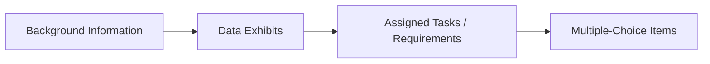

## Introduction
If there’s one thing I wish I had known when I first sat for the CFA Level II exam, it’s that item sets—often called “vignettes”—aren’t just about answering multiple-choice questions. Instead, they’re about fully immersing yourself in a short, case-based story. You know the drill: you’ll see roughly one to two pages of narrative, plus data exhibits or tables to interpret, and then face multiple-choice questions that test your grasp of everything from fundamental definitions to complex analytical reasoning.

It’s kind of like being handed a mini-investment scenario at work. You’re given background on a client, relevant data, maybe some footnotes or disclaimers that you’d better watch closely, and then you have to piece it together to recommend the right solution. The result? You’re tested on your ability to interpret, apply, and analyze—rather than just recite some formula. In this section, we’re going to walk through exactly what to expect from these item sets, how to handle them under exam pressures, and the best ways to avoid common pitfalls.

## Structure of the CFA Level II Exam
The Level II exam is split into two sessions—commonly referred to as the morning (AM) session and the afternoon (PM) session. Each session features a set number of vignettes, each of which typically contains either four or six multiple-choice questions. Altogether, you’ll tackle a series of item sets spanning various topic areas—Equity, Fixed Income, Derivatives, Quantitative Methods, and so on. The exam is designed such that each vignette generally ties to one primary topic, but sometimes you’ll find scenarios that cross over multiple areas (for example, a vignette that blends fixed income valuation concepts with regression output).

During each session, you are allotted a fixed amount of time—roughly 2 hours and 12 minutes if we stick to recent formats. Although the exact quantity of item sets can shift slightly from year to year, you can expect a division of topics somewhat proportional to the weighting outlined by the CFA Institute. The big takeaway is that you need to adapt to a patient-yet-prompt mindset: read carefully, interpret data, and answer questions with both precision and speed.

## Typical Vignette Flow
Let’s break down the flow of a typical vignette:

• Background Information: This is where you’ll get the setting—perhaps an equity analyst investigating a new stock, or a portfolio manager reviewing macro data. It often introduces a few characters (like a CFO or a research analyst), the company or market environment, and key constraints.  
• Data Exhibits: These might be tables of regression outputs, financial statements, or charts of historical performance. Sometimes the vignette includes multiple exhibits, each revealing different facets of the scenario.  
• Assigned Tasks / Requirements: The text usually hints at what must be done—analyzing certain metrics, applying a model, or interpreting a new piece of data.  
• Multiple-Choice Items: Finally, you’ll be asked 4–6 questions. Each question will typically require you to apply concepts or interpret data from the prior sections.

Everything—even the questions that feel tangential—must be answered using only the data in the vignette. This is a huge point for the CFA exam: you can’t rely on new “outside knowledge” that’s not implied in the scenario. If some detail isn’t included (say, a discount rate that you think should be common knowledge), and they don’t give it to you, you’re probably not meant to guess or assume.

## Role of Learning Outcome Statements (LOS)
Behind the scenes, each question in the Level II exam aligns with at least one Learning Outcome Statement (LOS). These LOSs are spelled out in your official CFA curriculum, detailing precisely what you’re expected to “do” with the knowledge you’ve acquired (e.g., “calculate and interpret…,” “evaluate the effect of…,” “explain strengths and weaknesses of…”).

While memorizing LOSs word-for-word can be overwhelming, it’s helpful to reference them throughout your studies. Each reading has multiple LOSs, and each LOS ties to a type of skill, such as “explanation” or “analysis.” If a vignette focuses on multiple regression analysis (as you might see in Chapter 2), you’ll see questions that test your ability to interpret regression charts, identify violations of assumptions, or calculate test statistics. If the LOS says “Interpret R-squared and adjusted R-squared,” you can be almost certain a question will pop up that touches on that exact skill.

## The Emphasis on Higher-Order Skills
One of the big leaps from Level I to Level II is the increased complexity and the “contextual” nature of the exam. Put bluntly, you’re no longer just plugging in numbers. They want to see if you can:

• Interpret and evaluate data (e.g., read the residual plot in a regression and spot suspicious patterns).  
• Apply theoretical concepts to real or semi-real scenarios (e.g., does the given data violate an assumption of stationarity in a time-series model?).  
• Synthesize multiple pieces of information (e.g., combine an income statement result with a regulatory constraint to come up with a likely effect on a valuation multiple).

Almost every question tries to measure not just “Do you know the formula?” but “Can you properly use it in a story?” or “How do you spot the conceptual trap here?” The examiners might, for instance, slip in an exhibit about sample size or p-values that looks normal at first, but hides an inconsistency that can change your entire conclusion.

## Time Budgeting Strategies
Let’s be honest—your reading speed and your ability to prioritize information can make or break your performance in the item sets. You might have 45 or so questions per session, each requiring an in-depth reading of the vignette. That’s not a little, given the time constraints. I remember one of my earlier mocks where I over-invested in a single vignette about a fancy econometrics concept. By the time I finished, I was left scrambling for the rest.

So how do you keep on track?

1. Skim the Vignette for Context: Read the opening paragraphs quickly to get a sense of the scenario. Identify what main topic or concept is being tested.  
2. Glance at the Exhibits: If they include data tables or regression outputs, jump to see what metrics or variables are listed. This helps you anticipate the questions.  
3. Look at the Questions: Sometimes scanning the question stems first clarifies which data points or paragraphs are more relevant.  
4. Manage Time in Blocks: If each session is ~132 minutes and has roughly 45 questions, you can estimate ~3 minutes per question. Factor in reading time as well. (In a simplified equation form:  
   KaTeX: t = T / N  
   where T is total minutes in a session, and N is total questions. If T = 132 and N = 45, t ≈ 2.93 minutes per question.  
   This is not always perfect, since some item sets are quicker or more involved, but it gives a baseline.  
5. Mark and Move: If you’re stuck, pick a best guess, circle the question (if your exam format or scratch paper allows), and move on. You can return later if time permits.

It’s easy to get bogged down in a single question or data exhibit (especially if it’s an area you find fascinating). Don’t let curiosity sabotage your time management. The real test is optimizing your correct answers across all item sets.

## Data Extraction and Linking to Concepts
One essential skill is picking out relevant data from sometimes lengthy exhibits. Suppose you see a balance sheet, an income statement, and a summary of regression coefficients. If the question is about the correlation between two assets, you likely won’t need that entire income statement. The examiners often include data that you might never need, or that’s used in only one out of six questions. So do a quick mental check: “Which data elements line up with the question at hand?”

For instance, in a Quant Methods vignette, you might see:

• A table with regression output, including coefficient estimates and standard errors.  
• A separate exhibit with a partial correlation matrix.  
• Some text disclaimers about how the data sample was gathered (maybe it’s not random or it’s missing some observations).  

In the multiple-choice questions, they may ask about the significance of a coefficient or potential violations of the OLS assumptions. Immediately link the relevant data: t-stats, p-values, residual patterns—these come from the regression output or disclaimers. The partial correlation matrix might indicate potential multicollinearity if you see large correlations among independent variables. The disclaimers might hint at biased sampling. In short, read with a goal: “How does each piece of data tie to potential questions?”

## Avoiding Overreliance on Memorization
A big shift from Level I to Level II is that you can’t just rely on memorizing formulas. Obviously, you need to know your formulas for, say, a two-tailed test or calculating an F-statistic in multiple regression. But the examiners will push you beyond that. They might ask: “Which assumption is violated based on Exhibit 2’s pattern of residuals across time?” And if you only memorized the name of the test but not the rationale or typical pattern that indicates, say, autocorrelation, you’ll be stuck.

So I’d recommend adopting a conceptual approach:

• Understand Why a Formula Exists: For example, the reason we use an F-test in regression is to see if at least one slope coefficient differs from zero.  
• Know What the Key Outputs Mean: R-squared, standard error, t-stats—these metrics matter for interpretation.  
• Practice Real Scenarios: Don’t just solve formula-based questions in isolation. Seek out practice item sets (including those in official CFA sources); see how they embed formulas into bigger pictures.

## Common Pitfalls
I remember discovering a couple of landmines:

• Misreading the Time Period: If the text says “The data is from 2016 to 2020,” watch for a question that references 2021. They may do it to test if you noticed the out-of-sample detail.  
• Missing a Footnote: Sometimes footnotes or disclaimers carry crucial details about assumptions or rounding.  
• Overcomplicating or Overthinking: If you feel stuck, recheck the question: “Is it possible they’re simply testing if I know the difference between a one-tailed and two-tailed test?”  
• Getting Lost in Minor Details: Some data might be pure filler. Don’t let that distract you from what the question is actually asking.

## Connecting Vignette Stories to Real-World Applications
The entire point of the CFA Program is to simulate real-world finance scenarios. Think of each vignette as a microcosm of professional tasks. For instance, you might have a vignette about building out a logistic regression model to predict default probabilities. That’s exactly the kind of project a risk analyst might tackle at a bank. Another item set might ask you to interpret a yield curve regression as part of a bond’s risk analysis. By consciously linking the exam scenario to potential day-to-day tasks, you’ll internalize the knowledge more deeply.

## Wrapping Up Your Preparation
• Do official practice item sets: This cannot be stressed enough. The official style best reflects the actual exam questions.  
• Simulate exam conditions: Time yourself. Practice reading vignettes quickly and methodically.  
• Use the LOS as your blueprint: If there’s an LOS about “Detecting heteroskedasticity,” expect a question that forces you to interpret a relevant chart or statistic.  
• Don’t ignore lightly tested topics: The exam has broad coverage. Even if a topic is small, a single question can be the difference between passing and failing.

Even after thorough preparation, item sets can still be nerve-racking. But if you take to heart these strategies—careful reading, mindful timing, conceptual understanding over rote memorization—you’re far more likely to navigate them effectively. Think of each vignette as a puzzle: gather the clues, figure out which pieces fit, and avoid the traps of extraneous details.

## References and Suggested Readings
• CFA Institute. (Current Year). CFA® Program Curriculum Level II. Refer especially to the “How to Approach Item Set Questions” section for official guidance.  
• Elwin, R. (2020). “Case-Based Problem-Solving in Finance.” Finance Press.  
• Williams, T. (2019). “Effective Time Management for High-Stakes Exams.” Productivity Insights Journal, 14(2).  
• Official CFA Institute Practice Questions in the Learning Ecosystem (online resource).

## Test Your Knowledge: Mastering CFA Level II Item Sets



### Which statement best describes the structure of CFA Level II item sets?

- [x] They include a short case (one or two pages of text and data) followed by multiple-choice questions.  
- [ ] They consist solely of formulas and short calculation questions.  
- [ ] They require an open-ended written response based on a scenario.  
- [ ] They include multiple-choice questions that rely purely on outside knowledge and not the provided data.  

> **Explanation:** Item sets (vignettes) typically include contextual background, supporting data, and a set of multiple-choice questions. They're meant to mimic real-world scenarios where the data and story are integral to finding the correct answers.

### An item set focused on regression will likely test all of the following skills EXCEPT:

- [ ] Interpreting regression coefficients.  
- [ ] Detecting autocorrelation from exhibit data.  
- [ ] Evaluating t-statistics for significance.  
- [x] Memorizing every market ratio for major public companies.  

> **Explanation:** The CFA Level II exam emphasizes using data from the vignette rather than recalling outside facts, such as memorizing real-world market ratios not provided in the scenario.

### Which of the following is NOT a recommended strategy when reading a CFA Level II vignette?

- [ ] Skimming the first paragraph for context clues related to the tested topic.  
- [ ] Checking the exhibit for relevant data, such as regression results or financial metrics.  
- [x] Ignoring footnotes and disclaimers unless the questions reference them directly.  
- [ ] Carefully reading each question stem to know which data points you’ll need.  

> **Explanation:** Footnotes and disclaimers often contain critical details (e.g., missing data, changes in accounting assumptions) and should not be skipped.

### Time budgeting during the exam is critical because:

- [ ] Each question has a fixed time limit of 1 minute.  
- [ ] You have unlimited time but must answer in the correct sequence.  
- [ ] The exam is open-book, so you need extra time to check references.  
- [x] The total exam time is fixed, so allocating too much time on one vignette can jeopardize answering the rest.  

> **Explanation:** You must manage your overall time effectively. Spending too long on a single vignette can reduce time for others and risk incomplete or rushed answers.

### The purpose of referencing the Learning Outcome Statements (LOS) while studying is to:

- [x] Provide guidance on the types of tasks and skills you’re expected to master.  
- [ ] Substitute for reading the detailed curriculum text.  
- [ ] Eliminate the need to practice item sets.  
- [ ] Determine the exact wording of every question on the exam.  

> **Explanation:** LOS clarify what you should be able to accomplish with the knowledge, but they don’t guarantee question phrasing or content. Reading the curriculum and practicing item sets remain essential.

### A multiple regression vignette includes an exhibit with high correlation among independent variables. This is likely testing your ability to:

- [x] Identify multicollinearity.  
- [ ] Forecast an AR(1) process.  
- [ ] Calculate the present value of future dividends.  
- [ ] Perform ratio analysis using IFRS guidelines.  

> **Explanation:** High correlation among independent variables signals the potential presence of multicollinearity, a common concern in multiple regression analysis.

### To avoid overreliance on memorization, you should:

- [x] Understand the theoretical underpinnings behind the formulas and interpret results in context.  
- [ ] Focus only on past exam questions with minimal reading of the curriculum.  
- [ ] Memorize as many formulas as possible and skip data analysis.  
- [ ] Study only the definitions provided in the glossary.  

> **Explanation:** CFA Level II vignettes test higher-order thinking skills. Grasping the concepts behind the formulas and interpreting data are crucial for success.

### You’ve spent 10 minutes on the first question of an item set and are still stuck. A good approach is to:

- [ ] Remain on that question until you are certain of the correct answer.  
- [ ] Guess the same letter for all unknown questions.  
- [x] Select the best possible answer, mark the question for review if the format allows, and move on.  
- [ ] Skip all the questions from that vignette.  

> **Explanation:** Over-investing time in one question can hurt your overall performance. It’s better to put down a reasoned guess and proceed, returning later if possible.

### What is a key reason instructors advise you to scan the item set’s questions before reading the entire vignette deeply?

- [x] It helps you identify which details in the vignette are most relevant.  
- [ ] It reveals the correct answers in advance.  
- [ ] It eliminates the need to read the background information.  
- [ ] It ensures you only answer questions that require calculations.  

> **Explanation:** Glancing at the questions can guide you to focus on the vignette sections that matter most, saving time and improving accuracy.

### True or False: The CFA Level II exam allows outside data to be used for answering item set questions if you recall it from your professional experience.

- [x] True  
- [ ] False  

> **Explanation:** You may lean on common principles from your professional experience, but the final answers must rely on the data and statements provided in the vignette. If external knowledge contradicts what’s given in the vignette, the vignette data and statements take precedence.


