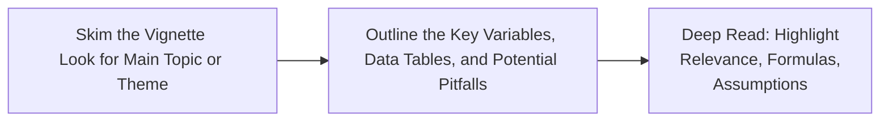

Many CFA Level II candidates run into the same challenge: You open the exam booklet, see a lengthy vignette filled with all sorts of numbers, footnotes, disclaimers, and—uh, wait—some questionable assumptions about market volatility. Before you know it, you’ve spent half your time re-reading the same paragraphs trying to figure out what’s important and what’s just there to throw you off. Sound familiar? Don’t worry—it’s totally normal. This section aims to help you adopt a more structured reading approach, so you can make sense of intimidating item sets, pinpoint essential information, and actually enjoy applying your quantitative know-how (well, “enjoy” might be a strong word, but at least reduce the stress!).

## The Crucial Role of a Structured Reading Approach

A structured reading approach is, in a nutshell, a clear methodology to work through complex texts. This is especially important for vignette-style questions, where examiners often present multiple data points—some relevant, some not so much—in a narrative format. A popular model is:

• Skim  
• Outline  
• Deep Read  

Why bother with such a method? Because it helps you track the story, note the key data points (like variable definitions and constraints), and quickly find that sweet spot between thoroughness and efficiency.

Below is a quick visual representation:



Just reading that might seem a bit mechanical, but it works. Personally, I remember the first time I took a mock exam with vignettes. I tried to read each item set word for word as if it were a novel—yikes, big mistake. I’d get so stuck on the details that I’d completely miss the bigger picture. Using a structured approach rescued me from that cycle.

### Skim

• Overview: Start with a quick glance, scanning headings (if any), names of key players or companies, references to formulas (like linear or logistic regression), and any disclaimers about data sources.  
• Purpose: This helps you grasp the scenario. Is it about a time-series forecast? A multiple regression analysis? Or maybe it’s an ARCH model scenario (something you’ll encounter in Chapter 6)? You want a top-level notion of what the vignette is trying to address before you dive into the fine print.

### Outline

• Organize: Jot down a brief list of variables, assumptions, or data tables. If you see a regression table, note the variables, R², and anything unusual about the standard errors.  
• Filter Distractions: Watch for extraneous details—“Daniel, the senior analyst, met with the CFO in Tokyo…” might be interesting color, but it might not matter for your calculations. In the world of item sets, these are often Distractions.  
• Quick Mind Map: If you’re a visual person, create a Mind Map on scratch paper. This helps you see the relationships between sections of the vignette: maybe one part explains firm fundamentals, another part references a model assumption, and a footnote covers a specific data disclaimer.

### Deep Read

• Clarify and Annotate: Now you can carefully read the text, highlighting relevant formulas or numbers. An Annotation is vital—circle or underline anything that might affect your solution, like “Standard Deviation = 2.5%” or “Company intends to pay a dividend.”  
• Confirm Relevance: As you go, stop and ask: “Is this piece of information crucial to the question, or is it just background noise?” This step ensures you don’t get lost in the fluff.  
• Be Mindful of Assumptions: Particularly for quantitative methods, check whether the vignette states assumptions about linearity, stationarity (important for time-series, see Chapter 6), or independence of errors (critical in regression analysis).  

## Identifying Key Data Points and Avoiding Distractions

One hallmark of Level II exam questions is that they’re loaded with data, but not all data is equally valuable. So how do you figure out what to keep and what to ignore?

• Check the Question: Often, the question at the end of the vignette reveals whether you need the correlation data from Table 2 or the discount rate in Footnote 3. If it’s about a discounted cash flow, that footnote on the discount rate is crucial. If it’s about a logistic regression, that discount rate might be a red herring.  
• Look for Patterns: In time-series problems, watch for repeated references to trends or seasonality. In regression problems, pay extra attention to how the problem might hint at heteroskedasticity or autocorrelation.  
• Cross-Reference Exhibits and Text: If the text says R² = 0.65, but the exhibit’s table lists R² = 0.32, you should figure out which one applies to the question. Sometimes examiners embed contradictory data on purpose to see if you can identify the correct piece of information.

## Annotation and Notetaking Strategies

If you’re still reading these vignettes as if you’re in a book club, it’s time to shift. This is an exam context—annotation is your best friend. Some folks highlight or underline, others make short bullet points. Just do it consistently. Here are a few tips:

• Develop Shorthand: For instance, use “std dev” for standard deviation, “rtn” for returns, “β” for a beta coefficient, etc.  
• Mark Alerts: If you see disclaimers like “Data for Q1 are estimated,” highlight it. You never know if the question might ask about the reliability of Q1 data.  
• Keep a Formula Reference: Many test-takers scribble a quick cheat sheet of formulas (like the CAPM, the Weighted Average Cost of Capital (WACC), or maybe an F-statistic formula) at the margin of the question paper. This can save some major time flipping through your memory (or the exam’s formula references) repeatedly.

## Working with Regression Outputs

Regression tables are extremely common in CFA Level II item sets, especially in Quantitative Methods. A typical Regression Table includes:

| Coefficients | Standard Errors | t-Statistics | p-Values | R² (or Adjusted R²) |
|--------------|-----------------|-------------|----------|---------------------|
| ...          | ...             | ...         | ...      | ...                 |

• Coefficients: These lines tell you the estimated effect of each independent variable on the dependent variable.  
• Standard Errors: They indicate the variability in the coefficient estimate.  
• t-Statistics & p-Values: Tied to hypothesis testing. For instance, a coefficient with a p-value under 0.05 is typically considered statistically significant (though watch out for changes in significance levels).  
• R² (and Adjusted R²): Reflects model fit—how much of the variability in the dependent variable is explained by the model. Adjusted R² accounts for the number of predictors, a big deal if you have multiple regressors.  

Make sure you understand each row. If the question is about the significance of an independent variable (like, say, GDP growth on stock returns), you’ll look for the relevant p-value. If the question’s about forecasting, you’ll look for the intercept, slope(s), and possibly the R² to assess how well the model might perform.

Here’s a tiny numeric example:

Suppose the vignette states:

“An analyst runs a multiple regression with Market Return (MKTR) and Company-Specific News Sentiment (NEWS) to predict daily stock returns. Results are reported below:”

| Variable | Coefficient | Std. Error | t-stat | p-value  |
|----------|------------|------------|--------|----------|
| Intercept| 0.002      | 0.0015     | 1.33   | 0.185    |
| MKTR     | 0.85       | 0.20       | 4.25   | 0.002    |
| NEWS     | 0.10       | 0.05       | 2.00   | 0.090    |

R² = 0.58

Interpretation:  
• Intercept (0.002) is not significant at the 5% level (p = 0.185), so you might consider it zero in a simplified model.  
• MKTR is quite significant (p = 0.002). This suggests a strong positive relationship with stock returns.  
• NEWS is borderline. If your significance cutoff is 5%, p = 0.090 means it’s not quite significant. But if the cutoff is 10%, then it might be considered significant at that level.  
• R² = 0.58 indicates 58% of the variance in daily returns is explained by the model.  

## Potential Traps (and How to Avoid Them)

Level II vignettes are designed to test your ability to separate wheat from chaff. Here are some common traps:

• Misreading Footnotes: Sometimes the footnote states “Data includes a structural break after 2019.” If you breeze past it, you might incorrectly apply a regression approach that assumes no break in the data.  
• Skipping Over Disclaimers: Vignette disclaimers about data reliability can drastically affect your interpretation. Maybe the data set is missing some months, causing potential seasonality issues.  
• Confusing Similar Metrics: Don’t mix up standard deviation with variance or confuse R² with Adjusted R². It happens under exam stress!  
• Overlooking Confidence Intervals: Sometimes you’ll see “95% CI for the coefficient is (0.02, 0.10).” That’s actually telling you it’s likely positive. If the question is about the sign or significance, that interval might be the biggest hint.

## Python Snippet for Interpreting Regression Data

If you happen to practice at home or on the job, you can parse regression output with Python. Here’s a (very) brief code snippet:

```python
import pandas as pd
reg_data = {
    'Variable': ['Intercept', 'MKTR', 'NEWS'],
    'Coefficient': [0.002, 0.85, 0.10],
    'StdError': [0.0015, 0.20, 0.05],
    'tStat': [1.33, 4.25, 2.00],
    'pValue': [0.185, 0.002, 0.090]
}
df = pd.DataFrame(reg_data)
print(df)

df['Significant95'] = df['pValue'] < 0.05
print(df)
```

This sort of spreadsheet or code-based approach is obviously not something you’ll do in the exam room but can be great for practice, building your comfort with reading regression outputs.

## Common Pitfalls: A Short Checklist

1. Skimming Too Quickly: Missing a crucial detail about the time period or sample size.  
2. Over-Highlighting: If you highlight everything, effectively you highlight nothing. Keep it selective.  
3. Ignoring the “Why”: Focus on the big “why” behind each piece of data—why does the exam want you to see it?  
4. Mixing Up Models: If the vignette references logistic regression (see Chapter 5), that’s not the same approach as linear regression in Chapter 2. Their outputs differ significantly!  

## Exam Relevance and Final Tips

Remember, the exam is testing not just your knowledge but also your test-taking strategy and time management. Try out practice vignettes and physically mark them up. Force yourself to label Key Data Points and Distractions. Over time, you’ll spot patterns and get more comfortable ignoring the fluff. 

In an exam context, sometimes you’ll read a question first before diving into the vignette—this “question-first” tactic can help you see exactly which numbers or disclaimers you’re hunting for. Experiment in mock exams to see which method suits you best.

• Mind the Clock: It’s easy to get sucked in. If you find yourself spending more than half your time reading, it might be time for a new approach.  
• Stay Flexible: The structured reading approach is a guideline, not a straitjacket. If you prefer reading the questions first, go for it.  
• Practice Under Pressure: Simulate exam conditions. Use the same type of highlight or underline method so that, by exam day, it feels like second nature.  

## References

- Beasley, P. (2021). “Active Reading Strategies for Finance Professionals.” Journal of Investment Education, 27(1).  
- CFA Institute. (Current Year). Example item sets in the CFA® Program Curriculum (Level II).  
- Franken, C. (2018). “Exam Prep Tactics: Maximizing Efficiency under Time Constraints.” EduPro Publishing.  

For more examples of how examiners weave extraneous information into an otherwise straightforward analysis, consult practice item sets from the official CFA Institute curriculum. The more you see this style, the easier it becomes to navigate.

---

## Test Your Knowledge: Effective Vignette Reading and Analysis



### Which step in a structured reading approach involves quickly scanning the vignette for context and main themes?

- [ ] Outline
- [x] Skim
- [ ] Deep Read
- [ ] Annotation

> **Explanation:** The Skim stage is where you do a quick, high-level pass to identify the basic context (e.g., type of model, major players).

### What is the primary purpose of a Mind Map when analyzing a vignette?

- [ ] To replace the question data with your own assumptions
- [x] To visualize relationships among different pieces of data and concepts
- [ ] To summarize only the regression output
- [ ] To rewrite the vignette in bullet points

> **Explanation:** A Mind Map helps you grasp the interplay of different vignette elements, clarifying how dataset references, assumptions, and disclaimers connect.

### Which of the following points is typically unnecessary to highlight for a quantitative vignette?

- [ ] Information regarding the time period of the data
- [x] The name of the CFO who provided the data
- [ ] Assumptions about stationarity in a time series
- [ ] The footnote explaining a structural break in the data

> **Explanation:** The vignette may include extraneous “human interest” details, like a CFO’s name. This is likely irrelevant for solving the quant problem.

### When interpreting a regression table, which statistic best reflects whether an individual independent variable is statistically significant?

- [ ] R²
- [ ] Adjusted R²
- [x] p-value
- [ ] Confidence interval range

> **Explanation:** The p-value is a direct measure of statistical significance for each coefficient in the regression model.

### Suppose a vignette’s regression table for a variable X has a 95% confidence interval that crosses zero. What does this suggest?

- [ ] The variable is definitely correlated
- [ ] The variable is definitely significant at 5%
- [x] The variable may not be significant at 5%
- [ ] The variable is a major outlier

> **Explanation:** If the confidence interval for a coefficient includes zero, it indicates that the effect could be zero, making the variable not statistically significant at that level.

### In a time-series vignette, which detail is crucial to catch if you suspect a nonstationary process?

- [ ] The CFO’s compensation structure
- [x] A footnote indicating a changing mean or trend over time
- [ ] The color of the graphs used in the document
- [ ] Share price data from five years ago

> **Explanation:** Nonstationarity is indicated by a systematic change in mean or variance over time, or by a specific mention of a trend or unit root.

### Why is it recommended to read footnotes carefully in CFA exam vignettes?

- [ ] They usually provide humorous anecdotes
- [x] They often contain disclaimers or structural changes that affect calculations
- [ ] They contain definitions of basic financial terms
- [ ] They are not part of the official question

> **Explanation:** Footnotes can reveal hidden disclaimers or data adjustments that significantly alter the analysis.

### Which strategy best helps confirm that you’re focusing on relevant information from the vignette?

- [ ] Answering each question before even reading the vignette
- [x] Briefly reviewing the question stem to identify which data points will be needed
- [ ] Immediately calculating every possible ratio in the text
- [ ] Omitting all narrative details

> **Explanation:** Taking a peek at the question stems or the final question can help you target relevant data more quickly.

### If a regression table indicates that the coefficient for GDP growth has a p-value of 0.001 and a t-statistic of 5.2, which conclusion is most likely correct?

- [x] The GDP growth variable is highly statistically significant
- [ ] The model has perfect predictive ability
- [ ] The GDP variable is useless
- [ ] There is a structural break in the data

> **Explanation:** A low p-value (below 0.05) and a relatively large t-statistic suggests that the coefficient is highly significant.

### True or False: The best approach to reading a vignette is to carefully dissect every sentence as though you are reading literature.

- [ ] True
- [x] False

> **Explanation:** A structured approach emphasizing efficient skimming, outlining, and only then deep reading is far more effective than reading every sentence in detail from the start.


