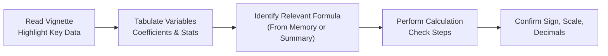

Many of us have experienced that heart-pounding moment in the exam hall: you glance at the clock, realize time is slipping away, and your mind goes blank on what’s usually a straightforward formula. Or maybe you read a snapshot of regression output buried within a vignette and can’t remember exactly which test statistic formula applies. Well, let’s talk about some practical, real-life approaches. I once reached for the t-statistic formula in my own Level II prep, only to mix up standard errors with standard deviation—ouch. Now, to spare you that stress, let’s chat about how to organize data and keep your essential formulas close at hand, no matter how pressured you feel.

## The Rationale Behind a Rapid-Reference “Formula Sheet” or “Concept Summary”

One of the best ways to avoid meltdown scenarios—and I promise, meltdown moments are normal once you hit that intense hour mark—is to have a mental or written “formula cheat sheet.” A formula sheet is sort of like your personal Swiss Army knife: it contains those fundamental relationships that you’ll use again and again. For instance, you may have:

• The multiple regression model:  
  $$y = \beta_0 + \beta_1 x_1 + \beta_2 x_2 + \cdots + \beta_k x_k + \varepsilon.$$

• The test statistic for coefficient significance:  
  $$t = \frac{\hat{\beta}_j - \beta_{j,0}}{\mathrm{SE}(\hat{\beta}_j)}.$$

• The p-value decision framework: reject H₀ if p-value < significance level.

• Basic guidelines like “if you see ‘autocorrelation’ in a time-series context, think Durbin–Watson test.”

Sure, you might have this knowledge in your memory, but let’s be honest: under exam pressure, you might confuse the formula for the standard error or forget whether degrees of freedom appear in the numerator or denominator. Jotting down your cheat sheet helps you re-center quickly. And in the real CFA Level II item-set (vignette) style, you may only have a snippet of time to pick the correct formula from memory. So that cheat sheet—mental or on scratch paper—becomes your best ally.

## Fast Strategies for Identifying Relevant Formulas

When you open a vignette, especially one stuffed with data, do this quick check:

• Skim for references to “coefficient significance,” “p-values,” “standard error,” or “confidence intervals.” You’ll know right away that you need a test statistic formula (and possibly a standard error formula) for each relevant coefficient.  
• Look for keywords like “variance,” “residual,” “F-statistic,” or “R-squared.” These hints guide you toward the relevant subset of your formula sheet.  
• In multi-regression contexts, you might see R-squared, adjusted R-squared, or mean squared error. Immediately highlight or mentally note that you’ll need those definitions.

If the problem is about a logistic regression, you might see references to “log-odds” or “likelihood.” For time-series, watch for words like “trend,” “stationarity,” or “AR(1).” Each of these triggers a mental link to a chunk of your formula summary. It’s like having a “If X, then Y” mapping.

## Tabulating Important Numerical Data in One Place

Let’s say you have three or four pages in a vignette with multiple tables: one is a partial ANOVA, another is a table of regression results, and yet another has summary statistics on the side. You know time is short, so what do you do?

Try a quick tabulation strategy. And by “tabulation,” I literally mean create a mini table on your scratch paper or your exam-provided workspace:

1. Write a concise label—like “Coefficient 1: β₁ = ?”  
2. Next to it, list the standard error, the t-value, or anything else you might need.  
3. If you see more than one coefficient or more than one model, keep them neatly labeled. Don’t worry about making it look pretty or centered; just ensure you have the correct reference points.

What you’re really doing is centralizing the data so you avoid flipping back and forth among the vignette pages. The last thing you want is to lose momentum searching for the standard error of β₂ because it was on that second table in small font. This technique is especially useful if the item set asks for multiple calculations in different parts of the question. Having the data all in front of you keeps your logic flow tight.

## Handling Multi-Part Calculations Under Time Pressure

Alright, so the exam question might require you to do multiple steps. For instance, you see references to computing a t-statistic, then the associated p-value, and then drawing a conclusion about rejecting H₀. Let’s break that workflow down:

1. Identify the needed inputs.  
   - Coefficient estimate: say $\hat{\beta}_1 = 0.045$.  
   - Standard error: maybe $\mathrm{SE}(\hat{\beta}_1) = 0.010$.  
   - Degrees of freedom (df): you see a note that the regression has n = 30 observations and k = 2 independent variables, so df = 30 – 2 – 1 = 27 for the t-distribution.  

2. Compute the test statistic.  
   - $$t = \frac{0.045}{0.010} = 4.5.$$

3. Use the t-statistic to get the p-value. The question might give you a partial t-table or might say “use DF=27.” Alternatively, if you can’t recall the exact p-value from memory, you might see a p-value approximation chart in the vignette or instructions.  

4. Compare the p-value to the significance level (like 5%).  
   - If p < 0.05, we reject H₀.  

5. Make the final conclusion.  

Notice that each step is distinct, and skipping any detail could blow up your final result. Plus, you want to keep track of decimal places. For instance, a slip from 0.010 to 0.100 would produce a t-value of 0.45 instead of 4.5—and that’s a disastrous difference. Keeping your steps in a short, labeled sequence on scratch paper helps you systematically cross-verify. Cross-checking can feel time-consuming at first, but once you get into the habit, you can do it very quickly.

## Double-Checking Data Integrity: Spot the Potential Pitfalls

Now, let’s talk about some common “whoops” moments:

• Misaligned columns in a table. Maybe the coefficient column is next to the standard error column, but there’s an extra row in between for some other metric. It’s easy to read the wrong numeric entry.  
• Negative signs or tiny decimals. If $\hat{\beta}_1$ is –0.004, that’s drastically different than 0.004 in your final conclusion. Same goes for mixing up 0.08 with 0.8.  
• Rounding confusion. If a table says 0.0020 and you read it as 0.002, that might not be catastrophic—unless the exam question is super sensitive to decimal places. However, try to keep the same level of precision throughout.  

One trick: quickly scan the table and rewrite the key numbers. As you rewrite them, read them carefully. If you wrote –0.004, confirm that there is actually a minus sign in front. That 10-second process can save you from a major meltdown.

## Overcoming Mental Blocks: “If You See X, That Implies Y”

Sometimes your mind just blanks out. You might read “F-statistic is 5.36 with 3 and 26 degrees of freedom,” and you can’t recall how to interpret that. This is when it’s invaluable to have a mental “if X, then Y” list:

• If you see “test statistic is an F-statistic for a multiple regression,” remember that the question might want the significance of *all* coefficients simultaneously (the joint hypothesis).  
• If “standard error of the slope coefficient is given,” you can guess they want a t-test or confidence interval.  
• If “p-value is less than alpha,” recall that we reject the null.

Develop your own cheat sheet from your practice sessions. Each bullet reminds you: “Oh yeah, for a multiple regression with k independent variables, always remember to consider the degrees of freedom of n – k – 1.” The more intangible example is the “mental block” that arises from pure nervousness in the exam hall. Rehearse the process at home repeatedly—simulate the stress if possible. The familiarity can help you slide back into autopilot even when your nerves are on edge.

## Importance of Time-Practiced Data Organization

It might sound cliché, but do practice vignettes under timed conditions—strictly. After all, you don’t want your first time-limited attempt to happen on exam day. You’ll quickly discover how easy it is to burn 10 minutes trying to recall a formula that normally you’d know in your sleep. By practicing:

• Your muscle memory forms. You’ll find yourself automatically writing certain formula pieces or tabulating data.  
• You’ll catch your personal pitfalls. Maybe you realize you always flip “std. error” and “std. dev.” Another might be forgetting to check the sign of a coefficient.  
• You’ll discover which formulas you can recall quickly vs. which ones you must truly memorize in a more systematic way.  

Gaining speed involves more than just finishing fast; it’s about developing enough structure so you can perform calculations methodically without panicking.

## A Quick Visual of the Process

Below is a compact flowchart highlighting how you might approach data organization:

Each node represents a critical checkpoint. By walking through these steps consistently, you minimize silly errors and keep your workflow calm and collected.

## Glossary

• **Formula Sheet/Concept Summary**: A personal collection of high-impact formulas (like t-tests, regression coefficients, or R-squared) that you can either quickly jot down on scratch paper or retain mentally for immediate reference.  
• **Tabulating Numerical Data**: The systematic arrangement of numbers—such as coefficient estimates, standard errors, or sample sizes—in a concise area so you can avoid rummaging through the vignette pages.  
• **Multi-Part Calculation**: A sequence of dependent steps in a single question—like computing a test statistic, then deducing a p-value, and finally interpreting significance.  
• **P-Value**: The probability of obtaining a test statistic at least as extreme as the observed one, under the assumption that the null hypothesis is true. If it’s below your chosen significance level (e.g., 5%), you generally reject H₀.  
• **Decimal Precision**: The exactness of numerical representation—e.g., 0.002 vs. 0.0020. Even small decimal place inconsistencies can lead to big differences in outcomes.

## Final Thoughts for Exam Relevance

As you progress through other sections—like interpreting residual plots (Chapter 2.5) or assessing the goodness of fit (Chapter 3)—you’ll see that data organization and formula recall remain crucial. By the time you’re done practicing, you’ll feel more at ease with overhead tasks such as reading multi-page vignettes, gleaning relevant numbers, marking them carefully, and applying the correct formula in the correct context.

Seriously, I’ve seen so many bright candidates trip on the easiest numeric details simply because they were under the gun timewise. The best antidote is methodical organization—like a mental (or scratch) formula sheet, carefully curated notes, and a consistent step-by-step approach. It may feel painstaking the first few tries, but with repetition, you’ll fly through it.

When you combine these “housekeeping” techniques with your deeper domain knowledge, you’ll be unstoppable on exam day. The confidence you gain from knowing you won’t lose easy points to decimal slip-ups or jumbled data is worth every second spent practicing.

---

**References and Suggested Readings**  
• CFA Institute Learning Ecosystem – Quantitative Methods Practice Problems and timed quizzes.  
• Rosenberg, J. (2020). “Efficient Calculation Techniques for Finance Exams.” Productivity in Finance Review.  
• Mason, G. (2019). “Building Exam-Day Calculation Speed: A Step-by-Step Guide.” FastFocus Publishing.

---

## Test Your Skills: Data Organization & Formula Recall Under Time Pressure



### Which of the following best describes a benefit of creating a “Concept Summary” or formula sheet during exam preparation?

- [ ] It completely replaces the need to read the vignette data.
- [ ] It adds extra reading time but reduces question-answering time.
- [x] It ensures rapid recall of essential formulas, reducing confusion under pressure.
- [ ] It is only necessary for advanced statistical concepts.

> **Explanation:** A concise “Concept Summary” streamlines your ability to recall critical formulas (e.g., regression coefficients, test statistics) under time constraints.

### A candidate notices each question in a vignette requires sorting through different tables, extracting small pieces of data from each. Which approach is most effective to minimize error?

- [ ] Trying to memorize all the numbers right away.
- [ ] Searching for each piece individually every time it is needed.
- [x] Creating a single, clearly labeled table containing all relevant numerical values.
- [ ] Highlighting every number in bright colors.

> **Explanation:** Tabulating the data in one place is a practical technique to minimize mix-ups and repeated searches.

### Suppose you have a regression analysis with β₁ = 0.03, SE(β₁) = 0.01, and 25 degrees of freedom. Which is the correct test statistic formula for evaluating the significance of β₁?

- [ ] t = (β₁ × SE(β₁))
- [x] t = β₁ / SE(β₁)
- [ ] t = SE(β₁) / β₁
- [ ] t = (β₁ + SE(β₁)) / DF

> **Explanation:** For each coefficient, the test statistic is the estimated coefficient divided by its standard error.

### When a p-value is provided but not a critical t-value, which step is typically taken to determine whether the null hypothesis should be rejected?

- [ ] Convert the p-value back into a test statistic first.
- [ ] Use the p-value only as a descriptive statistic, not for making decisions.
- [ ] Try to locate a z-table for small-sample approximations.
- [x] Compare the p-value to the chosen significance level (e.g., 5%).

> **Explanation:** A p-value below the chosen significance level indicates that the null hypothesis should be rejected.

### An analyst computes a t-statistic of 3.2 for a slope coefficient, yet the results show a reported standard error that’s 10 times larger than expected. Which best describes a potential cause?

- [ ] They used the F-statistic formula instead of a t-statistic formula.
- [ ] They used the entire sample standard deviation incorrectly.
- [x] They may have misread the coefficient’s decimal or misaligned columns in the table.
- [ ] They forgot to apply the significance level properly.

> **Explanation:** Large discrepancies often occur if the coefficient or standard error was misread (e.g., decimal place error or column alignment mix-up).

### Which of the following is a practical advantage of practicing item sets under strictly timed conditions?

- [x] It helps build the habit of methodically organizing data and formulas.
- [ ] It eliminates any possibility of reading errors.
- [ ] It guarantees perfect recall of formulas during the actual exam.
- [ ] It ensures you never second-guess your calculations.

> **Explanation:** Simulating exam pressures helps refine your strategies in data organization and formula recall, reducing panic or confusion during the real exam.

### A Level II candidate sees a mention of “Durbin–Watson statistic” in the vignette. Which immediate connection should they make?

- [ ] They should recall logistic regression odds interpretation.
- [ ] They should look for seasonal data patterns.
- [x] They should associate it with testing for autocorrelation in time-series data.
- [ ] They should automatically assume presence of multicollinearity.

> **Explanation:** The Durbin–Watson test is primarily used to detect serial correlation (autocorrelation) in the residuals of a time-series or regression context.

### In a multi-part calculation question where you must compute a t-statistic, then a p-value, and finally decide on a hypothesis test conclusion, what is the best way to avoid skipping a step?

- [ ] Write the final conclusion first and check your logic later.
- [ ] Perform all arithmetic in your head to save time.
- [x] Clearly label each intermediate step and cross-verify your arithmetic.
- [ ] Only focus on the largest coefficient for efficiency.

> **Explanation:** Labeling steps helps prevent mistakes. Skipping an intermediate step often leads to erroneous final conclusions.

### How can you most effectively guard against mixing up negative signs or decimal places in the exam?

- [ ] Convert all numbers into fractions before computing.
- [ ] Use only approximate values to reduce confusion.
- [x] Recopy the critical values carefully onto your scratch paper and verify sign/scale each time.
- [ ] Rely on memory to track the sign and scale of each number.

> **Explanation:** Methodically rewriting the numbers with attention to sign and decimal place is the simplest way to avoid sign or decimal mix-ups.

### True or False: It is acceptable to skip checking degrees of freedom when computing t-statistics if you already know the approximate significance level.

- [ ] False
- [x] True

> **Explanation:** This is a slight trick. In some CFA exam contexts, a provided table or direct p-value might make explicit reference to the correct distribution. However, “skipping” degrees of freedom is risky in practice—always confirm. In real-world and exam settings, you typically need to be sure the degrees of freedom line up with the distribution you’re using. The more precise your approach, the more accurate your conclusion will be.


