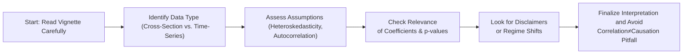

## Typical Misreadings of Regression and Statistical Outputs
It’s easy to get tripped up in the rush of reading CFA vignette questions—especially under the pressure of the clock. One of the sneakiest mistakes I’ve seen involves mixing up the signs of regression coefficients or ignoring the standard error measures entirely. I remember meeting a test-taker who was so focused on the magnitude of a coefficient that he forgot to note its negative sign. He was thrilled to find what he thought was a strong, positive relationship between market returns and a stock’s performance—until he realized he had interpreted a negative coefficient as a positive one.

Similar oversights happen when ignoring standard errors or p-values. In many item sets, you might see a table that provides the regression coefficient, the standard error, and a t-statistic. If you jump directly to the coefficient and skip its associated standard error or t-statistic, you might incorrectly conclude that a parameter is significant. That’s a quick route to choosing the wrong answer.

Also, watch out for incorrectly applying formulas from memory. If the question indicates, “Use a t-distribution with n – k – 1 degrees of freedom,” be sure you’re referencing the right degrees of freedom. A lot of partial-knowledge traps arise where the candidate uses a z-statistic—maybe from Level I or because they see a large sample size—when the question specifically states a small sample with the t-distribution. Even with large data sets, the exam may set up a scenario that calls for a different test distribution.

## Correlation vs. Causation
Let’s face it: correlation is a big deal in finance. Spotting patterns in returns or fundamental factors can lead to profitable insights. But correlation does not prove causation. You might see a compelling chart or regression table in a vignette claiming that “X strongly correlates with Y.” However, the pitfall is to jump to “X causes Y.” Vignette authors often love to set a trap by associating a correlation (maybe 0.85 or something eye-catching) with the idea that one variable drives the other.

Imagine you see a scenario analyzing two economic variables—for instance, average consumer credit and real estate sales volumes—both trending upward over a decade. The data might show a strong correlation. The temptation is to say something like, “Because consumer credit increased, real estate sales also rose.” But what if there was strong economic growth overall, and that factor influenced both credit and real estate markets simultaneously? The question might specifically mention an external factor like interest rate policy changes. If you skip that detail, you’ll jump to the correlation-equals-causation trap. The exam often includes disclaimers (e.g., data is from a booming decade) that are subtle hints you can’t automatically conclude a cause-and-effect relationship.

## Skipping Steps in Checking Assumptions
Another big pitfall is forgetting to check assumptions, particularly in multiple regression (see Chapter 2 for more details) and time-series analysis (Chapter 6). The presence of heteroskedasticity or autocorrelation can throw off test statistics and confidence intervals. If you see a question that presents a suspicious pattern of residuals—maybe they increase in magnitude over time or cluster in certain periods—this often indicates something is wrong with the usual regression assumptions.

Heteroskedasticity means the variance of the residuals is not constant across observations. When that happens, our standard errors are messed up—they might be smaller or larger than they should be, causing us to incorrectly judge coefficient significance. Autocorrelation (often referred to as serial correlation) arises when residuals are correlated over time, which can also skew test results. If a vignette states that residuals show a pattern or if the Durbin-Watson statistic is suspiciously low, be cautious about using ordinary least squares (OLS) results without adjustments.

A typical exam mistake is to assume you can interpret the slope coefficients normally even if standard assumptions break down. Perhaps the vignette specifically mentions that the “Breusch-Pagan test indicates significant heteroskedasticity.” That’s a major red flag not to rely on uncorrected standard errors. So always read the disclaimers and check if the vignette is nudging you to use remedial measures, like robust standard errors or a specialized method.

## Partial Knowledge and Close-But-Wrong Options
The exam, in item-set format, is filled with “close but not quite” answer choices. Let’s say you recall that the test statistic for a slope coefficient is:


t = \frac{\beta_i - 0}{\mathrm{SE}(\beta_i)}


But you’re fuzzy on the degrees of freedom. The exam provides four plausible answers that differ by the degrees of freedom used or a slight difference in the formula. If you rely on partial knowledge, you might zero in on an answer that looks right at a glance but fails a deeper check. It’s exactly the kind of question that can punish overconfidence.

Another partial-knowledge trap is mixing up the sample standard deviation with the population standard deviation. Or you might recall the process for the F-test in multiple regression but forget that with autocorrelation, the entire F-statistic might not be valid in its normal form. As a result, you end up picking an answer that was “kind of close” to the standard approach but not correct for the specific scenario given. Precisely these small details matter, and the exam is well-designed to exploit them.

## The Importance of Disclaimers and Economic Regime Shifts
Sometimes you open a vignette and see a line in the first or second paragraph like, “Our data was collected during a period of unusually low interest rates,” or “Management changed its accounting policies midway through the sample period.” Here’s a confession: in my early study days, I breezed right past disclaimers like these, thinking they weren’t relevant to the problem’s main calculations. Big mistake.

Details about data collection, sample biases, or a limited timeframe can drastically change your interpretation. The exam might expect you to question the stability of the regression or the representativeness of the sample. What if the analysis was done only during a bull market? You can’t easily extrapolate the results to a bear market. A mention of an “economic regime shift” often signals that the underlying relationships in your data may have changed. For instance, if a regression is run across two very different economic regimes, any single set of coefficients might not hold consistently across both. That’s where faulty inferences happen—unless, of course, you pick up on the disclaimers.

## Nonstationarity in Time-Series Data
Many item sets revolve around time-series data. Nonstationarity is a biggie. If a series has a unit root or a strong trend, you can’t just run an OLS regression and assume standard inference applies. Chapter 6 delves deeper into stationarity, but in a nutshell, if the data is nonstationary, your test statistics can be meaningless. I’ve seen many exam takers get tricked when a question states “the data show a rising pattern over time, with mean and variance changing,” yet they proceed as if the standard regression assumptions hold. Potential stationarity issues should prompt alarm bells.

## A Checklist of Pitfall Checks
Creating a short mental or written checklist during the exam can help ensure you’re avoiding common mishaps. It might be something you quickly reference before finalizing your answers:

- Have I properly identified the sample as cross-sectional or time-series?
- Did I confirm any mention of nonstationarity or economic regime shifts?
- Am I reading a coefficient’s sign correctly?
- Did I check the standard error and p-value for each key coefficient?
- Have I considered heteroskedasticity or autocorrelation?
- Is the question hinting at correlation vs. causation?
- Did I catch any disclaimers about limited data range, biased samples, or changing conditions?

Below is a simple Mermaid diagram of how these “pitfall checks” typically flow in your mind:



Referring to this flow—either conceptually or literally—can be a lifesaver in the exam. Also, remember to cross-check formula references with what the vignette or the question specifically tells you to use. If you see something like “An analyst used White’s robust standard errors,” that’s your cue to think about heteroskedasticity and how it’s being addressed.

## Scenario-Based Mini-Cases
Consider a scenario where a company’s stock performance is regressed on the S&P 500 returns and the 10-year Treasury yield. The vignette reveals:

• Data is from 2010–2020  
• Standard errors appear suspiciously small, and a test suggests strong autocorrelation.  
• The question states: “Due to historically low interest rates throughout this period, be cautious in interpreting the Treasury yield coefficient.”  

In the item set, one answer choice might say: “The coefficient on the 10-year Treasury yield is reliably negative, indicating that whenever yields drop, the firm’s stock experiences a decline.” Another choice might say: “The coefficient estimate is likely unreliable due to serial correlation and a sample covering a period of atypical interest rates.” The second is probably the better choice because it acknowledges the disclaimers and the presence of autocorrelation, which can invalidate naive interpretations.

Alternatively, consider a time-series example with daily bond returns. The vignette might hint that the series has a unit root (“the average and variance appear to change over the sample”). A partial-knowledge trap is to accept standard OLS t-statistics at face value: maybe the regression shows a “spurious” relationship that arises only because both series trend upward with time. The correct approach—recognizing the potential nonstationarity—would lead you to question the entire regression method or look for something like a cointegration test (covered in advanced time-series chapters).

## Brief Python Example for Correlation
Sometimes, seeing a quick snippet of code clarifies how partial knowledge can trick us. Suppose you do a quick correlation test in Python:

```python
import numpy as np

asset_a = np.array([0.01, 0.002, -0.005, 0.015, 0.009])
asset_b = np.array([0.008, 0.0, -0.01, 0.02, 0.012])

corr_value = np.corrcoef(asset_a, asset_b)[0,1]
print(f"Correlation: {corr_value}")
```

This code might spit out something like “Correlation: 0.95,” which is quite high. But guess what? Before concluding that one asset’s returns cause the other’s returns, you should check if both assets are trending because of a common factor—like the overall market environment. In exam terms, the item set might provide just that high correlation figure, then a fluff statement about “Asset A typically leads the movements of Asset B,” luring you into concluding causation. Don’t fall for it.

## In Closing
CFA Level II item sets are designed to push your analytical abilities and see if you can integrate multiple details—regression output, disclaimers about data, and the big difference between correlation and causation. Always slow down just enough to read each detail carefully. The disclaimers, the sign on coefficients, or the mention of outliers might be where the real test lies. It’s much more about being aware and methodical than simply memorizing facts.

Ultimately, skipping assumption checks or ignoring disclaimers can cost you big time. By following a structured approach—looking at the sample type, verifying stationarity (if time-series), assessing disclaimers, and carefully reviewing standard errors—you’ll drastically reduce the chance of falling for a trap. And trust me, the exam writers are experts at setting them.

## References and Suggested Readings
- CFA Institute. (Current Year). “Quantitative Methods” reading in the CFA® Program Curriculum Level II, sections on model limitations and assumptions.  
- Johnson, L. (2021). “Exam Errors: The 12 Most Common Mistakes in CFA Quant Questions.” inExam Academy Press.  
- Browning, D. (2022). “Understanding Regression Assumption Failures.” Journal of Empirical Finance, 6(3).

---------------------------------------------------------------------

## Test Your Knowledge: Quantitative Pitfalls in Vignette Questions



### Which of the following best illustrates the “partial knowledge” trap in a regression context?

- [ ] Confusing the significance level with the alpha in a standard normal test.
- [x] Using an OLS t-statistic formula but forgetting to adjust for autocorrelation in a time-series.
- [ ] Interpreting a correlation coefficient of 0.85 as a strong positive sign.
- [ ] Using a p-value approach instead of confidence intervals.

> **Explanation:** Partial knowledge often involves knowing the usual OLS formula for the t-statistic but missing a key detail (like adjusting for autocorrelation), thus leading to incorrect statistical inferences.

### A vignette states that a firm’s stock regressions against market returns show significant autocorrelation. Which approach is most appropriate?

- [ ] Conclude that the regression is still valid because the slope is highly significant.
- [ ] Switch to an F-test for the entire model without further modifications.
- [x] Adjust the regression using techniques designed for autocorrelation, such as Newey-West standard errors.
- [ ] Ignore the presence of autocorrelation because it only impacts small samples.

> **Explanation:** Autocorrelation affects standard errors, so you typically use robust methods such as Newey-West to correct them.

### A time-series regression is presented showing a strong relationship between a firm’s sales and GDP over 30 years. The vignette warns that “the data may not be stationary.” What is the best immediate response?

- [x] Check for unit roots or difference the data before concluding about the relationship.
- [ ] Assume the strong correlation indicates causation.
- [ ] Proceed with standard OLS testing, as 30 years is a sufficiently large sample.
- [ ] Immediately discard the data as invalid.

> **Explanation:** In nonstationary time-series, you must first test for unit roots. If a unit root is present, differencing or other transformations may be needed to achieve stationarity.

### A regression output shows a positive coefficient for “Interest Rate” on a corporate bond’s yield spread. Which pitfall might you fall into if you ignore the disclaimers stating that the data is from a single, low‑rate economic regime?

- [ ] Mixing up the sign of the coefficient.
- [ ] Failing to compute the correct t‑statistic.
- [x] Wrongly generalizing the positive coefficient to normal economic conditions.
- [ ] Believing correlation does not exist between interest rates and yield spreads.

> **Explanation:** If the dataset comes from a single, atypical regime, the coefficient may not hold under different interest-rate regimes. Ignoring this factor leads to overgeneralization.

### Which of the following is a classic example of a correlation vs. causation pitfall?

- [x] Concluding an increase in national GDP “caused” a rise in stock prices, without analyzing external drivers.
- [ ] Using a Durbin-Watson test to detect autocorrelation in the residuals.
- [x] Believing an inverse relationship indicates definite cause-and-effect based on a negative regression coefficient.
- [ ] Referring to robust standard errors when data is cross-sectional.

> **Explanation:** Jumping from correlation to causation is a common trap. A high (or negative) correlation does not necessarily mean one variable caused changes in the other without deeper analysis.

### Which choice represents a valid pitfall check question?

- [ ] “Do I know the data source for each coefficient?”
- [x] “Is the data cross-sectional or time-series, and did I account for the relevant assumptions?”
- [ ] “Are the regression results from the same analyst who wrote the question?”
- [ ] “Is the correlation 1.0 or -1.0?”

> **Explanation:** A solid pitfall check includes verifying the data structure (cross-sectional vs. time-series) and ensuring you used the proper assumptions and methods for that type of data.

### A Level II candidate sees a moderate correlation in a regression output (0.50), but the standard error for the slope is very large. If they ignore the standard error and focus solely on the correlation, they may:

- [x] Overestimate the significance of the slope coefficient.
- [ ] Correctly infer that correlation is too small to be useful.
- [x] Assume a cause-and-effect relationship without further analysis.
- [ ] Conclude the slope is negative.

> **Explanation:** Ignoring the large standard error leads to overconfidence in the coefficient’s significance. Also, focusing on correlation alone can tempt one to infer causation incorrectly.

### A vignette warns that the sample might be biased because it only covers a bull market. What best describes the potential pitfall?

- [x] The regression might not apply during other market conditions, leading to false generalizations.
- [ ] You can safely assume t-distribution for all residual analyses.
- [ ] The R-squared must be inflated because the market was rising.
- [ ] No pitfall exists if the sample size is large enough.

> **Explanation:** A bull-market-only sample can bias the results, making them inapplicable to normal or bearish conditions. This is a typical warning to consider regime shifts.

### The question states “An F-test indicates all regression coefficients are jointly significant.” The candidate concludes each coefficient individually has a significant impact. What mistake is this?

- [x] Confusing joint significance with individual coefficient significance.
- [ ] Confusing correlation and causation.
- [ ] Failing to check for stationarity in time-series.
- [ ] Believing alpha is 0.05 when it is actually 0.01.

> **Explanation:** The F-test checks joint significance, not necessarily the significance of each individual coefficient. A separate t-test is needed to confirm individual significance.

### When you see a t-statistic, t, represented as t = (βˆ - 0)/SE(βˆ), you should remember:

- [x] True
- [ ] False

> **Explanation:** Yes, the typical formula for testing a coefficient’s difference from zero in an OLS framework is (βˆ - 0)/SE(βˆ). This might vary slightly if testing a coefficient vs. a non-zero null hypothesis, but the general structure is the same.


