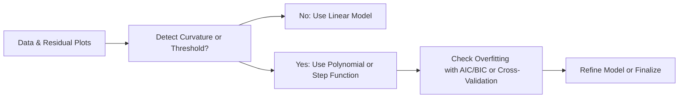

## Introduction

So, remember those straight‑line regressions with a single slope and intercept? Well, sometimes reality just doesn’t behave that nicely. In practice, market returns can surge and then plateau, interest rates can accelerate and then level off, and all sorts of financial indicators can bend in ways that a simple linear model can’t handle. That’s where polynomial terms, interaction effects, and step (piecewise) functions come rushing in to save the day.

Polynomial terms let us capture that swoop or curve in the data. Interaction terms reveal all those interesting ways in which one variable’s effect depends on another. Step functions highlight those threshold points—like how a bond’s duration risk might change dramatically when rates cross a certain barrier. In a sense, these techniques help us respect reality’s complexity without having to jump to super-advanced machine learning methods.  

Anyway, let’s see how you can fold in polynomial, interaction, and step functions into your regression toolkit. We’ll talk about the mechanics, the why, and the so-what—always tying it back to real financial examples that might pop up in CFA Level II item sets.

## Polynomial Regression

### Why We Need Polynomial Terms
Occasionally, you might sense that the effect of X on Y isn’t strictly a straight line. Think about how consumer spending might ramp up slowly during recoveries, accelerate sharply as growth heats up, and then level off once markets saturate or inflation bites. A linear regression might either understate or overstate certain segments of that data. That’s precisely when we fit a polynomial regression by including squared or cubed (or even higher powers) terms of an explanatory variable.

From a model-building perspective, a polynomial regression can be expressed as:


y = \beta_0 + \beta_1 x + \beta_2 x^2 + \beta_3 x^3 + \dots + \beta_k x^k + \epsilon


where \\( x^2 \\) and \\( x^3 \\) capture the curvature that a simple linear model cannot.  

### Real-World Financial Example
Picture a portfolio manager analyzing the relationship between small-cap stock returns (Y) and a market volatility index (X). If volatility is very low, small-caps might not offer much excitement. As volatility rises, small-cap returns might increase—reflecting risk-on sentiment. But at extremely high volatility levels, small-cap returns might tumble. Including \\( x^2 \\) might capture that hump-shaped (inverted U) pattern.

### Interpreting Coefficients and Marginal Effects
It’s tempting to interpret \\(\beta_2\\) or \\(\beta_3\\) in a polynomial regression at face value. Careful, though: the effect of an incremental change in X depends on all the terms. The marginal effect of X on Y is given by the partial derivative:


\frac{\partial y}{\partial x} = \beta_1 + 2 \beta_2 x + 3 \beta_3 x^2 + \dots + k \beta_k x^{k-1}.


If you’re working through a CFA vignette, it can help to evaluate this derivative at particular values of X. That shows the slope of the relationship—like measuring how returns shift when volatility is at 10, 20, or 30.  

### Multicollinearity Concerns
Adding \\( x \\), \\( x^2 \\), \\( x^3 \\), and so on can inflate collinearity. (After all, \\( x^2 \\) is highly correlated with \\( x \\) in many datasets—both just track “bigger X.”) This can bloat standard errors and complicate significance tests. A common remedy is to center or standardize X before generating powers, effectively letting the intercept capture the mean and reducing correlations among polynomial terms.

### Model Selection
You don’t want to keep piling on powers blindly. Test whether an additional polynomial term is justified—maybe by an incremental F‑test, an information criterion (like AIC or BIC), or cross-validation. In practice, if the second‑degree polynomial doesn’t significantly improve R-squared or reduce your out-of-sample error, it might not be worth the extra complexity.  

## Interaction Terms

### The Rationale for Interactions
All too often in finance, the effect of one variable depends on the level of another. Let’s say the strength of a momentum strategy (X₁) might differ significantly depending on market liquidity (X₂). In a plain linear model without an interaction term, you’d simply have:


y = \beta_0 + \beta_1 X_1 + \beta_2 X_2 + \epsilon.


But to capture how \\( X_1 \\) interacts with \\( X_2 \\) in a combined effect, you add \\( X_1 \times X_2 \\) to the mix:


y = \beta_0 + \beta_1 X_1 + \beta_2 X_2 + \beta_3 (X_1 X_2) + \epsilon.


Now, \\(\beta_3\\) reveals how the slope on \\( X_1 \\) changes as \\( X_2 \\) changes, and vice versa.

### Example: Valuation and Market Conditions
Suppose you’re modeling a stock’s returns (Y) using its price-to-earnings ratio (X₁) and an overall market sentiment index (X₂). Maybe high P/E is good only when sentiment is bullish. When an interaction term is significant, you’ll see that the relationship between P/E and returns is magnified or even reversed at different levels of sentiment.  

### Partial Derivatives for Interpretation
The coefficient \\(\beta_3\\) from \\( X_1 X_2 \\) doesn’t just stand alone; it modifies the original main effects. If you want the effect of \\( X_1 \\) on Y at a specific value of \\( X_2 \\), you’d compute:


\frac{\partial y}{\partial X_1} = \beta_1 + \beta_3 X_2.


Likewise,


\frac{\partial y}{\partial X_2} = \beta_2 + \beta_3 X_1.


This helps you interpret how each predictor’s slope changes in different contexts—something that can pop up in item sets where you must identify the effect of varying levels of another variable.

## Step Functions and Piecewise Regression

### Stepping Through Changes
Markets frequently exhibit threshold behaviors. A stock might exhibit one pattern of returns if its price remains below \$50 (value zone, perhaps), but above \$50, the market’s done messing around, and the valuation jumps onto a new plateau. Instead of forcing a continuous polynomial curve, piecewise regression (or step functions) can explicitly allow for a different slope or intercept once X crosses a threshold, known as a “knot” or “breakpoint.”

### Simple Piecewise Framework
Consider a single knot at \\( x = c \\). You might fit a model:


y = 
\begin{cases}
\beta_0 + \beta_1 X + \epsilon, & X \le c \\
\beta_0' + \beta_1' X + \epsilon, & X > c
\end{cases}


In practice, we often implement this by creating a new variable, say \\( (X - c)_+ \\), that equals \\( 0 \\) if \\( X \le c \\) and \\( (X - c) \\) otherwise. This ensures a continuous function but allows the slope to change after \\( X \\) passes \\( c \\).

### Financial Use-Cases
• Credit Risk: The effect of a firm’s debt-to-equity ratio might shift drastically once it crosses 1.0.  

• Regulatory Thresholds: New capital adequacy rules might kick in beyond a certain ratio, changing a bank’s returns or lending volumes.  

• Behavioral: Individual investors could react differently to stock price changes below \$100 than they do above \$100.

### Choosing Knots
In theory, you can set knots at known regulatory or psychological thresholds. Sometimes you do an exploratory analysis: scanning potential breakpoints to see which significantly improves model performance. The risk is data-snooping or overfitting if you try too many breakpoints.  

## Overfitting and Model Complexity

### Balancing Fit and Generalizability
All these expansions—extra polynomial terms, interactions, and step functions—can drastically improve in-sample fit, but that’s not always helpful if the model starts chasing random noise. Overly complex models can yield inflated R-squared values but fail miserably out of sample.  

Cross-validation (like k-fold) is your friend. It’s a systematic way to see how well your model generalizes. If you see big discrepancies in performance across folds, or if a simpler model is consistently doing just as well, it might be time to scale back.

### Information Criteria
Another more formal approach is to consult the AIC (Akaike Information Criterion) or BIC (Bayesian Information Criterion). These penalize complexity, so adding polynomial or step terms that don’t actually help yields higher (worse) AIC/BIC.

## Residual Diagnostics

### Visual Checks
Sometimes you just want to see if you managed to iron out the nonlinearity. Beyond standard checks of normality or homoscedasticity, plot the residuals against fitted values (or your primary predictor X). If the original linear model had a U-shaped pattern, a well-specified polynomial or step function model hopefully flattens that out.

### Indicator of Misspecification
If new patterns appear—like wave shapes or abrupt step-like shifts in your residual plot—maybe you need a different type of break, or you still need an additional polynomial term. Even with advanced regression techniques, never skip investigating the leftover structure in your residuals.

## Practical Considerations

- **Scaling and Centering**: Reduces correlation among polynomial terms. This is especially helpful if you suspect severe multicollinearity.  
- **Domain Knowledge**: If your domain knowledge points to a threshold (e.g., “Banks face new capital requirements once leverage ratio crosses 10×”), that can guide step function modeling.  
- **Interpretability**: The big trade-off with complex transforms is interpretability. For instance, a cubic polynomial might be time-consuming to interpret for an exam, so isolate that portion carefully if the question demands a thorough explanation.  
- **Ethical Conduct**: Using polynomial terms or searching breakpoints must comply with ethical guidelines. Data mining or p-hacking for the sake of impressing clients is frowned upon under the CFA Institute Code of Ethics and Standards of Professional Conduct. Disclose your methods and remain transparent about uncertainty.

## Implementation Tips for Exam Vignettes

• **Look for Clues**: If the vignette shows a residual plot with obvious curvature, guess that they’re hinting at polynomial terms or step functions.  

• **Partial Correlations**: Before building an overstuffed model, see if the partial correlation between X and Y suggests a polynomial shape. Quick scatterplots or descriptive stats can guide your thinking.  

• **Interaction Mentions**: Watch if the wording hints that the effect of one variable “depends on” or “varies with” another. That’s generally code for an interaction term.  

• **Focus on Interpretation**: CFA exams love asking how to interpret a certain coefficient or how the relationship changes for certain values. If you see an interaction or polynomial, anticipate a question about partial derivatives, marginal effects, or how the slope transitions in different intervals.  

• **Model Fit Tests**: If they provide partial F-tests or AIC/BIC changes, they might want you to identify which terms meaningfully improve the model.  

## Diagram: Conceptual Flow

Below is a simple flowchart that illustrates how you might decide between a standard linear model, a polynomial approach, or step functions when diagnosing nonlinearity in your data.

This high-level workflow isn’t set in stone, but it’s a handy reminder that you typically explore the data, look for hints of nonlinearity, and then proceed to more complex forms—always mindful of overfitting.

## Summary and Best Practices

Polynomial, interaction, and step function methods offer a flexible way to capture relationships that plain old linear regression just can’t handle. Whether you’re dealing with the cyclical nature of market indicators, synergy between two asset pricing factors, or threshold behaviors that abruptly change beyond a specific point, these techniques enlarge your regression toolbox.  

Still, you’ll want to be cautious. It’s easy to get carried away adding polynomial terms of every order or slicing the data into infinite steps. Lean on validation methods, keep an eye on potential multicollinearity, and interpret your results carefully. Above all, let your domain expertise guide the construction of these models so that they reflect real-world phenomena rather than chase ephemeral patterns.

## References and Further Reading

- Wooldridge, J. M. “Introductory Econometrics: A Modern Approach.” Various editions.  
- CFA Institute Level II Curriculum, Quantitative Methods.  
- James, G., Witten, D., Hastie, T., & Tibshirani, R. “An Introduction to Statistical Learning: With Applications in R.”  
- Fox, J. “Applied Regression Analysis and Generalized Linear Models.” Sage Publications.  
- CFA Institute. “Standards of Practice Handbook.”

## Test Your Knowledge: Polynomial, Interaction, and Step Functions



### A portfolio manager suspects the relationship between GDP growth and corporate bond returns follows a quadratic pattern. Which of the following regression models best captures this effect?

- [ ] y = β₀ + β₁ GDP + ε
- [x] y = β₀ + β₁ GDP + β₂ (GDP)² + ε
- [ ] y = β₀ + β₁ GDP + β₂ (GDP × interest_rate) + ε
- [ ] y = β₀ + β₁ log(GDP) + β₂ (GDP)² + β₃ (GDP)³ + ε

> **Explanation:** A quadratic (second‑degree) polynomial is modeled by including GDP² as an additional regressor. Interaction terms and higher-order terms are not necessary unless additional complexities are indicated.

### An equity analyst believes the impact of a firm’s R&D spending (X₁) on sales growth (Y) depends on the firm’s industry concentration (X₂). Which term would capture the combined effect of R&D and industry concentration?

- [ ] (X₁ + X₂)²
- [ ] (X₁ - X₂)
- [x] (X₁ × X₂)
- [ ] (X₁ ÷ X₂)

> **Explanation:** An interaction term is specified by multiplying the two predictors. This captures how the effect of X₁ on Y changes at different levels of X₂.

### If the model y = β₀ + β₁ X₁ + β₂ X₂ + β₃ (X₁ × X₂) + ε is estimated, how can you interpret β₃?

- [ ] It shows the average level of Y regardless of X₁ or X₂.
- [ ] It measures the incremental effect of X₁ on Y at X₂ = 0.
- [x] It measures how the slope for one variable changes depending on the value of the other variable.
- [ ] It removes collinearity between X₁ and X₂.

> **Explanation:** β₃ in the interaction term adjusts the slope of one regressor based on the level of the other regressor, illustrating how one predictor’s effect is modified by the other.

### In a piecewise (step function) regression with a single breakpoint c, which statement is most accurate?

- [ ] The slope must be the same in both intervals; only the intercept changes.
- [ ] The function cannot be continuous across the breakpoint.
- [ ] It is unnecessary to specify knots since the model locates them automatically.
- [x] The model can switch to a different slope once X crosses c.

> **Explanation:** A step function can allow for a different slope when X > c, typically by including (X - c)⁺ as a regressor.

### Which of the following is a major downside of adding high-degree polynomial terms?

- [x] It can inflate multicollinearity and lead to unstable estimates.
- [ ] It guarantees improved out-of-sample performance.
- [ ] It simplifies the interpretation of the regression coefficients.
- [ ] It eliminates the need for cross-validation.

> **Explanation:** High-degree polynomials often correlate strongly with one another, causing multicollinearity and potential overfitting. Cross-validation remains essential.

### A bank researcher examines how a new regulation at a loan-to-value (LTV) ratio of 80% alters default risk. If (LTV - 80)⁺ is included in the model, what does this accomplish?

- [ ] Creates a cubic term for LTV.
- [x] Allows the slope to change for LTV values above 80%.
- [ ] Interacts LTV with 80%.
- [ ] Forces the slope to be zero above 80%.

> **Explanation:** (LTV - 80)⁺ is zero if LTV ≤ 80 and increases linearly once LTV > 80. This is the essence of step (piecewise) regression.

### When deciding whether to include a third-degree polynomial term of X, which statistical approach would typically be most helpful?

- [ ] A normality test on Y
- [ ] A run test on residuals
- [x] An incremental F-test comparing the model with and without X³
- [ ] A correlation test between X¹ and X²

> **Explanation:** An incremental F-test shows whether adding a cubic term significantly improves the model fit compared to the original model without that term.

### When analyzing the effect of interest rates on bond returns, a piecewise model reveals different responses below and above a certain rate level. Which phenomenon does this best reflect?

- [ ] Convergence
- [ ] Mean Reversion
- [x] Threshold Behavior
- [ ] Perfect Multicollinearity

> **Explanation:** A piecewise or step function is tailored for threshold behaviors, where the relationship changes once the variable crosses a certain limit.

### Why might a researcher center predictor variables before generating polynomial terms?

- [x] To reduce potential multicollinearity among X, X², and X³.
- [ ] To ensure the intercept represents the range of X values.
- [ ] To eliminate outliers automatically.
- [ ] To enforce a zero slope for X at its mean.

> **Explanation:** Centering around the mean (or standardizing) helps reduce correlation among polynomial terms, making parameter estimates more stable.

### True or False: Polynomial regression with high-order terms always provides a better fit than linear regression.

- [x] True
- [ ] False

> **Explanation:** Well, it might in-sample. But “always” is misleading—higher-order polynomials can overfit and reduce out-of-sample performance. Depending on your data, polynomial expansions may or may not improve the final model. In practice, you should use cross-validation to check if the improvement is genuinely valuable.


