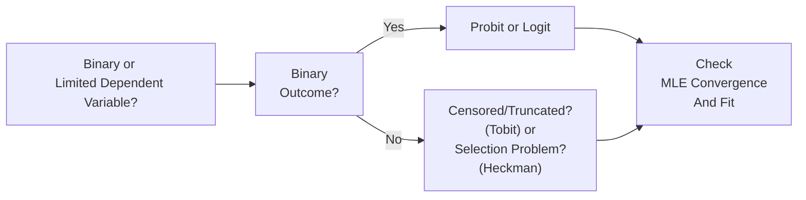

## Motivation for Nonlinear Models

So, we’ve all been there—running a standard Ordinary Least Squares (OLS) regression only to realize that our dependent variable isn’t really suitable for a plain old linear model in some critical way. Maybe it’s binary: takes a value of 0 if a firm does not default and 1 if it does. Or perhaps it’s bounded within [0, 1], such as a proportion of a portfolio allocated to a risky asset. In such situations, the linear assumption can be surprisingly misleading. Let’s say you’re trying to model the probability of a certain investment outcome. If you use OLS, the predicted values can easily be outside the range [0, 1], which is obviously nonsensical for a probability.

That’s where nonlinear models come to the rescue. These models ensure our predictions and inferences align with the data’s shape and constraints. A binary outcome often suggests logistic or probit regression. A continuous variable with a whole bunch of zeros (say, daily returns that any normal day might be zero or negative) might call for a censored or truncated model (Tobit), or a situation with sample selection might demand the Heckman correction.

These approaches are pretty standard in finance. For instance, you might want to:

• Estimate the probability of default (which is 0 or 1).  
• Investigate the probability of a stock paying a dividend or not.  
• Deal with “corner solutions” (e.g., 0 holdings in a certain asset).  

This section explores the most common nonlinear regression methods used in investment analysis, risk modeling, and research vignettes you’ll see at the CFA Level II exam. Understanding why we pick one type of model over another is critical, particularly when you come across item-set questions illustrating how real data might not “fit” the simpler linear form.

## Probit Regression

I remember the first time I encountered a probit model for a class project. I was crossing my fingers that the difference between “probit” and “logit” would be super obvious. Spoiler alert: the difference is subtle. Probit regression uses the cumulative distribution function (CDF) of the standard normal distribution as its link function. Instead of modeling the response directly, probit introduces a latent variable framework:

Let’s suppose there’s an unobservable (latent) variable:

p* = Xβ + ε

where X is your set of predictors, β is the vector of coefficients, and ε ~ Normal(0, 1). We do not observe p*, but we do observe a binary outcome:

p =  
   1  if p* > 0  
   0  if p* ≤ 0  

Hence, the probability that p = 1 is given by:

P(p = 1 | X) = Φ(Xβ),

where Φ(·) is the standard normal CDF. If you mapped out Φ(Xβ) on paper, it’s basically an S-shaped curve between 0 and 1, ensuring probabilities remain valid.

### Estimation by Maximum Likelihood

Under probit, we typically estimate β using Maximum Likelihood Estimation (MLE). The likelihood function is constructed around the probability that each observation is a 1 or a 0, given X. We then choose the β that maximizes this likelihood. In practice, software packages handle the math for us, but you’ll see references to log-likelihood values, z-statistics for coefficients, and standard errors that we interpret in a manner similar to OLS.

### Interpretation

One of the biggest initial challenges is interpreting the coefficients. With OLS, it’s easy: a one-unit increase in X is associated with a β increase in Y. For probit, the coefficient represents how X shifts the z-score threshold in a normal distribution—yikes, that’s not super intuitive off the bat. Typically, we check marginal effects: how a small change in X changes the probability. 

We can express the marginal effect of X_k on P(p=1) as:

∂Φ(Xβ) / ∂X_k = φ(Xβ) × β_k,

where φ(·) is the standard normal PDF. Notice that the marginal effect depends on X (because φ(Xβ) is evaluated at the sample’s Xβ values). Often, you’ll see partial effects reported at the mean of X or at other representative values.

## Logit Regression (Comparison to Probit)

“But wait,” you’re thinking, “I’ve also heard of logistic regression—are they the same?” More or less, yes, in the sense that they both handle a binary dependent variable. The difference? Logit uses the logistic function instead of the normal CDF:

P(y = 1 | X) = 1 / [1 + e^(-Xβ)].

If you take the log of [P / (1 - P)], you get the “log odds,” which is linear in X. In practice, the choice between probit and logit can be a bit subjective: probit is more common in economics (and older finance texts) because it’s historically associated with the idea of underlying normal errors. Logit is more frequent in machine learning and data science contexts. In typical finance vignettes, you may see either. Probit’s results and logit’s results are usually quite similar, save for scaling differences in the coefficients.

## Limited Dependent Variable Models

Sometimes, the dependent variable isn’t just 0 or 1. Maybe it’s a continuous variable that’s often censored (like a measure that piles up at 0). Or there’s a sample selection issue—only certain observations get recorded or included. These are classic “limited dependent variable” situations.

### Tobit Model

Consider you’re analyzing daily sales for an equity research firm, but a large portion of the observations are zero (e.g., no trades reported on certain instruments). A plain OLS might be biased because standard assumptions don’t hold. The Tobit model steps in when the data is censored at some value (often zero). 

The Tobit idea is that there is a latent variable y* = Xβ + ε that we would observe if it exceeded the threshold c (often c = 0). If y* ≤ c, then we observe y = c. The model is useful if you suspect your outcome is more or less linear beyond the threshold but is jammed at that threshold for a non-trivial fraction of the sample.

### Heckman Selection Model

Ever read a finance paper that says “we only have data for companies that issue dividends, so the sample is biased”? That’s a selection bias problem. The Heckman model corrects for sample selection by using two steps:

1) A selection equation: we model the probability of an observation being included in the sample (e.g., whether a firm pays dividends).  
2) An outcome equation: for those included, we model the main variable of interest (e.g., the size of the dividend).  

This approach introduces something called the inverse Mills ratio (IMR), which, in plain terms, corrects the second equation coefficients for the non-random nature of the sample. The end result is a “selection-corrected” predictor, giving you less-biased estimates of the relationship among the variables of interest.

## Marginal Effects and Goodness of Fit

As soon as you start using probit, logit, or the fancier limited dependent variable models, focusing solely on raw coefficients can be perplexing. That’s why marginal effects are typically reported. They answer, “What is the effect on the predicted outcome or probability if we tweak a single independent variable?”

At the same time, you might wonder how to measure the fit of these nonlinear models since you can’t just rely on R-squared the way we do with OLS. You have:

• Likelihood Ratio (LR) test: Compares the log-likelihood of the full model versus a restricted model.  
• Pseudo-R²: Not the same as the OLS R-squared, but helps measure improvement over a null model. Common ones are McFadden’s, Cox & Snell, and Nagelkerke.  
• Classification-based metrics: If you’re dealing with a binary outcome, confusion matrices, accuracy, precision, recall, and F1 scores can be quite relevant.

For the CFA exam, you might see references to “pseudo-R²” or the significance of the LR test. They want to see if you understand how to gauge model usefulness in a setting where the predicted variable sits in [0, 1].

## Implementation Concerns

Working with maximum likelihood is usually painless if your software converges. Sometimes, though, MLE can be finicky—especially with small sample sizes or poorly specified functional forms. Watch out for:

• Convergence Failures: If your data doesn’t supply enough variation, the iterative solver can fail.  
• Separation Issues: If X can perfectly separate 0 and 1 outcomes, the model might blow up (infinite coefficient estimates).  
• Multicollinearity: Just like in OLS, correlated predictors can create large standard errors.  

Validation or calibration tests (like the Hosmer-Lemeshow test) can help you see whether the predicted probabilities track the observed data well. In finance terms, you could see that it fails to capture the probability of default in different subgroups (e.g., high-yield vs. investment-grade) if the model is poorly specified.

## Interpreting Output in Vignettes

Now, imagine an exam vignette that shows a partial output from a probit model predicting whether a bond defaults. You’ll see something like:

• Coefficients (beta estimates).  
• Standard errors or z-stats.  
• Possibly a pseudo-R² or classification table.  
• A mention of the significance of each predictor.  

They might ask (1) how to interpret a certain coefficient, (2) the effect of a one-unit change in interest rate spread on the probability of default, or (3) how the model’s “fit” is evaluated. The correct approach is to highlight that each coefficient influences the latent propensity and that we typically convert that effect into marginal probability changes.

If the question is about making a “go/no-go” investment call based on the predicted probability, the classification-based approach might come up: “At a threshold of 0.5, would you classify this outcome as default or non-default?” Always look for the detail in the question stem. They might set a threshold of 0.2 or 0.7, depending on risk tolerance. That’s all fair game in a Level II item set.

## When to Choose Nonlinear Models

One helpful way to think about these models is as a flowchart:

In finance contexts:

• Use probit/logit if your dependent variable is binary, like forecasting a corporate bond’s default event.  
• Use Tobit if the dependent variable is censored, e.g., a portion of your sample is at a boundary (like 0).  
• Use Heckman if you only observe certain data points due to selection issues.

## Practical Example: Modeling Probability of Equity Issuance

Let’s do a quick scenario:

Imagine we want to predict whether a firm will issue new equity in the upcoming quarter (Issue = 1 if yes, 0 if no). We collect data on:

• The firm’s current leverage ratio (LEVERAGE).  
• Expected GDP growth (GDPGROWTH).  
• The firm’s stock return performance relative to market (RELRETURN).  

A probit model might look like:

Issue_i = 1 if Issue_i* = β₀ + β₁ LEVERAGE_i + β₂ GDPGROWTH_i + β₃ RELRETURN_i + ε_i > 0,  
         0 otherwise.

We run MLE and obtain estimates. Possibly:

β₀ = -1.20, β₁ = 0.50, β₂ = 0.80, β₃ = -0.10.

If LEVERAGE increases by 1—other variables held constant—we see a positive shift in the latent variable. Because β₁ = 0.50 > 0, that suggests the probability of issuing equity goes up (maybe the firm feels levered enough that it needs more equity). However, to find the exact probability change, we’d compute:

ΔP = φ(Xβ) × 0.50

evaluated at a specific point Xβ. If Xβ is around 0, φ(0) = 0.3989, so the marginal effect might be 0.3989 × 0.50 = 0.1994. That’s about a 19.94 percentage-point increase in the probability, though the exact number depends on the actual Xβ for that observation.

## Glossary

• Probit Model: A binary outcome model using the standard normal CDF as the link function.  
• Logit Model: A binary outcome model based on the logistic function, where the log-odds are linear in predictors.  
• Latent Variable: An unobserved variable underlying observed outcomes, e.g., propensity to default.  
• Marginal Probability Effect: The partial derivative of the probability function with respect to a predictor.  
• Tobit Model: A model addressing censored outcomes, often at zero.  
• Heckman Correction: A two-step procedure to address sample selection bias, incorporating the inverse Mills ratio.  
• Maximum Likelihood Estimation (MLE): A common estimation method maximizing the likelihood function of the data.  
• Pseudo-R²: A measure of fit for categorical or limited dependent variables, not directly comparable to OLS R².

## Best Practices and Exam Tips

• Double-check whether an OLS approach is valid. If data is binary, bounded, or censored, you probably want a nonlinear model.  
• Be ready to interpret partial effects or marginal effects in exam item sets. A direct coefficient interpretation can be misleading.  
• Understand that “pseudo-R²” is not the same as R². Don’t be alarmed if it’s smaller than what you’d see in typical OLS regressions.  
• Probit vs. logit is often a matter of convenience. Unless the exam specifically focuses on the difference in link functions, results are usually similar in practice.  
• For the Tobit and Heckman models, watch out for vignettes pointing out systematic data issues—like many zero values or a sample that’s clearly self-selected.  

## References and Further Reading

• Long, J.S. “Regression Models for Categorical and Limited Dependent Variables.” Sage Publications.  
• Greene, W.H. “Econometric Analysis.” Pearson.  
• Maddala, G.S. “Limited-Dependent and Qualitative Variables in Econometrics.” Cambridge University Press.  
• CFA Institute Level II Curriculum, Nonlinear Regression Topics.  

## Mastering Nonlinear Regression: 10 Practice Questions



### In a probit model, what function serves as the link between the linear predictors and the binary outcome?

- [ ] Logistic (sigmoid) function
- [x] Standard normal cumulative distribution function
- [ ] Standard normal probability density function
- [ ] Exponential function

> **Explanation:** Probit regression uses the standard normal CDF (Φ) as the link function relating the latent variable Xβ to the probability P(y=1).

### Which of the following statements best describes the difference between probit and logit models?

- [ ] Logit models produce probabilities that can exceed 1 under certain conditions.
- [x] Probit uses the standard normal CDF, whereas logit uses the logistic function to map linear predictors to probabilities.
- [ ] Probit is used for continuous outcomes, while logit is used for binary outcomes.
- [ ] Probit can only be estimated with a two-step approach, while logit cannot.

> **Explanation:** Probit and logit models are very similar in intent, but they use different link functions: the normal CDF for probit and the logistic function for logit. Both handle binary outcomes.

### Why is interpreting the raw coefficients in a probit or logit model potentially misleading?

- [ ] Because they are meaningless in all scenarios.
- [x] Because the coefficients reflect impacts on a latent index, not a direct change in probability.
- [ ] Because the coefficients are random variables.
- [ ] Because OLS assumptions are violated.

> **Explanation:** A probit or logit coefficient shift is on the latent scale (z-scores or log-odds). The marginal effect on probability depends on the level of Xβ.

### An analyst notices that an OLS regression yields predicted default probabilities outside the 0–1 range. Which type of model would typically cure this issue?

- [ ] Linear AR(1) model
- [ ] Polynomial regression
- [ ] Fixed-effects panel model
- [x] A binary response model like logit or probit

> **Explanation:** Binary response models ensure predictions stay within [0,1], which is vital for probabilities.

### In the Tobit model, what type of issue is primarily being addressed?

- [ ] Serial correlation in residuals
- [ ] Multicollinearity among regressors
- [x] Censoring, where a fraction of observations lie at a boundary
- [ ] Perfect collinearity between intercept and slope

> **Explanation:** The Tobit model addresses data censoring (often at zero). It accounts for the fact that the dependent variable is “stuck” at a boundary for a substantial share of observations.

### A researcher tries to model the dividend yield for firms, but only gathers data for firms that actually pay dividends. Which approach corrects the potential selection bias?

- [ ] GMM Estimation
- [ ] ARCH Model
- [ ] VAR Model
- [x] Heckman Selection Model

> **Explanation:** The Heckman two-step procedure corrects for sample selection bias by modeling the probability of being included in the sample first, then adjusting the main equation.

### If the log-likelihood of a restricted model is –120 and the log-likelihood of the unrestricted model is –100, which statement is accurate regarding the likelihood ratio test?

- [ ] The difference in log-likelihood is –20, so the restricted model fits better.
- [x] The difference in log-likelihood is 20, indicating the unrestricted model likely fits better.
- [ ] The difference in log-likelihood is 120, suggesting the restricted model is worthless.
- [ ] The difference in log-likelihood is 100, so the restricted model fits worse.

> **Explanation:** The LR statistic is 2×(–100 – (–120)) = 40, indicating the unrestricted model fits substantially better at typical significance levels.

### For a binary outcome model, which of the following metrics is commonly used to evaluate model classification performance?

- [ ] Adjusted R²
- [x] Confusion matrix
- [ ] Durbin-Watson statistic
- [ ] Variance inflation factor (VIF)

> **Explanation:** A confusion matrix (showing true positives, false positives, etc.) is a standard classification performance tool for binary outcome models.

### Marginal effects in a probit model are computed using the derivative of Φ(Xβ) with respect to X, multiplied by the relevant coefficient. Which function does Φ'(Xβ) correspond to?

- [ ] Exponential distribution
- [ ] Logistic function
- [x] The standard normal PDF
- [ ] The reciprocal of the standard normal PDF

> **Explanation:** The derivative of the standard normal CDF Φ is φ, the standard normal PDF.

### True or False: A logit model’s coefficients may sometimes be interpreted directly as changes in the probability for a one-unit change in X.

- [ ] True
- [x] False

> **Explanation:** In a logit model, the coefficients represent changes in the log-odds, not direct probabilities. To interpret in probability terms, you use marginal effects.


