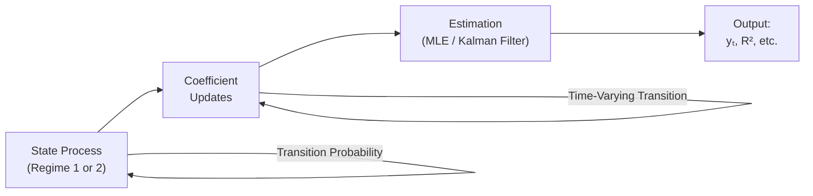

## Introduction and Motivation

Ever look at a regression model and wonder, “Uh, is this relationship really the same in 2020 as it was back in 2005?” This question, believe it or not, is at the heart of many real-world financial analyses. Traditional linear regressions assume that the underlying relationship between predictors (e.g., interest rates, market returns) and the dependent variable (e.g., asset prices, credit spreads) stays constant over the entire sample period. But we all know markets can be chaotic, shaped by policy changes, investor sentiment, or, well, global crises. The solution? Time‑varying coefficients and regime‑switching regressions.

In this section, we’ll explore these advanced methods that capture changes in underlying model parameters. These approaches are particularly relevant in dynamic markets, where credit risk might respond differently to interest rate shifts during recessions vs. expansions, or where stock returns show different patterns under “bull” or “bear” regimes. We’ll also highlight some personal experiences and anecdotes along the way—let’s just say, I’ve run into my fair share of odd market shifts that made me pause and wonder if a single regression line was telling the whole story.

## Why Traditional Models Sometimes Fall Short

Classical multiple regression (see Chapter 2 and Chapter 3 for a thorough refresher) gives us a single coefficient vector β, estimated from data assumed to be drawn from one stable relationship. In real markets, though, the effect of a factor like interest rates on stock returns might be small in stable times but balloon during crises—or perhaps vanish completely when central bank policies shift. Using one constant coefficient across the entire time horizon can either:

• Overestimate or underestimate coefficients during certain periods.  
• Lead to large forecasting errors, especially around turning points.  
• Fail to capture structural breaks—like a sudden policy change.  

This mismatch between real-world changes and model assumptions can mislead both investors and risk managers, leading to unwelcome surprises.

## Time‑Varying Parameter Models

Time‑varying parameter (TVP) models allow regression coefficients to evolve over time. Instead of treating β as a single fixed parameter set, we treat it as a sequence of parameters (βₜ) that may gently or abruptly shift as new data arrives. Let’s break down the concept and see why it can be so helpful in finance.

### Conceptual Overview

Imagine you suspect the sensitivity of a bond’s yield spread to short-term rates changes slightly every quarter. If you wanted to capture that, you could “let your model breathe” by introducing a dynamic process for the coefficients. Formally, in a time‑varying parameter model, the states include the regression coefficients, and they follow a specified transition equation. A typical linear state-space representation can look like:

(1)  yₜ = Xₜ βₜ + εₜ,  
(2)  βₜ = βₜ₋₁ + νₜ,

where:  
• yₜ is the dependent variable at time t (e.g., yield spread).  
• Xₜ is a row vector of explanatory variables at time t (e.g., short-term rates, economic indicators).  
• βₜ is the time‑varying coefficient vector.  
• εₜ and νₜ are error terms, often assumed to be Gaussian white noise processes.

Equation (1) is the observation equation, describing how yₜ depends on the unobserved state βₜ. Equation (2) is the state equation, specifying how βₜ evolves with time (e.g., random walk, local level model, or more structured dynamics).

### Kalman Filter in a Nutshell

To estimate βₜ in real time, we often use the Kalman filter—a recursive algorithm that processes the data sequentially, updating our belief about βₜ as new observations come in. The basic steps:

• Prediction: Given β̂ₜ₋₁ (the estimate at time t−1), predict β̂ₜ using the state equation.  
• Update: Once we observe yₜ, incorporate the new information to refine β̂ₜ.  

A bit like adjusting your seat as the train speeds up or slows down—you keep recalibrating your posture based on real-time “feedback.” In practice, you might use specialized software or statistical languages like R, Python, or MATLAB to implement the Kalman filter. Python’s “statsmodels” or “pydlm” libraries, for instance, provide built-in routines to handle state-space modeling.

### A Quick Anecdote

I once worked with a fixed income analyst who insisted that the effect of inflation on short-term corporate bond yields was minimal—and it was, during stable times. However, around the onset of a crisis, there was a big shift in how the market priced inflation risk into corporate yields. A time‑varying parameter model pinpointed the dynamic spike in sensitivity, which a static regression would have simply averaged away.

### Advantages and Disadvantages

Time‑varying parameter models can:

• Provide more accurate estimates if relationships truly shift gradually.  
• Capture slow structural changes or policy drifts that standard regressions miss.

But as you might guess, these models are more complex to estimate, require careful specification of how parameters evolve, and can be prone to overfitting if not properly regularized or validated with out-of-sample data.

## Regime‑Switching Regressions

Now, let’s talk about the more dramatic cousin of the time‑varying approach: regime‑switching models. Here, we assume that data is generated by different “states” or “regimes,” each with its own parameter set. The model can switch from one regime to another based on certain probabilities.

### Multiple Regimes in Finance

Your portfolio returns could behave very differently when the economy is in expansion vs. in a recession. Or consider emerging market equities: they might have “tranquil” vs. “turbulent” regimes. Regime‑switching models capture these abrupt transitions by allowing the coefficients—and potentially even the variance of shocks—to differ across states.

### Markov Switching

A popular flavor of regime‑switching is Markov switching (see also Chapter 11 for advanced time-series frameworks). In a Markov switching model, the probability of moving to a new regime depends on a transition matrix. If we have two regimes, the transition matrix might be:

P = 
[ p₁₁   p₁₂ ]
[ p₂₁   p₂₂ ],

where pᵢⱼ is the probability of moving from regime i to regime j. For instance:

• p₁₁ = Probability that we remain in regime 1 (e.g., “bull market”).  
• p₁₂ = Probability that we switch from regime 1 to regime 2 (e.g., “bear market”).  
• p₂₁ = Probability that we switch from regime 2 to regime 1.  
• p₂₂ = Probability that we remain in regime 2.

Below is a simple diagram illustrating the two-regime Markov switching process:

In each regime, you can have different parameters. A two-regime process might look like:

yₜ =  
• α₁ + β₁ Xₜ + εₜ   if (sₜ = 1),  
• α₂ + β₂ Xₜ + εₜ   if (sₜ = 2),

where sₜ is the state indicator for period t.

### Structural Breaks vs. Markov Switching

Sometimes, the researcher suspects a one-time break or a small number of breaks—like a policy shift in 2012 or a big structural change after the 2008 Global Financial Crisis. In that scenario, you might rely on a Chow test or a piecewise regression approach. But if breaks (or regime shifts) occur multiple times with no obviously known dates, Markov switching can systematically handle the probability of switching at each time step.

### Use Cases

• Equity Market Volatility: You might see low-volatility and high-volatility regimes, each with a distinct coefficient for an explanatory variable like the VIX (fear index).  
• Business Cycle Analysis: Distinguish expansions (higher consumption, stable returns) vs. recessions (lower consumption, more credit risk).  
• Commodity Price Modeling: Booms vs. busts in oil markets, each demanding different slope coefficients for global growth or supply constraints.

## Identification of Breakpoints

All these fancy frameworks hinge on properly identifying when or how the model changes. Some breaks are common knowledge—like a major policy change or the collapse of a currency peg. For these, you can literally chunk your data at that date and run separate regressions. When it’s not so obvious, you might do:

• Statistical tests (Chow test) to see if a known date is a structural break.  
• Rolling window regressions to see if coefficients “slide around.”  
• Maximum likelihood methods (Markov switching) or model comparison criteria (AIC, BIC) to see how many regimes fit best.

## Estimation Techniques

Time‑varying and regime‑switching models typically require specialized estimation methods:

1. **Maximum Likelihood Estimation (MLE):** Regime‑switching models often rely on MLE with the Expectation-Maximization (EM) algorithm or direct numeric optimization.  
2. **Bayesian Methods:** Posterior estimation with Markov chain Monte Carlo (MCMC) can be especially useful for time‑varying or regime‑switching parameters, though it’s computationally more demanding.  
3. **Kalman Filter for TVP:** As mentioned, the Kalman filter is almost the “gold standard” for recursively updating your beliefs about state-space processes.  
4. **Software:** R packages like “MSwM” (for Markov switching) or “dlm” (for state-space), as well as Python’s “statsmodels,” or specialized toolboxes in MATLAB or EViews. The choice depends on data complexity and personal comfort.

## Model Diagnostics and Validation

### Filtered and Smoothed Probabilities (Regime‑Switching)

A neat aspect of Markov switching models is you can track the probability of being in a certain regime at each point in time. Two common diagnostic measures:

• **Filtered probabilities:** Probability of being in regime i at time t, given all information up to time t.  
• **Smoothed probabilities:** Probability of being in regime i at time t, using the entire sample (both past and future observations).

By plotting these probabilities, you can visually inspect how frequently the model believes your data was in one state vs. another. Financial analysts often overlay these probabilities on real business cycle dates to see if the model’s “recession signals” align with official expansions/recessions.

### In-Sample vs. Out-of-Sample Performance

No model is perfect. We want to see how well these advanced models do beyond mere in-sample fit:

• **Backtesting:** If you’re forecasting credit spreads through a regime switching model, you might compare predicted spreads vs. actual spreads over historical hold-out segments.  
• **Prediction Intervals:** A time‑varying parameter model can generate time‑dependent intervals. Analysts often compare these intervals with realized values to gauge coverage accuracy.

### Parameter Stability

Sometimes the “time‑varying” aspect might be barely noticeable (i.e., coefficients barely fluctuate). In that case, a simpler constant-coefficient model might suffice. Or, you may discover that the coefficient changes drastically at a single point in time—suggesting a structural break approach. The gist: confirm that the more complex model is worth the additional complexity, especially for exam-level or real-time applications.

## Practical Applications in Exam Vignettes

On the CFA® Level II exam, you might face an item set describing different economic conditions across a sample period. They could mention “during the technology stock bubble of the early 2000s” and “during the subsequent recession,” for instance. Key clues that a single linear model is inadequate:

• Language referencing “two distinct phases” or “shifts” in economic policy.  
• Abrupt changes in volatility or policy environment.  
• Evidence that residuals of a standard regression become large or systematically biased after a certain date.

When you see these hints, think: “Huh, maybe a regime-switching or time‑varying parameter approach is warranted here.” The question might then ask how you would identify the break, how to interpret filtered probabilities, or how you might apply a time‑varying coefficient approach to capture the changes.

## Common Pitfalls

• **Mistaking Noise for Signal:** Short-term fluctuations might look like a regime change if you have limited data.  
• **Overfitting:** More regimes or too many flexible parameters can lead to a perfect historical fit but poor future forecasts.  
• **Ignoring Macroeconomic Fundamentals:** Even the best regime model fails if the underlying economic logic isn’t sound.  
• **Poor or Inadequate Diagnostics:** Failing to plot or interpret filtered vs. smoothed probabilities can hide where the model is missing the mark.

## Best Practices and Strategies

• **Start Simple:** Before jumping to a complex Markov switching or a fully dynamic time‑varying model, check if a simple break or two suffice.  
• **Use Multiple Evaluation Criteria:** Check both in-sample fit (likelihood-based metrics) and out-of-sample performance (forecast errors, rolling windows).  
• **Leverage Economic Theory:** If your data is about expansions vs. recessions, specify your regimes around recognized business cycle indicators.  
• **Cross-Reference with Residual Analysis:** Always keep an eye on the residual plots (see Chapter 2.5 and Chapter 4). Sometimes big structural changes show up as lumps or trends in the residuals.

## Diagram: Putting It All Together

Below is a simplified conceptual diagram of how you might structure a Markov switching regression with time‑varying coefficients. This hypothetical scenario combines both elements—though in practice, you’d likely choose one or the other or carefully structure them if used jointly.

• “State Process (Regime 1 or 2)” is the Markov chain.  
• “Coefficient Updates” indicates that each regime has potentially different parameters, which may also evolve.  
• “Estimation” block suggests you can unify these or do them separately, depending on your approach.

## Additional Exam Tips

• **Stay Alert for Structural Shift Keywords:** If the vignette mentions a major event (like “the central bank suddenly changed its interest rate policy in 2019”), you might suspect a break.  
• **Review the Concept of “Mean Reversion”**: For time‑varying parameter models, see if the data suggests that parameters revert to some long-term mean or drift stochastically.  
• **Practice Interpreting Probabilities**: For regime-switching, be comfortable discussing what a 75% filtered probability of “Regime 1” means for that time period.  
• **Link to Risk Management**: Many Level II problems revolve around how these advanced regressions inform decision-making—like adjusting portfolio exposure to different factors under different regimes.

## References

- Hamilton, J.D. “Time Series Analysis.” Princeton University Press.  
- Kim, C., & Nelson, C.R. “State-Space Models with Regime Switching: Classical and Gibbs-Sampling Approaches with Applications.” The MIT Press.  
- CFA Institute Level II Curriculum, especially advanced time-series sections.  
- Durbin, J., & Koopman, S.J. “Time Series Analysis by State Space Methods.” Oxford University Press.  
- Tsay, R.S. “Analysis of Financial Time Series.” Wiley.  

## 10 Sample Exam Questions: Time‑Varying Coefficients and Regime‑Switching Regressions



### Which statement best describes the core assumption behind time‑varying parameter (TVP) models?

- [ ] TVP models assume coefficients remain constant over the sample period.
- [x] TVP models allow regression coefficients to change over time based on a defined state‑space framework.
- [ ] TVP models are identical to ordinary least squares but use a longer sample.
- [ ] TVP models require a single structural break date, known in advance.

> **Explanation:** TVP models permit coefficients to evolve each period, typically using a state‑space form. This is distinct from a constant‑coefficient OLS setup or a single structural break model.

### In a Markov switching model with two states, which transition probability represents the likelihood that the process remains in State 1 from one period to the next?

- [ ] p₁₂
- [x] p₁₁
- [ ] p₂₁
- [ ] 1 − p₂₂

> **Explanation:** p₁₁ denotes the probability of staying in Regime/State 1. The matrix’s diagonal terms (p₁₁, p₂₂) reflect staying in the same state, and the off‑diagonal terms (p₁₂, p₂₁) reflect switching.

### Suppose you have a model for equity returns where each regime exhibits different volatility. Which diagnostic would best help you confirm that two distinct regimes are present?

- [ ] Autocorrelation function of the squared residuals.
- [x] Filtered and smoothed regime probabilities over time.
- [ ] Box-Jenkins approach for ARIMA models.
- [ ] Simple cross‑sectional data plots.

> **Explanation:** Filtered and smoothed probabilities from a Markov switching model allow you to see if the model identifies two separate regimes, each with its own volatility level.

### An analyst is examining monthly data on corporate spreads and notices a persistent upward trend in residuals starting in 2019. Which approach could she use to confirm a structural break in 2019?

- [ ] Use a VIX measure as an additional regressor.
- [ ] Update the sampling frequency to weekly.
- [x] Perform a Chow test at the suspected break date.
- [ ] Re-run an OLS regression without a constant term.

> **Explanation:** The Chow test is a common method to examine whether a structural break takes place at a known date. If the test indicates a significant difference, it confirms a break.

### Time‑varying parameter regression is particularly useful for which of these scenarios?

- [x] Gradual shifts in economic relationships that do not correspond to abrupt breaks.
- [ ] One-time, sharply defined policy changes.
- [x] Slowly evolving coefficient patterns reflected in ongoing market transitions.
- [ ] Stationary data with no sign of breaks or shifts.

> **Explanation:** Time‑varying models capture continuously evolving relationships. They’re less about single, abrupt breaks and more about drifting parameters over time.

### In a two‑regime Markov switching model, p₁₂ = 0.10 describes what scenario?

- [x] There is a 10% chance of transitioning from Regime 1 to Regime 2 in the next period.
- [ ] Regime 1 is likely to last 10 periods before switching.
- [ ] Regime 2 is 10% more volatile than Regime 1.
- [ ] Regime 1 is selected in 10% of the total sample observations.

> **Explanation:** p₁₂ denotes the transition probability from Regime 1 to Regime 2. A value of 0.10 means there is a 10% chance of switching from Regime 1 to Regime 2 from one period to the next.

### Which of the following is a major disadvantage of time‑varying parameter models?

- [ ] They cannot track subtle shifts in parameters.
- [x] They often require more complex estimation methods like the Kalman filter.
- [ ] They provide no probabilistic measure for structural breakpoints.
- [ ] They cannot be applied to financial data, only macroeconomic data.

> **Explanation:** A key challenge with time‑varying models is their computational complexity. Tools like the Kalman filter are necessary, which can be more involved than standard OLS.

### Which statement about regime‑switching models is correct?

- [ ] They assume all regimes occur with equal frequency.
- [x] Each regime has its own set of parameters and variance, and the model can shift between regimes based on transition probabilities.
- [ ] They are specifically designed for stationarity testing only.
- [ ] They require an exact known date for each regime shift.

> **Explanation:** Regime‑switching allows multiple sets of parameters that can switch according to specified transition probabilities, often capturing different levels of variance or slopes across regimes.

### A regression model might show constant coefficients in a normal analysis, but further investigation reveals distinct volatility patterns before and after a crisis period. Which approach is best if you suspect there are exactly two such periods?

- [ ] Time‑varying coefficient model with Kalman filter.
- [x] Piecewise (two segments) or Markov switching model that accounts for the known break.
- [ ] Increase the frequency of data from monthly to daily.
- [ ] Use standard OLS without modifications.

> **Explanation:** If you strongly suspect exactly two periods, you can implement a piecewise regression or a two‑regime (Markov switching) model that captures the structural break.

### True or False: The Kalman filter only updates parameter estimates after the entire sample is observed.

- [x] True
- [ ] False

> **Explanation:** Actually, this is a bit of a trick question. The typical Kalman filter operates in “real time,” updating estimates recursively as each new data point comes in. However, to refine not just current but also past states, you’d run a “Kalman smoother” which uses the entire sample. Without smoothing, the Kalman filter by itself primarily focuses on filtering forward in time.


