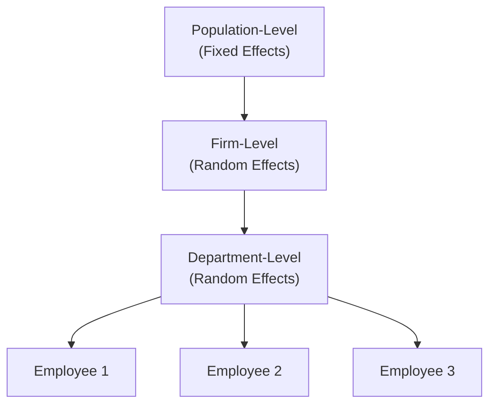

## Introduction

So, picture this: you’re analyzing various companies spread across multiple sectors, maybe even across different countries. You suspect that individual firms have unique characteristics—like different management approaches or capital structures—but they might also share something in common at the sector or country level. Then, on top of that, you notice that over time, these firms behave differently in response to market fluctuations. That’s a lot to unpack, right?

Well, mixed models (often called multilevel or hierarchical models) are custom-built for precisely this challenge. Mixed models let us capture these layers of variation in a neat and structured way. They incorporate both fixed effects (things we believe are constant for all groups, albeit with different intercepts or slopes) and random effects (group-specific fluctuations that we assume come from a larger distribution). In finance and economics, these models help us see both the overall market trends (fixed effects) and each individual firm or region’s twist on those trends (random effects).

In this section, we’ll highlight how mixed models can be a game-changer when we’re working on panel data or any scenario involving nested (hierarchical) structures. We’ll also chat about software options, essential assumptions, interpretation tips, and potential pitfalls.

## When to Use Mixed Models in Financial Settings

Sometimes I get asked, “Why do we even bother with hierarchical models? What’s wrong with a standard linear or multiple regression?” The short answer is: nested data. If your data points come from units within groups (like employees in a firm, or firms within sectors, or daily observations within a single firm), you risk violating model assumptions with a single-level regression. Regular regression might ignore the correlation within groups and treat each observation as independent, which can yield misleading standard errors and spurious results.

Mixed models do the following:  
• Recognize that observations from the same group/country/firm might be more similar to each other than to observations from different groups.  
• “Borrow strength” from the entire dataset so that groups with fewer data points can still glean information from other groups, balancing out the extremes (sometimes referred to as partial pooling).  
• Let you model random intercepts and/or slopes to capture how different each group is from the “average” or overall effect.

## The Foundation of Mixed Models

A basic mixed model for repeated observations of a dependent variable y for entity i at time t might look like:


y_{it} = \beta_0 + \beta_1 x_{it} + u_i + e_{it},


where  
• \\(\beta_0\\) is the overall (fixed) intercept,  
• \\(\beta_1\\) is the overall slope for some predictor \\(x_{it}\\),  
• \\(u_i\\) is the random effect for entity \\(i\\) (random intercept), often assumed \\(u_i \sim N(0, \sigma_{u}^2)\\), and  
• \\(e_{it}\\) is the usual residual error term, \\(e_{it} \sim N(0, \sigma_{e}^2)\\).

Under a random intercept model, each entity \\(i\\) has its own baseline level, \\(\beta_0 + u_i\\). If we also let the slopes vary, we get a random slope model:


y_{it} = (\beta_0 + u_{0i}) + (\beta_1 + u_{1i}) \, x_{it} + e_{it},


where \\(u_{0i}\\) captures how the intercept differs for entity \\(i\\), and \\(u_{1i}\\) captures how the slope differs for entity \\(i\\).

### Fixed Effects vs. Random Effects

In these models, “fixed effects” refer to parameters we’re directly estimating for the entire population or specific observed groups. “Random effects” represent those group-specific parameters (like intercepts or slopes) drawn from some distribution.

• Fixed effects: If you want to treat each group (say, each sector) as a unique category and estimate a coefficient for that category, that’s a fixed effect.  
• Random effects: If the groups are numerous (say, 500 different banks) and we believe they’re a random sample from a larger population of banks, we typically use random effects, enabling partial pooling.

Mixed models “mix” both. For instance, you might be certain that a macroeconomic slope (like the effect of GDP growth on firm returns) is relatively consistent across all firms (fixed), but you allow each firm its own personal portion of that slope (random), adjusting how strongly each firm’s returns respond to GDP.

## Hierarchical Structures

Hierarchical or multilevel models step it up a notch by letting you nest multiple layers. So, if we have employees nested in departments, nested in firms, nested in countries—yikes, that’s quite a chain of dependencies. But such is the complexity of real data. Let’s try a very quick diagram illustrating how hierarchical nesting might look:

Here, employees (D1, D2, D3) are within departments, which are themselves within firms. A hierarchical model might allow random intercepts and slopes at the firm level and additional random intercepts (or slopes) at the department level. The entire system also has population-level fixed effects.

In finance, you might see something like analysts nested in credit-rating agencies nested in countries, each level introducing different random effects. Or you could have daily observations for multiple stocks, each belonging to different sectors, which in turn are grouped by region.

## Benefits for Investment and Economics Data

Mixed models really shine for systematic exploration of cross-sectional and time-series data (commonly known as panel data). Here’s why:

• They handle repeated measures on the same entity without ignoring correlated errors.  
• They naturally connect distinct cross-sectional units, allowing for group-level effects that can vary from the overall mean yet remain informed by the entire dataset.  
• When the number of groups is large and each group has relatively few data points, a purely fixed-effects model can be unwieldy: you’d get a unique coefficient for each group. Mixed models sidestep that by letting you estimate the distribution of group-level effects.

This approach is hugely beneficial if you’re analyzing, say, daily returns from 200 stocks over a year, but each stock only has partial data for some days. In a purely fixed-effects approach, you’d have an intercept for each stock. But if you suspect these intercepts come from a larger “stock-level distribution,” and you want to see how they vary systematically, random effects might be your friend.

## Estimation and Software

Mixed models can be estimated using maximum likelihood (MLE) or restricted maximum likelihood (REML). REML provides unbiased estimates of variance components—particularly relevant when you’re dealing with random effects that partition the variance across different hierarchical levels.

Popular software tools include:  
• R packages “lme4” and “nlme.”  
• Python’s “statsmodels” (mixed_lm) and “PyMC” for Bayesian approaches.  
• Stata’s “mixed” command or SAS’s “PROC MIXED.”  

Working with these can be trickier than standard regression because you have to specify the correct nesting structure and random effects. The payoff is that you get more nuanced insight into how your data behaves at multiple levels.

## Checking Assumptions

As with all models, mixed models carry their own set of assumptions:

• Normal Distribution of Random Effects: We usually assume each random effect is drawn from a normal distribution with a mean of zero.  
• Independence Within Group Levels: Observations are correlated within the same group, but the group-level effects are independent from each other.  
• Homoscedasticity and No Severe Outliers: Standard assumptions about error terms still apply.  
• Sufficient Group Size: If too few observations exist per group, random effects might be poorly estimated.

Always look at residual plots. If the random effects distribution is far from normal (e.g., heavily skewed or has huge outliers), you might consider transformations or alternative modeling strategies.

## Model Interpretation & Intraclass Correlation Coefficient (ICC)

One of the more interesting stats in a mixed model is the Intraclass Correlation Coefficient (ICC). The ICC tells you how much variability in the outcome arises from differences between groups versus differences within groups.


\text{ICC} = \frac{\sigma_u^2}{\sigma_u^2 + \sigma_e^2},


where \\(\sigma_u^2\\) is the variance of the random intercept across groups, and \\(\sigma_e^2\\) is the residual variance at the observation level. If the ICC is high, points within the same group look more alike. If the ICC is near zero, differences between groups are negligible, and a simple single-level model might suffice.

Interpretation of parameters in a mixed model can be tricky:

• Fixed effects are “population-average” estimates—like an overall slope for how an increase in market volatility might affect returns across all firms.  
• Random effects give you specific intercepts or slopes for each firm, but they’re all drawn from the same distribution. This means you can see, for each firm, how far they deviate from the average.

## Practical Implementation Tips

• Consider partial pooling: If you have plenty of data within each group, random effects will more closely mirror standard fixed-effects estimates. If your groups are small, random effects shrink the group estimates toward the overall mean, helping avoid overfitting.  
• Test model fit: Compare models with and without random slopes or additional nested levels using information criteria like AIC, BIC, or likelihood ratio tests.  
• Watch for unbalanced data: Mixed models handle unbalanced data, but always check whether certain groups are drastically underrepresented. This can inflate uncertainty in those random effect estimates.

## Spotting Mixed Model Needs in Vignettes

On the CFA exam, item sets (vignettes) might hint at a nested structure. Maybe the prompt discusses multiple firms in different industries or repeated time-series measurements. If the question emphasizes that data is nested, or if it references correlation among observations from the same group, or if it explicitly mentions partial pooling across segments—those are classic signals that a mixed (multilevel) model is in play.

They might show you group-level intercepts and ask how to interpret them or present an “intraclass correlation coefficient” table to highlight within-group vs. between-group variance. The question could ask for the best approach to modeling or the best interpretation of results.

## Common Pitfalls & Best Practices

• Failing to account for correlation in the data: For instance, ignoring that repeated observations from the same firm are correlated. Results can be invalid if you treat them as independent.  
• Missing random slopes: Sometimes, only random intercepts are considered when slopes also vary by group. This can lead to oversimplified conclusions.  
• Overcomplicating the model: You can have a random effect for everything except your cat’s preference in cat food, but it might be overkill. Balance complexity with parsimony.  
• Overlooking model diagnostics: Residual checks, evaluating how random effects distribute across groups, and checking whether the covariance structures are correct can reveal big issues.

## Conclusion & Exam Tips

Mixed models aren’t just an academic curiosity. They’re super handy for real finance and econ data, especially with the complex nested structures we see in cross-country or multi-firm analyses. If you suspect that you’re missing out on big patterns lurking beneath your data because of grouping or repeated measures, that’s a signal to consider a hierarchical approach.

When it comes to the exam, watch for references to repeated measures, partial pooling, or intraclass correlation. Don’t be too casual—these conditions often trip up candidates who default to a single fixed-effects or naive OLS approach. Practice reading the question carefully, especially when they highlight variance components or mention group-level intercepts. Know how to interpret random intercepts, random slopes, and the ICC. Also, be ready to articulate why a hierarchical method might outperform a simple regression. It’s a classic exam scenario: “Which method is best, and why?”

Finally, keep an eye on assumptions like normally distributed random effects and confirm that the data is structured to support that. If the question hands you a residual plot with suspicious patterns or extremely skewed distributions, you might need transformations or a more robust variant.

Use your time wisely, dissect the question’s details, and explain each step of your reasoning—just as you would in your practice exercises.

## Glossary

• Mixed Model: A model containing both fixed and random effects, particularly suited for nested or hierarchical data.  
• Random Intercept: Group-specific offsets in the intercept term.  
• Random Slope: Group-specific differences in slope coefficients.  
• Partial Pooling: The shrinkage of group estimates toward the overall average, especially when group-level data is sparse.  
• Intraclass Correlation Coefficient (ICC): Proportion of total variance explained by group-level differences.  
• Panel Data: Multi-period data for multiple cross-sectional entities.  
• REML (Restricted Maximum Likelihood): An approach that provides unbiased estimates of variance components in mixed models.

## References and Further Reading

- Gelman, A., & Hill, J. (2007). Data Analysis Using Regression and Multilevel/Hierarchical Models. Cambridge University Press.  
- Snijders, T.A.B., & Bosker, R.J. (2012). Multilevel Analysis: An Introduction to Basic and Advanced Multilevel Modeling. Sage Publications.  
- Rabe-Hesketh, S., & Skrondal, A. (2022). Multilevel and Longitudinal Modeling Using Stata. Stata Press.  
- CFA Institute Level II Curriculum, Panel Data and Advanced Regression.  
- For software specifics, see the documentation for R packages (lme4, nlme) or Python’s statsmodels (mixed_lm).

## Test Your Knowledge: Mixed Models & Hierarchical Structures Quiz



### Which scenario best illustrates the need for a mixed model?

- [ ] Cross-sectional data with no grouping dimension.  
- [ ] Time-series data on a single entity with no repeated measurements.  
- [x] Panel data where multiple firms are observed across time and potentially share sector-level traits.  
- [ ] A single-level regression with no mention of hierarchical structures.  

> **Explanation:** Mixed models are particularly beneficial in the presence of nested or hierarchical data, such as firms within sectors observed over time.

### Which statement best describes partial pooling?

- [ ] Estimating a single intercept for all groups with no variation.  
- [x] Shrinking group-level effects toward the overall mean, especially when data is sparse.  
- [ ] Allowing only fixed effects but no random effects.  
- [ ] Ignoring group differences and treating all observations as identical.  

> **Explanation:** "Partial pooling" refers to how random effects borrow strength from the entire dataset, pulling small-sample group estimates toward the grand mean.

### What does a high Intraclass Correlation Coefficient (ICC) indicate in a hierarchical model?

- [x] A large portion of the variance is attributable to differences between groups.  
- [ ] Each observation is essentially independent.  
- [ ] The variance of residuals is higher than the variance of group intercepts.  
- [ ] There is a perfect negative correlation across groups.  

> **Explanation:** A high ICC means that observations in the same group are quite similar, so the group-level variation is significant compared with the residual variation.

### In finance, how might random slopes be useful?

- [ ] They force all groups to share the same slope.  
- [ ] They remove the intercept term to reduce complexity.  
- [x] They allow each firm or sector to have its own slope for a predictor like market volatility.  
- [ ] They are only relevant for single-level data.  

> **Explanation:** Random slopes allow the relationship between an independent variable (e.g., market volatility) and the outcome variable (e.g., stock returns) to vary across firms or sectors.

### When is Restricted Maximum Likelihood (REML) typically preferred over full MLE?

- [x] When estimating variance components to reduce bias in small samples.  
- [ ] For purely fixed-effects models with no random components.  
- [ ] Only when the random effect distribution is non-normal.  
- [ ] REML is never preferred in hierarchical modeling.  

> **Explanation:** REML is commonly used in mixed models because it yields less biased estimates of variance components, especially with smaller sample sizes.

### When a vignette references intraclass correlation, repeated measures, and partial pooling, it is suggesting:

- [ ] A purely cross-sectional OLS model.  
- [ ] A single time-series with no groups.  
- [x] A mixed (multilevel) model approach.  
- [ ] A logistic regression with no random effects.  

> **Explanation:** The terms "intraclass correlation," "repeated measures," and "partial pooling" strongly hint at hierarchical or mixed models.

### One potential pitfall when using mixed models is:

- [ ] Failing to pool data and using overly simplified random effects.  
- [x] Overcomplicating the model with too many random effects, leading to convergence issues or overfitting.  
- [ ] Using partial pooling when many data points exist for each group.  
- [ ] Correctly specifying the distribution of random effects.  

> **Explanation:** It’s easy to get carried away adding random intercepts and slopes for multiple levels. Overly complex models can be difficult to fit and interpret.

### Which of the following best describes a random intercept in a two-level hierarchical model?

- [x] A group-specific shift in the baseline outcome.  
- [ ] A universal intercept for all observations.  
- [ ] A slope that differs by individual within a group.  
- [ ] An interaction between two fixed effects.  

> **Explanation:** The random intercept is how much each group’s intercept differs from the overall mean intercept, capturing between-group baseline variability.

### Which is a valid reason to use a hierarchical model instead of separate regressions for each group?

- [x] To borrow statistical strength across groups, especially when some groups have limited data.  
- [ ] To enforce that all groups must have the exact same intercept.  
- [ ] To discard the correlation within groups.  
- [ ] Because the software doesn’t allow multiple single regressions.  

> **Explanation:** A key advantage of hierarchical models is partial pooling, which helps groups with small sample sizes by drawing information from the entire dataset.

### Mixed models assume random effects are:

- [x] Drawn from a common distribution, typically normal, with mean zero.  
- [ ] A fixed set of parameters with different intercepts for each group.  
- [ ] Entirely deterministic.  
- [ ] Calculated only if intraclass correlation is zero.  

> **Explanation:** Random effects in a mixed model represent deviations from the overall mean, assumed to follow a particular distribution (usually normal) centered at zero.


