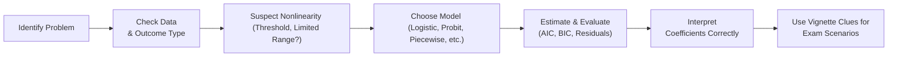

## Introduction

I still remember the first time I tried to model default probabilities with a plain vanilla linear regression. I thought, “Hey, let’s just regress defaults onto some credit metrics.” Well, fine—except that linear regression assumed values could go below zero or above one, which, as you know, doesn’t make much sense for a probability. I found myself scratching my head, wondering why I'd get negative predicted probabilities. That’s basically the definition of a red flag.

Nonlinear regression techniques solve precisely these kinds of issues. This section explores how to handle scenarios where linear models aren’t sufficient, whether you’re dealing with bond default probabilities, abrupt threshold effects, or the dreaded bull-versus-bear regime shifts in time-series. We’ll check out how polynomial terms can capture curvature, how logistic and probit models handle bounded outcomes, and how piecewise or step functions can model sudden policy-induced changes. We’ll also peek into tricks like mixed-effect models (which can help you combine both fixed and random group-specific effects).

While some of these methods might seem “kinda fancy,” they’re actually not that exotic if you understand the logic behind them. And from a CFA® exam perspective, these advanced ideas often pop up in item sets about forecasting, credit modeling, or evaluating opportunities in multiple market environments. So let’s get rolling.

## Crafting Realistic Case Studies

Before we dive into the nuts and bolts of each method, let’s talk about building a robust scenario—one that signals to you that a nonlinear approach is the way to go.

• Nonlinear Data Patterns: Often, the data itself reveals nonlinearities. Maybe the slope changes after a variable crosses a certain threshold, or we see a flattening effect at the tails.  
• Constrained Outcomes: If your dependent variable is a probability (like default risk) or a rate that can’t exceed certain bounds (e.g., short-term interest rates that rarely go below zero in normal conditions), you might need a logistic or probit model.  
• Multiple Regimes: Markets sometimes shift from bull to bear or from stable to volatile at the flip of a macroeconomic switch. A single linear slope could be misleading in these contexts.  
• Group-Specific Effects: If you have data broken down by region, country, or industry, ignoring group-level variance can lead to big errors. Mixed models let you partially pool across these groups.

Let’s consider a short (but hopefully helpful) anecdote: One of my colleagues modeled corporate bond spreads using a linear approach. In stable years, everything looked fine—but during a crisis, the credit spreads basically exploded, creating a non-linear jump the linear model simply couldn’t handle. That’s precisely why we might design a threshold model or a regime-switching approach.

## Polynomial and Interaction Terms

Polynomial terms let you introduce curvature into your regression. For instance, suppose we suspect a company’s Return on Equity (ROE) fosters growth, but only up to a certain point—after which diminishing returns set in. A simple polynomial model might look like:

Let y be the dependent variable (say, stock return), and x be ROE. A quadratic polynomial model would be:

y = β₀ + β₁·x + β₂·x² + ε

Where β₂ captures curvature in the relationship between x and y.  
 
Interaction terms, on the other hand, help you model a scenario where the effect of x₁ on y depends on the level of x₂. A typical interaction term might appear as x₁·x₂:

y = β₀ + β₁·x₁ + β₂·x₂ + β₃·(x₁·x₂) + ε

Maybe x₁ is an interest rate spread and x₂ indicates a market liquidity condition. The coefficient β₃ captures how the interest rate spread’s impact on your outcome depends on whether the market is liquid or not. In practice, analyzing interactions is crucial if you suspect synergy or offset effects among predictors.

### A Quick Example

Imagine we’re evaluating the performance of small-cap stocks (y) based on two factors: economic growth (x₁) and interest rate environment (x₂). We might suspect that small-cap stocks do best in a high-growth, low-interest environment—meaning x₁ interacts strongly with x₂. An interaction term ensures your model can pick up on that synergy.

## Step Functions and Piecewise Models  

Step functions or piecewise models treat the relationship between x and y as one slope (or intercept) up to a certain threshold, and a different slope beyond that threshold. For instance, a regulatory regime might change drastically if a bank’s capital ratio falls below 8%. So you end up with:

• For capital ratio c < 8%, y = β₀ + β₁·c + ε₁  
• For capital ratio c ≥ 8%, y = β₂ + β₃·c + ε₂  

This approach captures abrupt changes in relationships—like new tax brackets, new rules that kick in at certain asset sizes, or changes in consumer behavior at different income levels. Step functions are simpler than continuous polynomials and are often more interpretable when you know there’s a structural cut-point.

## Logistic and Probit Models for Default Probabilities

Logistic and probit regressions are lifesavers when your dependent variable is binary or bounded between 0 and 1. The logistic model typically uses the logit transformation:

P(default) = 1 / (1 + e^(-z))

where  
z = β₀ + β₁·(Financial metric) + β₂·(Macro factor) + ...  

Meanwhile, a probit model uses the cumulative distribution function (CDF) of the normal distribution:

P(default) = Φ(z)

where Φ(.) is the standard normal CDF. Practically, logistic regression is more common in finance, though probit is conceptually similar. The main difference is the underlying distribution assumption (logistic vs. normal).

### Why Use These?

Defaults can’t be negative or exceed 100%. If you try a linear regression, you risk predicted values outside [0,1]. Logistic and probit models automatically bound predictions between 0% and 100%. 

Also, interpretation changes. In linear regression, a one-unit increase in x changes y by β units. In logistic regression, a one-unit increase in x shifts the log-odds (logit) by β units, which translates to a multiplicative change in the odds. This means you have to be a bit more careful in explaining the results to stakeholders. But it’s totally worth it to avoid those nonsensical negative probabilities.

## Nonlinear Time-Series Elements: Regime-Switching

Sometimes markets behave differently in “calm” phases than in “stormy” phases. One approach is to use a Markov regime-switching model or threshold autoregressions. You might say, “If the S&P 500’s volatility index (VIX) is above 30, we switch to a ‘high-volatility’ regime. If it’s below 20, we’re in a ‘low-volatility’ regime.” Each regime can have different intercepts, slopes, or error structures.

### Practical Example

Let’s say you’re forecasting monthly returns on an equity index. In a low-volatility environment, returns might be well-approximated by a standard AR(1) process:

Rₜ = αₗ + ϕₗ Rₜ₋₁ + εₜ (low-vol regime)

But in a high-volatility environment, returns might follow:

Rₜ = αₕ + ϕₕ Rₜ₋₁ + ηₜ (high-vol regime)

where (αₗ, ϕₗ) and (αₕ, ϕₕ) differ. Switching between them depends on a threshold or a Markov chain rule. From an exam standpoint, watch out for item sets referencing “structural breaks,” “two distinct market phases,” or “regime changes” in the text. That’s usually your prompt that a standard linear time-series model may not cut it.

## Mixed Model Examples: Partial Pooling

Imagine analyzing corporate performance across multiple countries, each with its own quirks—like different regulations, tax codes, and labor costs. A “one-size-fits-all” linear model might ignore the unique aspects of each country, while fully separate models for each country might throw away valuable information about common global patterns.

Mixed models (also called hierarchical or multilevel models) let you do partial pooling. This means you can have:

yᵢⱼ = β₀ + β₁xᵢⱼ + bⱼ + εᵢⱼ

where yᵢⱼ is the outcome for observation i in group j. bⱼ is the random effect for group j, capturing group-specific intercepts (or slopes). The random effects bⱼ come from a common distribution with mean zero and some variance τ². That approach helps your overall estimates not to be overly swayed by small-sample groups, yet still adapt to group-level idiosyncrasies.

### Finance Use Case

Maybe your firm invests in real estate across different cities. You suspect local economic factors shape property returns, but all cities share some national-level drivers. Mixed models let you have a global intercept for the entire country but also let each city’s intercept deviate to reflect local differences. This method can be particularly powerful for portfolio managers looking to blend local knowledge with overall macro trends.

## Interpreting Output in Nonlinear Models

One major exam trap is to read coefficients in nonlinear models the same way you do in linear regressions. For logistic or probit, the coefficients reflect changes in log-odds or probit indexes, not direct changes in the probability. You might need to transform them to interpret real probabilities, typically by setting other variables to fixed values (like their means).

For polynomial or interaction terms, it’s wise to plug in sample values to see how y changes at realistic levels of x. That kind of “marginal effect analysis” often clarifies what the model is really saying.

For step functions, you might examine predictions on each side of the threshold to see if the model’s behavior changes drastically after crossing a certain point. Finally, for regime-switching models, you’d interpret each regime’s parameters separately—like the “bear regime” set of parameter values versus the “bull regime” set.

## Common Pitfalls

• Using Ordinary Least Squares on a Bounded Dependent Variable: Big no-no if your outcome is naturally restricted.  
• Overlooking Threshold Hints: If a vignette mentions a structural break or a special policy rule, you’re probably dealing with a piecewise or regime-switching scenario.  
• Misinterpreting Coefficients: In logistic regression, a coefficient is not the change in probability but rather the change in log-odds.  
• Neglecting Group-Level Variation: If data come from multiple categories or sectors, ignoring that structure can degrade your model’s performance.  
• Overfitting Curves with High-Order Polynomials: Sure, you can add x³, x⁴, x⁵..., but be careful that you’re not just chasing random noise.

## Exam Strategies

• Pay Attention to Vignette Clues: If the text highlights “jumps” at specific breakpoints, guess piecewise or step functions. If it emphasizes that data is “binary” or “bounded,” suspect logistic/probit.  
• Compare Models Using AIC/BIC: For advanced regression, these criteria often show up to reveal which model is “better fitting.”  
• Check Residual Plots and Goodness of Fit: Just as you learned in Chapters 2 and 3 about standard regression diagnostics, do the same for nonlinear models (albeit with specialized diagnostic tools).  
• Evaluate Predictive Accuracy: In logistic regression vignettes, they might provide classification tables or mention something like “type I or type II errors.”  
• Summarize Coefficients in Plain English: The exam might test your ability to interpret, not just run calculations. Comfortably explain what that slope means in a logistic scenario or how partial pooling impacts estimates in a mixed model.

## Practical Mermaid Flow

Below is a quick flowchart showing a typical path for deciding on a nonlinear approach:

## Glossary

• Scenario Analysis: Evaluating outcomes under hypothetical or historical conditions.  
• Regime Prediction: Estimating which market state (e.g., bull or bear) applies at a given time.  
• Partial Pooling Advantage: Sharing statistical information across related groups for more stable estimates.  
• Threshold Effects: Relationships that shift after a certain numeric cutoff.  
• Limited Outcome: Dependent variable restricted in range (e.g., 0% to 100%).  
• Interpretation in Nonlinear Models: Coefficients typically represent changes in odds or log-odds, not direct changes in the dependent variable.  
• Model Fit Indices (AIC/BIC): Used to compare competing models; lower scores generally indicate a better fit.  
• Structural Break Clues: Abrupt changes in slope or intercept aligned with external events.

## References and Further Reading

• CFA Institute Practice Questions, Level II. Review official item sets that deal with logistic regressions, polynomial expansions, and nonlinear time-series.  
• Gujarati, D., & Porter, D. “Basic Econometrics.” McGraw-Hill. Offers detailed, case-based exercises on both linear and nonlinear methods.  
• Walker, S., & Duncan, A. “Practical Statistics for Data Scientists.” O’Reilly Media. Good for bridging theory with real-world data examples.  
• Cross Validated (StackExchange): A community-based Q&A forum on stats and econometrics.  

## Test Your Knowledge: Nonlinear Regression Scenarios



### Which of the following best describes why logistic regression is preferred over linear regression for modeling default probabilities?

- [x] Logistic regression constrains predicted values between 0 and 1.
- [ ] Logistic regression allows continuous predictions past the 1 boundary.
- [ ] Logistic regression does not require a link function.
- [ ] Logistic regression eliminates multicollinearity entirely.

> **Explanation:** Logistic regression keeps the predicted default probability within the [0,1] range, preventing nonsensical negative or above-100% probabilities.

### A model that uses a single threshold to split data into two different linear relationships is commonly known as:

- [x] A piecewise or step function model.
- [ ] A polynomial interaction model.
- [ ] A Markov switching model.
- [ ] A random effects model.

> **Explanation:** A piecewise or step function model changes slope (and possibly intercept) on either side of a chosen threshold.

### In a regime-switching time-series model, which statement is generally true?

- [x] Each regime has its own set of parameters for the process generating the data.
- [ ] The same parameters apply across all regimes, but we switch error terms.
- [ ] The regime must be fixed and unchanging through time.
- [ ] Nonlinearities are impossible to capture in a regime-switching model.

> **Explanation:** Regime-switching models typically allow for different intercepts, slopes, or even error distributions in each regime. This is precisely how they capture nonlinear structures across different market states.

### When adding an interaction term between two predictors (x₁ and x₂) in a regression model, you primarily gain the ability to:

- [ ] Remove heteroskedasticity from the residuals.
- [ ] Force the slope of one variable to be zero.
- [x] Capture how the effect of one predictor changes depending on the level of the other.
- [ ] Ensure that the model is strictly linear in the parameters.

> **Explanation:** The interaction term x₁·x₂ allows the effect of x₁ on y to depend on the value of x₂ (and vice versa), capturing dependency between predictors.

### Which of the following statements is correct regarding logistic regression output?

- [x] Coefficients represent changes in the log-odds of the dependent variable.
- [ ] Coefficients have the same interpretation as in a standard linear regression.
- [x] Interpretations in terms of direct probability changes require additional transformations.
- [ ] The probabilities cannot be mapped back to real units once we have log-odds.

> **Explanation:** In logistic regression, coefficients reflect changes in log-odds. To interpret them in probability terms, you typically apply inverse logistic transformations at specific input values.

### A practitioner wants to model abrupt changes in a price-yield relationship after a regulatory limit is reached. What might be the most direct modeling approach?

- [x] A step function or piecewise approach defining a breakpoint at the regulatory limit.
- [ ] A standard linear regression with no additional terms.
- [ ] A random effects model assuming the same intercept across groups.
- [ ] A logistic model forcing the outcome to be between 0 and 1.

> **Explanation:** Piecewise modeling with a breakpoint at the regulatory threshold is the most straightforward way to capture abrupt relationship changes.

### In a Markov regime-switching model:

- [x] Transitions between states follow probabilistic rules, often depending on the current state.
- [ ] The state is known with certainty at each time period.
- [x] Different states may have different parameter values for the model.
- [ ] The model differs from threshold models because it’s purely linear.

> **Explanation:** Markov switching models use transition probabilities to move between states (regimes), each of which may have its own parameters, thus capturing nonlinearities across different states.

### Which of the following best summarizes partial pooling in mixed-effect models?

- [x] Each group’s estimates are pulled toward an overall mean while still allowing group-specific variation.
- [ ] Each group’s data are estimated entirely independently of other groups.
- [ ] Random effects do not allow for any variation across groups.
- [ ] Fixed effects are the only way to model group-specific intercepts.

> **Explanation:** Mixed-effect models (partial pooling) allow each group to have its own random intercept (and possibly slope), but these group-specific parameters come from a common distribution.

### An analyst finds that in a second-degree polynomial model y = β₀ + β₁x + β₂x² + ε, β₂ is negative and significant. The correct interpretation is:

- [x] The relationship has a concave shape with diminishing returns as x increases.
- [ ] The relationship is strictly positive at all values of x.
- [ ] A negative second-degree coefficient is impossible in finance.
- [ ] The relationship must cross zero exactly at x = 1.

> **Explanation:** A negative β₂ implies a concave-down parabola, signifying diminishing marginal effects of x on y at higher values of x.

### A threshold autoregressive (TAR) model is particularly helpful when:

- [x] Time-series data show distinctly different behavior before and after a certain cutoff.
- [ ] The data have a continuous linear pattern.
- [ ] We only want to model a binary outcome.
- [ ] The dependent variable is unbounded.

> **Explanation:** TAR models are designed to handle situations where a time-series exhibits different dynamics on either side of a threshold.


