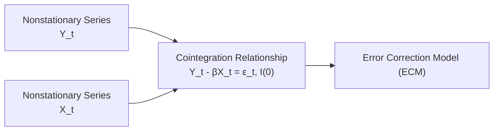

## Introduction and Rationale

Cointegration. Honestly, the first time I saw that word, I remember thinking: “Wait, co-what?” But it opened my eyes to how financial variables that wander around aimlessly on their own can still be locked together by a shared destiny in the long run. Cointegration and its partner in crime—the error correction model—are incredibly powerful concepts for analyzing time-series data in finance, especially when dealing with pairs trading, relationship-driven indexes, or simply any scenario where you suspect two or more nonstationary series have a stable, long-run connection. Once you catch that drift, you quickly realize how these models can form the backbone of strategies that exploit mean reversion or long-term equilibrium relationships.

In advanced time-series frameworks, cointegration is a reliable tool for ensuring we’re not chasing bogus results, as it addresses the “spurious regression” problem that tends to plague naive approaches. Below, we’ll walk through the fundamentals of cointegration, check out how to detect it with tests like Engle–Granger and Johansen, and then see how error correction models (ECM) help us keep tabs on short-run deviations while maintaining that sweet long-run equilibrium.

## Cointegration Basics

One might say that cointegration is like a dance between two or more nonstationary time series—where each has a drifting trend, but they still move in a coordinated pattern. If you saw them performing individually, you might think, “Hey, they’re just wandering off unpredictably.” But side by side, they remain in sync, drifting around a shared path.

• Two or more series are individually nonstationary (often integrated of order one, I(1)).  
• A linear combination (like Yₜ − βXₜ) can be stationary (i.e., integrated of order zero, I(0)).  
• If that linear combo is stationary, then Yₜ and Xₜ are said to be cointegrated.  

This is great news for finance pros. If a group of related asset prices or macro variables keep a stable relationship over time, it implies that whenever one variable drifts out of line, the other responds in a way that pushes the system back to equilibrium. So for example, if you’ve got two companies that produce similar goods and their equity prices diverge, you might suspect the divergence won’t last forever and set up a pairs trade to capitalize on the inevitable reversion.

## Order of Integration and Testing for Nonstationarity

When you’re modeling time-series data, you often start by checking whether your series is stationary. If not, you check if differencing it once (or more) can achieve stationarity. We say that a variable Yₜ is I(d) if differencing it d times yields a stationary series.

• A variable is I(0) if it is already stationary (no differencing required).  
• A variable is I(1) if you need one differencing operation.  
• A variable is I(2) if you need two differencing operations, etc.

### Common Tests for Unit Roots

• Augmented Dickey–Fuller (ADF) Test: Possibly the most popular. Tries to see if there’s a significant negative trend parameter in a transformed regression.  
• Phillips–Perron (PP) Test: Similar purpose as ADF, but often more robust to certain forms of heteroskedasticity or autocorrelation.  
• KPSS (Kwiatkowski–Phillips–Schmidt–Shin) Test: Instead of testing the null of “unit root,” it tests the null of “stationarity,” which can be a nice complementary approach.

But the key takeaway is this: if you find that Yₜ is I(1) and Xₜ is I(1), you might guess that they could be cointegrated. If they turn out to be cointegrated, that means some linear combination of them is actually I(0). That’s where the Engle–Granger or Johansen approach comes into play.

## Engle–Granger Two‑Step Procedure

The Engle–Granger method is often taught as a straightforward approach for testing cointegration between two variables. It goes like this:

1. Regress Yₜ on Xₜ (both I(1) series) to get  
   Yₜ = α + βXₜ + εₜ.  
   Then collect the residuals (εₜ).

2. Perform a unit root test on εₜ.  
   If εₜ is stationary (I(0)), then you congratulate yourself: Yₜ and Xₜ are cointegrated.

If that residual is not stationary, well, sorry to say, Yₜ and Xₜ might just be drifting around with no permanent tie to each other. That means you might be dealing with a “spurious” regression and all that lovely significance in your regression results might just be an illusion.

## Johansen Test

The Johansen test is a more general, more robust alternative for cointegration testing—particularly when you suspect more than two variables might be collectively cointegrated. Johansen uses a Vector Autoregression (VAR) framework and maximum likelihood to figure out:

• How many distinct cointegrating vectors exist among the variables. You might have multiple stable relationships in a system of variables.  
• The actual cointegrating vectors (i.e., the set of β parameters that define each stable combination).  

Johansen’s method spits out two test statistics: the trace statistic and the maximum eigenvalue statistic. Each test can tell you how many cointegrating relationships (denoted by a rank) are present out of the possible number of variables. This multivariate approach is more flexible because financial variables often go beyond a simple Y, X pair—like a trifecta of exchange rates or some large set of yields across different maturities.

## Error Correction Models (ECM)

All right, so you found cointegration. Great. Now you want a model to handle both the short-term fluctuations and the long-term equilibrium. Enter the error correction model (ECM). The logic is:

1. In the short run, variables can dash around, ignoring each other sometimes.  
2. In the long run, they gravitate back to an equilibrium relationship.  
3. The error correction term (ECT) essentially measures how far away you were from equilibrium at the last time step. The model includes a parameter that helps “nudge” the system back in line if it’s deviating too far.

In a simple case with two variables, you might see something like:

(1)  ΔYₜ = α₀ + α₁(Yₜ₋₁ − βXₜ₋₁) + other terms capturing short-run dynamics + νₜ.

The part in parentheses (Yₜ₋₁ − βXₜ₋₁) is the error correction term. If it’s large, meaning the system is out of whack, then the coefficient α₁ tries to reel it back in. Even though cointegration is a long-run phenomenon, real markets are full of short-run noise, so an ECM lets you keep track of both.

### Typical ECM Interpretation

• α₁ < 0: If Yₜ₋₁ is above the equilibrium implied by Xₜ₋₁, then ΔYₜ might be negative to correct it downward.  
• If α₁ is close to zero, the correction is sluggish. If it’s large in magnitude, the series whips back in line quickly.  

Below is a quick diagram illustrating how nonstationary series meet cointegration and feed into an error correction model:



## Implementation in Finance and Investments

If you’re dealing with pairs trading, cointegration is like your best friend. Forget about correlation alone—two stocks can be correlated but still drift apart permanently if they aren’t cointegrated. A cointegration framework implies that when the price spread (or ratio) gets too high or too low, it will revert, providing nice trading signals.

Other use cases:

• Yield curve analysis: different maturities on government bonds might be cointegrated, making it possible to detect anomalies that eventually revert.  
• International interest rates: if two central banks run similar policies or their economies are heavily tied, you might see the rates cointegrate.  
• Equity indices: major stock indices in integrated markets can share a stable relationship over time.

## Best Practices and Pitfalls

• Always test that the residual you find is truly stationary. If it’s not, you’re forcing a spurious cointegration.  
• Keep an eye out for structural breaks (wars, new regulations, major crises). If the structure changes significantly, the cointegration relationship might vanish.  
• In real financial data, sample sizes can be relatively short, which increases the difficulty of precisely identifying cointegration.  
• Johansen can handle more than two variables and is more robust—use it when possible, but be sure you have enough data points to estimate the necessary parameters.  
• The presence of cointegration doesn’t necessarily guarantee easy profits. Markets can remain off a theoretical equilibrium for a long time, and transaction costs or short selling constraints can hamper real-life trades.

## Glossary

• Nonstationary Series (I(1)): A time series whose statistical properties (like mean and variance) can change over time; differencing once can make it stationary.  
• Cointegration: A concept indicating that two or more I(1) series form a stable linear combination that is I(0).  
• Engle–Granger Two‑Step Procedure: A straightforward method to test for cointegration between two variables by regressing one variable on the other and then checking the stationarity of the residuals.  
• Johansen Test: A multivariate approach to cointegration that uses maximum likelihood estimation in a VAR framework, allowing multiple cointegrating relationships.  
• Error Correction Model (ECM): A model incorporating both short-run fluctuations and the long-run equilibrium relationship from the cointegration.  
• Error Correction Term (ECT): The previous period’s deviation from the long-run equilibrium; it influences how the model adjusts in the current period.  
• Spurious Regression: An apparent but misleading relationship between nonstationary variables that aren’t truly related in the long run.

## Practical Example (in Python)

Below is an illustrative snippet (high-level) for testing Engle–Granger cointegration in Python. Let’s assume we have two time series in pandas DataFrames, y and x (both presumably I(1)):

```python
import statsmodels.api as sm
import statsmodels.tsa.stattools as ts

X = sm.add_constant(x)
model = sm.OLS(y, X).fit()
residuals = model.resid

adf_test = ts.adfuller(residuals, maxlag=1)
print("ADF statistic:", adf_test[0])
print("p-value:", adf_test[1])

if adf_test[1] < 0.05:
    print("Residuals are stationary: cointegration exists!")
else:
    print("No cointegration found.")
```

This is definitely oversimplified, but it captures the main steps. Of course, in live financial data, you’d experiment with lags, test for structural breaks, and ensure the data is properly cleaned.

## References and Suggested Readings

- Engle, R. F., and C. W. J. Granger. “Co-integration and Error Correction: Representation, Estimation, and Testing.” Econometrica (1987).  
- Johansen, S. “Statistical Analysis of Cointegration Vectors.” Journal of Economic Dynamics & Control (1988).  
- Hamilton, J. D. Time Series Analysis. Princeton University Press, 1994.  
- CFA Institute. (Latest Curriculum Materials for Level II coverage on Cointegration and ECM).  
- CFA Institute Code of Ethics and Standards of Professional Conduct (always essential context).

## Final Remarks

Cointegration and error correction models can open the door to analyzing long-term relationships in your dataset while accounting for those short-run wiggles that always pop up. Make sure to apply robust testing procedures and watch out for structural breaks or regime shifts that might invalidate earlier insights. It’s all about forging that golden circle where theory meets the real world and where advanced time-series analysis anchors more resilient understanding and trading strategies.

Below are some questions to help you apply the concepts we’ve covered. Good luck, and keep practicing—because cointegration analysis, like many advanced topics in finance, becomes second nature only when you get your hands dirty with real data and actual examples.

## Mastering Cointegration and Error Correction Quiz



### Which statement best describes cointegration?

- [ ] It implies that two or more series are stationary when considered individually.  
- [x] It implies that nonstationary variables have a stationary linear combination.  
- [ ] It implies there is no need to test for stationarity in the residuals.  
- [ ] It means both or all variables do not require differencing.  

> **Explanation:** Cointegration specifically involves nonstationary series whose linear combination is stationary (I(0)).  

### Which of the following must be true if two variables are cointegrated?

- [ ] Both variables are I(0).  
- [ ] Residuals from a simple OLS regression are trending over time.  
- [x] Residuals from the cointegrating regression are stationary.  
- [ ] The variables cannot be tested via Engle–Granger once cointegration is established.  

> **Explanation:** Cointegration is confirmed if the residuals from a regression of the two I(1) series are I(0), i.e., stationary.  

### In the Engle–Granger procedure’s second step, what is tested?

- [ ] A structural break test on the fitted regression.  
- [ ] Whether the variables require differencing.  
- [x] A unit root test (e.g., ADF) on the residuals.  
- [ ] A Johansen rank test.  

> **Explanation:** Engle–Granger’s second step is to perform a unit root test on the residuals.  

### What is the main advantage of the Johansen test over the Engle–Granger method?

- [ ] Johansen’s test is simpler to apply when there are only two variables.  
- [ ] It relies solely on OLS estimates.  
- [ ] It does not require stationarity tests.  
- [x] It can handle multiple variables and estimate multiple cointegrating relationships.  

> **Explanation:** The real strength of Johansen is dealing with multivariate systems and identifying multiple cointegrating vectors.  

### Which element in an Error Correction Model (ECM) helps guide short-term deviations back toward long-run equilibrium?

- [ ] The intercept term.  
- [x] The error correction term (ECT).  
- [ ] The differenced dependent variable.  
- [ ] The Johansen rank.  

> **Explanation:** The ECT indicates how far the system has deviated from equilibrium in the previous period and “corrects” for that deviation.  

### If α₁ in an ECM is near zero, what does that imply about the speed of adjustment?

- [ ] Slow or minimal adjustment to the long-run equilibrium.  
- [x] Slow or minimal adjustment to the long-run equilibrium.  
- [ ] Rapid adjustment to the long-run equilibrium.  
- [ ] It cannot be determined without a Johansen test.  

> **Explanation:** A coefficient near zero means little correction is happening from one period to the next.  

### Which of the following is an example of cointegration in finance?

- [ ] Two completely unrelated stocks that happen to move together by chance.  
- [x] A pair of stocks in the same industry that maintain a stable price ratio over time.  
- [ ] A single stationary time series using daily closing prices.  
- [ ] Two commodities that show zero correlation.  

> **Explanation:** If the price ratio is stable, it suggests cointegration, indicating a long-run relationship.  

### What is a primary risk in applying cointegration analysis to historical financial data?

- [ ] The possibility that the residuals are automatically stationary.  
- [ ] The inability to use any test beyond Engle–Granger.  
- [ ] The assumption that cointegration never exists in real markets.  
- [x] Structural breaks or regime changes that invalidate the previously observed relationship.  

> **Explanation:** Real data often contain regime shifts that can disrupt previously observed cointegrating relationships.  

### In the Engle–Granger two-step method, which stationarity condition is crucial?

- [x] Both variables must be I(1) and their residuals I(0).  
- [ ] Both variables must be I(0) for their residuals to be meaningful.  
- [ ] One variable must be I(1) while the other is I(0).  
- [ ] No differencing is required before the test.  

> **Explanation:** Engle–Granger demands both variables be integrated of order one, with a stationary (I(0)) residual.  

### True or False: If two price series appear correlated over a period, they must be cointegrated.

- [ ] True  
- [x] False  

> **Explanation:** Correlation alone does not imply cointegration. Cointegration requires evidence of a stable long-run relationship with stationary residuals.  


