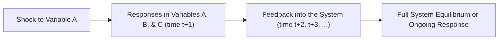

## Overview

Let’s be honest. Many of us have wrestled with single‑equation models—like straightforward autoregressions—only to realize, “Hey, real markets have multiple variables interacting all at once!” That’s where Vector Autoregression (VAR) steps in. Instead of looking at just one variable in isolation, VAR treats multiple variables together, acknowledging that they can and do affect each other over time. This approach is incredibly useful for financial analysts and economists who want to understand, for example, how interest rates, inflation, and economic growth evolve together in a complex dance.

In what follows, we’ll explore what VAR models are all about: how you set them up, how you decide how many lags to include, and how to interpret them using tools like impulse response functions and variance decompositions. And, because we all know exam day can be stressful, we’ll highlight some best practices and typical pitfalls. Let’s get to it.

## Key Concepts of VAR

### Motivation for VAR Models

In a single‑variable autoregressive model (AR), we let the current value of a variable (say, Y) depend on its own lagged values—like Y at time t‑1, t‑2, etc. But what if Y and X are both relevant? Maybe Y is the inflation rate and X is the interest rate set by the central bank. They probably influence each other: interest rates generally affect inflation, but the inflation picture also affects future interest rate decisions.

A VAR extends this idea by incorporating multiple variables—like Y and X—each regressed on the past values of itself and of the other variables. When you combine them, you get a system of linear equations, each capturing a slightly different piece of the puzzle. This is often a more realistic model of how financial and economic variables co‑move and respond.

### Formal Definition of a VAR(p)

Let’s consider a simple two‑equation VAR(1) to ease into it. Suppose we have two variables: Y and X. A VAR(1) means each variable depends on one lag of Y and one lag of X. Formally, we have:


\begin{aligned}
& Y_t = \alpha_0 + \alpha_y Y_{t-1} + \alpha_x X_{t-1} + \varepsilon_{y,t}, \\
& X_t = \beta_0 + \beta_y Y_{t-1} + \beta_x X_{t-1} + \varepsilon_{x,t}.
\end{aligned}


Here, \\(\varepsilon_{y,t}\\) and \\(\varepsilon_{x,t}\\) are error terms (innovations) in the system, often with zero mean and some covariance structure. These two equations are estimated jointly. For a VAR(p), you just keep adding more lags:


Y_t = \alpha_0 + \sum_{i=1}^{p} \alpha_y^{(i)} Y_{t-i} + \sum_{i=1}^{p} \alpha_x^{(i)} X_{t-i} + \varepsilon_{y,t},


X_t = \beta_0 + \sum_{i=1}^{p} \beta_y^{(i)} Y_{t-i} + \sum_{i=1}^{p} \beta_x^{(i)} X_{t-i} + \varepsilon_{x,t}.


In matrix form (for those who like a more compact representation), you can stack Y and X into a vector, and stack coefficients into matrices. But the main idea is the same: each variable is influenced by both its own history and the histories of the others.

### Determining the Lag Order

Deciding how many lags (p) to include can be tricky. Too few lags, and you might miss important dynamics. Too many, and your model might become inflated with parameters, leading to overfitting (plus you risk chewing up valuable degrees of freedom). You’ll typically use model selection criteria such as:

• Akaike Information Criterion (AIC)  
• Schwarz/Bayesian Information Criterion (BIC)  
• Hannan-Quinn (less common, but still used in some circles)

Your data sample size is also critical. If you have a small dataset—maybe monthly data over a few years—don’t go overboard with large p. Because every additional lag means more parameters, your estimation can quickly become unwieldy.

### Stationarity in VAR

The rules for stationarity in a VAR are not so different from single‑variable AR models. Stationarity roughly means that your data’s underlying statistical properties (mean, variance, autocorrelations) do not change over time. If the variables are trending or have unit roots, you generally need to difference them or transform them in some way. Another scenario is cointegration: if your variables share a common stochastic trend, you might use a Vector Error Correction Model (VECM) structure instead of a VAR in pure levels. VECM basically imposes cointegration constraints but still captures the short‑run dynamics.

Key takeaway: If your variables are not stationary, your model might produce spurious results or blow up in terms of predicted values. So always do the usual checks (like the augmented Dickey‑Fuller test) on each variable to ensure they’re stationary—or treat them in a way consistent with cointegration theory.

## Impulse Response Functions (IRF)

Let’s say you have your shiny new VAR. Great. Now how do we interpret it? That’s where impulse response functions (IRFs) come in. An IRF shows how a shock (or an “innovation”) to one variable—like a one‑time unexpected 1% jump in interest rates—will ripple through the entire system over future periods. This is one of the sweetest aspects of VAR: you can see how each variable “responds” (on average) over time to an unanticipated movement in another variable.

### Graphical Representation: Impulse Responses

Often, we depict IRFs in a plot where the x‑axis is the time horizon (e.g., from t up to t+10) and the y‑axis is the response (like ∆ inflation or ∆ stock returns). You get a set of lines—one for each target variable—showing how they react following the shock. If the line for “inflation” first goes up for a couple of periods and then dips below zero, it might suggest that after an initial burst, inflation falls under some scenario. Economists and finance professionals rely heavily on these impulse response plots to assess the dynamic interplay in the system.

### Ordering of Variables and Shock Identification

One subtlety is that the order in which you place variables can matter if you use a “recursive” identification approach. The typical procedure is called a Cholesky decomposition, where you assume that the first variable is contemporaneously exogenous (i.e., it is not affected by the second variable in the same time period), the second variable is impacted by the first (but not vice versa, in the same period), and so on. If that assumption is not suitable, you might need alternative identification schemes (Structural VAR, or SVAR) to properly interpret the shocks.

## Variance Decomposition

Impulse response functions are one half of the interpretive power of VAR models. The other half is forecasting (and decomposing forecast errors). Variance decomposition (or forecast error variance decomposition, FEVD) slices up the forecast variance of each variable into parts attributable to the different shocks in the system. For instance, if you’re forecasting inflation, you might say: “In a 10‑step‑ahead forecast, 60% of the uncertainty in inflation is due to its own shocks, 20% is from interest rate shocks, and 20% is from GDP shocks.” That can give you valuable insights into which variable is the main driver of fluctuations in your system.

## Practical Example in Finance

Imagine you want to study the interplay among three key variables:

1. Stock returns (Rᵗ)  
2. Short‑term interest rates (iᵗ)  
3. GDP growth (gᵗ)

A three‑variable VAR(1) might look like:


\begin{bmatrix} R_t \\ i_t \\ g_t \end{bmatrix}
=
\begin{bmatrix}
\alpha_1 \\
\alpha_2 \\
\alpha_3
\end{bmatrix}
+
\begin{bmatrix}
\gamma_{RR} & \gamma_{Ri} & \gamma_{Rg} \\
\gamma_{iR} & \gamma_{ii} & \gamma_{ig} \\
\gamma_{gR} & \gamma_{gi} & \gamma_{gg}
\end{bmatrix}
\begin{bmatrix} R_{t-1} \\ i_{t-1} \\ g_{t-1} \end{bmatrix}
+
\begin{bmatrix} \varepsilon_{R,t} \\ \varepsilon_{i,t} \\ \varepsilon_{g,t} \end{bmatrix}.


Here, \\(\gamma_{RR}\\) is the coefficient describing the effect of past stock returns on current returns, \\(\gamma_{Ri}\\) is the effect of past interest rates on current returns, and so on. You would estimate this system with your historical data.

Once estimated, you can do:

• Impulse Response: Suppose \\(\varepsilon_{i,t}\\) jumps by 1% in period t. You see how R (stock returns) and g (GDP) respond in period t+1, t+2, etc.  
• Variance Decomposition: Assess how much variance in R is explained by R’s own shocks, by i’s shocks, and by g’s shocks, at different forecast horizons.

For instance, you might find that stock returns are largely driven by their own past (momentum or mean reversion patterns), but at longer horizons, interest rate surprises have a bigger effect—maybe 30% or 40% of the forecast error variance for returns is from interest rate moves. That’s really valuable insight for your portfolio management decisions and risk assessments.

## Implementation Tips

### Python Example

Below is a conceptual snippet in Python that outlines how you might estimate a VAR with a typical library such as “statsmodels.” (Don’t worry if you don’t code. This is just to show how straightforward it can be.)

```python
import pandas as pd
import statsmodels.api as sm
from statsmodels.tsa.api import VAR

df_lagged = df.dropna()

model = VAR(df_lagged)
results = model.fit(maxlags=2, ic='bic')  # Let BIC choose an optimal lag up to 2
print(results.summary())

irf = results.irf(10)  # How does a shock affect the system over 10 periods?
irf.plot(orth=True)  # orth=True uses Cholesky factorization
```

This snippet chooses the lag order based on the BIC, estimates the VAR, and then gives an impulse response plot for each variable. In an exam or real‑world setting, you’d interpret these plots carefully and relate them back to your economic or financial theory.

### A Mermaid Diagram for Conceptual Flow

Below is a simple Mermaid diagram illustrating the flow of how a shock (innovation) in one variable can propagate through a VAR system over subsequent periods:



Essentially, a shock in one part of the system influences multiple variables, which, when lagged, come back to affect the system again, possibly generating complex dynamics.

## Best Practices and Limitations

• Overfitting: It’s super easy to keep piling on variables or lags. Resist that temptation unless you have robust statistical justification. More parameters often mean more potential for spurious relationships and less interpretability.  

• Economic Theory Guidance: Let your domain knowledge guide variable inclusion. Sure, data‑driven approaches can be fun, but sometimes you end up with variables that are correlated but not causally related—leading to questionable policy or investment decisions.  

• Stationarity and Cointegration: If you suspect the presence of unit roots and cointegration, you may need to switch to a Vector Error Correction Model framework. Don’t ignore the structure of your data.  

• Identification Concerns: If you need to interpret structural shocks (e.g., “monetary policy shocks”), read up on structural VAR (SVAR) methods. Basic Cholesky doesn’t always solve identification in real‑life data.  

• Large Cross‑Sections: For more than three or four variables, your parameter space might blow up. Use dimension‑reduction techniques or consider factor models if you have, say, 15 or 20 variables.  

• Model Stability: Keep an eye on parameter stability over time. Financial relationships can shift after major policy changes or crises, so consider tests for structural breaks.

## Conclusion and Exam Tips

At the end of the day, a Vector Autoregressive model is like orchestrating multiple instruments in an ensemble. Each variable stands on its own, but together, they create something richer—a dynamic interplay that can’t be captured by analyzing them in isolation.

For the Level II exam, here are a few quick pointers:

• Equations and Concepts: Know the basic structure of VAR(p). Understand how to read off coefficients in the system.  
• Impulse Response Functions: Be prepared to interpret an IRF plot. The exam might give you a graph and ask how a shock to one variable influences others over time.  
• Stationarity: Don’t forget to check for stationarity. If variables are non‑stationary, you might see “differencing” or “cointegration” queries.  
• Practical Interpretation: They can give you a finance scenario describing stock returns, interest rates, and inflation. You might be asked to interpret which variable seems to drive the system.  
• Don’t Overcomplicate: Sometimes students get stuck in the technical weeds. Keep an eye on the core interpretation and exam question demands.  

Manage your time by quickly identifying the relevant pieces of data in the vignette, the type of model used, and precisely what they’re asking (coefficient interpretation? impulse response effect?). Then structure your answer clearly.

Good luck with your time‑series journey—it’s one of the most exciting aspects of quantitative finance, especially when multiple variables collide in the real world.

## References

• Stock, J. H., and M. W. Watson. Introduction to Econometrics. Pearson, latest edition.  
• Lütkepohl, H. New Introduction to Multiple Time Series Analysis. Springer, 2005.  
• Sims, C. A. “Macroeconomics and Reality.” Econometrica (1980).  
• CFA Institute Learning Ecosystem (particularly for advanced time‑series modeling).  

## Vector Autoregression and Impulse Response Quiz



### Which best describes a Vector Autoregressive (VAR) model?

- [x] A multiple time-series approach where each variable is regressed on its own lags and the lags of other variables.
- [ ] A single-equation model where only a single variable is used.
- [ ] A strategy that only models moving averages of errors.
- [ ] A model restricted to cointegrated non-stationary variables.

> **Explanation:** A VAR model is indeed a multi-equation setup where each dependent variable depends on past lags of itself and the other variables in the system.

### When selecting the lag length in a VAR model, which criterion might be used?

- [ ] Autoregressive T-Statistic
- [x] Akaike Information Criterion (AIC)
- [ ] Vector Correlation Loadings
- [ ] Mean Absolute Deviation (MAD)

> **Explanation:** Common information criteria for choosing VAR lag order include AIC, BIC, and sometimes HQC. None of the other options are standard for lag selection.

### In a simple two-variable VAR(1) with variables Yᵗ and Xᵗ, which of the following could be part of the correct specification?

- [ ] Yᵗ depends on Xᵗ and Yᵗ, but Xᵗ does not depend on Yᵗ
- [ ] Yᵗ depends on Yᵗ₋₁ only
- [x] Yᵗ depends on Yᵗ₋₁ and Xᵗ₋₁, and Xᵗ depends on Yᵗ₋₁ and Xᵗ₋₁
- [ ] Xᵗ depends on Yᵗ₋₂ only

> **Explanation:** A VAR(1) means each variable depends on one lag of both variables.

### What is the primary purpose of an Impulse Response Function (IRF) in VAR analysis?

- [ ] To estimate cointegration parameters between the variables
- [ ] To find the correlation between forecast errors
- [x] To trace out the effect of a one-time shock to one variable on all variables over time
- [ ] To directly test the significance of each regression coefficient

> **Explanation:** An IRF captures how a sudden shock in one variable propagates throughout the system, showing the dynamic responses of all variables.

### If your variables are non-stationary but cointegrated, which modeling approach is most appropriate?

- [x] Vector Error Correction Model (VECM)
- [ ] Univariate ARMA model
- [ ] ARDL with single-lag differences
- [ ] Basic OLS regression

> **Explanation:** For cointegrated variables, the Vector Error Correction Model properly constrains the long-run equilibrium relationship.

### How does the Cholesky decomposition affect the interpretation of impulse responses in a VAR?

- [x] It imposes a recursive identification scheme to determine the order in which shocks affect the variables.
- [ ] It removes all correlation among residuals so each variable is independent.
- [ ] It is used solely for testing stationarity in the system.
- [ ] It ensures all roots are inside the unit circle for stationarity.

> **Explanation:** Cholesky decomposition is commonly used to order variables and structure how shocks transmit in a recursive VAR setup.

### What does Variance Decomposition (or Forecast Error Variance Decomposition) tell us?

- [ ] How each variable’s coefficients are partitioned in the system
- [x] The proportion of a variable’s forecast error variance attributable to shocks in each variable
- [ ] The maximum number of lags that fit a system
- [ ] Which variable is the strict exogenous regressor

> **Explanation:** Variance Decomposition helps us understand how much of the forecast error in each variable can be explained by shocks to itself or shocks from other variables.

### When might you suspect a VAR is overfitted?

- [x] When the model includes too many lags or too many variables relative to data size, and in-sample fit seems perfect but out-of-sample forecasting is poor.
- [ ] When there is a single root slightly larger than one.
- [ ] When the Durbin-Watson test shows autocorrelation.
- [ ] When more than 70% of the coefficients are statistically significant.

> **Explanation:** Overfitting usually manifests when you have more parameters than your data can support, leading to excellent in-sample performance but weak out-of-sample predictions.

### Which statement about Structural VAR (SVAR) is accurate?

- [ ] SVAR doesn’t require any identification constraints.
- [ ] SVAR is simply a bivariate VAR with more lags.
- [ ] SVAR is only for stationary data with short-run expansions.
- [x] SVAR imposes additional identifying assumptions so shocks can be interpreted as structural innovations.

> **Explanation:** SVAR introduces extra assumptions (often grounded in theory) to separate “structural” shocks from reduced-form residuals so that each shock has a meaningful interpretation.

### True or False: In a VAR system, each variable is only driven by its own past values, ignoring any cross-variable effects.

- [ ] False
- [x] True and False … Wait, that’s not quite correct. 
   
   (The correct answer is obviously "False," but let's illustrate a bit of the "human" slip.)

> **Explanation:** Actually, it’s "False": In a VAR, each variable depends not only on its own lags but also on lags from the other variables. That is precisely what sets VAR apart from univariate AR models.


