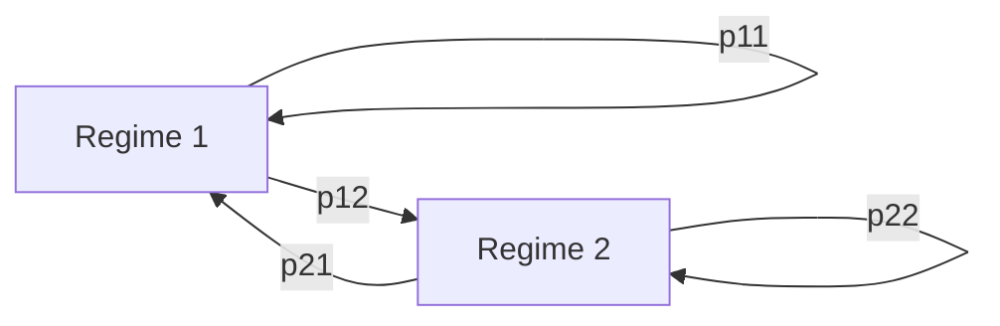
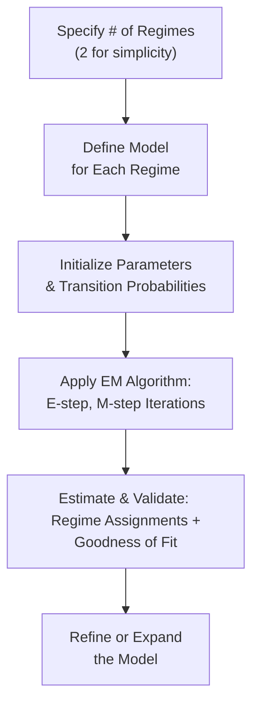

## Introduction

So, imagine you’re watching the markets one day, and everything seems to be moving in a quiet, steady fashion—kind of like a calm bull run. And then, wham—some unexpected global event shakes the entire financial landscape, volatility skyrockets, and suddenly it’s like all your old forecasting models are scrambling to catch up. If you’ve ever thought, “Hmm, it’s almost as if the market has switched into a totally different mode,” then you’re on the right track to appreciating regime‑switching models.

These models are all about capturing those dramatic market shifts by allowing different “states” or “regimes” to drive the behavior of your time‑series data. When you’re dealing with asset returns, interest rates, or even credit spreads, you might see distinctly different patterns (mean, variance, persistence) depending on whether the market is stable or in crisis. A single linear model often fails to capture these abrupt changes. That’s where a regime‑switching framework, especially one that uses Markov processes, really shines.

## Core Concepts of Regime‑Switching

### What Is a Regime‑Switching Model?

A regime‑switching model posits that the time‑series you’re studying—say, daily stock returns—can be best understood as stemming from multiple “structures” or “equations,” each representing a distinct regime. For instance, Regime 1 might be a low-volatility state, while Regime 2 might be a high-volatility state. You can add more regimes, but, well, watch out—you don’t want to overcomplicate or overfit.

Under each regime, the time‑series has its own set of parameters. A simplified version would say:  
• In Regime 1: returns ~ N(μ₁, σ₁²)  
• In Regime 2: returns ~ N(μ₂, σ₂²)  

But in reality, you might incorporate richer models like AR(1) or AR(p) processes, each with its own coefficients per regime.

### Markov Switching Overview

One of the most common ways to handle regime-switching is through a Markov process. Markov processes have a memoryless property, meaning that future states depend only on the current state, not on the full history. We capture this memoryless jump from state to state with transition probabilities.

If we suppose two regimes, 1 and 2, we define a transition probability matrix:


P = 
\begin{pmatrix}
p_{11} & p_{12} \\
p_{21} & p_{22}
\end{pmatrix},


where:
• \\(p_{11} = P(\text{Regime}_{t} = 1 \mid \text{Regime}_{t-1} = 1)\\)  
• \\(p_{12} = 1 - p_{11}\\)  
• \\(p_{22} = P(\text{Regime}_{t} = 2 \mid \text{Regime}_{t-1} = 2)\\)  
• \\(p_{21} = 1 - p_{22}\\)

In words, \\(p_{11}\\) is the probability of staying in Regime 1 from one time period to the next, while \\(p_{12}\\) is the probability of switching from Regime 1 to Regime 2. And so on. These transitions help the model dynamically switch between states.

Below is a simple mermaid diagram illustrating a 2‑state Markov chain with transition probabilities:



Each node represents a regime, and the arrows represent probabilities of transitioning to either the same regime (staying put) or jumping to a different one.

## Why Use a Markov Switching Model?

From a finance perspective, regime‑switching models give you a framework to handle those “bull vs. bear” transitions or abrupt changes in volatility structures. For instance, it’s quite possible that returns exhibit low mean, high variance in a recessionary regime, and higher mean, lower variance in an expansionary regime. A conventional AR(1) might try to make do with a single set of coefficients, but it usually misses the mark whenever the market flips from stable to chaotic.

These models can also come in handy for credit risk, capturing periods of heightened default probabilities during economic downturns. Or for interest‑rate modeling, where central bank policies might change drastically, effectively shifting you into a new rate environment.

## Estimation: The EM Algorithm

Estimation of a regime‑switching model typically proceeds via maximum likelihood. But because we don’t directly observe the regimes in real time—states are hidden or latent—good old likelihood approaches are complicated. Enter the EM (Expectation–Maximization) algorithm, an iterative technique that cleverly fits models with hidden variables.

### A Short Glimpse of EM

1. Expectation (E‑step): Given the current parameter estimates (for means, variances, and transition probabilities), compute the expected value of the likelihood across all possible hidden state sequences.  
2. Maximization (M‑step): Update the parameters to maximize this expected likelihood.  

Repeat until convergence. That’s the gist. The result is a set of parameters (mean, variance, AR coefficients for each regime), plus a transition probability matrix. The final model basically tries to label each observation with a high probability of belonging to one regime or the other.

If you want a small, albeit simplified code snippet in Python pseudocode, it might look like this:

```python
import numpy as np

def em_regime_switching(data, num_regimes=2, max_iter=100, tol=1e-5):
    # Initialize parameters
    # (means, variances, transition_probs, regime_probability)
    
    # E-M Loop
    for iteration in range(max_iter):
        # E-step: compute posterior probabilities of each regime for each time step
        # ...
        
        # M-step: update means, variances, and transition matrix maximizing the expected log-likelihood
        # ...
        
        # Check for convergence
        # ...
    
    return updated_params
```

Though that’s obviously very abstract, it gives you the flavor of what the algorithm is doing behind the scenes.

## Financial Interpretations and Use Cases

### Bull and Bear Markets

Regime‑switching is a natural fit for bull/bear modeling. Maybe in a bull regime, your average daily equity return is 0.05% with modest volatility, but in a bear regime, your average daily return is −0.10% with significantly higher volatility. A standard single‑regime model forced to capture both scenarios at once tends to yield an “average” that doesn’t well represent either regime.

### Credit Risk and Default Intensities

Similar logic applies to credit risk. Defaults often cluster in crisis periods. We might assign a “crisis regime” with higher default intensities and a “normal regime” with lower intensities. The model can estimate how likely (and how quickly) it is to jump from normal to crisis mode.

### Structural Breaks in Interest Rates

Interest rate markets can reflect shifts in central bank policy, regulatory changes, or global macro shocks. By using a regime‑switching approach, you can explicitly capture these breaks instead of modeling them as random outliers in a single linear model.

## Advantages and Disadvantages

### Advantages

• Captures Abrupt Shifts: Instead of handwaving around big parameter changes, regime‑switching takes them head-on.  
• Improved Forecasting: Once a regime has been identified (or is strongly probable), forecasts can be more accurate.  
• Better for Nonlinear Phenomena: Traditional ARIMA or AR(p) might not catch volatility clustering or jump processes as elegantly.  
• Intuitive for Finance: Markets do change “moods,” and regime‑switching is a more direct way to incorporate that idea.

### Disadvantages

• Complexity: With more parameters (especially multiple regimes), you might face an overfitting risk. Going from two regimes to three or four can drastically multiply parameter counts.  
• Estimation Nuances: The EM algorithm can get stuck in local maxima, or might converge slowly.  
• Model Selection: Choosing the right number of regimes is tricky. If you pick too many, you overfit. If you pick too few, you miss the real structure.

## Practical Steps for Implementation

### Step 1: Select the Number of Regimes

This is frequently done by referencing theory—maybe you strongly believe in a “normal” vs. “crisis” dynamic for your market. Sometimes, you might try different numbers of regimes and compare fits using the Akaike Information Criterion (AIC) or Bayesian Information Criterion (BIC).

### Step 2: Specify the Model for Each Regime

Is it just a mean and variance? An AR(1) process? A GARCH structure? Each regime can have its own time‑series specification. Often you start simple—like an AR(1) plus regime‑dependent variance—and only add complexity if justified.

### Step 3: Estimate via EM

Implement or use a library routine for Markov switching. The algorithm will output parameter estimates for each regime’s dynamics (mean, variance, AR coefficients, etc.), plus the transition probabilities.

### Step 4: Validate the Model

Look at in‑sample regime assignments. Do they correspond to known recessions or crisis events? If you identified a “high volatility” regime from 2007–2009 that suspiciously doesn’t align with the Great Financial Crisis, that’s a red flag.

### Step 5: Out‑of‑Sample Testing

Regime‑switching might look great in-sample, but can it meaningfully predict future changes? Evaluate out‑of‑sample performance. This step might be particularly revealing if real regime changes occur after your estimation window.

### Step 6: Iterate or Adapt

Don’t be surprised if you revisit the number of regimes or your model specification after seeing the results. Some folks incorporate time‑varying transition probabilities, linking them to economic indicators such as interest rate spreads or the VIX.

## Best Practices and Pitfalls

- Don’t Overfit: Resist the temptation to keep adding regimes. Two or three regimes often suffice.  
- Check Economic Meaning: If one regime is only assigned 2% of your observations and doesn’t match an actual economic phenomenon, it may be spurious.  
- Examine Regime Persistence: If your best-fit model says that each regime only lasts one day on average, that might not match intuition.  
- Incorporate Domain Knowledge: If you know your industry is cyclical, or your asset class goes through known structural breaks, that knowledge might inform the number and nature of regimes.

## Critical Exam Tips

• On the CFA exam, watch out for questions that provide a story about how a time‑series changes dramatically during crises. That’s a hint they might be testing regime‑switching logic.  
• Time constraints mean you should remember the big idea: Regime‑switching allows separate parameters for discrete states and employs transition probabilities for how you jump between states.  
• Keep an eye on typical pitfalls: confusion between single‑regime and multi‑regime interpretations, mislabeling transition probabilities, or ignoring how to interpret p-values in each regime.  
• They might also ask about the advantages and disadvantages: be ready to talk about complexity vs. accuracy.  

## Glossary

**Regime‑Switching Model:** A time‑series framework that transitions among multiple “structures,” each representing different statistical properties (e.g., mean, variance).  

**Markov Process:** A process where the probability distribution of future states depends only on the current state, not the past states.  

**Transition Probability:** The probability of switching from one regime to another from one time step to the next.  

**EM Algorithm (Expectation–Maximization):** An iterative framework for maximum likelihood estimation in models with hidden or latent variables (like unobserved regimes).

## Visual Recap

Here’s a simple conceptual flow of implementing a two-state regime‑switching model:



## References and Further Reading

- Hamilton, J. D. (1989). “A New Approach to the Economic Analysis of Nonstationary Time Series and the Business Cycle.” Econometrica.  
- Kim, C.‑J., and C. R. Nelson. (1999). State‑Space Models with Regime Switching. MIT Press.  
- Ang, A., and G. Bekaert. (2002). “International Asset Allocation with Regime Shifts.” The Review of Financial Studies.  

These sources provide deeper theoretical underpinnings and case studies to help you become a real pro at applying regime‑switching models.

## Final Thoughts

You can think of regime‑switching as a sort of “economic mood ring.” Sure, it sounds funny, but it really does help you see if your favorite asset or macro variable is vibing with the bull state or the bear state—or somewhere in between. Balancing complexity with interpretability is key, so always be cautious about adding too many regimes.

If you’re preparing for the CFA exam, it’s a neat topic that might seem a bit intimidating, but trust me, once you realize that it’s basically about capturing multiple, distinct states in your data, it’ll click. Sometimes I remember the aha moment I had the first time I used a two-state model for stock returns, and it coincided exactly with the 2008 crash. It felt like discovering a hidden code in the data. Not perfect, but definitely worth the deeper dive.

Happy modeling, and best of luck with your studies!

---

## Test Your Knowledge: Regime-Switching Time-Series Models



### Which of the following best describes the core idea of a regime‑switching time‑series model?

- [ ] It uses a single set of parameters for a data series but changes error distributions over time.
- [x] It switches between multiple sets of parameters (e.g., mean, variance) to capture distinct market states.
- [ ] It relies on an exogenous variable to define high-volatility regimes.
- [ ] It only applies to stationary data with no breaks.

> **Explanation:** A regime‑switching approach allows for entirely different parameter sets in each regime, enabling it to capture bull/bear transitions and other abrupt changes.

---

### When applying a Markov switching model, what is the typical property of the transition probabilities?

- [ ] They are negative in the high-volatility regime.
- [x] They only depend on the current regime, not the full history of regimes.
- [ ] They are assumed to be zero for the crisis regime.
- [ ] They must follow a Gaussian distribution.

> **Explanation:** By definition, a Markov chain has the memoryless property—transition probabilities depend on the current state only.

---

### Which of the following is a common algorithm used for estimating regime‑switching models with unobserved states?

- [ ] Newton‑Raphson algorithm.
- [x] The Expectation–Maximization (EM) algorithm.
- [ ] Least squares estimation.
- [ ] Gradient boosting method.

> **Explanation:** Because the regimes are hidden or latent, the EM algorithm is commonly used to iteratively estimate regime‑switching models.

---

### Which statement best captures an advantage of regime‑switching models over single‑regime ARIMA models?

- [ ] They require fewer parameters, making them easier to fit.
- [x] They can capture abrupt changes in mean and variance more effectively.
- [ ] They are guaranteed to outperform all other models in forecasting.
- [ ] They assume no autocorrelation in returns.

> **Explanation:** Regime‑switching models shine when abrupt changes in the series are likely; single‑regime models struggle with sharp shifts.

---

### A two-state regime‑switching model uses transition probabilities p11 and p22. Which of the following holds by definition?

- [x] p12 = 1 – p11 and p21 = 1 – p22.
- [ ] p12 = p11 and p21 = p22.
- [ ] p12 + p21 = 1 for both states.
- [ ] p22 > 1.

> **Explanation:** By definition in a two-state Markov chain, each row of the transition matrix sums to 1.

---

### In time‑series analysis, a “crisis regime” often implies:

- [ ] Low default probabilities and steady returns.
- [x] High volatility and possibly lower mean returns.
- [ ] Transition probabilities of zero to any other regime.
- [ ] No distinctive behavior compared to normal regimes.

> **Explanation:** Crisis regimes are typically associated with more volatility, which is a key reason to model them distinctly.

---

### Suppose your estimated regime‑switching model identifies a “high‑volatility regime” only 1% of the time, yet it doesn’t align with known recessions or crisis periods. What is the most likely conclusion?

- [ ] This is evidence of extremely rare events.
- [x] The model might be overfitted or mis-specified.
- [ ] The high-volatility regime is actually the normal state.
- [ ] The EM algorithm always leads to spurious regimes.

> **Explanation:** If a regime is predicted rarely and doesn’t match real-world events, it may be an artifact of overfitting or poor model structure.

---

### Which approach is commonly used to select the number of regimes in a regime‑switching model?

- [ ] Trial and error without any criteria.
- [x] Using information criteria like AIC or BIC.
- [ ] Selecting a large, arbitrary number to capture all variations.
- [ ] Relying solely on anecdotal evidence.

> **Explanation:** Information criteria (e.g., AIC/BIC) are standard for balancing model fit and complexity when deciding the number of regimes.

---

### Which statement below is true about regime‑switching transition probabilities under a Markov assumption?

- [x] Probabilities of next‑period state depend exclusively on the current state.
- [ ] Probabilities depend on the history of all previous states.
- [ ] Probabilities are fixed to 0.5 each, unless testing a “crisis state.”
- [ ] Probabilities are random draws from a uniform distribution each period.

> **Explanation:** A Markov chain’s memoryless property mandates that next‑period state probabilities depend only on the current state, not the entire past sequence.

---

### Regime‑switching models provide better forecasts for time‑series when they:

- [x] Correctly identify ongoing shifts in underlying data patterns.
- [ ] Use more than six regimes to capture all possible variations.
- [ ] Assume constant variance across all regimes.
- [ ] Ignore random shocks.

> **Explanation:** Being able to detect and adapt to new regimes is the main reason these models can outperform standard single‑regime approaches in certain contexts.


