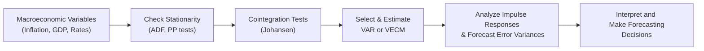

## Constructing Exam-Style Vignettes

Picture this: you open your CFA exam booklet and see a lengthy passage with tables of inflation rates, interest rates, consumer sentiment indices, and—why not—GDP growth data. On top of that, there’s a subtle note about “datasets partially aggregated from monthly to quarterly frequency.” Then you realize you need to figure out which advanced time-series technique is most appropriate here—perhaps a Vector Autoregression (VAR), maybe a Markov regime-switching model, or even an Error Correction Model (ECM) if the variables turn out to be cointegrated. Sound overwhelming? It doesn’t have to be.

Exam-style vignettes in this area often combine multiple macroeconomic indicators, each painstakingly layered into a story about a hypothetical (but realistic) economy. The challenge is twofold: interpret the data quickly and connect the narrative to the appropriate methodology.

Below is a typical progression you might see in a vignette:

1. A table attacking you with data: monthly inflation, quarterly GDP, and an interest rate series that changes from a fixed policy rate to a market-based rate halfway through.  
2. A mention that “analysts suspect a structural break in 2015 due to a major policy shift,” nudging you to consider break tests or regime-switching.  
3. Possibly incomplete theoretical backgrounds that hint at cointegration but never explicitly say “Cointegration.” Instead, they’ll mention that “over the long run, inflation and interest rates move together.”  

The trick is to piece these clues together. In real-world applications, especially around major policy changes, your data is often messy. You might have to convert monthly data to quarterly or check for a break in mid-series. The exam mirrors this real-world scenario so you can show that you know how to adapt your approach.

## Incorporating the Models

So, how do you decide which advanced time-series framework to use? Let’s walk through key models:

- Cointegration & Error Correction Models (ECM): If you suspect that two or more variables share a stable long-run relationship (e.g., inflation and interest rates co-move over time), a Johansen test might reveal cointegration vectors. For example, the vignette might say, “Johansen test indicates two cointegration vectors among inflation, interest rates, and CPI.” If that’s the case, you’d likely adopt a Vector Error Correction Model (VECM), capturing both the short-run deviations and the speed of return to the long-run equilibrium.

- Vector Autoregression (VAR): Maybe the data suggests these variables are interdependent without a direct cointegration relationship, but they influence each other dynamically. Vignettes might show an impulse response function, illustrating how a shock to interest rates eventually impacts GDP growth. You could be asked to read an impulse response table or interpret forecast error variance decompositions.

- Regime-Switching Models (e.g., Markov Switching): Sometimes the relationship changes under different “regimes,” such as expansion vs. recession. A Markov switching model might be indicated if you see graphical evidence of “low-inflation regimes” and “high-inflation regimes” over time, or if the vignette narrative mentions significant structural shifts in policy.

- Structural Breaks: A structural break can disrupt the stability of your time-series model. The vignette might describe how a major policy reform or an exogenous shock (like a global financial crisis) changed parameters. Examinees must identify if a single model remains valid or if different sub-period parameters are needed.

Here’s a simple visual workflow you might apply in the exam:



## Question Types and Examples

Exam questions can come in various flavors:

- Calculation: “Given the below Markov switching model’s transition probabilities, forecast the inflation rate for the next two periods.” Or “Find the equilibrium error correction term given your cointegration coefficient estimates.”
  
- Interpretation: “Interpret the impulse response function and describe the effect of a one standard deviation shock in the interest rate on GDP.” Or “Explain why ignoring cointegration might lead to spurious regression results.”

- Conceptual: “The data reveals a structural break in 2015. Should the displayed cointegration results be considered valid for the entire sample? Why or why not?” Or “Explain how short-run dynamics differ from long-run equilibrium in an ECM.”

A typical multi-period forecast question might go like this:  
• You’re given two regimes (Regime A: expansion, Regime B: recession) with specified probabilities.  
• The current period’s data suggests the model is in Regime A.  
• The question wants a two-step-ahead forecast for GDP growth, factoring in the possibility of switching to Regime B.  

Part of your answer requires combining the transition probability matrix with each regime’s expected GDP growth. That’s how you’d tie advanced theory to a practical forecast.

## Common Pitfalls

While these topics can be fun—yes, I said “fun,” but maybe that’s my inner data-nerd talking—there are some pitfalls exam candidates often hit:

- Mixing up Stationary vs. Nonstationary: Overlooking a unit root test or ignoring that variables might be integrated of order 1 (I(1)) can lead to nonsense regressions.  
- Confusing Short-Run and Long-Run Relationships in an ECM: It’s all too easy to interpret the error correction term incorrectly. Remember, ECM explicitly captures both short-run changes (the first-differenced variables) and the speed of adjustment back to a long-run equilibrium.  
- Misapplication of VAR: Just because you spot correlation among variables doesn’t mean you ignore the possibility of cointegration. If you do have cointegrated variables, a VECM is typically more appropriate than a standard VAR.  
- Overlooking Structural Breaks: If your data includes a major event—like a central bank drastically changing its monetary policy—failing to test for a break can throw off your entire model’s viability.

## Study Recommendations

You can’t become an expert in time-series modeling overnight, but you can develop a systematic approach. In both exam and real-world settings, these steps help:

• Identify Variables & Frequencies: Clarify what data you have and how frequently it’s measured. If data is mixed (some monthly, some quarterly), you might need to convert everything to a common frequency.  
• Check Stationarity: Use tests such as Augmented Dickey-Fuller (ADF), Phillips-Perron (PP), or Kwiatkowski–Phillips–Schmidt–Shin (KPSS) tests to see if each series is I(0) or I(1).  
• Decide on Cointegration: If variables are integrated of order 1, consider Johansen or Engle–Granger tests.  
• Choose the Model (VAR, VECM, Markov Switch, etc.): Evaluate the economic relationships and the exam’s hints.  
• Interpret Output Thoroughly: In a vignette, you might be given partial results; you’ll have to connect the dots.  
• Relate Results to Macroeconomic Policy or Asset Pricing: Ultimately, the exam might ask you to link the findings to investment decisions, interest rate forecasts, or inflation projections.

Plus, practice by reading numeric tables quickly. The real exam clock doesn’t pause while you stare at a 3×3 impulse response matrix, trust me. Develop the habit of quickly identifying which variable is shocking which, and how many lags or steps are shown.

## Example: Bringing It All Together

Let’s say we have an exam vignette that includes three macro variables:  
1. Inflation (INF) – monthly data  
2. GDP growth (GDP) – quarterly data  
3. Policy interest rate (POLR) – monthly data, but changes in 2015 from a fixed rate to a floating rate

The text indicates:  
• Johansen test shows one cointegration vector among INF, GDP, and POLR.  
• An impulse response function from a 3-step VAR is provided.  
• The question states that a large policy shift occurred in 2015, possibly suggesting a regime change.

You might see statements like:  
“Given the Johansen test indicates a cointegrating rank of 1 for the entire 2010–2025 sample, discuss whether the structural breakpoint in 2015 invalidates the cointegration result. How would you recommend adjusting the model?”

Your best approach is to:

- Check if separate cointegration analysis is needed pre- and post-2015.  
- Possibly adopt a Markov Switching Vector Error Correction Model (MSVECM) if you suspect that the error correction relationship itself changes in different regimes.  
- Evaluate the impulse response function carefully: a shock to POLR might initially impact GDP growth after three months, with knock-on effects on inflation.  

That’s the big picture of what you’ll face in item sets.

## Python Mini-Snippet: Johansen Cointegration

Below is a super-quick look at how you might practically test for cointegration (just for your reference—no coding skills required in the exam, of course):

```python
import pandas as pd
import statsmodels.tsa.vector_ar.vecm as vecm

# all aligned in monthly frequency with some method to deal with missing quarter data.

johansen_test = vecm.coint_johansen(df[['INF', 'GDP', 'POLR']], det_order=0, k_ar_diff=1)

trace_stat = johansen_test.lr1
critical_values = johansen_test.cvt  # Usually a 2D array of critical values
print("Trace Test Stats:", trace_stat)
print("CV at 95%:", critical_values[:, 1])

```

Again, not exam-mandatory but helpful to see how practitioners handle real data.

## Key Terms

• Impulse Response Table: Shows how a shock in one variable affects itself and others in subsequent time periods.  
• Structural Break: A parameter shift triggered by an event such as a policy change or economic crisis.  
• Short‑Run vs. Long‑Run: ECM helps separate short-run fluctuations (differences) from long-run relationships (cointegration).

## Additional Resources

• Sims, C. A. (1980). “Macroeconomics and Reality.” Econometrica.  
• Hamilton, J. (1994). “Time Series Analysis.” Princeton University Press.  
• Stock, J., & Watson, M. (1993). “A Simple Estimator of Cointegrating Vectors in Higher Order Integrated Systems.” Econometrica.  
• Federal Reserve Economic Data (FRED) for real-world macroeconomic datasets.  

If you can, look up past CFA® mock exams that have tested macroeconomic forecasting. Practice item sets that show partial regression outputs or tricky data transformations. You’ll refine both your speed and your skill.

---

## Test Your Knowledge: Advanced Macroeconomic Forecasting Methods



### A vignette provides monthly inflation data, quarterly GDP data, and a single interest rate series that changes definition in 2010. Which model feature might you consider most critical for handling this issue?

- [x] Inclusion of a structural break in the model.
- [ ] Using only pre-2010 data for inflation.
- [ ] Combining inflation and GDP into a single series.
- [ ] Ignoring the frequency mismatch and focusing on lead-lag analysis only.

> **Explanation:** A change in definition or measurement often signals a structural break. You must test for and potentially incorporate that break in your model.


### A candidate is given results of a Johansen test showing one cointegration vector among inflation (INF), interest rate (INT), and GDP. Which approach would be most appropriate?

- [ ] Traditional OLS of INF on INT and GDP in levels.
- [x] A Vector Error Correction Model (VECM).
- [ ] A standard Vector Autoregression (VAR) in first differences without an error correction term.
- [ ] A univariate AR model for GDP only.

> **Explanation:** With evidence of cointegration, a VECM is appropriate to capture both the long-run equilibrium relationship and short-run dynamics.


### A vignette indicates a Markov switching model with two regimes: expansion and recession. The transition probability matrix shows a 0.90 probability of staying in the same regime. When interpreting a multi-step forecast, the next step is to:

- [ ] Dismiss the possibility of switching regimes since the probability is high.
- [x] Multiply each regime's forecast by the probability of transitioning or remaining in that regime.
- [ ] Only use the expansion regime forecast because 90% is dominant.
- [ ] Immediately adopt an ECM to assess regime changes.

> **Explanation:** Even if the probability of staying in the current regime is 0.90, the correct approach is to weight each possible future regime outcome by its transition probability.


### Time-series data for inflation, interest rates, and consumer confidence from 1995 to 2025 is provided. A major monetary policy shift occurred in 2010. Which statement best describes how to handle this for cointegration testing?

- [ ] Combine pre- and post-2010 data without adjustment.
- [ ] Only use post-2010 data as the pre-2010 data is irrelevant.
- [x] Test for a structural break or run separate cointegration analyses for each sub-period.
- [ ] Immediately discard cointegration testing.

> **Explanation:** A known policy change may alter long-run relationships. Splitting or modeling the break is often necessary to maintain reliable results.


### A candidate is shown a 3-variable VAR impulse response function. An unexpected 1% rise in interest rates leads to a temporary GDP drop after two quarters, followed by a rebound. This pattern is describing:

- [x] The dynamic effect of a monetary shock on GDP.
- [ ] A cointegrating relationship among the variables.
- [ ] An immediate shift to a different regime.
- [ ] A short-run effect without any feedback loop.

> **Explanation:** In a VAR, an impulse response function depicts how a shock to one variable flows through the system over time.


### In an error correction model, the coefficient on the error correction term (ECT) is −0.4. Interpreting that coefficient suggests:

- [ ] The long-run equilibrium is reached instantly.
- [ x ] About 40% of the deviation from equilibrium is corrected each period.
- [ ] The variables are not cointegrated.
- [ ] The model has a unit root problem.

> **Explanation:** A negative error correction term close to −0.4 implies that 40% of last period’s disequilibrium is “corrected” in the current period.


### When building a multi-step Markov switching forecast for GDP growth, which factor is NOT typically required?

- [ ] Transition probabilities for each regime.
- [x] Cointegration vectors for all variables in the model.
- [ ] Expected value of GDP growth in each regime.
- [ ] The current regime’s indicator.

> **Explanation:** Markov switching doesn’t inherently require cointegration vectors unless you specifically combine it with an ECM approach. It primarily revolves around different states (regimes) and the probabilities of transitioning between them.


### A vignette states that "the short-run errors between GDP and inflation do not appear to accumulate over time, but they do revert toward a common trend." This observation supports the presence of:

- [x] Cointegration.
- [ ] Stationary fluctuations independent of each other.
- [ ] No long-run relationship at all.
- [ ] A purely random walk process.

> **Explanation:** If two series revert toward a common trend in the long run, that’s a hallmark of cointegrated variables.


### If an exam vignette shows that mean inflation drops significantly after a certain date but interest rate responses are unchanged, examiners might be hinting at:

- [ ] A stable VAR specification without breaks.
- [x] A partial structural break in the inflation series.
- [ ] No modeling changes—just a shift in the data center.
- [ ] Evidence that cointegration no longer applies to any variable.

> **Explanation:** A shift in mean for one variable only can signal a partial structural break, potentially requiring advanced modeling or at least a shift dummy.


### The main benefit of using a VAR structure (instead of a single-equation AR model) for macroeconomic forecasting is:

- [x] It captures the interdependencies among multiple time-series variables.
- [ ] It automatically corrects for any structural break.
- [ ] It ensures stationarity of all variables.
- [ ] It eliminates any need for cointegration testing.

> **Explanation:** VAR strategies let you model multiple equations simultaneously, capturing how each variable influences and is influenced by others in the system.



---

**Final Exam Tips:**  
• Always check if variables are stationary or cointegrated before you apply any advanced time-series technique.  
• For each exam vignette, adopt a systematic approach: define the problem, check for structural breaks, interpret model outputs, and connect them to macroeconomic implications.  
• Stay calm when you see a big impulse response table or Markov switching probabilities. Focus on how each piece of data flows through to your forecast or interpretation.  

Remember, these exam scenarios are echoes of real-world complexity. If you embrace their messy nature—rather than fight it—you’ll be well on your way to mastering macroeconomic forecasting vignettes. And who knows? By the end of your practice, you might find them (almost) fun.
