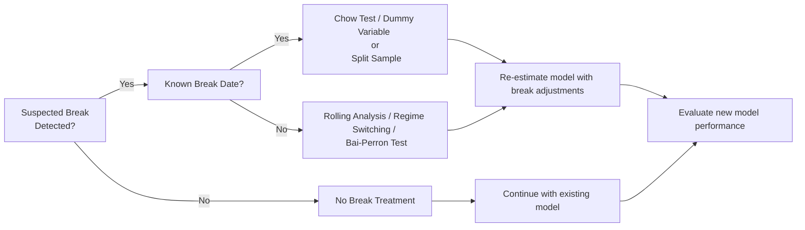

## Introduction

Sometimes our carefully crafted time-series models produce beautiful forecasts—until, all of a sudden, they don’t. We get thrown off by major policy changes, sudden regime shifts, or even subtle transformations in how a market responds to certain indicators. This phenomenon is often referred to as a structural break or parameter instability. In other words, the model parameters that once worked so well just aren’t representing the data anymore. These breaks can undermine the validity of stationarity tests, bias regression coefficients, and degrade forecasting accuracy.

Admittedly, you can feel a bit frustrated when you see your model’s once-stable behavior collapse. I remember the first time I tried forecasting oil prices long-term, only to discover that the dynamics post-2008 were drastically different from the prior decade. So, if your crystal ball suddenly goes hazy, it might be time to check for a structural break or two.

Below, we’ll dive into common triggers of structural breaks, how to detect them (e.g., the Chow test, rolling regressions), and how to incorporate them into your models (like using dummy variables or advanced regime-switching frameworks). While this topic is beyond the standard syllabus for some CFA exams, it provides essential insight if you’re dealing with real-world data that doesn’t always behave nicely. 


## Detecting Structural Breaks

Spotting a structural break is a lot like diagnosing a sudden dip in performance—there’s always a reason, and your job is to figure it out. Two frequently used detection methods are the Chow test and rolling regressions. Additionally, there are more sophisticated variants (e.g., Bai-Perron tests) that handle multiple breakpoints.

• Chow Test:  
  This involves splitting your dataset into two subsamples—before and after a suspected break date—and seeing if the model parameters differ statistically.  

  The idea is straightforward. Suppose you have a linear model:

  
    y_t = \beta_0 + \beta_1 x_{1t} + \cdots + \beta_k x_{kt} + \varepsilon_t.
  

  If you suspect a structural break at time \\( T^* \\), you split the sample into two: (1) \\( t \leq T^* \\) and (2) \\( t > T^* \\). You estimate your model in each segment, then pool the data and estimate again for the entire series. The Chow statistic checks whether the restricted (single‑equation) regression fits as well as the two separate regressions:

  
    F = \frac{ \bigl( RSS_R - (RSS_1 + RSS_2) \bigr)/k }{ (RSS_1 + RSS_2)/(n - 2k) },
  

  • \\( RSS_R \\) = Residual sum of squares (RSS) for the pooled regression  
  • \\( RSS_1 \\) = RSS for subsample 1  
  • \\( RSS_2 \\) = RSS for subsample 2  
  • \\( n \\) = Total sample size  
  • \\( k \\) = Number of parameters in each regression  

  A large \\( F \\)-statistic indicates a statistically significant difference between the two subsamples, suggesting a structural break at \\( T^* \\).

• Rolling (or Moving Window) Regressions:  
  When you’re not sure where or when a break might occur (or if it might be ongoing), rolling regressions can be life-savers. You estimate your model on a window (say, 36 months), shift the window forward one month, re-estimate, and repeat. You then inspect how key parameters (like \\(\beta_1\\)) evolve through time. If you see large shifts or drifts, that’s a red flag for instability.  

  Rolling regressions are especially helpful when changes aren’t abrupt—like a policy that’s eased in gradually or a demographic shift that unfolds slowly over time.  

If these tests detect one or more breaks, then you know the simplified “one-size-fits-all” model probably isn’t capturing what’s really happening in the data. 


## Types of Breaks

Structural breaks don’t necessarily appear as a lightning strike. Some can be abrupt, while others are more like a slow fade. In practice, you can categorize them into two basic flavors:

• Discrete Breaks:  
  Think of a sudden shift. Maybe a central bank announces a dramatic new monetary policy, or there’s a geopolitical event that drastically alters trade flows. At time \\( T^* \\), all bets are off. This is often the scenario we test for with the Chow method or other break tests that assume a single break date.

• Gradual Shifts:  
  Ever see interest rates creep upward very slowly as the economy transitions? Or maybe a commodity usage pattern changes as technology evolves. In these cases, the break might happen over multiple periods. Rolling regressions, time-varying parameter models, or a regime-switching method could be the best approach. You step back, watch the data over time, and see if your parameters are drifting in a particular direction.

It’s easy to miss gradual shifts if you’re only using a single-break test. Ideally, you’d blend approaches—like applying rolling window analyses monthly to see if there’s an upward or downward trend in your parameter estimates. 


## Consequences for Modeling

Neglecting a structural break can lead to a sense of false security. You might push out a forecast that’s basically worthless—maybe it fits the first 80% of your sample perfectly, but then fails catastrophically in the last 20%. Parameter instability can also show up in:

• Biased or Inconsistent Parameter Estimates:  
  If the data before and after a shift come from different regimes, the single set of parameters can be misleading. For instance, \\(\beta_1\\) might become artificially large or small to “average out” a break.

• Misdirected Inferences:  
  You might incorrectly conclude there’s a unit root when in reality your series is stationary but has a shift in its mean or variance. Similarly, you could misinterpret cointegration relationships if you fail to factor in a break that changes the underlying relationship between variables.

• Forecast Failure:  
  Let’s say you rely on your regression for portfolio construction or risk management. A structural break can lead to over- or under-hedging, wrong positions, or inaccurate cost of capital estimates. These are the sorts of mistakes that keep risk managers awake at night.

Admitting that your model’s parameters might not be carved in stone is the first step toward building more realistic—and hopefully more profitable—forecasts.


## Approaches to Address Breaks

Once you suspect or confirm a structural break, you have a few options:

• Split the Sample and Model Separately:  
  The simplest approach is to estimate separate models for each regime. If you believe monetary policy changed drastically in 2010, you can model 1990–2010 with one set of coefficients, then 2011–present with another. This is appealing for discrete breaks but might not capture subtle transitions well.

• Add Dummy Variables:  
  Another straightforward approach is to incorporate a dummy (indicator) variable for observations after the break date. You might have:

  
    y_t = \beta_0 + \delta_0 D_t + \beta_1 x_{t} + \delta_1 (D_t \cdot x_t) + \varepsilon_t,
  

  where \\(D_t\\) is 0 before \\(T^*\\) and 1 after \\(T^*\\). This approach lets you see changes in intercepts (\\(\delta_0\\)) and/or slopes (\\(\delta_1\\)). But what if your break is a slow drip? One dummy might not cut it.

• Regime-Switching or Markov Switching Models:  
  These are flexible frameworks that allow data to switch among multiple “states” or “regimes,” sometimes stochastically. For instance, one regime could represent a low-volatility growth environment, while another might reflect a high-volatility recession environment. The model endogenously determines when a switch occurs.  

  Markov switching models can handle more subtle shifts—like an evolving probability of being in one regime vs. another—without explicitly requiring you to specify the break date in advance.

• Structural Change Tests with Endogenous Break Detection:  
  The Bai-Perron test, for example, tries to identify multiple breakpoints in your data, all in a systematic way. It’s more advanced than a straightforward Chow test, particularly if you suspect multiple break dates.

• Time-Varying Parameter (TVP) Models:  
  Sometimes your coefficient \\(\beta_1\\) is not constant; it evolves smoothly over time. A time-varying parameter model (like a state-space framework using the Kalman filter) can track these changes. This is especially helpful when structural shifts are frequent or incremental rather than a once-off event.

No single approach is perfect. The “right” method often depends on your data and your guess about how abrupt or frequent the changes might be.  

Here’s a simple mermaid diagram illustrating a common decision flow:



Keep in mind, if you guess incorrectly about the nature of the break, you risk adding unnecessary complexity or missing the actual break altogether. 


## Glossary

Chow Test  
• A test that determines if there is a significant difference between two linear regressions estimated over different subsamples. Often used to verify the presence or absence of a discrete structural break at a known break date.

Rolling Regression  
• A method where the regression is estimated repeatedly over windows of data (e.g., last 24 months) that move forward in time, allowing you to see how coefficients evolve and whether they remain stable.

Structural Break  
• A shift in relationships or parameters within a time series, usually tied to policy changes, economic events, or market regime transitions. Failing to address such breaks can lead to biased parameter estimates and poor forecasting performance.

Regime-Switching  
• A class of models that allows different data-generating processes (e.g., “bull” vs. “bear” markets) to govern the observations at different points in time, often linking these processes via probabilistic rules (e.g., Markov chains).


## Practical Example with Python

Below is a simplified code snippet that demonstrates how you might perform a rolling regression in Python to detect a potential structural break. For large datasets and more complex checks, you’d expand the logic (e.g., incorporate the Chow Test or advanced tests like Bai-Perron).

```python
import pandas as pd
import statsmodels.api as sm
import numpy as np

window_size = 36  # monthly, for example

betas = []
dates = []

for i in range(len(df) - window_size):
    sub_data = df.iloc[i:i+window_size]
    Y = sub_data['Y']
    X = sub_data['X']
    X = sm.add_constant(X)  # includes intercept
    
    model = sm.OLS(Y, X)
    results = model.fit()
    betas.append(results.params['X'])
    dates.append(sub_data.index[-1])  # store the end date of the window

rolling_betas = pd.DataFrame({'Date': dates, 'Beta': betas}).set_index('Date')

rolling_betas.plot(title='Rolling Beta Estimates')
```

If you see a sudden jump or a steady drift in the Beta coefficient, that’s a strong indication of potential parameter instability. You would then investigate further, maybe applying the Chow test for a specific break date, or turning to a more robust model that accommodates a shift in regime. 


## Conclusion

Structural breaks and parameter instability might sound like advanced topics, but they’re incredibly relevant once you start working with real-world data. The economy isn’t static, markets evolve, and a method that works great in one era might falter in another. Understanding how to detect and model breaks can protect you from inaccurate forecasts, misguided investment decisions, and potential compliance or risk management mishaps.

From a CFA exam perspective, structural breaks might appear in time-series questions where you’re asked to evaluate the validity of a model. While not always a core part of the Level II curriculum, these techniques can be helpful if a vignette hints at changing market conditions or widely different pre- and post-event data. The big takeaway? Stay flexible. Always keep an eye on whether your model’s assumptions remain valid over the entire sample.

In practice, recognize that structural breaks can be discrete, gradual, or a hybrid. If you suspect a break, test it—and if the data say “Yes, there’s a break,” adapt your model accordingly. No two markets or instruments behave identically, so an iterative, data-driven approach typically works best. Good luck, and keep questioning those parameters whenever you suspect there’s more to the story!


## Additional References and Suggested Readings

• Chow, G. C. “Tests of Equality Between Sets of Coefficients in Two Linear Regressions.” Econometrica (1960).  
• Perron, P. “The Great Crash, the Oil Price Shock, and the Unit Root Hypothesis.” Econometrica (1989).  
• Bai, J., and P. Perron. “Estimating and Testing Linear Models with Multiple Structural Changes.” Econometrica (1998).  
• CFA Institute Level II Curriculum (Check the official readings for application to time-series and advanced regression).  
• Advanced Time-Series Analysis: James D. Hamilton’s “Time Series Analysis.”  
• For a more intuitive primer, see Rob J. Hyndman and George Athanasopoulos, “Forecasting: Principles and Practice.”


## Test Your Knowledge: Structural Breaks in Time-Series Analysis



### A researcher finds that her time-series model, estimated from 2010 to 2020, consistently underestimates values after a major 2015 economic crisis. Which of the following is the most likely cause?

- [x] A structural break in the underlying parameters post-crisis
- [ ] Overfitting the model to data from 2010 to 2015
- [ ] Lack of unit root testing
- [ ] Concurrent cointegration among all variables

> **Explanation:** The consistent underestimation post-2015 suggests the model’s parameters no longer hold, implying a structural break at the crisis or shortly afterward.

### Suppose you want to formally test for a structural break occurring at a specific point in your data. Which test is commonly used?

- [ ] Johansen test
- [x] Chow test
- [ ] Augmented Dickey-Fuller test
- [ ] Ljung-Box test

> **Explanation:** The Chow test is specifically designed to check whether parameters differ before and after a known break date.

### A discrete change in central bank policy nearly doubled short-term interest rates overnight. What type of break does this scenario most likely illustrate?

- [x] Abrupt (discrete) break
- [ ] Gradual shift
- [ ] Mean reversion shift
- [ ] Cointegrated shift

> **Explanation:** A quick, significant policy change that immediately impacts the data is typically a discrete break.

### When performing a rolling regression on 60 months of data that shifts one month at a time, what would a gradual upward trend in the slope coefficient indicate?

- [ ] A single discrete break
- [x] Gradual parameter drift
- [ ] A spurious regression result
- [ ] Perfect stationarity

> **Explanation:** A steadily moving slope coefficient across windows suggests the parameter is changing slowly over time.

### Which of the following approaches is most appropriate if the exact breakpoint is unknown and there may be multiple breaks?

- [ ] Simple dummy variable at a known add date
- [x] Bai-Perron multiple break test
- [ ] Cointegration test for break detection
- [ ] Seasonal decomposition

> **Explanation:** Bai-Perron methodology systematically identifies unknown multiple breakpoints.

### Failing to account for a structural break when one exists can result in:

- [x] Biased parameter estimates
- [ ] Automatically more stable predictions
- [ ] Improved stationarity
- [ ] Reduced model complexity

> **Explanation:** Neglecting a break can skew regression results and degrade forecasting accuracy.

### Which model would allow for shifts between different market regimes without specifying an exact break date?

- [ ] Simple linear regression
- [x] Markov switching model
- [ ] Autoregressive model of order 1
- [ ] Classical ANOVA

> **Explanation:** Markov switching models let the data dynamically change states (regimes) based on probabilistic rules, rather than specifying a fixed break date.

### In a regression context, how does adding a dummy variable help to model a structural break?

- [x] It lets the slope or intercept differ before and after the break
- [ ] It turns a time series into cross-sectional data
- [ ] It forces \\(\beta_1\\) to be exactly zero
- [ ] It eliminates serial correlation automatically

> **Explanation:** Dummy variables can capture separate intercepts or slopes in different regimes.

### A forecaster believes the crash of 2008 introduced a permanent, new level of volatility into the data. Which approach would be most direct to test this idea?

- [ ] White test for heteroskedasticity
- [ ] Cointegration test
- [x] A Chow test splitting the sample at 2008
- [ ] An ADF test for stationarity

> **Explanation:** Splitting the sample at 2008 allows a direct test of whether the parameters differ pre- and post-crisis.

### A structural break is always:

- [ ] Gradual
- [x] True
- [ ] False

> **Explanation:** This statement is false. Structural breaks can be abrupt or gradual. 


