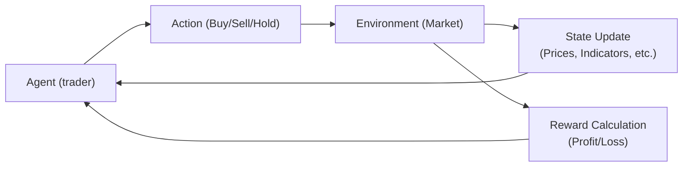

## Introduction to Reinforcement Learning

It’s often said that financial markets can feel like an endless puzzle. You have prices moving up and down, unexpected shocks, and continuous streams of fresh data. Reinforcement Learning (RL) is a technique that sees these markets as environments in which an “agent” (like our automated trading algorithm) navigates each moment, deciding whether to buy, sell, or hold, and then receiving feedback—in the form of profit, loss, or some risk-adjusted performance metric. Over time, the agent learns a policy that aims to maximize cumulative reward.

This is different from supervised learning, where we typically have a “labeled” dataset (e.g., historical returns labeled as high or low), or unsupervised learning, where we try to find hidden patterns (like clustering similar stocks). In RL, the agent is not spoon-fed labeled examples. Instead, it acts in an environment, collects rewards, and improves its decisions over time.

Below, we set out the essentials of RL and discuss how it can be applied in trading contexts. We’ll focus on concepts like action spaces, reward functions, and the classic exploration vs. exploitation dilemma. We’ll also see how RL can be operationalized for algorithmic trading, dynamic asset allocation, and even hedging strategies.

## Core Concepts and Terminology

Before we dig into details, let’s define some common RL terms used in finance:

• Agent: The learner or trading system that interacts with the market.  
• State: The current situation the agent “observes,” typically derived from market data (e.g., price levels, volatility, macro indicators, or internal signals).  
• Action: The decision the agent takes at each time step (e.g., buy, sell, do nothing, or set portfolio weights).  
• Reward: A scalar measure of success or failure (e.g., realized profit, risk-adjusted performance, or penalty if a position goes underwater).  
• Policy: The mapping from states to actions—essentially a rule for what to do in each market situation.  
• Exploration vs. Exploitation: The need to gather information about different strategies while also using the best-known strategy for near-term gains.  
• Discount Factor (γ): Determines how future rewards are weighted compared to immediate rewards.

### Why RL in Trading?

In classical supervised frameworks, you might predict tomorrow’s returns and then trade accordingly. But markets have a sequential dimension: you make a move today, which changes your portfolio composition and possibly influences future decisions, constraints, or transaction costs. RL naturally handles this sequential decision-making aspect by continuously updating the policy as new data arrives.

## Setting Up the RL Environment in Finance

If you’re building an RL-based trading system, you define:

• Observation Space: This is everything your agent can “see.” It might include historical price data, moving averages, volumes, RSI (Relative Strength Index) indicators, volatility estimates, or even news sentiment. You can get fancy by including macroeconomic measures like interest rates, inflation, or credit spreads.  
• Action Space: Possible moves at each step. In a simple scenario, actions could be discrete: buy one unit, sell one unit, or hold. In more advanced setups (often used by large funds), the action space might be continuous portfolio weights across multiple assets.  
• Reward Function: The most critical piece. You could set reward as net profit, but many prefer risk-adjusted metrics (like Sharpe ratios), or impose penalties for drawdowns or excessive volatility. That helps your agent focus not just on maximizing returns but also on controlling risk.

The environment is built to simulate how real markets respond to your trades, including price slippage, transaction costs, and liquidity constraints. This can get computationally heavy, but it’s crucial for realistic results. (We’ll talk about that soon.)

Here’s a simple diagram of the RL loop in a trading context:



The agent observes the current state (D), decides an action (B), receives a reward or penalty (E), and the environment transitions to a new state.

## The Exploration vs. Exploitation Trade-Off

One of the trickiest RL challenges is deciding how to balance:
• Exploration: Testing different actions (maybe taking a risk by opening a position in a new sector) to discover new insights.  
• Exploitation: Leveraging what the agent currently believes to be the best strategy.  

If you do too much exploration, you might lose money on ill-advised trades. Too little exploration, and your agent could remain stuck, never discovering a better approach. In short, every RL system needs some method—like ε-greedy, where with probability ε you explore a random action, and with probability 1-ε you exploit your best-known action. In real trading, you might reduce ε over time, focusing more on exploitation as you gain confidence.

## Approaches: Q-Learning vs. Policy Gradient

### Q-Learning and the Bellman Equation

Q-Learning is a popular off-policy method that learns a “Q-function” mapping state-action pairs to expected future rewards. The Bellman equation for Q-Learning can be written as:


Q(s, a) \leftarrow Q(s, a) + \alpha\bigl[r + \gamma \max_{a'} Q(s', a') - Q(s, a)\bigr],


where:

• \\( \alpha \\) is the learning rate, determining how quickly we update estimates.  
• \\( \gamma \\) is the discount factor.  
• \\( r \\) is the immediate reward for taking action \\( a \\) in state \\( s \\).  
• \\( s' \\) is the next state, and \\( a' \\) is the future action that yields the highest Q-value in the next state.

Q-Learning tries to converge on an optimal Q-function, from which you derive the best action in each state. It’s conceptually straightforward, but can be tough in high-dimensional finance contexts because Q is a huge definition table if you have many possible states.

### Policy Gradient Methods

Policy gradient (PG) tackles the problem differently. Instead of learning Q(s,a) directly, it parameterizes a policy \\( \pi_\theta(a|s) \\) by neural network weights \\(\theta\\). It maximizes expected returns through gradient-based optimization:


\nabla_\theta J(\theta) \approx \mathbb{E}\bigl[\nabla_\theta \log \pi_\theta(a|s) \cdot G_t\bigr],


where \\( G_t \\) is the return following action \\(a\\). Policy gradient methods often handle continuous actions better and can be more stable when dealing with large-scale problems—though they, too, require careful hyperparameter tuning.

## Applications in Trading

### 1. Algorithmic Trading

Think about short-term moves: maybe the agent is trading a single stock or a basket of correlated assets. The RL system takes a new observation every minute (or second, or microsecond, though that’s quite high-frequency) and decides whether to open or close positions. Over time, it learns which price movements or volume patterns lead to gains and which to avoid. This can be quite powerful, though you need top-notch data feeds and robust simulation environments to reflect actual market microstructure.

### 2. Dynamic Asset Allocation

You might have a portfolio with multiple asset classes—equities, bonds, maybe some alternative investments. The RL system periodically decides new weight allocations. If macro signals suggest a recession, the RL agent might shift more weight into defensive assets. If it sees good momentum in emerging markets, it might shift some capital there. Over time, it learns which dynamic reallocations historically would have yielded better risk-adjusted returns. This approach can complement more traditional portfolio rebalancing strategies, which might stick to static schedules or simple heuristics.

### 3. Risk Management / Hedging

Ever found yourself wishing your hedge positions auto-adjusted with market volatility? RL can handle that. The agent monitors, say, your equity portfolio’s exposure to interest rate fluctuations or currency volatility and decides daily whether to buy or sell futures to manage exposure. The reward function might measure how effectively you minimize variance, subject to a maximum cost constraint. Over time, the system can learn patterns in how interest rates shift or currency pairs move following certain macro announcements, adjusting hedges accordingly.

## Hyperparameters and Backtesting

Financial data is notorious for noise, non-stationarity, and sudden regime changes (looking at you, 2020 or 2008). Sensitivity to hyperparameters (learning rate, discount factor, network size) can be huge in RL:

• Learning Rate (α): Too high can cause wild updates and diverging trades; too low means you learn too slowly.  
• Discount Factor (γ): A higher discount factor focuses the agent on long-term returns. A lower one leads to a short-term bias—potentially ignoring longer-horizon opportunities (or risks).  
• Batch Size / Replay Buffer: If you use Deep RL techniques, you’ll likely store past experiences in a “replay buffer” to break correlation in training data. Manage its size carefully to capture enough diversity but avoid outdated samples.

Financial RL setups often require large-scale simulations or repeated backtests. You typically tune hyperparameters on historical data “in-sample,” then test on a separate time period “out-of-sample” to ensure generalizability. It’s a bit like walk-forward optimization in classical systematic trading.

## Transaction Costs and Market Realities

One major pitfall is ignoring the friction of real-world trading. Even if your agent “discovers” an amazing buy-sell pattern, real markets charge commissions, spreads, and slippage. That can quickly turn your strategy from profitable to a net loser. So your reward function (or environment simulation) should incorporate transaction costs. Liquidity constraints matter too: you can’t flip giant positions instantly without moving the market.

Hedging strategies also have costs—e.g., option premiums or futures margins. RL solutions that fail to model these can produce unrealistic positions. And always watch for overfitting, especially with discrete actions: you might see spurious patterns in small data sets that vanish in real life.

## Out-of-Sample Testing and Risk Management

You can think of RL as a highly adaptive approach. That’s great—until it starts to adapt to noise. Thus:

• Split your data into training, validation, and test sets. Our agent is trained on the training set, hyperparameters might get refined on the validation set, and final performance is confirmed on test data.  
• Walk-forward optimization: Train on the first segment, test on the next segment. Then roll forward, retrain with “new” data, test again. This simulates real usage where each new period is out of sample.  
• Stress testing: Evaluate the RL strategy’s performance under hypothetical “crisis” market scenarios.  

Meanwhile, from a risk management lens, it’s prudent to set constraints or guardrails. For example, limit position sizing or embed a maximum daily drawdown rule. RL can fail in ways that classic strategies might not anticipate, especially if the agent learns an unusual policy that’s rarely tested.

## A Quick Personal Reflection

I once tried a basic RL approach in a local hackathon for intraday stock trading, thinking, “Wow, this is going to blow everything out of the water.” Well, it kept overfitting the training data until the final model basically bought or sold on random signals. The lesson? Tuning the environment, reward function, and hyperparameters can be incredibly fiddly. But when you get it right—or at least, get it less wrong—RL trading strategies can adapt to shifting markets in powerful ways that static models can’t match.

## Example: Simple Python Snippet

Below is a bare-bones illustration of how one might set up RL for a single stock in Python. It’s not production-ready, but it sketches out the approach:

```python
import gym
import numpy as np
from stable_baselines3 import PPO  # Example RL library

class StockTradingEnv(gym.Env):
    def __init__(self, price_data):
        super(StockTradingEnv, self).__init__()
        self.price_data = price_data
        self.action_space = gym.spaces.Discrete(3)  # Buy, sell, hold
        self.observation_space = gym.spaces.Box(low=-np.inf, high=np.inf,
                                                shape=(5,), dtype=np.float32)
        self.current_step = 0
        self.position = 0
        # etc.

    def step(self, action):
        # Reward based on P&L from action
        # Transition to next state
        # Return: new_state, reward, done, info
        pass

    def reset(self):
        # Reset environment state
        pass

price_data = np.random.randn(1000)  # Stub data
env = StockTradingEnv(price_data)

model = PPO("MlpPolicy", env, verbose=1)
model.learn(total_timesteps=10_000)
```

Of course, real finance data requires a robust environment that handles transaction costs, partial fills, and other complexities. But hopefully this snippet conveys the overall structure of many RL solutions.

## Summary of Best Practices

• Choose your reward function carefully. Align it with your true performance and risk goals, not just raw returns.  
• Simulate real market conditions. Incorporate transaction costs, liquidity constraints, and slippage.  
• Tame complexity. If your environment is too large, training will be slow and can overfit.  
• Validate out-of-sample. Walk-forward tests and stress scenarios help you see if the strategy generalizes.  
• Monitor overfitting. RL can latch onto spurious patterns. Keep your eyes open for suspiciously good backtest performance that might collapse in real time.  
• Deploy with caution. Real money is on the line. Start with small drawdowns or sandbox accounts.

## Exam Tips and Pitfalls

On the CFA exam, you might see a vignette describing an analyst using RL-based models to allocate between equities and bonds. Expect questions on how to identify appropriate states, actions, and reward signals. They might also ask about practical considerations, such as the role of transaction costs or how the algorithm might fail if future market conditions differ from historical training data. Know the difference between Q-Learning and Policy Gradients, the concept of exploration vs. exploitation, and why discount factors matter for balancing near-term vs. long-term gains.

Reinforcement learning is a powerful extension of machine learning for real-time decision-making. But it comes with big challenges in finance: data non-stationarity, noise, and the cost of mistakes. If you keep an eye on realistic constraints and robust testing, RL can become a valuable tool in your trading strategy arsenal.

## References and Further Reading

• Sutton, R. S. & Barto, A. G. (2018). “Reinforcement Learning: An Introduction.”  
• Moody, J. & Saffell, M. (1999). “Reinforcement Learning for Trading.” Journal of Finance.  
• OpenAI Spinning Up in Deep RL. https://spinningup.openai.com  

Feel free to explore these resources for more advanced treatments of RL algorithms and implementation details.

## Test Your Knowledge: Reinforcement Learning in Trading Strategies Quiz



### Which best describes the primary difference between reinforcement learning and supervised learning in a trading context?

- [x] Reinforcement learning involves learning from an environment through trial-and-error, while supervised learning relies on labeled historical data.
- [ ] Reinforcement learning requires labeled data for all potential trades, while supervised learning does not.
- [ ] Reinforcement learning always results in deterministic policies, whereas supervised learning may be probabilistic.
- [ ] Supervised learning typically focuses on multi-step sequential decisions, while reinforcement learning targets single-step classifications.

> **Explanation:** Reinforcement learning uses interact-and-feedback mechanics (actions and rewards), whereas supervised learning relies on labeled data to learn direct input-output mappings.

### In reinforcement learning, what is the purpose of a reward function when applied to trading?

- [ ] To label each instance of historical market data with a buy or sell signal.
- [x] To offer feedback on each action's profitability or risk-adjusted performance, guiding the agent to improve its policy.
- [ ] To ensure that the agent never explores actions that might lead to losses.
- [ ] To maintain a constant level of volatility in the trading strategy.

> **Explanation:** The reward function defines how the agent “scores” each action, aligning behavior with desired trading objectives such as profitability or risk-adjusted returns.

### Which term refers to balancing the need to gather more information about the environment with utilizing the agent's current best strategy?

- [ ] Discount optimization
- [ ] Policy gradient
- [ ] Bellman backup
- [x] Exploration vs. exploitation

> **Explanation:** Exploration vs. exploitation is a classic challenge: how much to “experiment” vs. how much to “use what you know.”

### In Q-learning, what parameter influences how future rewards are valued compared to immediate rewards?

- [ ] Learning rate (α)
- [ ] Epsilon (ε) in ε-greedy
- [x] Discount factor (γ)
- [ ] Momentum factor (β)

> **Explanation:** The discount factor (γ) balances long-term vs. short-term reward, controlling how Q-learning evaluates future outcomes.

### Which of the following is a key advantage of policy gradient methods over Q-learning in high-dimensional trading environments?

- [ ] They avoid the risk of overfitting.
- [x] They can more easily handle continuous action spaces (e.g., setting portfolio weights).
- [ ] They do not require hyperparameter tuning.
- [ ] They rely solely on labeled examples for training.

> **Explanation:** Policy gradients directly optimize a continuous policy and often handle large action spaces more gracefully than Q-learning’s discrete or tabular approach.

### Why is it critical to incorporate transaction costs and slippage in an RL-based trading simulator?

- [x] Omitting these costs can lead to overly optimistic backtest results and strategies that collapse in real markets.
- [ ] These costs are generally negligible compared to the agent’s reward.
- [ ] Transaction size in RL is always small, so slippage does not matter.
- [ ] To ensure that the agent focuses solely on short-term profits in a cost-free environment.

> **Explanation:** In real-world trading, paying commissions, crossing spreads, and slippage can significantly reduce net returns. Failing to simulate these can produce unrealistic RL policies.

### What is walk-forward optimization in the context of RL trading strategies?

- [ ] A method to test multiple random seeds to see how robust the Q-values are.
- [x] Repeatedly training and testing the strategy on sequential, non-overlapping time segments to mimic live deployment.
- [ ] A reward-shaping technique that penalizes backward-looking trades.
- [ ] A method where the agent only takes forward trades (buys) without short-selling.

> **Explanation:** Walk-forward optimization trains on one period, tests on the next, then moves forward in time, emulating real-time conditions.

### Which of the following best describes why RL strategies are prone to overfitting in financial markets?

- [x] Financial data is noisy and nonstationary, and RL can latch onto spurious patterns if not properly validated.
- [ ] RL rarely explores new strategies, so it never changes its approach.
- [ ] Markets yield no random fluctuations, so RL has zero difficulty in learning stable patterns.
- [ ] RL never uses historical data to form its policies.

> **Explanation:** RL can find “patterns” in noisy historical data that don’t generalize to the future, leading to overfitting and failure out of sample.

### A discount factor (γ) close to 1.0 in a trading RL system suggests what?

- [x] The agent values long-term returns nearly as highly as immediate returns.
- [ ] The agent only cares about immediate rewards.
- [ ] The agent refuses to execute trades until the final time step.
- [ ] The agent uses Q-learning instead of policy gradients.

> **Explanation:** A γ near 1 means the RL agent strongly considers future rewards, emphasizing longer-term performance over short-term gains.

### True or False: High transaction costs and liquidity constraints typically limit an RL agent’s ability to exploit arbitrage opportunities in real markets.

- [x] True
- [ ] False

> **Explanation:** These market realities can erode returns and hamper some of the predicted “optimal” trades, making real arbitrage far more challenging than simplified simulations might suggest.


