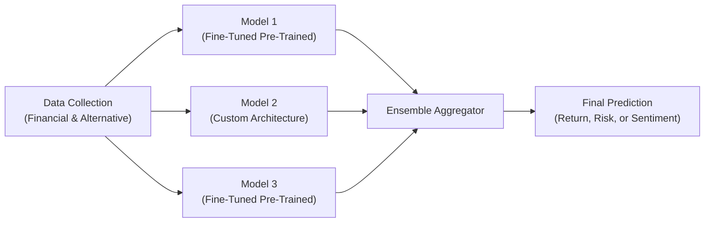

## Foundations of Deep Ensembles

Deep ensembles revolve around the idea that multiple neural networks, when appropriately combined, often outperform any single network. This is reminiscent of the classic saying “two heads are better than one,” but taken to the next level for finance datasets, which can be massive, messy, and sometimes incomplete. By blending several models, each with slightly different architectures, training data subsets, or hyperparameter configurations, we reduce the variance of our final prediction. That’s because each “specialist network” sees the data from a unique angle, and blending them captures a more robust—and usually more accurate—view.

Anyway, I remember the first time I tried to predict daily stock returns using just a single neural network. The predictions were so volatile that they gave me a few more gray hairs. Then I tried an ensemble of smaller networks, and the improvements were almost immediate. While not perfect, ensemble predictions were far more stable, and I felt more comfortable trusting them for portfolio construction tasks.

In the context of the CFA Level II exam, deep ensemble methods might appear in item sets where you have to select the best strategy for improving a machine learning model’s performance. Candidates should be ready to explain how ensemble methods can reduce overfitting and improve generalization—strong exam-relevant knowledge for real-world investment analysis.

## Why Ensembles Matter in Finance

Financial data is notoriously noisy. Prices, returns, and macro indicators can be influenced by countless events or behaviors. One day’s price jump might come from macroeconomic releases (e.g., a surprising change in inflation), while the next day’s shift might be due to a corporate earnings surprise or even a social media rumor. Such noise can cause a single neural network to latch onto patterns that don’t generalize, leading to big regrets later.

Producing multiple models—each slightly different—and then aggregating their outputs is a way to “spread out the risk” of overfitting. For example, one ensemble member might focus more on macro indicators, another might focus on fundamentals, a third might inadvertently pick up seasonal patterns, and so on. When we combine them, we end up with an aggregate result that’s often more balanced and robust.

## Common Ensemble Approaches

### Bagging (Bootstrap Aggregating)

Bagging typically involves training each model on a bootstrapped version of the dataset. A bootstrapped version is created by sampling the original training data with replacement. So, each deep neural network sees a slightly different set of observations, possibly with duplicates. Bagging is especially handy for finance use cases when your dataset is large (e.g., daily returns for 1,000 stocks over 10 years). Even with big data, neural networks can overfit, so giving each network a divergent experience helps weed out spurious relationships.

After training, you average (or otherwise aggregate) their predictions. In finance, you might average predicted returns or projected default probabilities to get a final, more confident estimate. It’s straightforward but often surprisingly effective.

### Boosting

Boosting is like repeatedly improving your model by learning from mistakes. You begin with a single network (or a simple model), which will inevitably make errors. Then, in each subsequent “round,” you tweak the training process to focus more on the data points that gave you trouble earlier. Think of it as an iterative correction tool—your ensemble learns to pay extra attention to all the places it went wrong before.

You’ll often see boosting used in more structured data contexts, like credit risk modeling or predicting corporate defaults. Each iteration hammers away at the residual errors from the previous round. Boosted ensembles can be powerful but can also overfit if you push them too far—especially in time series forecasting or volatile financial data. Always watch for that dreaded overfitting (we’ll talk more about that soon).

### Stacking

Stacking (or “stacked generalization”) is a two-layer approach. In the first layer, you train multiple base models (e.g., several deep neural networks or a blend of a neural net, a random forest, and a gradient-boosted trees model). Then you feed the predictions of these base models into a so-called “meta-learner” (often another neural network or a regression model) that figures out how best to combine them.

This approach can be particularly useful in finance if you want to combine signals from diverse modeling philosophies. For instance, you could simultaneously run one neural network that uses purely fundamental features, another that uses macroeconomic time-series data, and a third that uses textual sentiment from news. Then, stacking uses a “referee model” to weigh each base model’s predictions. You end up with a single, more robust output that draws on each base model’s strengths.

## Model Diversity and Risk Mitigation

The beauty of deep ensembles is that we can encourage each model to be distinct. Some common ways:

• Different Network Architectures: Maybe one is a recurrent neural network (RNN) to handle time series, while another is a feed-forward network focusing on cross-sectional data.  
• Hyperparameter Tweaks: Vary the learning rates, batch sizes, or hidden layer sizes.  
• Data Sampling: Bagging is a form of data sampling, but you might also try different data segments (for instance, focusing on different sub-periods in a time series).  

For finance tasks, building model variety can keep your predictions more balanced. If all your models are identical, your ensemble will just replicate a single model’s output—no real gain.

## Uncertainty Estimates and Risk Modeling

An ensemble can do more than just give a final prediction; it can help you gauge uncertainty. Essentially, if the outputs of the individual networks differ wildly from each other, that’s a clue that the final ensemble forecast is “less certain.” In risk management settings (e.g., Value at Risk calculations or stress tests), understanding the confidence interval around a predicted outcome is critical. With ensembles, you can glean an intuitive sense of that confidence by looking at how dispersed the ensemble members’ forecasts are.

Some advanced approaches even treat the ensemble as a Bayesian approximation, giving you a posterior distribution over predictions. While that might be overkill for typical exam item sets, it’s definitely relevant if you’re analyzing tail risks or extreme scenarios in practice.

## Integrating Deep Ensembles into Fundamental Analysis

In fundamental factor models, you might incorporate an ensemble module to estimate earnings growth or discount rates more precisely. Suppose you have a deep network focusing on traditional balance sheet metrics, another that’s purely analyzing news sentiment for each company, and yet another that’s analyzing industry-level macro data. You can ensemble their forecasts of next-quarter earnings and feed that aggregated forecast into a discounted cash flow (DCF) model. By harnessing multiple viewpoints, you often get a more consistent fundamental input to your valuation.

This synergy is a perfect illustration for a CFA exam scenario. You might see a vignette describing an investment manager who’s deciding between a single neural network or multiple distinct networks. Then they show hypothetical performance measures, requiring you to highlight how ensembles can reduce volatility and produce more stable estimates.

## Transfer Learning: Reusing Knowledge for Financial Tasks

Transfer learning is the strategy of taking a model that’s been trained on one massive task—often unrelated to finance—and adapting (or “transferring”) it to a new, smaller financial dataset. In deep learning, especially with advanced language models, we can leverage enormous pre-trained networks (like those originally trained on billions of sentences) and fine-tune them to detect sentiment in a limited set of financial documents.

### Saving Time and Costs

Training huge models from scratch is expensive—both financially and computationally. Instead of devoting months of GPU time to build a large language model from zero, you can “borrow” an existing pre-trained model and adapt it in a fraction of the time. I once tried to train a small language model on my personal finance text corpus from scratch—my laptop nearly overheated. Eventually, I bit the bullet, used a pre-trained model, and within a couple of hours, I had results. Transfer learning is a total game-changer in this regard.

### Example: FinBERT for Financial Text

FinBERT is a specialized derivative of the BERT language model, fine-tuned for financial contexts. It’s often used to classify the sentiment of analyst reports or identify relevant risk disclosures. For instance, if you want to sift through 10,000 earnings call transcripts to see which ones contain “cautious language,” FinBERT’s pre-trained parameters provide a massive head start. Then, you do a final fine-tuning step with your specific domain tags (e.g., “positive,” “negative,” “uncertain”) on a labeled finance dataset.

### Domain Adaptation

Domain adaptation is essentially transfer learning for specialized contexts. Suppose you have a pre-trained image recognition model. Maybe it recognizes cats and dogs. That’s not obviously relevant for finance, right? But if you had access to satellite imagery of retail parking lots (a real example used by some hedge funds), you could adapt that model to detect foot traffic for big-box stores. The base model’s knowledge of how to interpret shapes and objects is transferred, and you simply teach it what a “parking lot pixel” means in your domain.

## Fine-Tuning for Finance

Once you have your pre-trained model, you typically replace the final layers (or unlock all or some layers) and fine-tune them on your new dataset. For smaller, specialized tasks, you might freeze most of the network’s layers and only update the last layer. For bigger tasks, you might unfreeze more layers and train further. In finance, the best approach depends on your dataset’s size and complexity:

• If your new task is extremely similar to the original training task, you might only need slight adaptation.  
• If it’s quite different, you might unfreeze more layers and feed in labeled data to “re-learn” crucial aspects.  

Regardless, in the exam context, if a question asks about “transfer learning,” be ready to discuss both the benefits (time, cost, performance, domain knowledge) and the trade-offs (potential mismatch between original and new domain, risk of overfitting a smaller dataset).

## Combining Transfer Learning with Ensembles

Deep ensembles and transfer learning aren’t mutually exclusive. You can ensemble multiple fine-tuned pre-trained models that each capture distinct aspects of the target domain. For instance, you might have one ensemble member that’s a smaller specialized version of FinBERT for technical product disclosures, another that’s a more general sentiment model, and a third that’s a model for market chatter on social media. Stacking or bagging these models can yield more robust textual analysis feeds into your ultimate pricing or risk model.

## Best Practices and Avoiding Overfitting

Financial data can be tricky, so you want to be extra careful with model validation. Overfitting remains a major concern when building large ensembles or transferring models to smaller datasets:

• Cross-Validation: Standard k-fold cross-validation is a decent start for cross-sectional data. For time series data, consider a “walk-forward” or rolling-window validation. This ensures you simulate the real forecasting process and avoid peeking at future data.  
• Out-of-Time Testing: Reserve a distinct period that your model never sees during training. In finance, markets evolve, so a model that shines in 2018 might fail in 2022 if not tested properly.  
• Limited Fine-Tuning: If the dataset is small, over-optimizing your entire deep network could lead to memorization. Freeze the bulk of the model’s layers and only fine-tune the last few layers.  
• Ensemble Diversity: If your ensemble members are too similar, the benefits dwindle. Ensure diversity by using varied initializations, architectures, or training subsets.  

A common pitfall on the CFA exam is ignoring the time dimension in validation. Many times, candidates treat financial time series data like it’s an ordinary i.i.d. dataset. They might shuffle it randomly for cross-validation, inadvertently introducing future knowledge into the training set. Doing so can yield overoptimistic results that crumble in real practice. Mentioning an out-of-time test can be a good way to demonstrate exam-ready best practices.

## Practical Mermaid Diagram: Ensemble Pipeline

Below is a simple mermaid diagram that summarizes how you might set up a deep ensemble pipeline, combining pre-trained models and newly trained networks:



Each pathway represents a distinct approach or architecture. The ensemble aggregator is where predictions merge, potentially with weighting or a meta-learner. This final output might estimate daily returns, classify market news sentiment, or assess credit risk—depending on your finance application.

## Small Python Example

Here’s a tiny illustrative snippet in Python (using a pseudo-framework) to show how you might ensemble predictions:

```python
import numpy as np

# Each model has a predict() method that returns an array of predicted returns
def ensemble_predict(data, models):
    predictions = [model.predict(data) for model in models]
    # Simple average
    return np.mean(predictions, axis=0)

# data = ... # your test set features
# final_preds = ensemble_predict(data, models)
```

Of course, real-world use cases are more complex, possibly weighting each model’s prediction differently or using a separate meta-learner. But the main idea remains: combine results from multiple networks for a final, consolidated forecast.

## Ethical and Professional Standards

When employing advanced models, always adhere to the CFA Institute’s Code of Ethics and Standards of Professional Conduct. Be sure you:

1. Disclose any use of complex models to clients if it significantly influences trade decisions.  
2. Maintain transparency about potential biases or limitations.  
3. Safeguard confidential data and avoid misusing alternative data (like social media sentiment) if it violates privacy or data ownership rights.  

Ethical usage of client data, especially in large-scale text mining, is vital. If your domain adaptation approach uses private transcripts, confirm you have the right to do so. Ethical lapses or data misuse not only threatens your firm’s reputation but can also lead to compliance inquiries.

## Exam Tips

• Be prepared to identify scenarios in vignettes where deep ensemble methods provide more stable forecasts than a single model.  
• Highlight how transfer learning can drastically cut down modeling costs and time.  
• Watch for red flags of overfitting: suspiciously high performance in sample but poor performance in a separate time window.  
• Understand the difference between bagging, boosting, and stacking. The exam might test your knowledge of how each technique handles errors or combines predictions.  
• Emphasize domain adaptation if you see a scenario describing the use of external pretrained models from a slightly different field.  

## Glossary

Ensembles: Combinations of multiple models that often yield improved prediction performance.  
Bagging (Bootstrap Aggregating): Training multiple models on bootstrapped subsets of the data and averaging their predictions.  
Boosting: Incrementally refining an ensemble by focusing on errors made by previous models.  
Stacking: Training a meta-learner to optimally combine predictions of base models.  
Pre-Trained Model: A neural network already trained on a large dataset.  
Fine-Tuning: Taking a pre-trained model and updating its weights on a new dataset to adapt the model to a new task.  
Domain Adaptation: Making a model trained in one domain effective in another domain that has some structural differences.

## References and Further Reading

• Zhi-Hua Zhou, “Ensemble Methods: Foundations and Algorithms,” for an in-depth look at diverse ensemble strategies.  
• C. Olah’s Blog on Deep Neural Nets Visualization: <http://colah.github.io/> – a great resource for understanding how these models “see” data.  
• “FinBERT: Financial Sentiment Analysis” by Yang et al., SSRN.  
• For best practices on building robust financial time series models, see the official CFA Curriculum references on quantitative methods and machine learning.  

---

## Test Your Knowledge: Deep Ensembles and Transfer Learning in Finance



### Which of the following best describes the primary motivation for using deep ensembles in finance?

- [ ] They reduce the dimensionality of large datasets.  
- [x] They decrease model variance by blending multiple neural network predictions.  
- [ ] They allow for faster testing of financial hypotheses.  
- [ ] They eliminate the risk of overfitting entirely.  

> **Explanation:** Deep ensembles combine multiple models to reduce overall variance and improve out-of-sample performance. They do not fully eliminate overfitting risk but do help mitigate it.

### How does bagging (Bootstrap Aggregating) typically train models in an ensemble?

- [ ] By focusing on the errors of previous models.  
- [x] By training each model on a bootstrapped sample of the dataset.  
- [ ] By only training on out-of-time data.  
- [ ] By having a meta-learner combine predictions of sub-models.  

> **Explanation:** Bagging uses random subsets of data (with replacement) to train each model independently and then averages their results.

### Which statement accurately differentiates boosting from bagging?

- [x] Boosting iteratively adjusts to errors in previous models, while bagging trains models independently on bootstrapped samples.  
- [ ] Boosting uses resampling, but bagging does not.  
- [ ] Bagging produces a single combined model, whereas boosting trains one model.  
- [ ] Bagging is used exclusively for time series, whereas boosting is used solely for cross-sectional data.  

> **Explanation:** Boosting focuses on the residuals or errors from prior models and iteratively improves performance. Bagging trains models on random subsets, independently.

### In a stacked ensemble (stacking), what is the role of the meta-learner?

- [ ] To identify outliers in the data.  
- [ ] To randomly sample subsets of the data for each model.  
- [x] To learn how to optimally combine predictions from base models.  
- [ ] To freeze the network weights during transfer learning.  

> **Explanation:** Stacking trains a meta-learner to weigh or combine the predictions of base models, generating one final enhanced prediction.

### When is transfer learning most beneficial in a financial application?

- [x] When you have a relatively small dataset but can access a large pre-trained model.  
- [ ] When you plan to retrain all layers of a model from scratch.  
- [ ] When computational resources are unlimited.  
- [ ] When the domain of the pre-trained model is completely unrelated to finance.  

> **Explanation:** Transfer learning shines when you have limited data in a specialized domain and can adapt a larger pre-trained model instead of rebuilding from scratch.

### Which term refers to adapting a model from one domain to a somewhat different, but related, domain?

- [ ] Fine-tuning  
- [ ] Bagging  
- [ ] Bootstrapping  
- [x] Domain adaptation  

> **Explanation:** Domain adaptation is the process of making a model work well in the new, slightly different environment or data distribution.

### Why should out-of-time testing be employed when validating ensemble models in finance?

- [x] To evaluate how well the model performs on a time period not used in training and avoid look-ahead bias.  
- [ ] To generate more synthetic data for training.  
- [x] To ensure that the model uses future data to calibrate current predictions.  
- [ ] To estimate the model’s cost efficiency.  

> **Explanation:** In finance, markets evolve over time. Using an out-of-time sample prevents the model from implicitly learning future trends in the training phase and provides a realistic performance check.

### Which of the following is a primary advantage of ensembles for risk estimation?

- [x] They can capture the dispersion of individual network forecasts for confidence intervals.  
- [ ] They fully eliminate all biases in data.  
- [ ] They automatically identify the best hyperparameters.  
- [ ] They ensure the final model is universally valid across all markets.  

> **Explanation:** Observing the spread in predictions across ensemble members can inform how certain or uncertain the model is about its forecasts, which is valuable for risk management decisions.

### In a typical stacking framework, which step best aligns with the concept of a “meta-learner”?

- [ ] Training multiple neural networks on bootstrapped samples.  
- [ ] Selecting only the best network for production.  
- [x] Fitting a final model that optimally uses the base models’ predictions as features.  
- [ ] Using a single combined training dataset for all parent models.  

> **Explanation:** Stacking (stacked generalization) involves training base learners separately and then having a meta-learner process their outputs to produce a final, more refined prediction.

### True or False? “In finance, an ensemble of fine-tuned pre-trained models can be used to achieve more robust sentiment analysis than a single model.”

- [x] True  
- [ ] False  

> **Explanation:** Utilizing multiple fine-tuned pre-trained models with different specialties or hyperparameters often leads to more stable and accurate sentiment analysis results due to the ensemble’s variance reduction.


