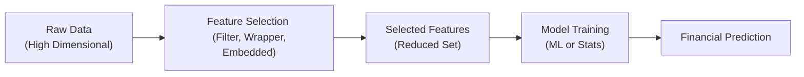

## Introduction
I remember back in the day when I first tried to build a quantitative model for my own little portfolio (well, I thought it was big at the time). I stuffed in every possible variable—price multiples, sentiment scores, yields, technical signals, you name it—because I figured more data meant more insights. But guess what? I found myself staring at a monstrous, overfitted beast that was about as stable as, well, a house of cards. It turns out that cramming in every tea leaf you can find isn’t the best strategy. In fact, in financial modeling, careful and deliberate feature selection and engineering can be the difference between a robust predictive model and an absolute meltdown.

That’s why we’re going to talk about automated feature selection and engineering. You see, in finance, noise can be high, markets can shift, and relevant signals are often sparse. Being strategic about which inputs you use (and how you transform them) is absolutely critical.

## Importance of Feature Selection for Finance
Financial datasets can be messy. They often include thousands (or even millions) of data points from market prices to macroeconomic indicators, social media sentiment, corporate filings, alternative data streams, and more. Yet the true “signal” that helps you forecast asset price movements or credit risk might be buried in a sea of irrelevant or redundant features. If you just throw everything into a model, you risk:

• Overfitting: The model picks up random quirks in your training data.  
• Longer training times: More features means more computation.  
• Interpretability issues: It’s hard to explain a black-box that uses too many unvetted features.  
• Data cleaning nightmares: Maintaining so many variables can create data hygiene nightmares (missing data, measurement errors, look-ahead bias, etc.).

Feature selection is essentially about trimming the fat—finding the minimal set of predictive and relevant features so your model is nimble, generalizes better, and remains interpretable for investment decisions.

## Filter Methods
Sometimes, the simplest approach is the best place to start. Filter methods rank the importance of features by looking at statistical relationships with the target variable—before training a more complex model. Common approaches include computing correlations or using mutual information to gauge how strongly a feature interacts with the outcome. In finance:

• Correlation-based selection might measure relationships (e.g., Spearman’s rank correlation) between an indicator and future returns.  
• Mutual information can capture more complicated, potentially nonlinear relationships.

The advantage of these methods is that they’re super fast. You don’t train a full model for each potential feature. As a result, you can quickly discard obviously useless features. However, filter methods won’t necessarily capture interactions between multiple variables, so they can be a bit naive.

## Wrapper Methods
When you have more time or your dataset isn’t gargantuan, wrapper methods can help you dig deeper. These methods train an actual predictive model (like a regression, a random forest, or some fancy deep net) on various subsets of features. They evaluate the model’s performance each time to figure out which combination of features yields the best results. 

One popular approach is Recursive Feature Elimination (RFE). Here’s how it generally works:

1. Train the model on all features.  
2. Rank the importance of each feature according to the model.  
3. Drop the least important ones.  
4. Re-train and repeat until you’re left with the desired number of features.

It’s a bit like weeding a garden: train, prune a few features, see how it looks, prune some more, and so on. Now, a big friendly warning: wrapper methods can be quite computationally expensive—especially in large-scale financial applications where you might have thousands of potential input variables.

Here’s a quick snippet in Python that shows how RFE might work with a logistic regression:

```python
import pandas as pd
import numpy as np
from sklearn.feature_selection import RFE
from sklearn.linear_model import LogisticRegression

model = LogisticRegression()
rfe = RFE(model, n_features_to_select=5)  # We want top 5 features
rfe.fit(X, y)
selected_features = X.columns[rfe.support_]
print("Selected features:", selected_features)
```

## Embedded Methods
Embedded methods bring the best of both worlds: the feature selection occurs during the process of fitting the predictive model. Regularization-based techniques such as Lasso (L1 penalty) and Ridge (L2 penalty) are classic examples:

- Lasso sets some coefficients to exactly zero, effectively removing them from the model.  
- Ridge shrinks coefficients but usually doesn’t drop them entirely.  
- Elastic Net combines the strengths of both Lasso and Ridge.

In many financial applications—like factor investing—Lasso can be a sweet approach if you suspect that only a small subset of potential factors truly drives returns. For instance, you might test 100 macro factors but suspect only a handful are actually relevant. Lasso can systematically push irrelevant factors’ coefficients down to zero, simplifying your model. Just be aware that heavily regularized approaches can sometimes underfit or remove features that might be relevant in certain market regimes.

## Automated Approaches: Genetic Algorithms & More
For large-scale problems, we can use more advanced meta-heuristics:

• Genetic Algorithms (GAs) or Evolutionary Strategies: Start with a random set of features, measure performance, and iteratively “evolve” a population of feature sets by combining or mutating them. Think “survival of the fittest features.”  

• Automated Model-Based Selection: Tree-based ensembles (e.g., random forest, gradient boosting machines) often provide a ranking of feature importance without additional overhead. You can take these rankings, prune the less important features, and hone in on the top “leaves.”

These methods can be especially fun (though sometimes frustrating) in finance because they can unearth strange combos of variables—like specific text-based sentiment plus certain macro variables—that might not otherwise appear strongly correlated using simpler filter methods. But watch out for overfitting. The more flexible your approach to discovering weird relationships, the higher your chance of stumbling upon random noise that performs well in-sample.

## Addressing Challenges in High-Dimensional Finance
As new sources of data multiply—social media posts, satellite imagery, credit card transactions, text from earnings calls, etc.—financial analysts can easily have thousands of features. Handling these huge sets is not trivial:

• Overfitting is a constant threat: always do out-of-sample testing or cross-validation.  
• Data cleaning is nonnegotiable: garbage in, garbage out.  
• Computation time can spiral: a large-scale wrapper or GA might be infeasible for real-time portfolio decisions.

One best practice is to do a quick filter pass (like correlation or mutual information) or dimension reduction first, then use a more computationally heavy approach (like RFE or GAs) on the smaller reduced set of features. Also, be mindful of “look-ahead bias”—you should only use data that was available at the time of the forecasts.

## Diagram: The Feature Selection Process
Below is a Mermaid diagram that outlines an example pipeline from high-dimensional data to final predictions. Notice how feature selection sits in the middle, bridging raw data exploration and efficient model training.



## Advanced Transformations
Sometimes, we don’t just select features; we transform them to create new, more informative ones. Two notable techniques:

• Principal Component Analysis (PCA): a time-tested linear approach that rotates your feature space into orthogonal “principal components” capturing most variance in fewer components. However, component interpretability can be tricky: if your PCA-based factor is a blend of 30 macro signals, it’s not exactly intuitive which economic force it represents.

• Autoencoders: these are neural networks trained to compress and then reconstruct the data, effectively learning a condensed representation (the encoded layer). This approach can discover deep nonlinear structures, but you need to track how those encoded representations correlate with fundamental financial signals and ensure you’re not just capturing spurious patterns.

In finance, it’s common to see these advanced transformations used for dimensionality reduction in large and complex data sets, such as scraping textual data from earnings calls. But a major note of caution—lack of interpretability can hamper you if you’re required to provide rationales for your trades or comply with certain regulatory constraints.

## Practical Tips and Data Hygiene
Every time you do feature selection or feature engineering, keep the following in mind:

• Separate in-sample vs. out-of-sample data. You’d be surprised how often folks inadvertently cheat by using future data in their transformation steps.  
• Use cross-validation. If a set of features only works well on one subset of data, it might be random noise or overfit.  
• Document your transformations. Nothing is worse than forgetting how you built that “mystery factor” that used to predict returns flawlessly.  
• Validate your approach in different market regimes if possible. Some features might only matter in bull markets or during recessions.

Finally, remain aware of the interplay between multiple features, especially if you rely heavily on macro variables or textual data. Interaction effects can be subtle yet critical.

## A Brief Case Example
Let’s say you’re building a machine learning model to forecast next-month stock returns. You start with:

1. 1,000 potential features (e.g., momentum indicators, macro data, sector, textual sentiment, etc.).  
2. You run a correlation-based filtering step and drop 700 that either have near-zero correlation or just redundant readings.  
3. With 300 left, you apply Lasso regression (an embedded method) in a cross-validation loop. You discover that only 12 features get nonzero coefficients consistently.  
4. You then test these 12 features in an out-of-sample period, checking performance over two years.  
5. The final model ends up with an annualized alpha of, let’s say, 5%, which is not too shabby—especially if your baseline is near zero net-of-costs.

Of course, you must continuously monitor these features. Market conditions change, so your once-perfect features might degrade. Revisiting the selection pipeline regularly, say quarterly, is usually a good practice.

## Key Terms (Glossary)
• Feature Selection: The process of identifying the most relevant inputs (features) for a predictive model.  
• Feature Engineering: Transforming and creating new variables to help a model better capture the underlying relationships in the data.  
• Filter Method: A technique that selects features based on simple, stand-alone statistics (e.g., correlation, mutual information).  
• Wrapper Method: An approach that repeatedly trains a predictive model on various subsets of features to see which subset yields the best performance.  
• Embedded Method: A method that performs feature selection during the model training itself (e.g., Lasso).  
• Genetic Algorithm: A nature-inspired search technique that evolves subsets of features, mimicking the concept of survival of the fittest.  
• Autoencoder: A type of neural network that learns a compressed representation (encoding) of the data, used for dimensionality reduction or denoising.

## Conclusion
Automated feature selection and engineering can hugely enhance your quantitative models in finance. By carefully pruning or transforming features, you reduce the risk of chasing random noise and build models that are more robust, interpretable, and hopefully more profitable. It’s an iterative and sometimes messy process—kind of like rummaging through a closet full of data trying to find that perfect outfit. But with the right combination of filter, wrapper, and embedded methods (plus a dash of advanced transformations), you’ll be well on your way to discovering precious signals buried in the noise.

In the end, remember that each dataset, market regime, and investment strategy might demand a slightly different approach. Keep your data squeaky clean, your cross-validation rigorous, and your sense of curiosity alive.

## References and Further Reading
- Kuhn, M., & Johnson, K. (2013). Applied Predictive Modeling.  
- Kelleher, J. D., Mac Namee, B., & D’Arcy, A. (2015). Fundamentals of Machine Learning for Predictive Data Analytics.  
- Scikit-learn Feature Selection Documentation:  
  https://scikit-learn.org/stable/modules/feature_selection.html  

## Test Your Knowledge: Automated Feature Selection and Engineering Quiz



### Which of the following best describes why feature selection is important for financial data?

- [ ] It eliminates the need for time-series analysis.  
- [x] It helps control overfitting and reduces noise by focusing on the most relevant predictors.  
- [ ] It ensures linear relationships only.  
- [ ] It avoids all forms of data cleaning.  

> **Explanation:** By focusing on the most relevant predictors, we avoid overfitting and reduce noise. Feature selection does not eliminate time-series analysis or data cleaning requirements, nor does it ensure linear relationships.

---

### In filter methods, features are selected primarily based on:

- [ ] A genetic algorithm that iteratively prunes features.  
- [ ] Dynamic time warping.  
- [x] Simple statistical measures like correlation or mutual information.  
- [ ] Cross-validation with Lasso penalty.  

> **Explanation:** Filter methods rely on straightforward statistics (e.g., correlation) to evaluate features before passing them into a more complex model.

---

### Which statement about wrapper methods is most accurate?

- [x] They retrain models multiple times on different subsets of features.  
- [ ] They do not require a predictive model at any point.  
- [ ] They are usually the most computationally efficient.  
- [ ] They don’t need cross-validation.  

> **Explanation:** Wrapper methods train a predictive model on various subsets of features, evaluating performance each time, which can be computationally expensive.

---

### Lasso (L1 penalty) is known for:

- [ ] Adding constant values to all feature coefficients.  
- [ ] Ensuring all features maintain minimal nonzero weights.  
- [x] Driving many coefficients exactly to zero, effectively performing feature selection.  
- [ ] Only shrinking coefficients, never setting them to zero.  

> **Explanation:** Lasso uses an L1 penalty that forces some coefficients to zero, acting as an embedded feature selection method.

---

### Which approach best describes a genetic algorithm for feature selection?

- [ ] Exhaustively checking every subset of features.  
- [x] Evolving subsets of features based on a survival-of-the-fittest principle.  
- [ ] Applying principal component transformations.  
- [ ] Using correlation measures for feature scoring.  

> **Explanation:** Genetic algorithms borrow inspiration from natural selection, combining and mutating feature subsets to discover better solutions over generations.

---

### A key risk of feature selection in finance is:

- [ ] Having too few available features to choose from.  
- [ ] It guarantees perfectly stable models in all markets.  
- [x] Overfitting if the selection process itself is not consistently validated.  
- [ ] It eliminates ways to reduce dimensionality.  

> **Explanation:** Overfitting remains a central risk, particularly if feature selection and validation are performed inadequately, leading to spurious relationships being chosen.

---

### Which statement correctly portrays filter methods vs. wrapper methods?

- [x] Filter methods use statistical tests and do not retrain many models, while wrapper methods test multiple subsets by retraining a model.  
- [ ] Filter methods rely on a GA, wrapper methods rely on correlation.  
- [ ] Both approaches rely on L1 penalties.  
- [ ] Wrapper methods cannot overfit.  

> **Explanation:** Filter methods use simpler statistical metrics without repeatedly training models, whereas wrapper methods involve retraining a predictive model on various feature subsets.

---

### What is one advantage of applying tree-based models for feature ranking?

- [ ] They require no computational resources.  
- [x] They can capture nonlinearities and interactions among features.  
- [ ] They only work with PCA-transformed data.  
- [ ] They automatically use L1 penalties for selection.  

> **Explanation:** Tree-based methods (e.g., random forests) naturally model nonlinear relationships and interactions, and they provide importance scores that guide feature selection.

---

### A potential drawback of using PCA for feature engineering is:

- [x] Difficulty interpreting the principal components in a purely financial context.  
- [ ] Inability to reduce dimensionality effectively.  
- [ ] Requirement of an L1 penalty.  
- [ ] High correlation with the response variable is guaranteed.  

> **Explanation:** While PCA effectively reduces dimensionality, the new components are linear combinations of original features, making financial interpretation more challenging.

---

### True or False: Autoencoders perform dimensionality reduction by learning a compressed representation of the data.

- [x] True  
- [ ] False  

> **Explanation:** Autoencoders are neural networks that force a bottleneck in the architecture, learning to encode and then reconstruct the data, thus performing a form of dimensionality reduction.


