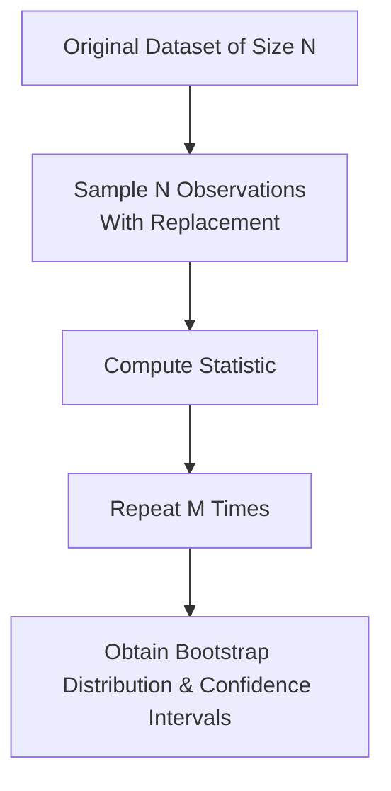

## Introduction
Have you ever found yourself staring at a set of financial returns, thinking there’s no way they’re truly “normal” but still feeling stuck because the usual parametric formulas keep whispering “assume normality”? Yeah, me too. In reality, financial data can be messy, have fat tails, or display weird aseasonal patterns (looking at you, emerging markets). This is exactly where bootstrapping comes to the rescue.

Bootstrapping is a resampling method that helps us infer the statistical properties of our data or models without shackling ourselves to rigid distributional assumptions. It’s used a lot in Monte Carlo simulations and scenario analysis for risk management, portfolio performance attribution, and even checking the reliability of your carefully calibrated regression coefficients. But we can’t stop there—what if your data is time-dependent and you have autocorrelation among your daily returns? Plain vanilla bootstrapping might shatter those correlations. Enter block bootstrapping, which partitions data into blocks to preserve those precious patterns.

Let’s explore how bootstrapping works, how block bootstrapping extends that idea for time series, and why these techniques are so darn practical for finance professionals wrangling complex real-world data.

## Basic Concepts of Bootstrapping
### Why Bootstrapping?
Classic (parametric) statistical inference typically demands assumptions—like “returns are normally distributed” or “residuals are i.i.d.” (independent and identically distributed). If your data doesn’t really behave that way (which in finance, it often doesn’t), parametric approaches can yield misleading confidence intervals, p-values, or risk estimates.

Bootstrapping, in contrast, is distribution-agnostic. Instead of assuming a specific distribution, it uses the empirical distribution of your observed data. In simpler terms: if you trust your dataset is somewhat representative of the underlying process, you can keep sampling from it—even with replacement—over and over until you get a sense of how your statistic of interest (like a mean return or a regression coefficient) behaves.

### The Core Algorithm
Here’s a four-step simplified overview of bootstrapping:

1. From your original dataset of size N, randomly draw a sample of size N with replacement. (That means some observations might appear multiple times, while others might not appear at all in that resampled set.)
2. Compute the statistic of interest (e.g., average return, volatility, coefficient from a regression).
3. Repeat steps 1 and 2 a large number of times—say 1,000 or 10,000—to build an entire distribution of that statistic.
4. Derive your confidence intervals or risk measures from that empirical distribution.

To visualize it:



In financial research, you might do this for mean returns to see the range of possible portfolio returns or for regression slope coefficients to measure alpha’s significance while relaxing the usual normality assumptions.

### Independence Requirement
Standard bootstrapping basically requires that observations be independent from one another. If your data is i.i.d. (independent and identically distributed), the typical bootstrap approach should be just fine. However, as soon as you suspect autocorrelation, especially in time series like daily returns or yield changes, you no longer have strict independence. That’s where block bootstrapping steps in.

## Block Bootstrapping for Dependent Data
### Why Block?
Many financial time series exhibit correlation over time—stock returns on consecutive days, for instance, may not be perfectly independent. Plain bootstrapping that treats each data point as an independent draw could scramble the time dependencies. If the objective is to preserve correlation patterns or seasonal effects, you can group the data into “blocks” and sample those blocks instead of sampling single observations. This ensures each chunk of resampled data retains the within-block correlation.

### Moving-Block vs. Stationary Block Bootstrap
1. Moving-Block Bootstrap:  
   - Divide your time series into consecutive blocks of a fixed length (say, 5 days or 20 days).  
   - Randomly draw from these blocks (with replacement) to build your new resampled series.  
   - The block size should ideally be large enough to capture the main correlation structure but not so large that your resampled data is basically the same sequence repeated.

2. Stationary Block Bootstrap:  
   - A more flexible variant that chooses both the starting position and the block lengths randomly.  
   - This approach can help in situations where the time series is not strictly stationary or if the correlation length changes over time.  

Either way, block-based methods aim to mirror the original temporal structure. Returns from day 1 to day 5 in a block stay together, removing the risk of day 1 re-sampling with, say, day 97, which might make no sense if those data points are strongly correlated.

## Practical Applications in Finance
### 1. Confidence Intervals for Regression Coefficients
Suppose you’re running a multiple regression of fund returns on various factor exposures (e.g., market, size, value). The classical approach might assume normality of residuals. If you can’t be sure—and often you can’t—bootstrapping can yield robust confidence intervals for alpha and beta estimates. Re-sample your regression’s data (maintaining i.i.d. assumptions or using block bootstrapping if the data is time-series) and record the distribution of estimated coefficients each time. Then you’re free from worrying whether your t-statistic meltdown is valid under normal assumptions.

### 2. Portfolio Performance Evaluation
Ever wonder how stable your performance metrics (like Sharpe Ratio or Jensen’s alpha) really are? Use bootstrapping to simulate alternative return paths from your actual historical data. Repeatedly measuring these performance metrics across bootstrap samples will produce a distribution that shows how consistent your results might be. If that alpha keeps shifting from +5% to -2%, it might indicate your “edge” is not so stable after all.

### 3. VaR and Expected Shortfall
Value at Risk (VaR) and Expected Shortfall (ES) are major risk metrics that rely on the distribution of returns. Rather than fitting a parametric distribution (like a normal or Student’s t) that might not hold for tail events, you can do a bootstrapped approach: repeatedly draw from your historical series, compute the portfolio returns, and measure the losses at certain quantiles. If your returns are time-dependent, block bootstrapping is especially valuable to keep clusters of volatility or momentum effects intact.

### 4. Stress Testing and Scenario Simulation
Along with broader Monte Carlo simulations, bootstrapping helps you develop “alternative histories.” For instance, you could combine bootstrapped scenarios with known stress periods—like re-sampling blocks heavily from the 2008 crisis era—to see how your portfolio might fare in repeated crisis-like conditions.

## Code Example: Simple Python Bootstrapping
Here’s a tiny snippet to illustrate how one might code up a naive bootstrap in Python for a dataset on daily returns:

```python
import numpy as np

def bootstrap_mean(returns, num_iterations=1000):
    n = len(returns)
    means = []
    for _ in range(num_iterations):
        sample = np.random.choice(returns, size=n, replace=True)
        means.append(np.mean(sample))
    return np.array(means)

returns = np.array([0.01, 0.02, -0.005, ...])  # Fill with real data
boot_means = bootstrap_mean(returns, num_iterations=5000)

lower_bound = np.percentile(boot_means, 2.5)
upper_bound = np.percentile(boot_means, 97.5)
print(f"95% CI for mean return: [{lower_bound:.4%}, {upper_bound:.4%}]")
```

If your data has time-dependence, you’d adapt this to collect blocks instead of single observations.

## Advantages and Limitations of Bootstrapping
### Advantages
• Fewer distributional assumptions: Works well with non-normal, fat-tailed data.  
• Flexible: Straightforward to apply to many statistical measures (variance, regression coefficients, Sharpe Ratios, etc.).  
• Empirical grounding: Derives from actual data patterns, not hypothetical ones.  

### Limitations
• Dependence on sample representativeness: If your historical period is unrepresentative of future conditions (structural changes, one-off events), bootstrapping might mislead.  
• Computational intensity: Doing thousands (or tens of thousands) of resamples can be heavy if you’re dealing with big data.  
• i.i.d. assumption in basic bootstrap can be invalid if your data is autocorrelated—hence the need for block bootstrapping or other variants.  

## Common Pitfalls
• Incorrect Block Size: Choose block sizes too large, and you’re basically repeating big chunks of data over and over. Choose them too small, and you lose correlation context.  
• Overlooking Regime Shifts: Bootstrapping with, say, a pre-crisis dataset might yield confidence intervals that are nowhere near relevant for a post-crisis environment.  
• Underestimating Rare Events: Just because your dataset doesn’t have many extreme tail events doesn’t mean they won’t occur. Bootstrapping can only “re-emphasize” what’s already in the data.  

## Exam Relevance and Tips
In the CFA Level II exam item sets, you might see an investment scenario where returns or residuals are not well-modeled by standard parametric distributions. You may be asked which type of bootstrap approach is most appropriate under correlation or heteroskedastic conditions, or you might have to interpret a shift in an alpha confidence interval after applying a block bootstrap. When approaching these problems:

• Identify if the dataset is i.i.d. or autocorrelated.  
• Decide if basic or block bootstrapping is implied.  
• Be mindful of how new confidence intervals or standard errors compare to those generated by standard parametric techniques.  
• Understand that the exam might ask for the conceptual reason behind using block bootstrapping (i.e., preserving the time dependence).  

This is a classic “test your conceptual mastery” scenario—and the good news is that getting comfortable with bootstrap logic can really sharpen your analytical approach to many other advanced topics in finance.

## References and Further Reading
• Efron, B., & Tibshirani, R. (1993). “An Introduction to the Bootstrap.” CRC Press.  
• Davison, A. C., & Hinkley, D. V. (1997). “Bootstrap Methods and Their Application.” Cambridge University Press.  
• Politis, D. N., Romano, J. P., & Wolf, M. (1999). “Subsampling.” Springer.  

---

## Test Your Knowledge: Bootstrapping and Block Bootstrapping Quiz



### 1. Which of the following is the primary advantage of bootstrapping over classical parametric methods?

- [ ] Bootstrapping always produces a narrower confidence interval.  
- [ ] Bootstrapping always yields more optimistic results for investors.  
- [x] Bootstrapping does not require specifying an underlying distribution.  
- [ ] Bootstrapping makes data automatically independent and identically distributed.  

> **Explanation:** Bootstrapping’s big advantage is that it’s distribution-agnostic. It doesn’t assume normality or any particular form, relying instead on empirical resampling.


### 2. When data points are serially correlated, the best approach to preserve time-dependent structure is:

- [ ] Sampling each data point with replacement independently.  
- [ ] Applying a parametric distribution with a random pattern.  
- [x] Using block bootstrapping.  
- [ ] Removing outliers.  

> **Explanation:** Block bootstrapping is designed to preserve autocorrelation by sampling contiguous blocks of data, rather than single observations.


### 3. In the moving-block bootstrap, blocks are typically chosen:

- [ ] All of the exact same length to preserve consistent correlation structures.  
- [x] With a fixed length chosen a priori.  
- [ ] With random lengths selected from a GARCH model.  
- [ ] By randomizing both length and start position for each chosen block.  

> **Explanation:** In the moving-block approach, you fix a block length (say, 5 days) and sample those blocks directly from the time series.


### 4. Which statement best describes why block bootstrapping may be preferable to basic bootstrapping for time-series data?

- [ ] Basic bootstrapping is only valid when the data is normally distributed.  
- [ ] Block bootstrapping is computationally simpler than basic bootstrapping.  
- [x] Block bootstrapping preserves the correlation structure present in grouped observations.  
- [ ] Basic bootstrapping applies only for small sample sizes.  

> **Explanation:** The core advantage of block bootstrapping is it respects the within-block autocorrelation.


### 5. Which of the following is a common disadvantage of bootstrapping for financial applications?

- [ ] It replaces the real-world sample with simulated data that is never representative.  
- [x] It relies on the historical sample being representative of the future.  
- [ ] It can only be used in normally distributed datasets.  
- [ ] Bootstrapping automatically solves all distribution problems.  

> **Explanation:** A key drawback is that bootstrapping depends heavily on the historical dataset’s relevance to future market conditions.


### 6. A portfolio manager wants to estimate the distribution of 1-day returns under minimal assumptions. She chooses to use bootstrapping rather than a parametric VaR approach because:

- [x] Distribution-free methods may better capture unexpected tail behaviors seen in historical data.  
- [ ] Parametric approaches always produce narrower VaR estimates.  
- [ ] She requires fewer data points to implement VaR with bootstrapping.  
- [ ] Parametric VaR is generally not accepted by regulators.  

> **Explanation:** Bootstrapping can capture the empirical peculiarities of the data, especially in the tails, without imposing normal or other parametric forms.


### 7. In a standard bootstrap setting (without blocks), which assumption is usually required?

- [ ] Stationarity but not independence.  
- [ ] Autocorrelation is consistently high.  
- [x] Observations are independent and identically distributed.  
- [ ] The dataset must be normally distributed.  

> **Explanation:** Basic bootstrap methods assume the sample is i.i.d. If not, the resulting inferences can be biased.


### 8. If daily returns exhibit strong volatility clustering, which bootstrap variant is most appropriate?

- [ ] Classical (i.i.d.) bootstrap.  
- [x] Block bootstrap.  
- [ ] Bayesian bootstrap.  
- [ ] Parametric bootstrap using a normal distribution.  

> **Explanation:** Volatility clustering suggests time dependence, and a block bootstrap is more appropriate to retain that structure.


### 9. A key purpose of using bootstrapping to estimate a statistic’s standard error is:

- [x] To approximate its sampling distribution empirically without relying on parametric assumptions.  
- [ ] To confirm the distribution must be normal.  
- [ ] To guarantee a smaller standard error than parametric methods.  
- [ ] To produce synthetic data free from any sample bias.  

> **Explanation:** By resampling the observed data, bootstrapping approximates the variance of the statistic directly from the data, without imposing specific distributions.


### 10. True or False: Stationary block bootstrap allows for varying block lengths during resampling.

- [x] True  
- [ ] False  

> **Explanation:** Stationary block bootstrap randomly selects both the starting points and the (sometimes variable) lengths of the blocks, providing a more flexible approach for time-dependent data.


