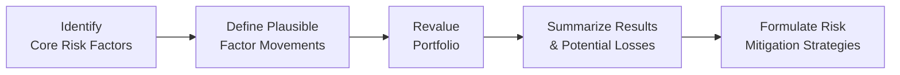

## Introduction

Scenario analysis can feel like this fantastic tool we all know we should be using—but all too often, we only think of it when markets get shaky. In my early days working in risk management at a small investment house, I learned the hard way that “hoping for the best” isn’t a strategy. Scenario analysis, particularly stress testing, helps push our portfolios beyond that hopeful lens into the realm of sober realism. By deliberately applying hypothetical or historical shocks to our models, we expose blind spots and identify vulnerabilities early. In this section, we take an in-depth look at practical approaches, pitfalls, and best practices for scenario-based stress testing.

## Historical and Hypothetical Scenarios

Scenario analysis involves simulating how a portfolio or security would perform under specific conditions. Often, these conditions represent market downturns, sudden interest rate hikes, or changing credit spreads. There are two broad categories:

• Historical scenarios: Here, you replicate actual past events—like the 2008 financial crisis or the COVID-19 market shock—to see how your current portfolio might fare if history repeated itself.  
• Hypothetical scenarios: These are constructed and forward-looking. They’re not tied to a specific historical episode but instead might assume, for example, a sudden 300-basis-point increase in interest rates plus a geopolitical shock that’s never really happened before—though it’s plausible it might.

Historical scenarios can be especially useful if your portfolio has exposures that existed during a major event. But if your portfolio has grown or changed significantly since that event, or if markets have fundamentally evolved, a purely historical scenario might not capture today’s reality. That’s where hypothetical scenarios shine, because you can customize them to reflect potential future stressors—like new monetary policy shifts or emerging technologies.

## Spotlight on Stress Testing

Stress testing is a specialized form of scenario analysis that zeroes in on severe, often extreme but plausible events. Regulators globally (think CCAR in the United States or the EBA stress tests in Europe) require financial institutions to run these analyses on their balance sheets. But even if you’re not at a large bank, stress testing your portfolio is a best practice. It forces you to ask: “What if everything went horribly wrong, all at once?” Stress tests:

• Examine capital adequacy (for banks) or liquidity needs (for investment houses) during severe market conditions.  
• Help risk managers see if correlation assumptions might break down (since correlations often spike in crises).  
• Reveal hidden pockets of tail risk—those improbable but devastating scenarios that models can easily overlook.

## Determining Scenario Severity

Picking the right magnitude for your scenario is a bit of an art and science. You can judge severity by:

• Historical Observations: Use shocks equivalent to the worst events seen in previous market crises (e.g., the 1987 market crash, the 2008 credit crisis, March 2020 pandemic-induced volatility).  
• Standard Deviation Multiples: Take the typical daily/weekly/monthly volatility of a risk factor and scale up by 2, 3, or even 5 standard deviations to reflect extreme moves.  
• Policy Shocks: For more creative scenarios, incorporate global policy shifts—like an abrupt end to quantitative easing, a sudden trade war, or large-scale government defaults.  

The crucial part is internal consistency. If you assume interest rates spike by 200 basis points, you might want to adjust inflation expectations, currency values, or GDP growth accordingly. You can’t just move one factor in isolation if your scenario tries to mimic real-world conditions—markets usually respond in multiple dimensions.

## Model Limitations and Oversight

All these simulations might look robust, but, well, the real world can be cruel to neat models. During times of stress, assumptions about correlation or market liquidity might go out the window. Tail risk events or so-called “black swans” (rare, unpredictable events) can strike, turning even the best scenario analyses into an underestimation. Common pitfalls:

• Correlation “spikes.” In normal times, equity and fixed-income might move inversely, but market-wide panics turn everything correlated.  
• Liquidity constraints. Suddenly, you can’t trade out of positions without huge slippage.  
• Psychological/sentiment shifts. Traditional models ignore investor panic, margin calls, and forced selling.  

Even the best risk models can’t perfectly anticipate these dynamics, so it’s essential to interpret stress test results with a healthy dose of pragmatism and humility.

## Implementation Steps

How do you actually set this up? Below is a high-level framework, refined through countless attempts (and, I’ll admit, some embarrassing missteps) in professional settings.

### Identify Core Risk Factors
Start by listing the variables that move the needle in your portfolio. Are you most exposed to interest rates? Do you hold a big chunk of equities with high beta to the market? Maybe you have a multi-currency portfolio. Pinpoint these big drivers.

### Define Plausible Factor Movements
Next, estimate how much those risk factors might change under stress. This is where you decide on severity (historical extremes, standard deviation multiples, or custom shocks). If equity markets drop 40%, do credit spreads also widen by 300 basis points? If interest rates rise, do you also see currency depreciation?

### Revalue the Portfolio
Repricing or revaluing is often the hardest part. For each scenario, you feed the changed parameters into your valuation models. This might require advanced tools, especially for complex derivatives. Spreadsheets work for some, but you may need specialized tools if your portfolio is large or complicated. Double-check any “shortcut” approaches carefully—oversimplification can lead to underestimation of losses.

### Summarize Results and Potential Losses
You’re looking for more than just a single “X% drawdown.” You want to see how each scenario affects your performance metrics (returns, volatility, Value at Risk). For a bank, it might mean capital ratios or liquidity coverage ratios. For asset managers, you might focus on compliance with mandates or drawdown thresholds. Summarize these impacts in a clear, visually digestible format—maybe with scenario-by-scenario bar charts or pivot tables.

### Formulate Risk Mitigation Strategies
If your results are terrifying (and sometimes they are!), develop a plan. You could reduce leverage, hedge with derivatives, or diversify the portfolio further. The idea isn’t just to shake your head at potential disasters; it’s to set up your portfolio so you can weather storms.

## Illustrative Example

Let’s say you manage a portfolio primarily comprising high-yield corporate bonds and global equities. You’re worried about a potential stagflation scenario—GDP slowing, inflation rising, central banks pushing interest rates up aggressively:

• Risk Factors: Interest rates (benchmark yields), credit spreads, equity indices, currency exchange rates (for non-domestic investments).  
• Scenario Definition (Severe):  
  – 10-year Treasury yield: +300 bps over six months  
  – High-yield credit spreads: +400 bps  
  – Equity markets: –30%  
  – USD: Strengthens 10% vs. major currencies (assuming capital flight into “safe” assets)  

You’d then revalue your bond positions, factoring in yield changes and spread widening, as well as possible downgrades in credit rating. Equities drop sharply, so you map that into your portfolio’s equity exposures. Finally, currency moves might mean some foreign assets lose additional value in U.S. dollar terms. If the results show a 25% drawdown, you consider whether that’s acceptable. If not, you might buy options or shift the portfolio to defensive sectors.

## Glossary

• Stress Test: Simulation to evaluate how financial positions hold up in extreme conditions.  
• Historical Scenario: Scenario based on replicating a past event like the Great Financial Crisis.  
• Hypothetical Scenario: Forward-looking scenario designed around plausible, sometimes unprecedented events.  
• Tail Risk: The risk of extreme outcomes lying in the distribution’s tails, often underestimated in normal market forecasts.  
• Correlation Breakdown: When relationships among assets, typically stable in normal markets, deviate drastically during crises.  
• Systemic Risk: The risk that failure in one component triggers repercussions across the entire financial system.

## Conclusion

Scenario analysis and stress testing aren’t just academic exercises or regulatory check-the-box items. They’re vital. They shine a bright light on where you might be overexposed in times of turbulence. Granted, these analyses rely on assumptions and only approximate reality. But seeing your portfolio’s “worst-case” outcomes can be a sobering wake-up call—far better to discover your vulnerabilities on paper than in the middle of a market crash.

For more details, consult the Basel Committee on Banking Supervision (BCBS) guidelines for stress testing frameworks or IMF Working Papers that offer robust macro stress testing examples. If you want to take a deep dive, Philippe Jorion’s “Value at Risk: The New Benchmark for Managing Financial Risk” is a classic reference.

## References

• Jorion, P. (2007). “Value at Risk: The New Benchmark for Managing Financial Risk.” McGraw-Hill.  
• Basel Committee on Banking Supervision. (Various Publications). Guidance on stress testing.  
• IMF Working Papers on macro stress testing methodologies.  

## Test Your Knowledge: Scenario Analysis and Stress Testing Quiz



### 1. Which of the following best describes a hypothetical scenario?
- [ ] A replication of the 2008 financial crisis.  
- [x] A constructed event that assumes future possibilities, such as a sudden regulatory shift.  
- [ ] A scenario that strictly relies on past standard deviation estimates only.  
- [ ] A scenario that depends solely on known correlations.  

> **Explanation:** A hypothetical scenario involves forward-looking or “designer” shocks that may not have a direct historical precedent.

### 2. In stress testing, why is internal consistency across factors important?
- [ ] It ensures models only account for one risk factor at a time.  
- [x] It properly reflects correlated market conditions when multiple variables move together.  
- [ ] It guarantees that severity is always calibrated at historical extremes.  
- [ ] It keeps interest rates and credit spreads fixed to eliminate confusion.  

> **Explanation:** Internal consistency means recognizing that multiple risk factors often move in tandem (like rates, spreads, and GDP), so they should be aligned in scenarios.

### 3. Tail risk typically refers to:
- [ ] The risk that markets will always revert to mean.  
- [ ] The risk of missing moderate market moves.  
- [x] The risk of rare, extreme outcomes that lie at the distribution’s tail.  
- [ ] The risk that regulators will impose new capital requirements.  

> **Explanation:** Tail risk concerns those improbable but extreme events that normal distributions might significantly underestimate.

### 4. During stress events, correlations between asset classes often:
- [ ] Decrease sharply.  
- [x] Increase unexpectedly, causing interconnected market declines.  
- [ ] Stay the same, as correlations are static parameters.  
- [ ] Reverse (positives become negatives) in a predictable manner.  

> **Explanation:** In market panics, assets commonly move in the same direction (a spike in correlation), undermining diversification strategies.

### 5. Under US regulatory frameworks, stress testing is often mandated to:
- [ ] Provide daily margin calls for all types of positions.  
- [x] Ensure banks hold sufficient capital against severe downturns.  
- [ ] Remove the need for VaR (Value at Risk) calculations.  
- [ ] Guarantee that no bank fails under extreme scenarios.  

> **Explanation:** Regulators like the Federal Reserve use stress tests (e.g., CCAR) primarily to check banks’ capital adequacy under severe hypothetical conditions.

### 6. Which of the following is a key difference between historical and hypothetical scenarios?
- [ ] Historical scenarios only measure correlation risk.  
- [ ] Hypothetical scenarios never adjust for macroeconomic changes.  
- [x] Historical scenarios replicate actual past events; hypothetical scenarios are forward-looking constructs.  
- [ ] Only hypothetical scenarios can be used for regulatory filings.  

> **Explanation:** Historical scenarios model real past events unchanged, while hypothetical ones allow you to “design” potential shocks for the future.

### 7. When calibrating the severity of a scenario using standard deviation multiples:
- [x] You increase the magnitude of shocks by a chosen multiple of historical volatility.  
- [ ] You rely exclusively on fundamental macro models.  
- [ ] You are forced to assume zero correlation across different risk factors.  
- [ ] You only look at equity market movements.  

> **Explanation:** Scenario severity can be gauged by applying 1x, 2x, or even 5x standard deviation shocks to historical volatility.

### 8. Which step comes first in implementing scenario analysis?
- [x] Identifying the key risk factors relevant to the portfolio.  
- [ ] Performing hedging transactions based on scenario outcomes.  
- [ ] Summarizing the results of the scenario.  
- [ ] Revaluing the portfolio under each scenario.  

> **Explanation:** The very first step is always to identify which risk factors drive portfolio performance and risk exposure.

### 9. A “black swan” event in markets is best defined as:
- [ ] A highly probable but well-understood scenario.  
- [ ] A mild market fluctuation that is easy to predict.  
- [ ] A possible event that has not yet occurred, but is frequently forecasted.  
- [x] A rare, unpredictable event with massive potential impact.  

> **Explanation:** Black swan events are characterized by their extreme rarity, severe impact, and their often-unpredictable nature.

### 10. True or False: Stress testing results should be taken literally as the single “worst-case” scenario an institution might face.
- [x] True
- [ ] False

> **Explanation:** Actually, it’s somewhat a trick question. Many institutions treat stress test outcomes as a critical check on capital adequacy, but in practice, they’re “one possible worst-case”—not the only scenario. Still, many risk managers treat it as a near-literal yardstick for how bad things can get.


