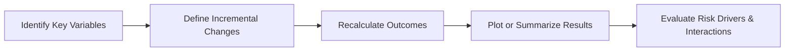

## Introduction

So, let’s say you’re hanging out with your investment team, and someone says, “We really need to figure out how changes in the discount rate might affect our bond portfolio’s value.” Suddenly all eyes are on you, and you realize it’s time to dust off that sensitivity analysis toolkit. If you’ve ever felt that little surge of panic, you’re definitely not alone. But here’s some reassurance: sensitivity analysis is actually one of the more intuitive techniques for risk evaluation. It’s like gently poking a balloon from different angles to see where and how it might deflate.

In this section, we study how small changes in assumptions—whether it’s interest rates, growth rates, or currency exchange forecasts—affect the final output of a financial model. We also examine how sensitivity analysis relates to risk evaluations and scenario analysis, which means we’ll compare “what if?” scenarios and see how vulnerable your portfolio or your valuations might be.

## The Essence of Sensitivity Analysis

Sensitivity analysis is basically about asking: “If I tweak one input, how does it change my output?” It’s the same idea as turning the volume knob on a radio—only you’re turning the knobs on interest rates, growth projections, or discount factors instead. A typical approach might be:

• Choose a particular variable (e.g., expected inflation).  
• Shift it slightly up or down by a certain increment (like ±1% or ±2%).  
• Observe how that change affects your target metric (e.g., net present value, bond price, or portfolio return).  

Sometimes the result completely alters the picture—and sometimes you find that the variable doesn’t matter much at all. The key is not just how big the changes in output are, but which variables cause those bigger changes. Those become your “key risk drivers.”

### Single vs. Multi-Factor Sensitivity

One big distinction is between single-factor and multi-factor analyses:

• Single-factor analysis: You pick one input—say, the discount rate—and see how your outcome changes when that single rate wiggles up or down. The rest of the variables are frozen in place.  
• Multi-factor analysis: You turn multiple knobs at once. For instance, you might change both the discount rate and the projected growth rate, then see how the combined interplay affects your final result. This approach can expose how different variables offset or reinforce each other.

In a real-world setting, markets often move in tandem (for example, interest rate changes might affect exchange rates, and so on). A multi-factor approach can capture these simultaneous shifts more comprehensively than a single-factor analysis.

## Risk Evaluations Using Sensitivity Analysis

In an exam or professional environment, “risk evaluations” mean identifying what could go wrong and how badly it might hurt your portfolio. Sensitivity analysis is a straightforward way to get that risk conversation going. By systematically calculating outcomes for adjusted assumptions, you can see:

• Which variable movements would deal the biggest blow to valuations.  
• The shape or slope of your risk profile (e.g., is it highly sensitive near certain thresholds?).  
• Which exposures might need hedges, additional capital, or more robust contingency planning.

To help visualize, analysts often create “tornado charts” or “spider diagrams.” These charts give quick pictures of which factors matter the most. If you see a towering bar in the tornado chart for changes in interest rates, you know interest rates are your biggest vulnerability.

### Spider Diagrams and Tornado Charts

• Spider Diagram: This type of chart fans out multiple lines from a center point, each line representing a variable. As you alter the variable from low to high, you mark the resulting outcome on that line. The more extreme the slope, the more sensitive your model is to that variable.  
• Tornado Chart: Imagine a horizontal bar chart sorted by the absolute impact of a certain variable on the final outcome. The longest bar at the top indicates the factor with the largest effect. Successively shorter bars follow below, creating a “tornado” shape.

Both visual methods are super helpful in advanced risk evaluations. You can quickly pinpoint those triggers that could drastically boost or slash your portfolio or project valuation.

## Practical Steps to Conduct Sensitivity Analysis

Even though the concept is straightforward, sometimes people skip crucial steps or fail to interpret the results correctly. Well, here’s a practical walkthrough:

### Identify Relevant Variables

Think about the main drivers behind your model. Could be discount rates, growth rates, tax rates, exchange rates, or even operating costs in a project valuation. Select variables that you believe, based on experience or data, wield significant influence.

### Decide on Incremental Changes

Determine how much you’ll tweak each variable. Will it be ±1%, ±2%, or ±5%? Maybe you’ll use an absolute shift (e.g., ±50 basis points for an interest rate). If you’re dealing with very volatile inputs, pick increments that reflect realistic variations in the market.

### Recalculate Portfolio or Security Value

Next, you run your model with each new assumption. If it’s a single-factor analysis, you’ll do a few runs for each variable in isolation. If it’s a multi-factor analysis, you might combine increments across several variables.

### Plot or Tabulate Results

This is where spider diagrams or tornado charts come into play. All you need is a spreadsheet or basic plotting software to get a quick, intuitive snapshot.

### Investigate Interactions Among Variables

It’s not just about how each variable changes independently. Sometimes two variables move in the same direction and amplify the risk. Other times, they cancel each other out. If you see surprising interactions, do a deeper dive to understand the economic or financial principles behind those correlations.

Below is a simplified flowchart of the general steps:

## Connection with Scenario Analysis

You might be wondering, “How is this different from scenario analysis?” Good question. Scenario analysis typically involves constructing entire market conditions—like a recession scenario where GDP shrinks, unemployment rises, and interest rates go ultra-low. Sensitivity analysis is usually more granular, focusing on small incremental changes to single or multiple inputs, rather than big picture “world states.”  

But there’s overlap. You can certainly combine both: Start with a broad scenario (like a recession) and then do a sensitivity analysis to see whether small variations around that scenario drastically change your results. This combination can be hugely revealing for risk management—especially if you realize that a mild tweak in assumptions within an otherwise benign scenario leads to a major meltdown.

## Local vs. Global Sensitivity

Analysts also distinguish between local and global sensitivities:

• Local Sensitivity: Measures how the model reacts to small changes in the neighborhood of a specific point (e.g., your baseline scenario).  
• Global Sensitivity: Looks at model reactions over a wide range of possible values and might require more sophisticated techniques—especially if the relationships between variables are complex or nonlinear.

In finance, local sensitivity is pretty common. When you hear someone say, “We tested ±1% around the base discount rate,” that’s typically local. Global analyses might be used if you suspect things could drastically change once variables stray well beyond “normal” bounds.

## Derivatives: Greeks and Sensitivity

Those of you dealing with derivatives will be familiar with “Greeks” like Delta (∂V/∂S) for changes in underlying price, Vega (∂V/∂σ) for changes in volatility, Theta for time decay, and so on. These Greeks are essentially specialized sensitivity measures that tell you how an option’s value changes when each parameter increments. It’s a prime example of single-factor sensitivity analysis in a derivatives context.

## Quick Numeric Example

Let’s illustrate with a small, single-factor example. Assume you have a bond priced at:

(1)  
P = ∑(C / (1 + r)^t) + (F / (1 + r)^n)

Where:  
• P = bond price  
• C = annual coupon payment  
• F = face value  
• r = yield or discount rate  
• t ranges from 1 to n, with n = maturity in years  

Suppose r is currently 5%. You decide to see what happens with ±1%. You do:

• At 4% => P4% = $1,070 (for instance)  
• At 5% => P5% = $1,000 (your baseline)  
• At 6% => P6% = $940  

Even from this tiny illustration, you can see that the bond’s price is quite sensitive to shifts in yield. If you chart these outcomes, you’ll find a negative slope—higher yields mean lower bond prices. You can replicate this approach with multiple factors (e.g., if there’s also a currency element or default-risk premium).

## A Note on Best Practices

• Cross-Check Ranges: Don’t only test a ±1% shift if your variables can realistically move ±5%.  
• Combine Tools: Use scenario analysis alongside sensitivity analysis to get a more robust risk picture.  
• Document Assumptions Clearly: That way, anyone replicating your analysis can see your steps and replicate or challenge them.  
• Watch Out for Nonlinearities: If your model has nonlinear relationships (like derivative payoffs), small changes in inputs can result in large changes in outputs beyond a certain threshold.

## Potential Pitfalls

• Overlooking Correlation: If you hold one variable constant when, in reality, it should be moving with another, your analysis could mislead you.  
• Using Too Few Increments: If you only check ±1%, you might miss bigger meltdown or windfall scenarios.  
• Failing to Communicate Results: Even if you do a thorough job, make sure you summarize your findings in a user-friendly chart or table.

## Personal Anecdote

Years ago, I was working on valuing a mid-sized manufacturing firm. We built a big discounted cash flow (DCF) model. I thought we nailed down the discount rate assumptions until we did a sensitivity analysis varying the discount rate by ±2%. Turns out, even a small tweak in the discount rate turned a comfortable investment into a borderline one. This piece of insight literally halted the acquisition process until we sorted out how stable that discount rate truly was. It was a huge wake-up call for me—sensitivity analysis isn’t just a box-ticking exercise; it can genuinely make or break a deal.

## Ethical Considerations

From a CFA perspective, always ensure you present your sensitivity findings honestly and transparently. There’s a temptation to show only favorable results—like “cherry picking” which sensitivities you highlight. But misleading stakeholders about risk exposures could violate the CFA Institute Code and Standards (not to mention cause serious reputational damage).

## Final Exam Tips

• Practice building a small sensitivity table under time pressure. You want to demonstrate to the examiners that you can quickly toggle variables and interpret the results.  
• Familiarize yourself with creating or interpreting a tornado chart or spider diagram. These pictorial tools often appear in item sets, where you might be asked which variable is the biggest risk driver.  
• Connect the dots between sensitivity analysis and bigger risk frameworks like scenario analysis or stress testing. The exam might have multi-part vignettes combining these ideas.  
• Use official formulas or recognized ones (like the bond pricing formula or a DCF approach) as your blueprint. Examiners love seeing correct formula application.  
• If you see a question about local vs. global sensitivity, remember it’s basically about incremental changes close to your baseline vs. broader changes that might reveal more complex vulnerabilities.  

## References

• Fabozzi, F. J. (ed.) (2008). “Handbook of Finance: Volume I.” Wiley. (Chapter on risk modeling, scenario, and sensitivity methods.)  
• McKinsey & Company (2010). “Valuation: Measuring and Managing the Value of Companies.” (Sections on forecasting and sensitivity analyses.)  
• Damodaran, A. (2012). “Investment Valuation.” Wiley. (Chapters on risk assessment, scenario analysis, and sensitivity.)  

## Mapping to Learning Outcome Statements

• Illustrate how small changes in assumption variables (e.g., interest rates, growth rates) alter the valuation or return estimate of a financial asset.  
• Assess the relative significance of different drivers of valuation using tornado charts or spider diagrams.  
• Distinguish between single-factor and multi-factor sensitivity analyses, and discuss how each approach may be used in a comprehensive risk management framework.  
• Integrate sensitivity considerations into broader risk models, highlighting how local vs. global sensitivities differ in their implications.

## Practical Sensitivity Analysis & Risk Evaluations Quiz



### A portfolio manager wishes to understand how changes in the interest rate alone impact a bond’s price. Which technique is most appropriate?

- [x] Single-factor sensitivity
- [ ] Scenario analysis
- [ ] Multi-factor sensitivity
- [ ] Monte Carlo simulation

> **Explanation:** Single-factor sensitivity focuses on changing one input (interest rate) while holding other variables constant.

### Which of the following best describes the purpose of a tornado chart?

- [ ] It simulates random draws of risk factors to estimate an outcome distribution.
- [ ] It plots output variability as a function of multiple factors across a range of probabilities.
- [x] It ranks variables by their impact on the final valuation in a bar chart, displaying the most impactful variable on top.
- [ ] It summarizes covariances among multiple indicators in a tabular layout.

> **Explanation:** A tornado chart visually compares the impact of changing each input variable on the outcome, ranking them by magnitude so that the largest effect is at the top.

### If two variables in a multi-factor sensitivity analysis consistently move in opposite directions, what is the likely effect on the valuation outcome?

- [x] Their impacts may partially offset each other, leading to reduced sensitivity.
- [ ] Their impacts will double and magnify overall risk.
- [ ] The analysis becomes invalid.
- [ ] There is no impact because each factor is considered independently.

> **Explanation:** When variables move in opposite directions, one may mitigate the effect of the other, reducing the net impact on the final result.

### Which of the following best characterizes “local sensitivity” in the context of sensitivity analysis?

- [x] A measure of how the model output changes for small variations around a specific baseline.
- [ ] A measure of the output changes for extremely large variable movements only.
- [ ] A method of testing a wide range of market scenarios.
- [ ] A special technique that only applies to derivative pricing.

> **Explanation:** Local sensitivity focuses on small and immediate changes in an input variable around a fixed or base scenario.

### A spider diagram helps in which primary way for sensitivity analysis?

- [x] It displays how the outcome changes for incremental adjustments of multiple variables in a radial layout.
- [ ] It ranks variables by magnitude of effect in descending order.
- [x] It also shows how each variable might interact to create a non-linear effect.
- [ ] It provides the next step inputs for a Monte Carlo simulation.

> **Explanation:** A spider diagram visually tracks how varying each input (from low to high) affects the model’s output, with each factor shown as a separate spoke from a center point. Different slopes indicate different sensitivity levels.

### Which of the following is a critical first step in conducting a sensitivity analysis?

- [x] Identifying and selecting the key variables that drive your model.
- [ ] Creating a random distribution for each variable.
- [ ] Building a single-factor scenario ignoring baseline assumptions.
- [ ] Computing correlation matrices for all factors in the model.

> **Explanation:** Before you begin, you must understand which variables are the major drivers of the model and therefore most relevant to test.

### Which scenario most likely requires multi-factor sensitivity analysis?

- [x] When interest rates and commodity prices both significantly affect returns.
- [ ] When you only want to test a ±50 bps shift in the discount rate.
- [x] When lines of credit are not a factor in your model.
- [ ] When evaluating final outputs without interim calculations.

> **Explanation:** Multi-factor sensitivity is needed if multiple inputs—like interest rates and commodity prices—are expected to impact the outcome simultaneously.

### Why is it often useful to conduct both scenario analysis and sensitivity analysis?

- [x] Scenario analysis provides a broader context of multiple changing conditions, while sensitivity analysis isolates specific variable increments.
- [ ] Sensitivity analysis alone can replace all forms of scenario analysis.
- [ ] Scenario analysis is only relevant for stress testing and not for baseline checks.
- [ ] Both are required by IFRS and GAAP for compliance purposes.

> **Explanation:** Scenario analysis typically looks at multi-variable “states of the world,” while sensitivity analysis zooms in to see how small or moderate changes in one (or a few) variables alter outcomes.

### Which statement about single-factor sensitivity analysis is correct?

- [x] It varies one variable while all others remain constant, giving insight into that variable’s marginal impact.
- [ ] It examines the simultaneous movement of all significant risk factors.
- [ ] It is an advanced technique that requires machine learning.
- [ ] It is inferior to scenario analysis and rarely used.

> **Explanation:** Single-factor sensitivity changes one variable while freezing the others, revealing that specific variable’s influence on the outcome.

### A firm has identified that changes in foreign exchange rates have a disproportionately large effect on profitability compared to interest rate changes. In a tornado chart, foreign exchange rate sensitivity would likely appear:

- [x] At the top of the chart, with the largest bar.
- [ ] In the middle, to show it’s moderately important.
- [ ] At the bottom, as it is the default position.
- [ ] Not on the chart at all.

> **Explanation:** Tornado charts rank variables by their impact on outcomes. The largest impact appears at the top as a wide bar to visually underscore its major influence.


