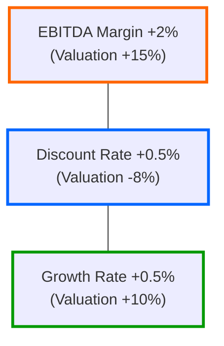

## Introduction and Framework

Simulation-based strategies are, in my opinion, some of the most exciting areas in quantitative finance. They allow us to experiment with possible outcomes under varying conditions—like you’re playing “What if?” with real money at stake. We can generate thousands of possible paths for market variables, measure tail risk more accurately, and better prepare ourselves for shocks. In exam scenarios, you’ll often see piecewise question sets (i.e., “vignettes”) that require integrating Monte Carlo, bootstrapping, scenario, and sensitivity analyses. Let’s walk through a series of realistic cases to illustrate these methods in action.

Before we jump into the details, let’s remind ourselves of a few baseline concepts:

• Monte Carlo Simulation: Repeated random experimentation with specified probability distributions to observe the range of possible outcomes.  
• Path-Dependent Options: Derivatives whose payoff depends on the path an underlying price (or rate) took, not just its final value.  
• Bootstrapping: A resampling method (also known as nonparametric resampling) that re-uses empirical data to create “new” datasets for statistical inference.  
• Stress Testing: Evaluating or “shocking” a portfolio with extreme or unlikely market conditions (e.g., a +300 basis point rate hike).  
• Sensitivity Analysis: Tweaking key drivers (like discount rates, correlation assumptions, or volatility) one at a time to see which driver has the largest impact on valuation or risk metrics.

Below are four integrated vignettes that connect these tools in typical exam-style item-set scenarios.

## Case 1: Derivative Valuation with a Stochastic Underlying

Imagine you’re analyzing a path-dependent derivative—an Asian option on an equity index. The option’s payoff depends on the average price of the index over the life of the option (rather than just its final price). You need to run a Monte Carlo simulation to determine the probable payoff and, by extension, the fair market value of the option.

### Setting the Stage

• Underlying: Equity index with current price of 3,500.  
• Volatility (σ): 20% annualized.  
• Risk-Free Rate (r): 3% annualized.  
• Time to Maturity: 1 year.  
• Number of Paths: 10,000 (to get a decent estimate).  
• Correlation with Other Assets: Let’s assume we also hold a bond that has mild negative correlation with the index, around –0.2 (though the bond is less critical for the direct pricing of this option, it’s relevant if we embed the option in a broad portfolio).

### Process Demonstration

We break the 1-year horizon into monthly steps, so 12 increments. Each path will be a random walk based on geometric Brownian motion:

The underlying’s price St+Δt in a risk-neutral framework can be modeled as:  
St+Δt = St · exp((r – 0.5σ²)·Δt + σ√(Δt)·Z)  

where Z ~ N(0,1). Summing or averaging these monthly prices (depending on the payoff structure) yields the final “average price” for that path. Then we compute the option’s discounted payoff. Repeating thousands of times gives a distribution of discounted payoffs.

Below is a small Mermaid diagram to visualize this process:

### Payoff Distribution and Final Valuation

After generating these paths—let’s say we do 10,000 of them—we’ll have a distribution of payoffs. The mean of that distribution, discounted back at the risk-free rate, is the fair value of the Asian option. One of the most important outputs for exam purposes is the cumulative distribution function (CDF) of simulated payoffs. This CDF helps us see, for instance, the probability of the option expiring worthless or having an above-average payoff. 

In an exam setting, you might be asked to:  
• Identify the pricing steps.  
• Describe how changes in volatility or correlation step in.  
• Interpret the final payoff distribution.

## Case 2: Portfolio Stress Test with Interest Rate Shock

Now let’s say you’re analyzing a multi-asset portfolio that includes bonds, equities, and derivative instruments. Out of nowhere, you’re told that the Fed (or a similar central bank) might spike interest rates by 300 basis points. Yikes.

### Hypothetical Shock

Interest rates rising by 3% is a huge shock. For a bond portfolio, that typically means prices will drop significantly, especially for long-duration instruments. Equities might also suffer if the discount rates used in valuations expand quickly. But let’s see how we can systematically approach this.

### Repricing the Portfolio

1. Bond Portfolio: Suppose you hold a basket of medium- to long-duration government and corporate bonds. After a 300 bp rise:
   • The yield to maturity jumps, decreasing bond prices.  
   • The magnitude of the drop depends on each bond’s Macaulay Duration and Convexity.  
2. Equity Component: Higher rates shrink present values for future cash flows, so the equity index might drop by, say, 10–15%.  
3. Derivatives Overlay: Your portfolio might contain interest rate swaps or interest rate futures. If you’re short fixed-rate and long floating-rate (as in a pay-fixed, receive-floating swap), you might see a gain that offsets some bond price losses.  

Exam-style item sets may provide partial yield curve data, durations, or equity betas. You’ll apply the shock to the relevant instruments, then aggregate the new portfolio value. 

### Risk Management Responses

When you see a big negative shift in portfolio value, you might wonder, “Okay, now what adjustments do we make?” Common strategies include:  
• Hedging with interest rate futures or interest rate options.  
• Reducing portfolio duration by switching from long-term bonds to short-term instruments.  
• Diversifying into assets less sensitive to rate increases (e.g., low-duration or floating-rate notes).

Be prepared to demonstrate a quick re-valuation and identify what (if any) correlations change during a stress event. Sometimes, correlations spike or invert in extreme conditions, so watch out for that nuance on the exam.

## Case 3: Bootstrapping for VaR Calculation

Value at Risk (VaR) is a typical risk metric that can appear across various question sets. Particularly for multi-asset portfolios, a simple parametric VaR (assuming normality) might not cut it if the returns distribution is skewed or if volatility clusters over time. That’s where a block bootstrap approach can give more robust estimates.

### Dataset and Resampling

• Suppose you have 1,000 daily returns for a multi-asset portfolio.  
• Instead of assuming normality, you want to resample from the actual return history.  
• With a “block bootstrap,” you keep small blocks of consecutive returns together, preserving serial dependence or autocorrelation.  

Algorithmically, you take small blocks of historical returns (like 5-day windows) at random and stitch them together to create new return series of length 1,000. Then you recalculate the P/L distribution from these new synthetic series.

### Interpreting the Tail

VaR is often stated as a loss threshold (e.g., 5% VaR). Let’s say your 5% VaR is –4.5%. This means: “We are 95% confident we will not lose more than 4.5% in one day under normal market conditions.” By using block bootstrap techniques, you might see a fatter left tail than predicted by normal distributions, resulting in a more conservative VaR figure.

### Potential Differences from Normal-Based VaR

• More robust reflection of real-world fat tails or skewness.  
• The effect of clustering and time-dependence in volatility.  
• Potential mismatch vs. parametric VaR if the distribution is far from normal.

Keep an eye out for exam questions where the test might show you a parametric VaR in one column and a bootstrapped VaR in another. You’ll be asked to interpret why the bootstrapped VaR is higher or otherwise different.

## Case 4: Sensitivity Analysis of a Corporate Valuation

Let’s shift gears to a classic equity approach: corporate valuation under discounted cash flow (DCF). Sometimes, the trickiest part is not the formula but how to handle “what-ifs” around discount rates, growth rates, or operating margins.

### Varying Key Inputs

1. Discount Rate (WACC): Suppose your base-case Weighted Average Cost of Capital is 10%. If that creeps up to 11% or 12%, your DCF shrinks significantly.  
2. Growth Rate in Terminal Value: Maybe you’ve used a perpetual growth rate of 3%. Changing it to 2% or 4% can have a major impact on terminal value.  
3. EBITDA Margin: Increase or decrease assumptions about operating efficiency, and watch the final valuation swing.

### Visualizing with Spider or Tornado Charts

A spider chart might show your base-case valuation in the center, then each ring out represents a shift in one variable (e.g., ± 1% on discount rate, ± 0.5% on growth, ± 2% on EBITDA margin). A tornado chart ranks these variables by their impact, showing which factor has the biggest effect on valuation.

In the chart above, not exactly a “spider” but a simplified diagram for illustration, you see how each assumption alters the valuation from a base scenario.

### Example of Cumulative Effects

When everything shifts in an unfavorable direction, a small change in the discount rate plus a small drop in margins plus a small drop in growth can dramatically reduce the valuation. This synergy often surprises candidates. In exam questions, watch for combined scenarios that test your ability to multiply or compound the effects (e.g., a new discount rate of 11% combined with 2% growth and a 1% lower margin).

## Practice Approach and Common Pitfalls

• Practice Slow and Fast: In timed mock exams, I’ve seen candidates rush and accidentally double-count or misread correlation signs. Take a breath.  
• Check Correlation or Autocorrelation: If returns are autocorrelated, using a standard bootstrap (rather than block bootstrap) might misrepresent the real risk.  
• Pay Attention to Extreme Events: Stress testing is all about extremes. Don’t let your mind switch into “average” mode.  
• Watch Out for Path Dependence: For derivative pricing, jumping directly to the final underlying price can be a pitfall if it’s path-dependent.  
• Revisit Basic Probability: For Monte Carlo, your random draws must reflect the proper distribution (and keep correlation in mind).  

These pitfalls can appear in item-set style questions, where a misstep in reading or assumption can lead to a string of incorrect calculations.

## Exam Mindset

Exam items linking simulation-based strategies usually require you to:  
• Understand the data given (historical returns, volatility estimates, correlation figures).  
• Set up or at least conceptually simulate the scenario (Monte Carlo, bootstrapping, or “shock” analysis).  
• Interpret cumulative distributions, identify tail risk, or discuss plausible risk management steps.  
• Combine multiple steps quickly (like a short sensitivity analysis after a stress test).  

In other words, you might see a question that says: “Here’s your bond portfolio, here’s your equity holdings, here’s an option position. The rate environment changes or volatility is updated. Now compute the new payoff distribution or the portfolio VaR.”

Time management is key. On the exam, you have limited minutes per item set, so you want to glean the relevant data at a glance, zero in on the key formula or conceptual approach, and produce a concise answer.

## References and Further Reading

• CFA Institute, “CFA Level II Curriculum—Readings on Risk Management Applications of Option Strategies.”  
• Luenberger, D. G. (2013). Investment Science. Oxford University Press. (Simulation-based approaches to finance modeling.)  
• Wilmott, P. (2006). Paul Wilmott on Quantitative Finance. Wiley. (Theory and practice of advanced derivatives pricing.)  

Feel free to geek out with these references if you want deeper mathematical rigor. They’re excellent resources for bridging academic theory and real finance applications.

## Final Exam Tips

• Remember that Monte Carlo can be time-consuming. On the exam, you probably won’t run a live simulation but must conceptually show you know the steps.  
• Stress testing is straightforward but watch for detail: Don’t forget that interest rate shocks can alter correlations.  
• Bootstrapping results can differ from parametric calculations. On the exam, you’ll often be asked why they differ and which approach might be more representative of real-world risk.  
• Sensitivity analyses are all about measuring which variables have the greatest sway. For item-set questions, interpret chart data carefully.  

It seems to me that mastering these four big scenarios—derivative valuation, portfolio stress testing, bootstrapping, and sensitivity analysis—will equip you with a robust skill set for the exam and real-life financial modeling.

## Simulation-Based Strategies Practice Questions



### Question 1

Which of the following best describes a path-dependent option payoff?

- [ ] The payoff is solely determined by the underlying’s price at expiration.  
- [x] The payoff is influenced by the underlying’s price path over the life of the option.  
- [ ] The payoff is always higher than that of a standard option.  
- [ ] The payoff is determined by interest rate movements alone.  

> **Explanation:** Path-dependent options (e.g., Asian, lookback) depend on the underlying’s price path or average price during the option’s life, not just the price at maturity.

### Question 2

In a Monte Carlo simulation for an Asian option, which of the following steps is least likely?

- [ ] Simulation of monthly underlying asset prices.  
- [ ] Calculation of the average price over the simulated path.  
- [x] Using the option’s strike price in every step to recast the random draws.  
- [ ] Repeating the simulation many times to obtain an average payoff.  

> **Explanation:** You typically generate random price paths and compute average underlying prices; however, you don’t typically “recast” random draws using the strike price. The strike is separate from the underlying’s simulated price.

### Question 3

In a stress test that adds 300 basis points to interest rates, what is the main reason bond prices drop?

- [x] Higher yields decrease the present value of future coupon and principal payments.  
- [ ] Higher rates cause bond maturities to extend.  
- [ ] The coupon rates do not change, thus eliminating any yield advantage.  
- [ ] Equity market correlation rises automatically.  

> **Explanation:** Rising rates typically reduce bond prices by increasing the discount rate for cash flows. The other choices are either incomplete or irrelevant to immediate price changes.

### Question 4

What is the principal advantage of using a block bootstrap method over a simple random resampling method for VaR calculations?

- [ ] It always produces lower VaR estimates.  
- [ ] It relies on normally distributed returns.  
- [x] It preserves time-series dependence in returns.  
- [ ] It eliminates the need for correlation analysis.  

> **Explanation:** The block bootstrap retains correlations and autocorrelations in consecutive data points, which is often critical in real-world return series.

### Question 5

When performing a sensitivity analysis on a DCF valuation model, which input change tends to have the biggest immediate effect on the terminal value?

- [ ] Adjusting cost of goods sold.  
- [x] Varying the perpetual growth rate in the terminal value formula.  
- [ ] Changing the risk-free rate used for CAPM.  
- [ ] Increasing short-term revenue assumptions.  

> **Explanation:** The terminal value is highly sensitive to the perpetual growth rate; a small tweak in that rate can make a big difference in the final valuation.

### Question 6

A tornado chart is most useful for:

- [ ] Plotting the time-series returns of multiple assets.  
- [ ] Showing the exact path of a stock price in a Monte Carlo simulation.  
- [x] Ranking the relative impact of different input variables on an outcome.  
- [ ] Demonstrating a value distribution of average payoffs.  

> **Explanation:** Tornado charts provide a ranked visual representation, highlighting which factors most significantly affect the final outcome.

### Question 7

After a 300 bp rate shock, which risk management response is generally recommended to reduce portfolio duration?

- [ ] Purchasing longer-term Treasury bonds.  
- [x] Selling long-duration instruments and buying short-duration instruments.  
- [ ] Increasing exposure to high-yield debt.  
- [ ] Buying call options on the same bonds.  

> **Explanation:** Reducing portfolio duration typically involves shifting into shorter-duration bonds; purchasing long-term bonds would actually increase duration.

### Question 8

A key limitation to the block bootstrap for VaR is:

- [ ] It fully assumes independence of returns.  
- [ ] It fails to capture any shows of autocorrelation.  
- [x] It may not perfectly replicate extreme tail events if they rarely appeared in the historical data.  
- [ ] It relies on a normal distribution for returns.  

> **Explanation:** Because bootstrapping relies on historical data, extreme events that are rare in the dataset might still be underrepresented. It does, however, preserve some correlations due to the block method.

### Question 9

In pricing a path-dependent derivative using Monte Carlo, which of the following is most important?

- [ ] Using an equally weighted historical average as the final price.  
- [x] Computing the payoff at each step before moving to the next, to incorporate the path’s history.  
- [ ] Assuming zero volatility for the payoff dimension.  
- [ ] Only applying discount factors at the final node.  

> **Explanation:** For path-dependent derivatives, you must track the path at intermediate steps. Merely using a final price or ignoring intermediate path changes undermines the payoff calculation.

### Question 10

Monte Carlo simulation typically requires which primary inputs?

- [x] Probability distribution of the underlying variable and the number of paths to simulate.  
- [ ] Bankruptcy probability of the underlying company.  
- [ ] Historic realized covariance with an industry competitor.  
- [ ] Only the correlation parameter.  

> **Explanation:** The foundational elements of Monte Carlo pricing involve a probability distribution assumption (e.g., lognormal) and the number of simulation paths. Correlations can be relevant, but the question highlights the essential generic input of distribution plus path count.


