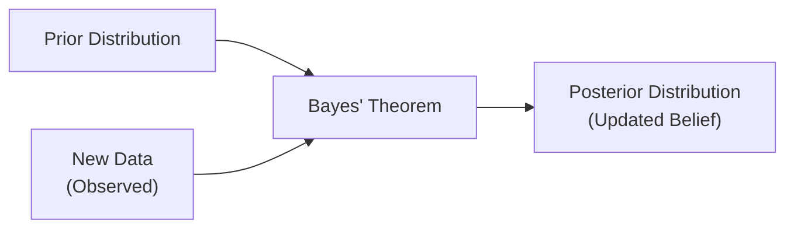

## Overview and Motivation

If you’ve ever re-evaluated a stock’s prospects after reading new earnings reports or changed your asset allocation strategy based on the latest interest-rate data, then—believe it or not—your thought process had a little “Bayesian” flavor. Well, maybe you didn’t call it that at the time, but you were adjusting your beliefs in light of fresh information.

This section uncovers how Bayesian Updating formalizes that natural, iterative way of thinking: we start with some initial assumption (a prior), factor in new data (the likelihood), and arrive at an updated belief (the posterior). By mastering this approach, you can significantly boost the flexibility and responsiveness of your quantitative modeling in finance.

## Fundamentals of Bayesian Inference

Bayesian inference is built on the idea that probabilities represent our subjective state of knowledge about an uncertain quantity, such as a security’s expected return or a company’s default risk. Unlike classical (frequentist) statistics, which typically posits fixed parameters and repeated sampling, Bayesian methods treat parameters themselves as random variables with their own probability distributions.

In a nutshell:

• Prior: “What do I believe before seeing fresh data?”  
• Likelihood: “Given these specific parameter values, how likely is it that I see this data?”  
• Posterior: “Okay, now that I’ve seen the data, I’ll update my belief and get a new probability distribution for the parameter.”

Bayesian statistics has become a big deal in finance because it mirrors how investors naturally update their views with every data release—like a new GDP figure or an unexpected earnings beat.

## Priors in Financial Applications

### Types of Priors

1. Non-Informative (Flat) Prior  
   If you have little clue where a parameter might fall, or if you aim to minimize “subjective” input, you can use a non-informative prior. This is essentially a broad, flat distribution that says, “Any value is equally likely.” For instance, you might say you have no prior knowledge of a small startup’s volatility parameter. So you just let the data speak for itself.

2. Informative Prior  
   Perhaps you do have domain expertise or can tap into historical data. In that case, an informative prior can shape the posterior more strongly. For instance, if a popular stock typically has a volatility around 15% ± 3% (based on many years of data), you can encode this knowledge in a prior distribution—often a normal distribution with mean 0.15 and standard deviation 0.03.

3. Conjugate Prior  
   Conjugate priors are chosen to simplify Bayesian updating because the posterior stays in the same family of distributions as the prior. For example, in a simple Bernoulli trial scenario, a Beta prior remains Beta after updating with binomial data. Likewise, normal-inverse-gamma priors are widely used for modeling unknown means and variances in financial return data.

### Selecting a Prior

The choice of prior is partly art, partly science. In practice, for something like a credit-risk model, you might use market-implied estimates as a baseline prior. Or you might rely on internal “expert-based” distributions about default rates, especially if you don’t have large sample data for a new asset class. The guiding principle is that your prior should reflect the reality of your existing knowledge (or uncertainty); obviously, the more high-quality domain expertise you have, the more you can embed it in the prior.

## Likelihood Functions

### What Is the Likelihood?

The likelihood function gauges how well your chosen model (with specific parameter values) explains the observed data. In plain English: “If my parameter is X, what’s the probability that I would see this sample of data?” The higher that likelihood, the more consistent your parameter is with the data.

### Examples in Finance

• Normal Likelihood for Returns: If we assume returns follow a normal distribution with an unknown mean μ and variance σ², the likelihood function for observed returns r₁, r₂, …, rₙ is derived from the normal probability density function evaluated at each observation.  
• Bernoulli/Binomial Likelihood for Credit Default: If you’re modeling the probability of default as a 0/1 outcome, you might use the Bernoulli likelihood for each default or success, and update a parameter p for each new data point.  
• Poisson Likelihood for Count Data: For event-based modeling—such as the number of credit-rating downgrades within a quarter—you might assume a Poisson process.

In Bayesian terms, the likelihood is “the voice of new data.” It interacts directly with your prior to update beliefs—if the data is strongly at odds with your prior guess, the posterior distribution will shift substantially.

## The Posterior Distribution

The posterior distribution is the “grand finale”: your new belief about the parameter after factoring in both the prior and the incoming data. Mathematically, you’ll see it written as

Posterior ∝ Prior × Likelihood,

or equivalently,

Posterior = (Prior × Likelihood) / Evidence,

where “Evidence” (also called the marginal likelihood) is a constant that ensures probabilities integrate to one.

### Why the Posterior Matters

In finance, you might care about the posterior mean of a parameter—like the posterior average volatility for an asset—if you want to incorporate that updated volatility in your next risk model. Or you could use the entire posterior distribution in a Value at Risk (VaR) calculation, capturing not just a single estimate but the uncertainty around that estimate.

## Bayes’ Theorem in Financial Terms

Bayes’ Theorem states:

P(θ | Data) = [ P(Data | θ) × P(θ) ] / P(Data),

where:

• θ is your unknown parameter (e.g., the mean return),  
• P(θ) is the prior,  
• P(Data | θ) is the likelihood,  
• P(Data) is the marginal likelihood or evidence.

Think of P(Data) as a normalizing constant. It scales the product of Prior × Likelihood so that the posterior distribution is a valid probability distribution. From a practical standpoint, you can often ignore the denominator for conceptual understanding because it doesn’t depend on θ—although in practice, you still need to compute or approximate it to get a proper posterior distribution.

## Visualization of Bayesian Updating

A picture’s worth a thousand formulas, right? Let’s visualize how prior distribution morphs into posterior with new data.

In this simple diagram, your prior beliefs and the fresh data feed into the Bayesian update. The result is your posterior distribution, which generally shifts (and possibly narrows) to incorporate the new evidence.

## Practical Example (Beta-Bernoulli)

Let’s get a little more concrete. Suppose we’re modeling the probability of a corporate bond default. Each bond either defaults (1) or doesn’t (0) within a certain timeframe. We denote the unknown probability of default as θ.

• We pick a Beta(α, β) prior for θ, because it’s a common conjugate prior for Bernoulli data. Let’s say α = 2, β = 2, which is a somewhat “neutral” prior centered around θ = 0.50.  
• We observe 10 bonds, and 3 of them default. We now want P(θ | Data).  
• The likelihood for 3 defaults out of 10 total trials (with probability θ each) is given by a Binomial distribution.  
• Posterior parameters become α’ = α + 3, β’ = β + 7. So now our posterior is Beta(5, 9). This distribution is now shifted more toward a lower default probability (roughly 0.36 as a mean).  
• If more bonds default in the next period, the posterior would shift accordingly.

In real-world finance, you might use a Beta prior for all sorts of probabilities—like the chance a new product launch flops. As you gather more data, you keep updating the posterior, forming a dynamic view of the risk.

## Applications in Finance

1. Asset Return Forecasting: Investors frequently update their expectations of returns based on new information (earnings, reported news events). A Bayesian approach can refine these estimates more flexibly than fixed-parameter models.  
2. Risk Management: Volatility estimates for derivative pricing or VaR calculations can adapt in real time. If market volatility spikes unexpectedly, your Bayesian posterior distribution quickly incorporates that.  
3. Credit Risk Modeling: Bayesian updating helps incorporate new macroeconomic data or borrower-specific data (such as corporate earnings or rating downgrades).  
4. Portfolio Optimization: Some managers embed Bayesian forecasts of expected returns and covariances into their optimization routines. This approach dynamically adjusts with incoming data, rather than relying on a single “snapshot” model estimated once.

## Best Practices and Common Pitfalls

• Appropriate Prior Selection: Overly confident priors might overshadow the data (though if your expertise is solid, that’s not always a bad thing). Non-informative priors can lead to wide posterior uncertainty when sample sizes are small.  
• Model Fit: Bayesian methods require a well-specified model. If your likelihood function doesn’t match real-world data generation (e.g., ignoring fat tails or regime changes), posterior estimates might be misleading.  
• Convergence Issues: In more complex Bayesian models (e.g., hierarchical or high-dimensional setups), you may need numerical approximations (MCMC methods). Always check for convergence.  
• Overreacting to Noise: Bayesian methods can adapt quickly, but if you feed them noisy or spurious data, your posterior might wobble too often. Consider the reliability of each data point before incorporating it.  
• Computation Intensity: For large-scale portfolio models, sampling techniques (like Markov Chain Monte Carlo) can get computationally expensive. Plan your resources and time accordingly.

## Exam Relevance and Tips

On the Level II exam, you may encounter item sets (vignettes) illustrating how an analyst updates a parameter estimate using Bayesian reasoning, particularly with uncertain return distributions. Key points to remember:

• Be comfortable with the logic behind Posterior = Prior × Likelihood.  
• Know common conjugate prior–likelihood pairs (e.g., Beta-Binomial, Normal-Inverse-Gamma).  
• Understand how changes in sample outcomes shift the posterior distribution.  
• Be ready to interpret and compare results from different priors, especially if the exam question mentions “informative vs. weakly informative priors.”  
• Watch out for any ethical concerns around data usage—like ignoring conflicting evidence because of a too-strong prior.

## References and Further Reading

• Gelman, A., Carlin, J., Stern, H., & Rubin, D. (2013). Bayesian Data Analysis. Chapman & Hall.  
• McGrayne, S. (2011). The Theory That Would Not Die: How Bayes’ Rule Cracked the Enigma Code… Yale University Press.  
• CFA Institute Research Foundation: Articles on Bayesian methods in investment management – https://www.cfainstitute.org/research

## Test Your Knowledge: Bayesian Updating in Financial Modeling



### Which of the following best describes a prior distribution in Bayesian analysis?

- [ ] The observed data collected from historical returns or other empirical sources.  
- [x] The initial belief about parameters (e.g., mean returns) before incorporating new data.  
- [ ] The most current estimate that incorporates all the data observed so far.  
- [ ] The real probability of a phenomenon unaffected by subjective perspectives.  

> **Explanation:** The prior represents your belief about the parameter before accounting for new observations.

### In a Beta-Bernoulli model for default probability, which statement is true regarding the posterior distribution?

- [x] The posterior distribution remains in the Beta family after observing Bernoulli data.  
- [ ] The posterior distribution switches from Beta to a normal distribution with the new data.  
- [ ] The posterior distribution remains unchanged regardless of the observed data.  
- [ ] The posterior entirely discards the prior if the sample size is large.  

> **Explanation:** One of the key benefits of a Beta prior coupled with Bernoulli (or binomial) data is that the posterior stays Beta-distributed (conjugacy).

### Which factor is most likely to cause a Bayesian model to “overreact” to new data in financial models?

- [ ] A non-informative prior with a large sample size.  
- [x] The incorporation of extremely noisy or outlier data without any adjustment.  
- [ ] Using a conjugate prior-likelihood pairing.  
- [ ] Using a fixed normal prior with a known variance.  

> **Explanation:** Noisy data, particularly if the model is not designed to down-weight outliers, can lead to highly volatile posterior estimates.

### In Bayesian updating, the likelihood function can be viewed as:

- [x] An expression of how plausible the observed data is given a particular set of model parameters.  
- [ ] A measure of how strongly the posterior converges to the prior.  
- [ ] A penalty function that always reduces the influence of the prior.  
- [ ] A constant that normalizes the probability distribution.  

> **Explanation:** The likelihood represents how well the chosen parameters explain the recently observed data.

### Which of the following is a practical benefit of using conjugate priors in financial modeling?

- [x] They simplify posterior calculations so the updated distributions remain in a known family.  
- [ ] They eliminate the need to compute the posterior distribution altogether.  
- [x] They guarantee that prior beliefs cannot influence the final estimate.  
- [ ] They ensure that the marginal likelihood is always equal to 1.  

> **Explanation:** Conjugate priors keep the posterior in the same family, making the math tractable. However, they do not eliminate the influence of prior beliefs or computations for the posterior.

### What is one reason Bayesian methods are often favored in adaptive or online financial forecasting?

- [x] They continuously update parameter estimates as new information arrives.  
- [ ] They ignore any prior data once a posterior is established.  
- [ ] They guarantee unbiased parameter estimates without any prior assumptions.  
- [ ] They eliminate the possibility of specification error.  

> **Explanation:** Bayesian approaches allow forecasts to be adjusted in real time, reflecting the ongoing flow of market or firm-specific data.

### A very “flat” prior in Bayesian analysis implies:

- [x] Little to no initial information about the parameter.  
- [ ] The parameter value is certain and unchanging.  
- [x] The posterior is unaffected by new data.  
- [ ] An improper prior where posterior calculation is impossible.  

> **Explanation:** A flat (non-informative) prior indicates minimal prior knowledge, letting data strongly shape the posterior.

### If an analyst uses a Normal-Inverse-Gamma prior for (μ, σ²), that prior is considered:

- [x] Conjugate for a normal likelihood with unknown mean and variance.  
- [ ] Non-conjugate for any likelihood function.  
- [ ] Always non-informative, regardless of the chosen hyperparameters.  
- [ ] Unsuitable for Bayesian updating.  

> **Explanation:** Normal-Inverse-Gamma is a classic conjugate prior when dealing with unknown mean and unknown variance under normal assumptions.

### When new data significantly contradicts a strong (highly concentrated) prior in a Bayesian model, the posterior distribution will likely:

- [ ] Stay almost identical to the prior distribution.  
- [ ] Move exactly to the maximum likelihood estimate, ignoring the prior.  
- [x] Shift away from the prior toward values supported by the data, though possibly not as far as a frequentist estimate.  
- [ ] Remain unaffected, unless the prior is improper.  

> **Explanation:** Bayesian updating balances prior information and the new data. Strong contradictory evidence will pull the posterior away from the prior, but the prior still exerts some influence.

### True or False:  
Bayes’ Theorem requires you to calculate the marginal likelihood (or evidence) directly in every scenario.

- [x] True  
- [ ] False  

> **Explanation:** Technically, the denominator (marginal likelihood) may be computed or approximated to normalize the posterior. In practice, advanced methods like Markov Chain Monte Carlo or variational inference handle this, but it’s conceptually demanded by Bayes’ Theorem.


