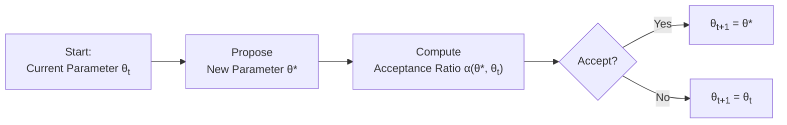

## Introduction to Markov Chain Monte Carlo (MCMC)

Have you ever built a Bayesian model and realized, “Um, there's no way I'm solving this integral by hand.” Well, that's precisely where Markov Chain Monte Carlo (MCMC) steps in. MCMC is a powerful collection of computational algorithms designed to sample from probability distributions with shapes and dimensions too complicated for classical analytical methods. 

At the heart of MCMC lies the idea of a “Markov chain,” which is essentially a sequence of random variables (or parameter values) where each value depends on the previous one. Over many iterations, that chain “forgets” its starting point—like a traveler wandering around until eventually reaching a distribution that fairly represents the shape of the Bayesian posterior we’re after. 

• MCMC is widely used when direct sampling from a posterior distribution (the distribution of parameters after observing data) is analytically prohibitive.  
• Key MCMC algorithms include Metropolis-Hastings and Gibbs Sampling, each offering a systematic way of drawing from difficult distributions and gradually honing in on the target posterior.  
• In finance, MCMC can help handle complex parameter spaces, such as multi-factor equity models that incorporate industry and macroeconomic factors, or time-varying volatility models in fixed income.

## The Role of MCMC in Bayesian Finance

If you’re dealing with a straightforward Bayesian problem—perhaps a single-parameter model—simple techniques might suffice. But for real-world financial applications, oh boy, those parameter spaces can get massive. Think about a multi-factor equity model with dozens of covariates, or a hierarchical Bayesian approach to portfolio allocation that includes separate layers for industry effects and region effects. 

MCMC allows you to:  
• Tackle high-dimensional parameter spaces, producing posterior estimates and credible intervals for each parameter.  
• Incorporate realistic prior information in the analysis. For instance, you might have prior beliefs about how fast volatility mean reverts in a GARCH model.  
• Approximate complicated posterior distributions that do not have closed-form solutions.  

### Computational Considerations

When working with MCMC, you’ll frequently hear about terms like “chain length,” “burn-in,” and “thinning.” Let’s define each:

• Chain Length: The total number of MCMC iterations (or draws). A longer chain often yields more precise estimates—assuming your sampler is well-behaved. But it also requires more computational time.  
• Burn-In Period: The initial set of iterations that we discard. Early in the chain, the algorithm is still “finding its bearings” and could be heavily influenced by the starting values.  
• Thinning: A technique where we only keep every kth draw (say, every 10th or 20th), reducing autocorrelation among stored samples and easing memory constraints.

## Metropolis-Hastings Algorithm

Metropolis-Hastings is a flexible, general-purpose MCMC method that can handle scenarios where you can evaluate the density of your posterior only up to a proportionality constant. 

### How It Works

1. Start with some initial guess for your parameter, θ₀.  
2. Propose a new candidate parameter θ* based on a proposal distribution (e.g., a normal distribution centered at the current parameter).  
3. Compute the acceptance ratio, α(θ*, θₜ), which is typically:

   α(θ*, θₜ) = min { 1, [ p(θ*) × q(θₜ | θ*) ] / [ p(θₜ) × q(θ* | θₜ) ] }

   • p(θ) is the posterior (or unnormalized posterior) at θ.  
   • q(· | ·) is the proposal distribution used to propose new values.  

4. Accept θ* with probability α(θ*, θₜ). If accepted, θₜ₊₁ = θ*, otherwise θₜ₊₁ = θₜ.  
5. Repeat for many iterations.

### Visualizing the Metropolis-Hastings Steps

Below is a simple Mermaid flowchart showing the iterative process. You can imagine each iteration as a small step in a random walk that gradually settles into the “shape” of the target posterior.



### Influence of Proposal Distribution

If the proposal distribution is too narrow, your chain might move very slowly (low acceptance means you just keep jumping back to the same spot). Conversely, if it's too wide, you might propose values that are almost always rejected. There's a trade-off between exploration (covering many parts of your posterior) and acceptance (ensuring enough accepted proposals to capture the real shape).

## Gibbs Sampling

Where Metropolis-Hastings is a more universal approach, Gibbs Sampling relies on the ability to directly sample from a parameter's conditional distribution given everything else. That might sound fancy, but it's actually straightforward when each full conditional distribution is something we can sample from easily—like a normal distribution in a Bayesian linear regression. 

### How It Works

Imagine you’ve got parameters (θ₁, θ₂, …, θₙ). For iteration k:

1. Draw θ₁⁽ᵏ⁺¹⁾ from p(θ₁ | θ₂⁽ᵏ⁾, …, θₙ⁽ᵏ⁾, Data).  
2. Next, draw θ₂⁽ᵏ⁺¹⁾ from p(θ₂ | θ₁⁽ᵏ⁺¹⁾, θ₃⁽ᵏ⁾, …, θₙ⁽ᵏ⁾, Data).  
3. Continue until you cycle through all parameters.  

By the time you reach θₙ, you’ve updated everything based on the newly sampled values. That set (θ₁⁽ᵏ⁺¹⁾, …, θₙ⁽ᵏ⁺¹⁾) becomes your next draw in the chain.

### Finance Application Example

Gibbs Sampling is particularly popular in hierarchical models, such as modeling stock returns with nested industry and firm-level effects. Each level's parameters might have a well-known conditional distribution (e.g., normal or Gamma), and you can cycle through them in a Gibbs scheme. 

## Evaluating Convergence

So you’ve run a chain for 10,000 iterations, but how do you know if you’ve done enough sampling? Convergence diagnostics tell you whether your chain is “done cooking,” so to speak, and is sampling from the correct posterior distribution rather than meandering aimlessly.

### Trace Plots

A trace plot is simply the path of the sampled parameter values over iterations. If the plot looks like it “settles” into a stationary band without obvious trends or drifts, that’s a good sign. If you see the chain wandering off in one direction, you might suspect insufficient mixing or a model misconfiguration.

### Autocorrelation Checks

Another big sign of convergence is to see how correlated samples are across iterations. If draws are highly autocorrelated, you might need a longer chain or some thinning. Alternatively, maybe your proposal distribution (in Metropolis-Hastings) is not well-scaled.

### Gelman-Rubin Diagnostic (R-hat)

If you can afford to run multiple chains with different starting points, the Gelman-Rubin statistic (often referred to as \\(\hat{R}\\)) is a popular measure:


\hat{R} = \sqrt{\frac{\hat{V}}{W}}


where \\(\hat{V}\\) is an estimate of the posterior variance based on both “within-chain” and “between-chain” variance. If \\(\hat{R}\\) is close to 1.0 for each parameter, it suggests that all chains are sampling from the same distribution. But if \\(\hat{R}\\) is well above 1.1, you might be seeing large discrepancies that indicate non-convergence.

## Practical Tips for MCMC Implementation

• Choose Reasonable Starting Values: Sometimes you have a prior guess or a maximum likelihood estimate that’s stable. Bad starts can prolong burn-in.  

• Decide on Burn-In Length: There's no one-size-fits-all. If your trace plots show that it takes about 1,000 iterations to stabilize, you might want a burn-in of 2,000 just to be safe.  

• Check Effective Sample Size (ESS): MCMC draws can be correlated. The ESS is the equivalent number of independent samples. A higher ESS means more reliable posterior summaries.  

• Document Thoroughly: Record acceptance rates, step sizes, or any adjustments you make so you can replicate or debug your chain setup.  

• Parallel Chains: Running multiple chains can quickly reveal poor mixing or confirm that you’ve achieved convergence.  

• Eye on Computation: MCMC can be computationally expensive—especially if each iteration involves evaluation of large matrices for multi-factor models. High-performance libraries like Stan or PyMC can help.  

## Example: Simple Metropolis-Hastings in Python

Below is a tiny snippet illustrating a bare-bones Metropolis-Hastings procedure for a hypothetical distribution. In real life, you’d also track chain diagnostics, add burn-in, and maybe store acceptance rates.

```python
import numpy as np

def target_density(theta):
    # A toy unnormalized posterior, e.g., a simple 1D Gaussian
    return np.exp(-0.5 * theta**2)

np.random.seed(42)
num_samples = 10000
samples = np.zeros(num_samples)
theta_current = 0.0

for i in range(1, num_samples):
    # Propose new candidate from N(theta_current, 1)
    theta_proposal = np.random.normal(theta_current, 1.0)
    
    # Metropolis acceptance ratio
    alpha = min(1, target_density(theta_proposal)/target_density(theta_current))
    
    # Accept or reject
    if np.random.rand() < alpha:
        theta_current = theta_proposal
    
    samples[i] = theta_current
```

In practice, you’d want to produce trace plots, evaluate acceptance rates, and store relevant metrics for diagnosing convergence.

## Glossary

• **MCMC (Markov Chain Monte Carlo):** A class of computational algorithms for sampling from probability distributions too complex for direct methods.  
• **Chain Convergence:** The point at which MCMC samples effectively represent the true posterior.  
• **Burn-In:** The initial portion of MCMC draws discarded due to dependence on starting values.  
• **Mixing:** How well the chain explores the parameter space; good mixing means the chain moves freely around the posterior.  
• **Acceptance Ratio:** The probability of accepting a proposed parameter in Metropolis-Hastings.  
• **Trace Plot:** A visual plot of sampled values over iterations used to detect chain stabilization.  
• **Gelman-Rubin Diagnostic (R-hat):** A measure of convergence comparing within-chain and between-chain variances.

## References & Further Reading

• Chib, S. & Greenberg, E. (1995). “Understanding the Metropolis-Hastings Algorithm.” The American Statistician.  
• Stan Development Team (https://mc-stan.org/): Excellent software and documentation for advanced Bayesian modeling.  
• Gelman, A. et al. (2013). Bayesian Data Analysis. CRC Press.  
• PyMC (https://docs.pymc.io/): Python library for Bayesian modeling using MCMC and related methods.

------------------------------------

## Markov Chain Monte Carlo (MCMC) and Convergence Diagnostics Quiz



### Which of the following best describes the term "burn-in" in MCMC?

- [ ] The total number of samples drawn during the entire chain.
- [ ] The portion of the chain used to diagnose convergence.
- [x] The initial number of draws discarded to remove dependence on starting values.
- [ ] The final number of draws used to generate autocorrelation statistics.

> **Explanation:** Burn-in refers to the first part of the MCMC chain that is discarded due to its dependency on the initial values. Discarding these iterations helps ensure that subsequent samples are more representative of the target posterior.

### In the Metropolis-Hastings algorithm, which factor primarily governs how frequently proposed samples are accepted?

- [x] The acceptance ratio α(θ*, θₜ).
- [ ] The dimensionality of the parameter space.
- [ ] The chain length.
- [ ] The burn-in period.

> **Explanation:** The acceptance ratio α(θ*, θₜ) dictates whether a proposed sample θ* is accepted. It incorporates the posterior density and the proposal distribution.

### When would Gibbs Sampling be more convenient than Metropolis-Hastings?

- [x] When the full conditional distributions of parameters are known and easily sampled.
- [ ] When the proposal distribution is challenging to choose.
- [ ] When the target distribution's shape is known and unimodal.
- [ ] When the chain dimension is extremely large and complex.

> **Explanation:** Gibbs Sampling works best when each parameter's conditional distribution is recognized and can be directly sampled, which simplifies the iterative updates.

### Which of the following is a visual method to gauge whether an MCMC chain has stabilized?

- [x] Trace plots.
- [ ] QQ plots.
- [ ] Box plots.
- [ ] Probability-paper plots.

> **Explanation:** A trace plot shows the sampled values of a parameter over iterations. Once it looks steady and without trend, it suggests (though does not guarantee) convergence.

### The Gelman-Rubin statistic (R-hat) compares which two variances?

- [x] Between-chain variance and within-chain variance.
- [ ] Prior variance and posterior variance.
- [ ] Sample variance and population variance.
- [ ] The variance of the chain to the variance of independent data.

> **Explanation:** R-hat evaluates the ratio of between-chain variance to within-chain variance. If they are similar, it implies chains converge to the same posterior.

### If your chain exhibits very high autocorrelation, which of the following might you do?

- [ ] Reduce the number of samples to trade depth for speed.
- [x] Increase chain length or apply thinning to reduce correlation between samples.
- [ ] Start from multiple identical initial points.
- [ ] Use a test for stationarity like the Augmented Dickey-Fuller (ADF).

> **Explanation:** High autocorrelation within an MCMC chain means adjacent samples are similar. Increasing chain length or using thinning are common strategies to mitigate this challenge.

### What does it mean if a chain “mixes” well?

- [ ] The current sample is always accepted.
- [ ] The chain's variance is always decreasing.
- [ ] The chain's burn-in period is negligible.
- [x] The chain freely explores the parameter space, moving among different regions efficiently.

> **Explanation:** “Good mixing” means the chain visits various regions of the posterior distribution without getting stuck, thus better approximating the distribution.

### In Metropolis-Hastings, which aspect primarily determines how large the candidate steps are?

- [ ] The number of parallel chains.
- [ ] The burn-in period.
- [x] The proposal distribution’s variance or scale.
- [ ] The trace plot shape.

> **Explanation:** The scale of the proposal distribution dictates how big the jumps in parameter space are. Setting it too large or too small can hurt acceptance and mixing.

### What does “effective sample size” (ESS) measure in MCMC?

- [ ] The minimal chain length required before discarding burn-in.
- [x] The equivalent number of independent samples in a correlated chain.
- [ ] The total memory used by the chain across iterations.
- [ ] The ratio of consecutive acceptance rates in Metropolis-Hastings.

> **Explanation:** Because MCMC samples tend to be autocorrelated, the ESS estimates how many truly independent draws the chain contains, which is critical for reliable inference.

### True or False: If the trace plots of one chain look stable, there is no need to run multiple chains.

- [ ] True
- [x] False

> **Explanation:** Even with stable-looking trace plots, it’s prudent to run multiple chains from different initial points. Comparing chains is a stronger indicator of convergence.


