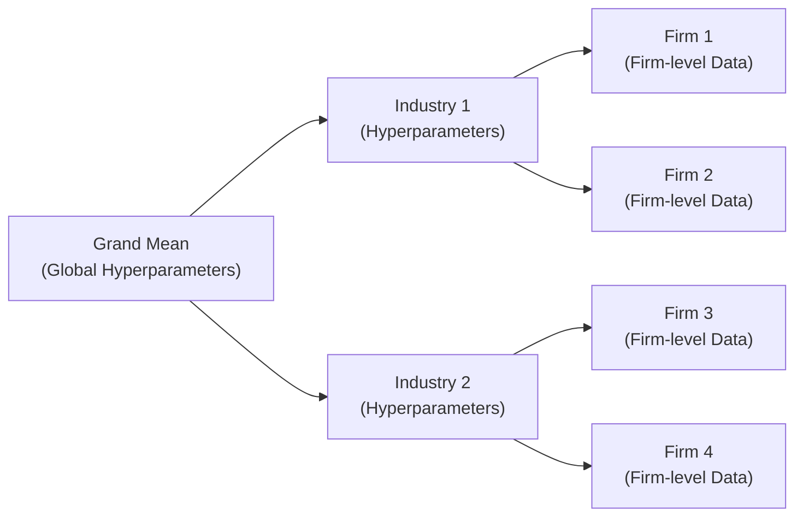

## Why Bayesian Thinking Matters in Finance

So, Bayesian methods are often described as a data-updating superpower in statistics. In finance, you’re constantly seeing new information roll in—new earnings data, new macro indicators, new company reports—and you need to process all of it in a structured way. Bayesian regression basically says, “We have some beliefs about our parameters (our priors), and we’ll update those beliefs in light of newly observed data,” which leads us to a posterior distribution. That posterior distribution is the new “state of knowledge” about our parameters and helps us forecast or make decisions.

You might be thinking: “Wait, don’t linear regressions already give me estimates for betas and confidence intervals?” They do, but Bayesian approaches add the neat ability to incorporate prior knowledge or domain expertise, and they produce full posterior distributions rather than single-point estimates. This means you can do more flexible forecasting and quantification of uncertainty. And in a field like finance, which is frequently uncertain and rarely neat, that’s huge.

## Bayesian Linear Regression Fundamentals

Bayesian linear regression is the building block of many advanced hierarchical or multilevel approaches. Let’s go step by step—like we’re pulling apart an engine to see how each piece fits.

Consider a simple linear regression model:

yᵢ = β₀ + β₁xᵢ + εᵢ

where  
• yᵢ is the response variable (e.g., returns)  
• xᵢ is the predictor variable (e.g., a factor exposure)  
• β₀ and β₁ are coefficients we want to estimate  
• εᵢ ∼ 𝒩(0, σ²) is the error term  

### Specifying a Prior

From a Bayesian perspective, β₀ and β₁ are random variables with prior distributions. A common approach is to assume something like:

β₀, β₁ ∼ 𝒩(0, 10²)

(meaning we guess a normal prior with mean zero and a large variance to reflect relatively mild prior knowledge). We also specify a prior over the variance σ², often an inverse-gamma distribution or something similar, but let’s keep it less complicated for now.

### Combining Prior and Likelihood

Next, we observe data (xᵢ, yᵢ) for i = 1, …, n. We form the likelihood:

p(y | β₀, β₁, σ²) = ∏ ( 𝒩(yᵢ | β₀ + β₁ xᵢ, σ²) ), i = 1 to n

The Bayesian magic is that we multiply our prior by the likelihood:

Posterior ∝ Prior × Likelihood.

Or symbolically:

p(β₀, β₁, σ² | y, X) ∝ p(y | β₀, β₁, σ², X) · p(β₀, β₁, σ²).

### Deriving the Posterior (Conceptual Overview)

If we assume normal priors on (β₀, β₁) and a conjugate inverse-gamma prior on σ², then the posterior distribution remains in the same family—also normal-inverse-gamma. The result is:

(β | X, y) ~ 𝒩(β̂, Σ̂),
σ² | X, y ~ Inverse-Gamma(α̂, β̂),

where β is shorthand for (β₀, β₁). The means and parameters α̂, β̂, β̂, Σ̂ get updated based on the data. You don’t have to memorize the exact forms for the exam, but you should understand that updating means shifting the prior distribution into a posterior distribution informed by the observed data. 

This is in contrast to frequentist approaches, where β̂ is just the least-squares solution. The Bayesian result is an entire posterior curve that factors in prior beliefs, which might be super helpful if we suspect that certain factor betas should be near zero or that volatilities have certain plausible ranges. The big takeaway is that Bayesian regression solutions incorporate both prior knowledge and sample data.

## Advantages Over Classical Regression

You might ask: “So why bother?” There are a few high-impact reasons:

• Natural Parameter Uncertainty: With Bayesian regression, you explicitly model the uncertainty about coefficients. Instead of a single point estimate, you have a distribution capturing how confident (or not) you are about each coefficient.  
• Predictive Posterior: You can derive the distribution for y* (future or out-of-sample observations), which provides a more intuitive measure of what we expect new data to look like. This is great if you’re building out-of-sample predictions, say for returns next quarter.  
• Incorporation of Expert Judgments: Suppose your investment committee strongly believes that a broker’s research alpha factor is near zero. You can incorporate that as a prior, and if the data doesn’t strongly contradict it, your posterior will remain near zero.  
• More Flexibility in Complex Models: Frequentist methods often become quite unwieldy for complicated or multi-level structures. Bayesian methods can elegantly handle them—especially with computational tools like Markov Chain Monte Carlo (MCMC).  

Many practitioners (myself included!) occasionally find themselves frustrated by classical confidence intervals, which can be misinterpreted. Posterior intervals (“there’s an 80% chance that the true beta is in this range, given the data and the prior”) can feel more natural from a decision-making perspective.

## Hierarchical (Multilevel) Models

Sometimes called multilevel models, hierarchical approaches let you handle data that’s naturally grouped—like firms within an industry, or industries within a region. By layering the priors, you allow partial pooling of data across groups to avoid extremes caused by small sample sizes.

### When to Use Hierarchical Models

If you’re analyzing, say, different firms’ stock returns and suspect that each firm’s returns might have a slightly different intercept (α) but the same slope parameters with respect to certain market factors, you could either:  
• Fit a separate regression for each firm (possible overfitting, ignoring shared structure)  
• Pool all data together in one big regression ignoring firm differences (possible underfitting and ignoring heterogeneity)  

A hierarchical approach offers a middle ground: each firm can have its own intercept, but we estimate a distribution over those intercepts, partially pooling them toward an overall mean. This approach is wonderful when a small number of observations per group otherwise leads to huge standard errors in a purely “unpooled” method.

In finance, you might see it in applications such as:  
• Modeling default rates across different credit cohorts (each region or demographic shares some higher-level default risk parameters, but we still allow local variation).  
• Multi-factor equity models that vary by sector. Some sectors might have different exposures to macro factors, but overall factor movements can be shared across sectors.

### Partial Pooling: Finding the Sweet Spot

Partial pooling is the essence of hierarchical modeling. In the simplest sense, each group-level parameter (e.g., intercept for each group) is assumed to come from a common distribution that has hyperparameters. If you recall any frustrating experiences with small group sample sizes (I sure do!), partial pooling helps share information among groups so that a group with fewer observations doesn’t get an excessively extreme estimate.

It’s like this:  
• If a group has a bunch of data that strongly suggests its intercept is higher/lower than average, it gets pushed away from the overall mean.  
• If another group has very little data, it shrinks more closely toward the overall mean.  

That’s partial pooling in a nutshell—balancing the group-specific data versus the global data so that you don’t overfit or you don’t just lump everything into one pot.

## Hierarchical Model Implementation Details

Imposing hierarchical priors or hyperpriors (the prior on the group-level parameters) can sound complicated, but let’s break it down with an example.

Suppose you have multiple industries, each containing multiple firms. You want to model the return of firm i in industry j:

yᵢⱼ = αⱼ + β₁,ⱼ xᵢⱼ + … + εᵢⱼ

where  
• αⱼ is the intercept for industry j, which itself is drawn from a distribution with hyperparameters μᵅ, σᵅ².  
• β₁,ⱼ might also be drawn from a distribution with hyperparameters μᵦ, σᵦ².  
• The variance σ² could be common or could also vary by industry.

In a Bayesian hierarchical framework:

αⱼ ~ 𝒩(μᵅ, σᵅ²),  
β₁,ⱼ ~ 𝒩(μᵦ, σᵦ²).

Then we have hyperpriors on μᵅ, σᵅ², μᵦ, and σᵦ². Each firm-level observation becomes part of the bigger puzzle, telling us something about its industry intercept and slope. MCMC or variational inference draws samples from this multi-level posterior, iteratively updating our beliefs about individual group parameters and the global hyperparameters.

In short, you get a posterior distribution of parameters for each industry, plus an updated distribution of the global hyperparameters. This layering might feel complicated, but software such as Stan, PyMC, BUGS, or similar packages can fit these models with relative ease. The end result? A more robust model that handles cross-group differences elegantly while sharing statistical strength across groups.

### A Quick Hierarchical Diagram

Here’s a small mermaid diagram that illustrates the flow of information from a global hyperparameter level down to industry-level parameters and then to the firm-level data:

Each box is a “layer.” The top box is the hyperparameter distribution. That flows into the “industry-level” boxes, which then connect to actual firm-level data.

## Use Cases in Finance

1. Credit Risk Modeling: Imagine you have default or loss metrics for multiple geographies. Each geography might have its own intercept (e.g., baseline default risk) and slope on a macroeconomic factor (like unemployment). A hierarchical approach can pool the data across geographies, making estimates more stable in smaller regions.  
2. Factor Modeling Across Sectors: If you suspect that betas on certain risk factors (e.g., currency risk or interest rate risk) vary among sectors, a hierarchical approach can capture those differences without ignoring the overarching structure.  
3. Forecasting Return Distributions: Bayes is the hero when we need a predictive distribution. By modeling uncertain parameters, you get an entire distribution over next period’s returns for each firm or sector, rather than a single point estimate.

## Best Practices and Common Pitfalls

• Choosing Priors: If your priors are too tight, you might overshadow your data. If they’re too loose, you lose the benefit of Bayesian methods. Often, moderately informative priors are a good place to start, and you can refine them if you have strong domain knowledge.  
• Computation: Hierarchical models can become computationally expensive. MCMC methods might require a lot of sampling. Make sure to check convergence diagnostics (e.g., R-hat) to ensure your chains have settled.  
• Overfitting vs. Underfitting: Partial pooling helps with this—groups with plenty of data get more autonomy, whereas groups with little data get shrinkage toward the overall mean. But if the hierarchical structure is mis-specified, you could still run into trouble.  
• Interpretation: Because you have random effects (like industry intercepts) coming from a distribution, you’ll want to be careful in explaining results—particularly if stakeholders are used to classical fixed-effects assumptions.  
• Model Complexity: Especially for large-scale financial data, it’s tempting to add multiple hierarchical levels (e.g., region→industry→firm→department). But each added level can complicate the model. Consider parsimony and confirm you have enough data to support it.

## Exam Tips for Bayesian and Hierarchical Applications

• You might see a vignette describing a scenario where a sector has only a handful of data points. The question might revolve around partial pooling: “How would a Bayesian hierarchical model handle this situation?”  
• Make sure you know how to interpret posterior intervals—these intervals reflect the probability statement about the parameter given the data, which differs from frequentist confidence intervals.  
• If they give you a prior distribution or mention that a manager’s guess is effectively a prior, think about how that prior would combine with the data-likelihood.  
• Watch for “multilevel” or “nested” data hints. If the item set explicitly shows data that’s grouped by sector, or region, or time cluster, suspect that hierarchical modeling might be relevant.  

## Glossary

• Hierarchical Model: A multi-level model structure in which parameters of one level (e.g., firm-level intercepts) are themselves drawn from distributions governed by higher-level hyperparameters (e.g., industry-level means).  
• Partial Pooling: A shrinkage technique in hierarchical models that avoids extremes by blending group-specific estimates with an overall mean.  
• Hyperparameters: Parameters of the prior distribution in a hierarchical model (like the mean, variance of the random intercepts). Think of them as “the parameters for the parameters.”  
• Predictive Posterior: The distribution of future observations (e.g., returns, default rates) based on the posterior distribution of parameters. This is your forward-looking uncertainty about what will happen next.

## References and Further Reading

• Gelman, A. & Hill, J. (2007). “Data Analysis Using Regression and Multilevel/Hierarchical Models.” Cambridge University Press.  
• CFA Institute readings on Bayesian methods and advanced statistical modeling.  
• McElreath, R. (2020). “Statistical Rethinking.” Chapman and Hall/CRC.  
• Stan, PyMC, BUGS project websites for practical implementation details.  

## Sample Exam Questions on Bayesian Regression and Hierarchical Models



### A portfolio manager wants to incorporate prior beliefs about factor exposures in a regression. Which of the following best describes how Bayesian regression differs from a classical (frequentist) approach?

- [ ] Bayesian regression always produces narrower confidence intervals.  
- [x] Bayesian regression updates prior beliefs with observed data to generate a posterior distribution.  
- [ ] Bayesian regression disregards data if it conflicts with prior beliefs.  
- [ ] Bayesian regression cannot be used for predictive modeling.  

> **Explanation:** Bayesian regression formally combines the prior distribution (which reflects prior beliefs) with the likelihood of the observed data to yield a posterior distribution of the parameters.

### In Bayesian linear regression, the key reason posterior intervals are often considered more intuitive than frequentist confidence intervals is:

- [ ] They depend only on the sample mean.  
- [x] They can be interpreted as the probability that the parameter lies within a range, given the data and prior.  
- [ ] They are guaranteed to be narrower than classical confidence intervals.  
- [ ] They ignore prior beliefs and rely solely on observed data.  

> **Explanation:** A Bayesian credible interval is a probability statement about the parameter, which many practitioners find more intuitive than the frequentist interpretation of confidence intervals.

### Which of the following statements about hierarchical models is most accurate?

- [x] Hierarchical models allow group-specific parameters to be partially pooled toward an overall mean.  
- [ ] Hierarchical models assume each group’s parameters are identical.  
- [ ] Hierarchical models cannot incorporate hyperparameters.  
- [ ] Hierarchical models require large sample sizes to provide any advantage.  

> **Explanation:** Hierarchical models enable partial pooling, estimating separate parameters for each group while sharing information across groups through hyperparameters.

### If a credit risk analyst fits a separate regression model for each region independently, which problem is most likely to arise in a dataset with uneven sample sizes?

- [x] Overfitting in small-sample regions and ignoring shared structural information.  
- [ ] Consistent parameter estimates across all regions.  
- [ ] Underfitting in large-sample regions.  
- [ ] Reduced variability in parameter estimates.  

> **Explanation:** Fitting a separate regression for each region can overfit regions with fewer data points, failing to leverage information from other regions.

### What is the primary computational approach often used to estimate the posterior distribution in a hierarchical Bayesian model?

- [ ] Maximum Likelihood Estimation (MLE).  
- [ ] Ordinary Least Squares (OLS).  
- [x] Markov Chain Monte Carlo (MCMC).  
- [ ] Bootstrap resampling.  

> **Explanation:** While hierarchical models can sometimes be approximated by other methods, MCMC sampling is a commonly used approach for drawing from the posterior distribution in a Bayesian context.

### In a two-level hierarchical model, if both the intercept and slope are allowed to vary by group, but we assume each arises from a normal distribution around a global mean, these global means and variances are referred to as:

- [ ] Confidence intervals.  
- [ ] Random effects.  
- [ ] Bayesian priors.  
- [x] Hyperparameters.  

> **Explanation:** The global mean and variance that define each group-level parameter’s distribution are called hyperparameters, reflecting the “parameters of parameters.”

### Which of the following best defines “partial pooling” in the context of hierarchical models?

- [x] Combining information across groups so that estimates are shrunken toward a global average.  
- [ ] Spreading observations randomly across groups in the dataset.  
- [ ] Splitting data into multiple segments with no overlap.  
- [ ] Fitting separate models for each group without any shared parameters.  

> **Explanation:** Partial pooling is precisely the approach of blending group-specific estimates with an overall average, preventing overfitting or underfitting.

### When would a hierarchical Bayesian model be especially appealing?

- [ ] When the sample size is extremely large and homogeneous across groups.  
- [x] When data are grouped (e.g., by industry, region) and each group has limited observations.  
- [ ] When classical regression results have zero uncertainty.  
- [ ] When no prior information is available about any parameters.  

> **Explanation:** Hierarchical models excel in settings with naturally grouped data and varying sample sizes across those groups. They share strength and stabilize estimates.

### Which statement most accurately describes a predictive posterior distribution in Bayesian analysis?

- [ ] It only indicates the probable range of the sample mean.  
- [x] It provides a distribution for future (unobserved) data points based on the posterior of model parameters.  
- [ ] It is used exclusively for historical data comparisons.  
- [ ] It is an alternative term for a classical confidence interval.  

> **Explanation:** The predictive posterior describes the likely range of future observations (like future returns), informed by the posterior distributions of the parameters.

### True or False: Bayesian hierarchical models are unable to incorporate domain expert beliefs, because everything must be derived directly from the data.

- [ ] True  
- [x] False  

> **Explanation:** Expert beliefs are precisely what priors can encode in Bayesian models. Those priors can then be updated by data.


