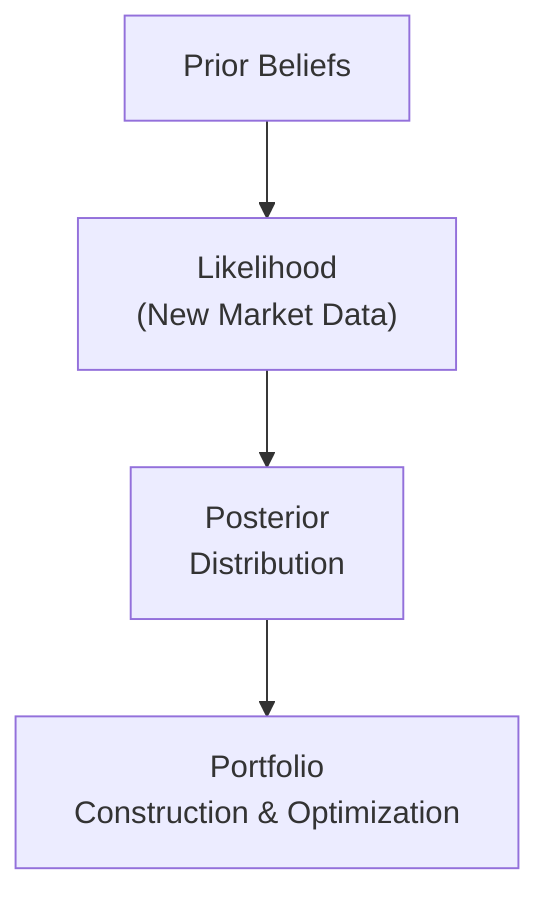

### Conceptual Overview
So, you want to build a portfolio that brings together the best of both worlds: your own insights (things you feel strongly about, maybe from fundamental analysis or reading the latest macroeconomic reports) and the wealth of market data that’s out there. Bayesian portfolio construction basically says, “Hey, why don’t we treat our opinions and forecasts like a prior belief, then update that belief as new info (a.k.a. evidence) rolls in?” This approach acknowledges that we’re never 100% sure about any single forecast, so we blend (in a mathematically rigorous way) the prior distribution of returns with fresh observations. The result is a posterior distribution: a refined belief about the likely returns and risks of various assets.  

If that sounds a little fancy, think of it this way: Let’s say you inherited your family’s secret recipe for chocolate chip cookies (that’s your ‘prior’ belief in how to make them). One day, you stumble upon a new baking tip from a friend test kitchen (that’s your ‘new data’). You combine your original recipe with this new tip, updating your cooking approach so that your cookies (hopefully) come out even better.  

That’s basically the gist of Bayesian updating. But in finance, we’re not dealing with cookies—unfortunately—we’re dealing with uncertain future returns. This uncertain future means we have a distribution for each asset’s possible outcomes, and with Bayesian ideas, we keep pooling fresh info to refine those distributions.  

### The Black-Litterman Model Connection
One of the best‑known examples of this approach is the Black-Litterman model, which sometimes sounds more complicated than it really is. The model tries to address a common frustration: if you naively plug your own return forecasts into a classic mean-variance optimization, you can end up with some pretty wacky portfolios (overly concentrated in certain assets, for instance).  

The Black-Litterman approach basically does two major things:

• It starts with a “reverse optimization.” That means it looks at the actual market capitalization weights of assets—like global equity indexes, corporate bond indexes, etc.—and asks, “What expected returns would justify these market weights if everyone’s being rational?” Those implied returns become your baseline or “equilibrium” returns. Think of them as the market’s best guess about how different assets should be priced in the grand scheme.

• Next, it allows you to quietly inject your own views on specific assets (e.g., “I believe Asset A will outperform its peer group by 1% next year with a certain confidence level…”). The model then seamlessly merges that subjective view into the equilibrium returns. Technically speaking, your view is treated as another piece of evidence (the likelihood), and the equilibrium returns act like a prior.  

After combining, you get posterior expected returns that reflect both the market equilibrium and your unique opinions—weighted by how confident you are in those opinions. This is Bayesian updating at work: market equilibrium data + your private signals = a posterior distribution of asset returns.  

### Steps in Bayesian Portfolio Optimization
Now, let’s walk through the typical steps you’d follow when actually applying Bayesian methods to build a portfolio.

1. **Specify Prior Beliefs**  
   You can start with a prior distribution for expected returns (and possibly for covariance matrices too). Depending on your appetite for complexity, you might say: “My prior is the set of implied returns derived from current market caps,” or “My prior is simply the historical average returns from the past 10 years.”  

2. **Define the Likelihood**  
   Next, you gather new information that updates your prior. This might be macroeconomic forecasts (like inflation or GDP growth), new fundamental data (like company earnings announcements), or even your own “expert judgments.” You treat these data as the likelihood function, which tells us how plausible it is to see the observed data, given different assumed levels of asset returns.  

3. **Compute Posterior Estimates**  
   In Bayesian math, the posterior distribution of returns is proportional to the product of the prior and the likelihood. Formally:  
   $$
   p(\theta \mid X) = \frac{ p(X \mid \theta) \; p(\theta) }{ p(X) }  
   $$
   Here, \\(\theta\\) could represent the vector of expected returns and their correlation structure, and \\(X\\) represents the new data. This is the essence of Bayesian updating.  

   To get the new (posterior) expected returns, you can rely on well-known Bayesian formula derivations or a specialized model like Black-Litterman.  

4. **Optimize the Portfolio**  
   Once you have the posterior distribution of returns (and ideally an updated covariance matrix), you perform portfolio optimization. Often that’s mean-variance optimization:  
   $$\text{Minimize} \quad w^\top \Sigma_{\text{posterior}} w \quad \text{subject to} \quad w^\top \mu_{\text{posterior}} = \bar{r}, \quad \sum_i w_i = 1,$$  
   where \\(w\\) is the vector of portfolio weights, \\(\mu_{\text{posterior}}\\) is the posterior mean returns, and \\(\Sigma_{\text{posterior}}\\) is the posterior covariance matrix.  

   Of course, there are more advanced approaches—like incorporating transaction costs, factor-model constraints, or short-sale restrictions. But at heart, you’re using your posterior beliefs to feed an optimization routine.  

Check out this simple flow diagram for the conceptual process:

### Advantages Over Traditional Mean-Variance Approach
Why bother with all this Bayesian business, right? Couldn’t we just use historical averages as expected returns and call it a day? Well, there are actually several compelling reasons to go Bayesian:

• **Integration of Multiple Data Sources**  
  Traditional mean-variance often finds a single “right answer” from historical data. But Bayesian methods let you combine, say, macro forecasts, fundamental valuations, and your hunches about certain companies.  

• **Reduction of Estimation Risk**  
  If you’ve ever tried plain old Markowitz optimization, you know how sensitive it can be. Slight changes to expected returns or covariances can create drastically different allocations. Bayesian approaches dampen that by formalizing how uncertain you are about each piece of input.  

• **Flexibility and Intuitive Use of Subjective Judgment**  
  Many portfolio managers have “soft” information that’s not purely numerical. Bayesian frameworks let you incorporate those intangible insights into the optimization in a structured manner.  

• **Better Risk-Adjusted Performance**  
  By acknowledging uncertainty and preventing overconfident bets, Bayesian-based portfolios often exhibit improved out-of-sample stability compared to classic plug-in historical approaches.  

### Practical Considerations
Let’s be real: implementing a Bayesian portfolio approach can be tricky. You might find yourself wading through matrix algebra or coding a sampling algorithm like MCMC (Markov Chain Monte Carlo). For big portfolios—like hundreds or thousands of stocks or bonds—this can get computationally heavy.  

• **Covariance Estimation**  
  We must be mindful about how to handle the covariance matrix. Bayesian updating can be extended to handle second-moment uncertainty too, but that’s a level of complexity not everyone’s ready for.  

• **Data Quality and Model Checking**  
  If your “views” are systematically biased or your data feed is incomplete, your posterior results can get skewed. Just because it’s Bayesian doesn’t mean it’s bulletproof!  

• **Scaling Up**  
  With large-scale portfolios, you may need more advanced numerical methods to estimate posterior distributions (like MCMC). This can be time-consuming, so you might want to rely on approximations (e.g., the Black-Litterman closed-form adjustment for posterior means).  

• **Subjective Confidence**  
  In actual practice, you must decide how confident you are in your own forecasts. The Black-Litterman model, for instance, has a parameter for the uncertainty in your views. Tweak it, and you can see your portfolio shift between balancing the market prior and your personal convictions.  

### Glossary
- **Bayesian Portfolio Construction**  
  Updating your initial beliefs (priors) about asset returns and risks with new evidence to form posterior distributions, then constructing a portfolio based on those posterior estimates.

- **Black-Litterman Model**  
  A popular Bayesian-inspired method that merges equilibrium market returns (implied from market weights) with investor views to form posterior expected returns for optimization.

- **Reverse Optimization**  
  A step in Black-Litterman (and other models) where you infer implied returns from the existing market-cap weights assuming mean-variance equilibrium.

- **Posterior Covariance**  
  The updated (Bayesian) covariance matrix of asset returns after merging prior assumptions with the likelihood from new data.

### References & Further Reading
- He, G. & Litterman, R. (1999). “The Intuition Behind Black-Litterman Model Portfolios.” Goldman Sachs Fixed Income Research.  
- Idzorek, T. (2007). “A Step-by-Step Guide to the Black-Litterman Model.” CFA Institute Conference Proceedings Quarterly.  

### Conclusion and Exam Tips
In the real world, Bayesian portfolio construction is a powerful tool for combining rigorous mathematical models, market data, and your own well-honed investment instincts. Whether you choose a formal approach like Black-Litterman or a more custom Bayesian method, you’ll likely find that balancing subjective views with market consensus can improve portfolio stability and performance.  

For the exam, remember these tips:  
• Understand the core concept of combining priors and likelihood. CFA Level II often loves to test whether you can articulate how Bayesian updating works in the context of forecasting or investment allocations.  
• Know how the Black-Litterman model sets up equilibrium returns through reverse optimization. Make sure you’re comfortable explaining the difference between the “implied market returns” and your private views.  
• Watch for item-set questions that ask how to adjust confidence in your views or how that confidence affects the final (posterior) distribution.  
• Keep an eye on potential pitfalls, like messing up the weighting matrix that merges the prior and your subjective view.  
• Practice interpreting the posterior: a question might show a mini “Bayesian update” table and ask how the final weights change.  

And as usual, time management is everything. If you see a Bayesian modeling question, break it down to the building blocks: prior, new data, posterior, final portfolio. You’ll likely find that the exam’s item sets revolve around these steps.  

Now, let’s test your knowledge with some targeted, exam-style questions.

## Test Your Knowledge: Bayesian Portfolio Construction Concepts



### Which of the following best describes the primary benefit of Bayesian methods in portfolio construction?
- [ ] They rely solely on historical mean returns for forecasting.
- [ ] They prevent the use of any subjective forecasts in optimization.
- [x] They combine prior beliefs and new information to refine return estimates.
- [ ] They guarantee superior performance in all market conditions.

> **Explanation:** Bayesian methods systematically integrate both historical (prior) views and new data (likelihood) to produce a posterior distribution of asset returns, offering a more flexible and robust framework than simply plugging in historical means.

### In the Black-Litterman model, "reverse optimization" refers to:
- [ ] Sampling returns via Monte Carlo for each asset.
- [x] Inferring implied returns from observed market weights.
- [ ] Reversing the sign of all covariance matrix elements before optimization.
- [ ] Eliminating leverage by reversing short-sale constraints.

> **Explanation:** Reverse optimization is about deducing the “implied” equilibrium returns that justify current market-cap weights, assuming a mean-variance framework.

### Which of the following statements about posterior distributions is most accurate?
- [x] The posterior distribution reflects updated beliefs after incorporating new information.
- [ ] Once a prior is set, the posterior cannot deviate from it.
- [ ] The posterior distribution only depends on the likelihood function.
- [ ] Posterior distributions in finance never change over time.

> **Explanation:** A posterior distribution is obtained by combining the prior distribution with the likelihood of new data. As new data arrives, the posterior changes accordingly.

### In Bayesian portfolio construction, if an investor has very high confidence in her own views, the:
- [ ] Posterior distribution will heavily resemble the equilibrium returns.
- [x] Posterior distribution will be more influenced by the investor’s views rather than the market prior.
- [ ] Covariance matrix remains unaffected by the investor’s confidence level.
- [ ] Required sample size must be larger.

> **Explanation:** The more confidence you place in your private views, the more weight those views receive in the Bayesian update, leading the posterior to tilt away from the original market equilibrium.

### When compared with standard mean-variance optimization, one advantage of the Black-Litterman model is:
- [x] Reduced sensitivity to errors in input forecasts.
- [ ] Guaranteed to create more volatile portfolios.
- [ ] Elimination of the need for a covariance matrix.
- [ ] Excluding equilibrium weights from the optimization process.

> **Explanation:** Because Black-Litterman blends the market equilibrium (thought to be relatively stable) with an investor’s subjective views, it reduces the input-sensitivity issues commonly plaguing pure mean-variance optimization.

### Which of the following is a major computational challenge in large-scale Bayesian portfolio optimization?
- [ ] Minimizing the risk-free asset allocation.
- [ ] Calculating monthly returns.
- [ ] Ensuring the sum of weights equals zero.
- [x] Handling high-dimensional posterior distributions, often requiring advanced methods like MCMC.

> **Explanation:** In high dimensions, estimating the posterior distribution can be formidable, potentially leading to heavy reliance on Monte Carlo or other specialized algorithms.

### In a Bayesian setting, the prior distribution of asset returns typically represents:
- [ ] The final result of the Bayesian analysis.
- [ ] The realized future market returns of all assets.
- [x] The initial belief about expected returns before incorporating new data.
- [ ] A guaranteed minimum return for each asset.

> **Explanation:** The prior distribution is our best guess about returns (and risk) before we see the latest evidence. Commonly, investors use historical data or equilibrium-based estimates for this.

### An investor uses a Bayesian approach and finds that the asset’s posterior return is almost unchanged from its prior return estimate. This most likely indicates:
- [ ] The investor has a calculation error in the covariance matrix.
- [x] The new information (likelihood) did not significantly alter the prior.
- [ ] The posterior is always equal to a prior in Bayesian methods.
- [ ] Bayesian updating is not applicable for that asset class.

> **Explanation:** If the new data (likelihood) is minimal or not in conflict with the prior, the posterior stays close to the prior.

### In the Black-Litterman model, the weight given to investor views versus the equilibrium market is determined by:
- [ ] The volatility of the market prior only.
- [ ] The portfolio’s leverage constraints.
- [ ] Management fees.
- [x] The confidence level or uncertainty assigned to the investor’s views.

> **Explanation:** If you express high confidence in your views, the model will tilt more strongly toward your forecasts, whereas low confidence will keep you closer to the market equilibrium.

### True or False: One key advantage of Bayesian methods in portfolio construction is that they can systematically incorporate both quantitative data and qualitative investor insights.
- [x] True
- [ ] False

> **Explanation:** Indeed, Bayesian frameworks are uniquely suited for combining hard numbers with softer, subjective investor judgments, weighting each according to its perceived reliability.




