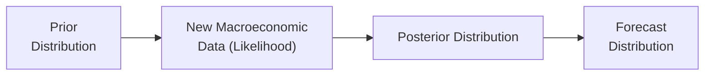

## Scenario Setup

Imagine that you’re an analyst tasked with forecasting monthly stock returns for an emerging-market (EM) portfolio. Your historical dataset spans 10 years, focusing on average returns, volatility, and sector composition. Let’s say these EM exposures are typically higher risk than developed-market equities, so you expect to see somewhat choppier data—often featuring higher volatility, potential structural changes in policy, and a whiff of political risk. 

Now, you’ve just read a significant macroeconomic report suggesting that policy rates in the relevant emerging economy are poised to change trajectory—perhaps the central bank will raise benchmark rates in the next quarter. You suspect this will affect corporate financing costs, investor sentiment, and eventually equity returns. The question is: how do we incorporate that macroeconomic viewpoint into our forecast systematically?

One robust approach is Bayesian forecasting. In a Bayesian framework, you don’t just rely on historical data passively. Instead, you combine (1) your prior beliefs or historical estimates about EM returns with (2) the likelihood of new evidence (the macro report) to form (3) a posterior view of future returns. Let’s dive step by step into how this might work.

## Step-by-Step Bayesian Forecasting

### Step 1: Define the Prior

A Bayesian forecast starts with a prior distribution—a belief about a parameter (like expected return) before seeing the most recent data or relevant new information. In practice, you might set this prior based on:

• Historical returns over the last 10 years for the EM portfolio.  
• Possibly some rolling average that buffers out short-term noise.  
• Volatility estimates, maybe using a GARCH model to capture the changing variance over time if you want to be fancy, or a simpler average standard deviation if you’re pressed for time.

For a slightly more casual illustration, let’s say your prior for monthly returns, μ, is normally distributed with mean 1% and standard deviation 2%. In other words,

μ ~ N(1%, (0.02)²).

That’s your initial guess, shaped by years of data. Maybe you’ve looked at macro conditions in the past that were roughly “normal,” and you figure 1% monthly is typical. Sure, you might be ignoring stuff like structural breaks or crisis outliers, but hey—it’s a straightforward starting point.

### Step 2: Incorporate the New Macroeconomic Data (Likelihood)

Next, you incorporate evidence from the macroeconomic report. Let’s say the policy rate is due to rise by 1.5 percentage points over the next few months. In broad strokes, higher rates can pressure stock returns downward (through higher discount rates on future cash flows), but for an emerging market, the story can get complicated by capital flows, currency influences, and sector-specific impacts. So how do we structure this evidence?

• We treat the macro report as new data, D, that suggests the “true” expected return might differ from the historical average moving forward.  
• Statistically, the likelihood function L(D | μ, σ) captures how probable it is to observe such macro data given specific parameter values for μ and σ.

We might approximate the relationship between policy rate changes and the shift in equity returns with a linear factor model or some reduced-form correlation. For instance, a quick historical check across multiple emerging markets might reveal that a 1% increase in the policy rate leads to a –0.3% shift in average monthly equity returns (just as a simplified guess). You can refine that logic further with more sophisticated econometric approaches.

### Step 3: Derive the Posterior Distribution

In Bayesian terms, the posterior distribution of μ—our updated belief about the expected return—comes from multiplying the prior and the likelihood:

P(μ | D) ∝ P(μ) × P(D | μ).

In words, you take your best guess before (prior) and then “weight” it by how well that guess explains new data (likelihood). Conjugate priors (like a normal prior paired with normal likelihood) can yield an easy closed-form solution for the posterior mean and variance. If so, you’ll see something like a posterior mean that’s a weighted average between the historical average and some function of the new macro data.

In actual math terms (assuming normal distributions throughout):

1) Prior: μ ~ N(μ₀, σ₀²)  
2) Observed data implies a likelihood: R̄ ~ N(μ, σ²/n)  

Combining those yields a posterior: μ | R̄ ~ N( μ_post, σ_post² ).  

The exact formulas for μ_post and σ_post² will depend on the sample size, the prior’s tightness, and how strongly the new evidence points away from the old distribution.

### Step 4: Use Simulation or Closed-Form Solutions

If you’re dealing with a non-conjugate prior or more complicated model structures (like structural breaks, heavy tails, or a regime-switching logic), you might not have a neat closed-form posterior. Instead, you turn to numerical methods, typically Markov Chain Monte Carlo (MCMC). This approach uses iterative simulation to sample from the posterior distribution. 

Here’s a little snippet in Python just to illustrate how you might set up an MCMC using a basic Bayesian framework. Please don’t worry too much about the exact code intricacies if you’re new to Python:

```python
import numpy as np
import pymc3 as pm

observed_returns = np.random.normal(0.01, 0.02, 120)  # 10 years of monthly data
prior_mean = 0.01
prior_sd   = 0.02

with pm.Model() as bayes_model:
    mu = pm.Normal('mu', mu=prior_mean, sigma=prior_sd)
    # Let's assume known or fixed volatility for simplicity
    sigma = 0.02  # known standard deviation
    likelihood = pm.Normal('likelihood', mu=mu, sigma=sigma, observed=observed_returns)
    
    # Sample from the posterior
    trace = pm.sample(2000, tune=1000, cores=1, chains=2)
    
post_mean_mu = np.mean(trace['mu'])
print("Posterior Mean of Monthly Return:", post_mean_mu)
```

If your prior or likelihood is straightforward, you can skip MCMC and derive an analytical posterior. For example, a normal prior combined with normal data results in a normal posterior:

(1) Posterior mean = (σ² × μ₀ + σ₀² × R̄) / (σ² + σ₀²),  
(2) Posterior variance = (σ² × σ₀²) / (σ² + σ₀²).

The key takeaway: you get a new mean and standard deviation for your distribution, reflecting how strongly you weight the new data relative to your prior.

### Step 5: Construct the Final Forecast Distribution

After you’ve derived a posterior distribution for μ, that distribution effectively becomes your “new prior” for forward-looking returns. In practice, you might do something like:

• Take the posterior mean as your predicted monthly return.  
• Use the posterior variance or credible intervals as a gauge of uncertainty.  
• Combine it with your volatility estimates (including updated assumptions if the policy change is expected to alter volatility) to generate predictive distributions.  

You can then produce risk metrics like Value at Risk (VaR) or Expected Shortfall using the posterior distribution. If policy rates truly push returns downward, you might find your distribution shifting left relative to the original historical average.

Here’s a quick mermaid diagram illustrating the logical flow:



The idea is that once you have the posterior (Step 3 or 4), you can carry it virtually into the next period’s forecast distribution (Step 5). This final stage is what you’d share with managers to highlight how your view of expected return has been updated in light of the macro shift.

## Interpretation of Results

So let’s say your updated posterior mean on monthly returns turned out to be 0.6%, down from the original 1%. That might mean the macro environment is telling you to brace for lower returns. But let’s also suppose the posterior distribution’s standard deviation grew from 2% to 2.5%. Why? Possibly because the new macro data introduced more uncertainty. If, for instance, policy changes in emerging economies are typically met with heightened volatility, the model can reflect that.

One cool feature of Bayesian analysis is the 95% credible interval around this forecast. Suppose you find:

• 95% credible interval: (–1.2%, 2.3%).

This means, under your posterior distribution, there’s a 95% probability the true mean return lies within that range (assuming your model specification is capturing reality). Compare this to a classic frequentist confidence interval: that interval might say something about repeated-sample coverage but doesn’t interpret the parameter itself as random. Bayesian intervals, by contrast, directly speak to the probability that μ lies in that range, given your data and priors.

## Discussion of Uncertainty

It’s important to note that in Bayesian forecasting, the uncertainty is captured in at least two ways:

1. Parameter Uncertainty: We’re not 100% sure what the true expected return is, so the posterior distribution for μ is spread out.  
2. Model Fit and Likelihood Strength: If our new macro evidence is strong and historically consistent, we’ll see a big shift away from the prior. If it’s weak or contradictory, the posterior will stay near the prior.

Also, if there’s reason to suspect the macro policy shift is less important than the hype, or that the policy might not be fully implemented, your likelihood function can be adjusted accordingly—placing less weight on that scenario.

## Reporting and Decision-Making

When you communicate your Bayesian forecast to portfolio managers or clients, you might:

• Show a chart of historical returns, your prior estimate (1% monthly return), and a fan chart for your posterior forecast that fans out to show the distribution of possible outcomes.  
• Emphasize the shift in the central forecast (posterior mean) and how it either keeps or discards the historical assumption.  
• Provide a summary table with your 5th percentile, 50th percentile, and 95th percentile forecasted returns. This is especially helpful for risk management.  
• If the posterior distribution indicates that macro policy changes pose a clear threat to returns, you might want to reduce the portfolio’s exposure to that emerging market or hedge with derivatives.

Fan charts are especially useful. They visually depict the central scenario (like the median forecast) and then “shaded” bands around it for the different credible intervals. This style of communication can really help clients or managers grasp the range of uncertainty at a glance.

## Glossary

• Forecast Distribution: The posterior distribution of future returns you derive from Bayesian updating, reflecting new evidence about future market conditions.  
• Credible Interval: The Bayesian version of a confidence interval. It contains the parameter with a stated probability given the data and the prior (e.g., a 95% credible interval).  
• Fan Chart: A visual tool showing the projected path of a forecast plus the uncertainty bands (like multiple credible intervals).  
• Emerging-Market Portfolio: A portfolio that focuses on equities, bonds, or other assets from developing economies, typically exhibiting higher volatility and different risk factors compared to developed markets.

## References & Further Reading

• Kerman, J. (2011). “A Bayesian Forecasting Approach to Equity Returns.” Journal of Forecasting.  
• CFA Institute Investment Foundations on Macroeconomic Policy Implications for Emerging Markets:  
  https://www.cfainstitute.org  
• Gelman, A., Carlin, J.B., Stern, H.S., & Rubin, D.B. (2013). Bayesian Data Analysis. Chapman & Hall/CRC.  
• Robert, C., & Casella, G. (2010). Introducing Monte Carlo Methods with R. Springer.

----------

## Test Your Knowledge: Bayesian Forecasting in Emerging Markets



### Which of the following best describes the role of the prior distribution in a Bayesian forecast for an emerging-market portfolio?

- [x] It represents our belief about expected returns (and volatility) before incorporating new macroeconomic data.
- [ ] It is the parameter we seek to estimate after observing new data.
- [ ] It is the distribution of future returns after we incorporate new data.
- [ ] It is the data-generation process for calibrating the model’s residuals.

> **Explanation:** In Bayesian terms, the prior distribution encodes our initial beliefs about parameters (e.g., expected returns) before updating with new evidence (the macroeconomic data).

### Suppose you begin with a prior mean of 1% monthly return for an emerging market equity portfolio. Your macro data strongly suggests a negative effect of upcoming policy changes. If these data have high likelihood strength, which outcome is most likely?

- [x] The posterior mean will shift downward more significantly.
- [ ] The posterior mean will remain very close to 1%.
- [ ] The posterior distribution will not change at all.
- [ ] The prior standard deviation must necessarily decrease.

> **Explanation:** High likelihood strength means the new evidence is compelling, so the posterior will move further away from the prior and more toward the evidence that indicates a negative shift.

### A credible interval in Bayesian analysis is:

- [x] An interval within which the parameter (e.g., expected return) lies with a given probability, conditional on the data and prior.
- [ ] An interval that would contain the true parameter 95% of the time based on repeated samples.
- [ ] A range used purely for predictive modeling in frequentist approaches.
- [ ] The deterministic range of all possible parameter values with no uncertainty.

> **Explanation:** A credible interval is interpreted as a direct statement about the probability that the parameter lies within a specified range, given the observed data and our prior.

### In a Bayesian framework, which of the following steps occurs after deriving the posterior distribution for the expected return?

- [x] Constructing the forecast distribution for future periods, incorporating the updated posterior parameters.
- [ ] Gathering historical returns and forming the prior distribution.
- [ ] Ignoring the posterior in favor of classical confidence intervals.
- [ ] Changing model assumptions to frequentist maximum likelihood.

> **Explanation:** Once you have the posterior, you use it to build a forecast distribution for future returns. The other choices refer to earlier or non-Bayesian steps.

### Which statement accurately contrasts Bayesian forecasting with classical (frequentist) approaches in this context?

- [x] Bayesian methods interpret parameters as random variables to be updated with data, while frequentist methods treat parameters as fixed but unknown.
- [ ] Bayesian methods forbid the use of historical data and rely on hypothetical distributions.
- [x] Bayesian methods do not use p-values at all.
- [ ] Frequentist methods can only handle normally distributed data, whereas Bayesian methods work with any distribution.

> **Explanation:** The key distinction is that Bayesian frameworks treat parameters as random and update them with new data; frequentist frameworks treat parameters as fixed and data as random. Also, Bayesian approaches typically don’t rely on p-values; they use posterior distributions and credible intervals.

### You have a prior that monthly stock returns follow a Normal(μ₀ = 0.8%, σ₀ = 2%) distribution. You observe new data suggesting returns might be slightly higher, leading to a posterior with a mean of 1.0%. According to Bayesian analysis, which scenario is likely true?

- [x] The macro data had enough weight to nudge the posterior mean upward from 0.8% to 1.0%.
- [ ] The new data directly replaced the old data, making the prior irrelevant.
- [ ] The posterior must have a standard deviation of zero.
- [ ] The posterior’s mean must remain at 0.8% since that was the original value.

> **Explanation:** If posterior inference lifts the mean from 0.8% to 1.0%, it indicates that the new evidence tilted the distribution upward. The prior does not vanish; it merely gets updated.

### To implement a Bayesian forecast using Markov Chain Monte Carlo (MCMC), an analyst would:

- [x] Specify a probabilistic model for returns, define a prior, and numerically sample from the posterior distribution using iterative algorithms.
- [ ] Use standard regression diagnostics such as R-squared and p-values to finalize their parameter estimates.
- [x] Derive the posterior distribution via purely analytical (closed-form) solutions only.
- [ ] Abandon any reference to the prior once the new data become available.

> **Explanation:** MCMC is all about iterative sampling from posterior distributions when closed-form solutions are not feasible. Those steps include specifying the likelihood and prior, and then running sampling algorithms to approximate the posterior.

### In the presence of weak macro evidence (i.e., uncertain policy signals), a Bayesian forecast would most likely:

- [x] Remain closer to the prior distribution than if the macro evidence were strong.
- [ ] Disregard the prior in favor of the slight macro signals.
- [ ] Necessarily flip the sign of expected returns.
- [ ] Automatically expand the prior’s standard deviation to infinite bounds.

> **Explanation:** Weak evidence tends to exert less influence on the posterior, so the posterior remains closer to the prior.

### A 95% credible interval for the expected monthly return in this Bayesian setup might be described as:

- [x] “There is a 95% probability that the true monthly return lies in this interval, given our model and data.”
- [ ] “We are 95% confident this interval covers the true mean return, under repeated sampling.”
- [ ] “We cannot be wrong about the parameter once this interval is established.”
- [ ] “We included 95% of historical data points within this band.”

> **Explanation:** The Bayesian credible interval is interpreted as a 95% probability statement about the parameter, conditional on the model, prior, and observed data.

### True or False: In a Bayesian framework, the updated posterior distribution effectively becomes the new prior for the next round of data updates.

- [x] True
- [ ] False

> **Explanation:** Bayesian updating is iterative. After you get a posterior, you can use it as the prior in subsequent analyses or as a basis for scenarios down the line.


