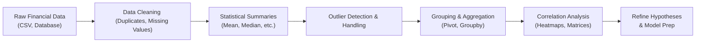

## The Importance of EDA in Large Financial Datasets

Ever spent hours collecting reams of financial data—maybe thousands or millions of rows—and then wondered, “Uh, where on earth do I start?” That’s precisely where Exploratory Data Analysis (EDA) swoops in to save the day. EDA is like that seasoned detective you call in to examine a scene and uncover all sorts of hidden clues. In finance, EDA helps you quickly spot patterns, possible anomalies (like outliers), and relationships that might forecast future performance or highlight risk exposures.

And, trust me, in the world of big finance data—where we could be dealing with tick-level pricing from global markets, social media sentiment data, or alternative data sets like satellite imagery—understanding how to systematically explore and visualize these datasets is crucial. Without a clear EDA plan, we risk drowning in a sea of intangible numbers or, even worse, making ill-informed decisions. 

## Summarizing Statistical Properties

When you face large financial datasets, it’s often helpful to begin with simple summary statistics. These provide a quick snapshot that can help you sense-check the data and, well, see if anything stands out as suspicious or particularly noteworthy. 

• Mean and Median:  
  - The mean (arithmetic average) is sensitive to extreme values—like large positive or negative outliers.  
  - The median (the middle value when data is sorted) is more robust and can handle sudden spikes or plummets in your dataset without being overly influenced.

• Mode:  
  - The mode is rarely used in continuous finance data like prices or returns (since exact repeated values are uncommon), but it might matter for categorical variables—like a rating or classification system.  

• Standard Deviation (σ) and Variance (σ²):  
  - These measure data dispersion. In financial contexts, standard deviation often acts as a proxy for “risk” (especially with returns).  
  - The formula for sample standard deviation is:

  
  s = \sqrt{\frac{1}{n - 1} \sum_{i=1}^{n} \left( x_i - \bar{x} \right)^2}
  

• Skewness:  
  - Looks at asymmetry in the distribution of returns or other metrics. That’s huge for risk-management because returns that are heavily skewed to the downside might keep you up at night.

• Kurtosis:  
  - Captures the “tailedness.” A high positive kurtosis often indicates a higher likelihood of extreme returns (a “fat-tailed” distribution).

Sometimes, I’ll take one look at these parameters and think, “Gosh, this distribution is more skewed than I expected!” In that moment, I know I need to investigate further—maybe the data-harvesting process introduced partial day returns or missing intervals, or perhaps certain market events cause data clustering.

## Handling Outliers

In finance, outliers can be supremely important. A single outlier may represent a real and critical market move—like a flash crash—or it might just be a data glitch. The big question is: do we keep it or toss it? Well, it depends on context.

### Identifying Outliers

• Box Plots:  
  - Box plots elegantly show the median, quartiles, and potential outliers based on the interquartile range (IQR). For example, data points lying outside 1.5×IQR from the first or third quartile are marked as outliers. This is an old-school yet surprisingly effective approach.

• Robust Measures:  
  - The median absolute deviation (MAD) is a robust way to measure dispersion and spot outliers if standard deviation is too sensitive to extreme data points.

• Z-Score Thresholds:  
  - Sometimes we define outliers as points that lie outside a certain Z-score range (say ±3 standard deviations from the mean). This approach can work in a pinch, although it might not be perfect for data that’s not normally distributed.

### Dealing With Outliers

• Winsorization:  
  - Winsorization caps extreme values to specific percentiles. For instance, you might replace everything below the 1st percentile with the 1st percentile value, and everything above the 99th percentile with the 99th percentile value. This helps reduce the impact of any monstrous anomalies.

• Trimming:  
  - Trimming literally removes outliers. But be cautious: if you’re analyzing market data, the outliers might be exactly what you need to pay attention to.

• Domain Investigation:  
  - Always ask yourself, “Is that outlier financial reality or a data error?” If it’s real (say a shock during a market crash), you usually shouldn’t discard it without analyzing further.  

## Partitioning Large Datasets

When dealing with ridiculously large data—like millions of daily equity returns spanning decades—running some of these computations or even visualizations can be slow and clunky. That’s where data partitioning strategies can be a lifesaver.

• Random Sampling:  
  - One approach is to randomly sample a fraction of your data (like 10%) for quick checks. If your sample is representative, you’ll get a decent sense of your data’s distribution, correlation structure, and potential outliers.

• Stratified Sampling:  
  - Often used in finance to ensure each “stratum” (like each sector, region, or market-cap class) is proportionally represented in your sample. This method helps avoid inadvertently ignoring an important market segment (e.g., tiny but volatile small-cap stocks).

• Time-Based Partitioning:  
  - In scenarios like rolling windows or time-series analysis, you might break data into subperiods—like a calm pre-crisis window and a crisis window—so you can see how market behaviors shift dramatically across different times.

## Tools for EDA in Large Financial Data

### Python, R, and Beyond

• Python & pandas:  
  - Python’s “pandas” library is practically the Swiss Army knife for EDA. You can use DataFrames to load massive CSV files (though extremely large files might require chunking), then quickly group, filter, merge, and pivot data.

• R & data.table:  
  - R’s “data.table” can be insanely fast for big merges and aggregations—often outpacing some disk-based solutions for data in the gigabyte range.

• Big Data Ecosystems:  
  - If your data is enormous (think billions of rows), frameworks like Apache Spark and Hadoop-based systems are your go-to. Spark’s DataFrame interface is reminiscent of pandas or data.table but distributed across a cluster of machines.  

Here’s a small example in Python for computing basic stats across big data (though you might need to chunk or use Spark if your dataset is massive):

```python
import pandas as pd

# We'll read it in chunks
filename = "large_financial_data.csv"
chunk_size = 1000000  # 1 million rows per chunk

stats_list = []

for chunk in pd.read_csv(filename, chunksize=chunk_size):
    desc = chunk['Return'].describe(percentiles=[0.25, 0.5, 0.75])
    # Summarize each chunk
    stats_list.append(desc)

combined_stats = pd.DataFrame(stats_list).mean()

print(combined_stats)
```

Note: The above code is a simplified example. In real big-data settings, you’ll often rely on distributed frameworks.

## Grouping and Aggregating Large Data

In financial analysis, we’re often interested in grouping data (e.g., by sector, by day, by region) and then calculating summary metrics for each group. Pivot tables or groupby operations can quickly highlight which companies or industries exhibit anomalies or interesting patterns.

- Grouping by Ticker: To see average returns or volatilities by stock.  
- Grouping by Date: To see how the market performed daily or track certain macro factors.  
- Grouping by Rating Class: If analyzing bonds or credit instruments, you may want to see how yield spreads differ by credit rating levels across multiple time intervals.

### Example: Aggregating Returns by Sector

Let’s say you have an equity dataset for all stocks in an index, along with each stock’s Global Industry Classification Standard (GICS) sector. You might quickly evaluate the average daily return by sector, the standard deviation, and even the median daily trading volume. This aggregation can uncover how cyclical industries differ from defensive sectors during volatile markets. 

## Data Cleaning Before Visualization

I once spent days analyzing a big dataset of returns, only to later discover that nearly 10% of the data entries were duplicates that came from a complicated data-merging process. Nothing dampens your day more than realizing your analysis is off because your data includes “ghost entries.”

### Common Data Cleaning Steps

1. Removing duplicates:  
   - Sometimes you’ll see duplicate rows for the same date-ticker combination. Quick checks (like ensuring each date-ticker pair is unique) can spot these issues.

2. Handling missing values:  
   - Missing data is almost a given in large finance datasets—maybe certain periods have no trades. You may choose to fill them with zeros, interpolate them (for continuous variables), or simply drop them if they are not crucial.

3. Verifying data integrity:  
   - Check if the data type is correct (e.g., numeric vs. string).  
   - Confirm certain constraints—like returns in [-1, +∞), or volumes are non-negative.

Taking time to clean your data thoroughly may feel tedious, but it pays massive dividends when you get to the modeling stage. Remember, no fancy model can fix broken data. 

## Using Correlation Matrices and Heatmaps

### Revealing Relationships

A correlation matrix is basically a grid showing correlation coefficients for every pair of variables in your dataset. In finance, variables might be daily returns for different stocks, interest rates, commodity prices, or fundamental ratios. A correlation matrix can hint whether certain assets move together or trend in opposite directions.

### Creating a Heatmap

Heatmaps turn correlation matrices into color-coded grids where warmer colors might show stronger positive correlations and cooler colors might show negative or weaker correlations. For large datasets (like hundreds of securities), heatmaps can reveal clusters that you might want to investigate further—like a cluster of technology stocks that move closely together compared to, say, consumer staples.

Here’s a simple diagram of the EDA workflow, from data ingestion to correlation analysis:



## Real-World EDA Examples

### Volatility Patterns

Imagine exploring daily returns for 500 stocks across 10 years. Computing summary stats reveals that certain stocks have extremely high standard deviations. At first, you wonder if it’s data corruption. But after investigating, you find they’re small-cap biotech firms that tend to experience sharp price moves around clinical trial news. That’s a real phenomenon—so you keep those outliers in your model, or maybe you highlight the risk for an investment committee meeting.

### Lead-Lag Relationships

Perhaps you suspect that major commodities (like oil) might provide an early indicator for certain emerging market currencies. By partitioning data into monthly averages and building a correlation matrix, you see how changes in the price of oil lead exchange rate movements by about one month. Voila! That’s a hypothesis worth exploring in a predictive model, or at least bringing to your top-level macro strategist.

## Glossary

• Exploratory Data Analysis (EDA): Analyzing datasets to summarize main characteristics—often with visual methods—to uncover patterns, detect anomalies, and test hypotheses.  
• Outlier: A data point lying far from others in a dataset. Can heavily skew means or regressions if not treated thoughtfully.  
• Box Plot: A standardized chart of data distribution using a five-number summary.  
• Skewness: A measure of the asymmetry in a distribution, relevant for financial return modeling.  
• Kurtosis: A measure of the tailedness in a distribution, highlighting the risk of extreme events.  
• Winsorization: The capping of extreme data values to lessen outlier impact.  
• Sampling (Random, Stratified): Reducing large datasets into representative subsets for more efficient analysis.  
• Correlation Matrix: Shows pairwise correlation coefficients among several variables.  
• Heatmap: A color-coded representation of data that gives a visual sense of magnitude and correlation in rows and columns.

## References & Further Reading

• Tukey, J. (1977). “Exploratory Data Analysis.” (A pioneering and classic text introducing EDA).  
• James, G., Witten, D., Hastie, T., & Tibshirani, R. (2013). “An Introduction to Statistical Learning.” Chapter 2 covers basic EDA with a good jumpstart for practical examples.  
• Bernard Marr, “Big Data in Practice” (Insights on large-scale data handling and EDA).  
• Kaggle (https://www.kaggle.com/): A trove of publicly available datasets & tutorials.  
• Apache Spark (https://spark.apache.org/): For distributed data analysis at scale.

## Exam Relevance

From a CFA® Level II perspective, EDA is critical whenever you’re sifting through item sets that provide multiple data points—like a company’s financial statements spanning several quarters or market data spanning different benchmark indices. You should be ready to recognize outliers, interpret summary statistics quickly, and identify patterns in the information given. Exam questions might also revolve around generating or interpreting correlation data, or they may require you to handle outliers appropriately in a regression context.

## Test Your Knowledge: Exploratory Data Analysis for Large Datasets Quiz



### Which of the following best describes the role of EDA in finance?

- [ ] It mainly focuses on constructing advanced predictive models.
- [x] It aims to summarize the main characteristics of a dataset, often using visual and statistical methods.
- [ ] It replaces the need for standard deviation as a measure of risk.
- [ ] It exclusively screens out outliers.

> **Explanation:** EDA is key to summarizing and visually exploring financial datasets to detect patterns, anomalies, and relationships before constructing more advanced models.

### Suppose you have returns for 1,000 stocks over 10 years. Why might you consider stratified sampling?

- [x] To ensure each sector (or other relevant group) is adequately represented in the sample.
- [ ] Because it discards extreme outliers more systematically.
- [ ] Because random sampling does not work for time-series data.
- [ ] Because stratified sampling doubles the sample size automatically.

> **Explanation:** Stratified sampling guarantees representation from different segments in the dataset, which is particularly important when industries or categories behave differently.

### Which statement about outlier treatment is correct?

- [x] Winsorization caps extreme values without removing them completely.
- [ ] Trimming outliers is always preferred to keep the dataset cleaner.
- [ ] Domain checks rarely matter; outliers are usually data errors.
- [ ] Outliers uniformly inflate correlation values.

> **Explanation:** Winsorization is a technique that modifies only the extreme observations by capping them at certain percentiles. Trimming or ignoring outliers outright can sometimes lead to a loss of critical information.

### What is a potential reason that box plots are particularly helpful in EDA?

- [ ] They show detailed correlation between variables.
- [ ] They depict data only in terms of standard deviations.
- [ ] They focus on large-sample parametric assumptions.
- [x] They summarize the distribution (median, quartiles) and highlight potential outliers visually.

> **Explanation:** Box plots rely on quartiles and the interquartile range—easy to interpret and helpful for spotting outliers.

### In analyzing a large dataset of daily returns, which approach is most suitable for mitigating performance issues?

- [x] Partitioning or sampling the data to work with smaller, representative chunks.
- [ ] Eliminating all missing values.
- [ ] Only focusing on the top 5 stocks in terms of market cap.
- [ ] Relying wholly on correlation matrices to reduce dimensionality.

> **Explanation:** Partitioning or sampling is a common approach for large datasets, allowing quick computations or visual inspections without losing representativeness.

### In a correlation matrix of 100 variables, a heatmap is useful because:

- [ ] It converts all numeric results into p-values.
- [ ] It highlights only positive correlations.
- [x] It provides a visually intuitive representation of all pairwise correlations, showing patterns at a glance.
- [ ] It automatically discards multicollinearity.

> **Explanation:** Heatmaps are color-coded correlation matrices that help you quickly identify patterns, clusters, or unusual relationships among many variables.

### Why might you choose to keep an outlier rather than exclude it?

- [x] Financial outliers can reflect real market shocks or significant events.
- [ ] Because outliers do not affect averages.
- [x] Because the outlier might be essential for risk-management decisions.
- [ ] Because outliers are always errors introduced by data feeds.

> **Explanation:** Outliers can be genuine reflections of market behavior (like extreme volatility or a one-off corporate event). Excluding them blindly can skew your perspective on risk or return profiles.

### Which of the following is a benefit of median-based metrics like median absolute deviation (MAD) for outlier detection?

- [x] They’re more robust to outliers than mean-based metrics.
- [ ] They automatically normalize the data and correct biases.
- [ ] They identify all possible outliers with no exceptions.
- [ ] They rely on assumptions of normality to detect anomalies.

> **Explanation:** The median (and MAD) is less influenced by extreme values and thus offers a more stable gauge of dispersion and outlier detection.

### When preparing financial data for EDA, verifying that no date-ticker pairs are duplicated is part of:

- [ ] Replacing missing values.
- [ ] Correlation matrix creation.
- [x] Data cleaning and integrity checks.
- [ ] Heatmap design.

> **Explanation:** Ensuring unique rows (like date-ticker pairs) is a key step in data cleaning and maintaining data integrity, especially in large financial datasets.

### True or False: In large-scale EDA, domain expertise is less critical because algorithms automatically identify meaningful patterns.

- [ ] True
- [x] False

> **Explanation:** Domain expertise is crucial. Algorithms and visualizations can uncover patterns, but only analysts with robust finance knowledge can interpret whether such patterns are real, spurious, or indicative of deeper market phenomena.


