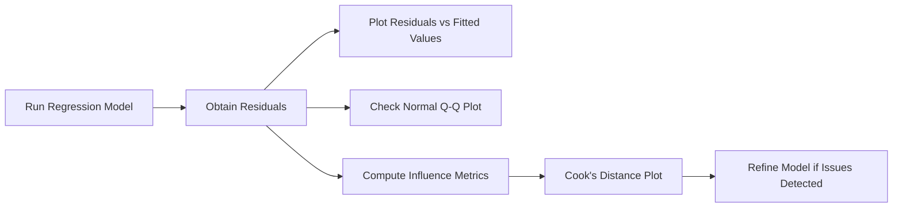

## Refresher on Residuals and Why They Matter  
Residuals—those pesky differences between the observed values of a dependent variable and the values predicted by our regression model—can tell us almost everything about how well (or how poorly) our model fits the data. When we talk about advanced graphical methods for residual diagnostics, we’re essentially diving into the art of spotting patterns that shouldn’t be in your residuals if your model is good. In other words, a good model yields somewhat “randomly scattered” residuals. But if you start seeing shapes and trends (like a fanning out pattern or a big arc), your model might be missing something—perhaps omitted variables, nonlinearity, or it might be suffering from heteroskedasticity.  

I remember running one of my first multiple regressions on a messy dataset for a consulting gig—my residuals vs. fitted values plot kind of looked like a bowtie. It was a dead giveaway that something was off with the variance (heteroskedasticity alert!). That’s what piqued my interest in these advanced diagnostic plots.  

## Residual vs. Fitted Values Plot  
One of the first go-to plots is the residuals vs. fitted values plot. On the x-axis, you have the fitted (predicted) values from your regression, and on the y-axis, the residuals. If everything is hunky-dory, you should see a somewhat horizontal “cloud” of points centered around zero.  

But watch out for:  
• Rising or falling trend: suggests nonlinearity (the model might need polynomial terms or transformations).  
• Fanning out pattern: potential heteroskedasticity (variance of residuals increases or decreases as fitted values grow).  
• Clusters or lumps: might mean there’s a hidden variable segmenting your data (maybe seasonal or structural differences).  

A quick tip: This plot is sometimes easier to read if you add a zero reference line. It’s basically a horizontal line at y=0 that helps you see if the residuals are symmetric around zero or drifting off in certain regions.  

Here’s a brief snippet in Python showing how you might produce such a plot:

```python
import statsmodels.api as sm
import matplotlib.pyplot as plt

model = sm.OLS(y, X).fit()
res = model.resid
fitted = model.fittedvalues

plt.scatter(fitted, res)
plt.axhline(y=0, color='red', linestyle='--')
plt.xlabel('Fitted Values')
plt.ylabel('Residuals')
plt.title('Residuals vs. Fitted Values')
plt.show()
```

In R, many analysts use the built-in `plot.lm()` function, which generates this plot (and others) automatically.

## Normal Q–Q Plot  
The Normal Q–Q (Quantile–Quantile) plot checks whether residuals follow a normal distribution. Recall that standard regression assumptions typically assume normal residuals (especially for confidence intervals and significance tests to be fully valid). In this plot, the theoretical normal quantiles lie on the x-axis, and the empirical quantiles of the residuals lie on the y-axis. If the points roughly line up on a diagonal line (often drawn at a 45° angle), you’re good.  

If you see systematic curvatures or heavy tails (points veering away on both ends), then your residuals might be non-normal—which can happen if your data has outliers or if you’re dealing with a distribution that’s skewed. Sometimes transformations (like using log of the dependent variable) might help. Or you might consider robust regression techniques.  

In Python, you can generate a Q–Q plot with:  

```python
import statsmodels.api as sm
res = model.resid
fig = sm.qqplot(res, line='45')
```

Interpreting the Q–Q plot is more of an art than a science at times—especially with large datasets. A quick personal tip: color-code or label potential outliers so you can see if a few data points are driving the deviations or if the entire distribution is off.  

## Scale–Location Plot  
Sometimes called the “Spread–Location” plot, this chart takes the absolute (or sometimes the square root) of standardized residuals on the y-axis, and the fitted values on the x-axis. It’s especially handy for detecting heteroskedasticity. If you notice that the plot shows a systematic pattern—e.g., the points start out very clustered at lower fitted values but fan out at higher fitted values—then you probably have non-constant variance.  

A typical workflow might look like this:  



The Scale–Location plot is basically a deeper dive into that “res vs. fitted” approach but focusing specifically on whether the spread (variance) of the residuals remains stable across different levels of predicted values.  

## Leverage and Influence Plots  
With large regression models, especially in finance where you might have hundreds of observations (or thousands), it’s easy to miss outliers that skew your entire regression line. This is where leverage and influence plots step in.  

• Leverage: A data point has high leverage if it sits far from the other points in the space of independent variables. Think of it as a point that’s horizontally far away from everyone else in terms of X-values—it can pull the regression line (or hyperplane in multiple dimensions) heavily.  
• Influence (or Cook’s Distance): A measure of how much an observation influences overall regression coefficients. Large Cook’s Distance values indicate that removing this point significantly changes the fitted regression.  

In many statistical software packages, you can produce a plot that has the residuals on one axis, leverage on another, and circles sized by Cook’s Distance. This is sometimes called an influence plot (or bubble plot). High leverage plus a large residual is a classic recipe for trouble.  

## Partial Regression Plots  
Partial regression plots (also known as added-variable plots) show the relationship between each individual predictor (X) and the dependent variable (Y), holding all other predictors constant. They help you spot:  
• Nonlinearity in the relationship between X and Y.  
• Potential omitted variable biases if the partial regression suggests that including an additional variable drastically alters the relationship.  

A partial regression plot for a single variable Xᵢ typically regresses Xᵢ on the remaining predictors to get residuals, and also regresses Y on the remaining predictors (without Xᵢ) to get residuals. Then you plot these two sets of residuals against each other. If that plot still shows a strong visible pattern (nonlinear curve, for instance), you might consider transformations or polynomial terms for Xᵢ.  

## Color-Coding and Layering in Large Datasets  
When dealing with large financial datasets—imagine daily returns for multiple stocks, or huge panel data—residual diagnostics can get visually messy. One way to handle this is to color-code your points to mark high-leverage or high-Cook’s-Distance observations. Another approach is layering—plot the bulk of your points in a subdued color, then highlight outliers or interesting segments.  

For instance, color-coded clusters might reveal that residuals for a certain industry are systematically different than for others. Or maybe a specific time period (like a recession) is producing higher variance. The big picture goal is to reduce “visual clutter” so you can see patterns that matter.  

## Specialized Residual Diagnostics for Time-Series and Panel Data  
Advanced finance models often deal with time-series or panel data. In time-series, your residuals might be autocorrelated—meaning the residual at time t is correlated with the residual at time t−1. If that violates the classical assumption of independence, you’ll see it in an autocorrelation function (ACF) plot or partial autocorrelation function (PACF) plot of the residuals.  

• ACF Plot of Residuals: If the residuals are truly random, the ACF should instantly drop to near-zero for all lags greater than zero. A slow decay or big spikes at certain lags indicates autocorrelation.  
• PACF Plot of Residuals: Similar idea but controls for intermediate lags.  

For panel data (pooled time-series across multiple entities), you might see cross-sectional correlation or entity-specific effects. In that scenario, you often do group-wise or cluster-robust checks, analyzing residuals by entity or across time. And partial regression plots can be repeated for each cross section or time slice to see if your model is consistent across entities or periods.  

## Designing Effective Diagnostic Charts  
I can’t emphasize enough how labeling and annotations make a difference. If you’re preparing a presentation for your risk management team—or, let’s face it, if you’re just trying to parse your own analysis—clearly labeling these charts can save insane amounts of time. Some best practices include:  
• Add a reference line for zero on your residual plots.  
• Clearly note which data points are outliers (maybe label them with their observation number or highlight them).  
• Choose color palettes that are easily distinguishable.  
• Avoid clutter—too many lines or legends can distract from the main story.  

## Common Pitfalls and Practical Tips  
• Overlooking Outliers: Even one or two extreme points with high leverage can skew your entire model. Always check those points!  
• Misreading the Q–Q Plot: It’s easy to see minor wiggles and overreact. Focus on major deviations from the diagonal.  
• Forgetting about Time Effects: In finance, especially, data might come with date/time stamps. If your residual pattern changes over time, consider a dynamic model or a time series approach.  
• Not Considering Nonlinearity: Sometimes transformations (like log transformations) can fix a lot of ills. Residual pattern detection is your best friend in identifying whether you need them.  

## Conclusion: Exam Tips and Final Thoughts  
Graphical residual diagnostics might feel like a “softer” approach compared to robust statistical tests, but trust me: a careful look at your plots is often more intuitive and can reveal issues that numerical tests miss. For the CFA exam, be prepared to interpret a variety of residual plots in item set vignettes. You might get a question that shows a partial regression plot with a distinct curve, implying you should consider a nonlinear specification. Or you might see a Cook’s Distance bubble chart indicating an influential observation.  

When you come across these questions:  
• Take a step back and ask, “What does this pattern tell me about the model’s assumptions?”  
• Check for nonlinearity, outliers, non-constant variance, or autocorrelation.  
• Link your observations back to potential solutions: transformations, robust errors, different functional forms, or dropping outliers if justified.  

Residual diagnostics might feel at times like detective work—and honestly, that’s kind of the fun part. Keep an open mind, trust those plots, and be ready to refine your model accordingly.

## References and Further Reading  
• Kutner, M., Nachtsheim, C., & Neter, J. “Applied Linear Statistical Models.” McGraw-Hill.  
• Belsley, D., Kuh, E., & Welsch, R. “Regression Diagnostics: Identifying Influential Data and Sources of Collinearity.” John Wiley & Sons.  
• R Documentation on plot.lm: https://www.rdocumentation.org/packages/stats/versions/3.6.2/topics/plot.lm  
• CFA Institute, “CFA® 2025 Level II Curriculum,” Quantitative Methods section for deeper insights into regression diagnostics.  
• Hamilton, J. D. “Time Series Analysis,” Princeton University Press.  
• Wooldridge, J. M. “Introductory Econometrics: A Modern Approach,” Cengage.  
• Tsay, R. S. “Analysis of Financial Time Series,” Wiley.  
• Gujarati, D. N., & Porter, D. C. “Basic Econometrics,” McGraw-Hill.  

## 10 Advanced Residual Diagnostics Questions for CFA Exam Practice



### Which diagnostic plot typically helps check for systematic patterns or non-constant variance in residuals?  
- [ ] Normal Q–Q plot  
- [x] Residuals vs. Fitted Values plot  
- [ ] Boxplot of the dependent variable  
- [ ] Time series line plot  

> **Explanation:** The residuals vs. fitted values plot is the go-to for detecting patterns like systematic trends or varying spread (heteroskedasticity).  

### What is the primary purpose of a Normal Q–Q plot in regression diagnostics?  
- [ ] To check for autocorrelation of residuals  
- [x] To assess if residuals follow a normal distribution  
- [ ] To spot missing predictors  
- [ ] To evaluate correlation among independent variables  

> **Explanation:** The Normal Q–Q plot compares the distribution of residuals to a normal distribution. Deviation from the diagonal line suggests non-normality.  

### In finance, which specialized diagnostic plot can help detect autocorrelation in regression residuals for time-series data?  
- [ ] Boxplot  
- [ ] Residuals vs. Fitted Values plot  
- [x] Autocorrelation Function (ACF) plot  
- [ ] Normal Q–Q plot  

> **Explanation:** The ACF plot of residuals is vital for time-series analysis. If residuals are autocorrelated, the ACF plot will not drop to near-zero quickly.  

### Which statement best characterizes the Scale–Location (Spread–Location) plot?  
- [x] It plots the square root of standardized residuals against fitted values to assess variance homogeneity  
- [ ] It measures the correlation between different predictor variables  
- [ ] It compares fitted values to actual data points to detect mis-specified models  
- [ ] It ranks each residual based on Cook’s Distance  

> **Explanation:** The Scale–Location plot is a diagnostic tool to help detect non-constant variance (heteroskedasticity) by examining how residual spread changes with the fitted values.  

### When you see a point with a large Cook’s Distance, what does it imply?  
- [x] The point is potentially influential and removing it may significantly alter regression results  
- [ ] The regression is perfectly specified and free from heteroskedasticity  
- [ ] The model is definitely correct, but data is non-stationary  
- [ ] The residuals are normally distributed  

> **Explanation:** Cook’s Distance identifies observations that have a large influence on the fitted regression coefficients.  

### Which of the following is an advantage of color-coding residual plots in large datasets?  
- [ ] It makes the plot look more sophisticated but does not improve analysis  
- [x] It helps highlight specific groups or outliers among thousands of points  
- [ ] It ensures normality assumptions are always met  
- [ ] It automatically corrects for heteroskedasticity  

> **Explanation:** By color-coding high-leverage or high-Cook’s-Distance observations, analysts can quickly pinpoint problem points in a sea of data.  

### Why might partial regression plots be especially useful in multiple regression analysis?  
- [ ] They only show the correlation between residuals and time  
- [x] They help visualize the relationship between each predictor and the dependent variable, controlling for other predictors  
- [ ] They are identical to the ACF plot  
- [ ] They eliminate the need to evaluate normality of residuals  

> **Explanation:** Partial regression plots (added-variable plots) allow you to isolate the effect of one predictor, removing the effects of the other variables in the model.  

### Which pattern in a residuals vs. fitted values plot suggests a need for non-linear terms in your regression?  
- [ ] Perfectly flat line of residuals  
- [x] Curved or “U-shaped” pattern of points around the zero line  
- [ ] A random scattering of residuals around zero  
- [ ] Clusters of points with zero variance  

> **Explanation:** A curved pattern indicates the presence of nonlinearity that the model has not accounted for.  

### In time-series regression, which approach is recommended when significant autocorrelation is found in residuals?  
- [ ] Add more independent variables regardless of relevance  
- [ ] Ignore it until sample size increases  
- [x] Use an appropriate time-series model (e.g., AR, ARIMA) or apply robust standard errors  
- [ ] Convert residuals into dummy variables  

> **Explanation:** Significant autocorrelation in residuals suggests that a standard OLS model may be inadequate. Consider specialized time-series models or corrections like Newey–West standard errors.  

### For the CFA exam, a question exhibits a Scale–Location plot with residuals growing larger as fitted values increase. What’s a likely implication?  
- [x] The regression model may exhibit heteroskedasticity requiring corrective measures  
- [ ] The residuals are perfectly normal  
- [ ] The data are suitable for simple linear regression without transformations  
- [ ] The variable is stationary and free from time dependence  

> **Explanation:** A visible fan or wedge shape in a Scale–Location plot suggests non-constant variance in the residuals (heteroskedasticity).  


