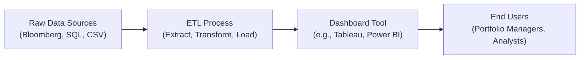

### Introduction to Dynamic Dashboards

Um, let’s be honest—most of us have had moments when we open up a static Excel report with 38 tabs, two dozen pivot tables, and wonder if there’s a better way. Dynamic dashboards answer that need by letting you interact with constantly updated data in one clean, well-organized workspace. In an investment context, this can mean seeing real-time price changes, daily portfolio VaR updates, or automatically recalculated performance metrics as new data flows in.

Compared to old-school static presentations, dynamic dashboards can significantly streamline day-to-day tasks—like churning out a morning P&L summary or diagnosing unusual spikes in trading volume. The real beauty is that you can “slice and dice” data on the fly. Want to filter out certain asset classes, focus only on a specific time range, or drill down to a single sector? No problem. Design the dashboards thoughtfully, and you’ll find they become the “single source of truth” for your team’s analytics.

### Popular Tools for Dashboard Creation

There are tons of solutions on the market to create dashboards, but three big ones often come up in finance:

• **Tableau**  
  Tableau is widely praised for its drag-and-drop interface and robust data visualization options. It’s also well-regarded for real-time collaboration—multiple analysts can work on the same dashboard and see changes reflected instantly. Suppose you’re analyzing performance at your asset management firm: you can place stock returns, risk metrics, and sector rotations side by side, then instantly switch to a multi-asset view if needed.

• **Power BI**  
  If you’re already knee-deep in Microsoft’s ecosystem—Excel, SharePoint, Azure—Power BI feels like a natural extension. It integrates seamlessly with Microsoft data sources, letting you set up “quick insights” in minutes. I once worked with a portfolio manager who consumed Microsoft SQL data from the firm’s internal investment database. Creating a Power BI dashboard basically cut her weekly reporting time in half. She was pretty astonished, saying, “I used to dread Fridays, but now the data just refreshes itself and my manager gets the results automatically.”

• **R Shiny / Python Dash**  
  R Shiny and Python Dash are more customizable, open-source solutions favored by analysts who love coding or have advanced statistical needs. You get to harness all the power of R’s (or Python’s) libraries—like forecasting packages, specialized machine learning extensions, or time-series functions—and present them in an interactive web-based dashboard. Because it’s code-based, the flexibility is almost endless: you can add specialized algorithms, integrate advanced risk modeling, or tailor the look and feel to your firm’s branding. 

### Structuring a Finance-Focused Dashboard

A well-structured financial dashboard typically displays key performance indicators (KPIs) that matter to your specific domain. Think about an equity portfolio manager who wants real-time P&L, volatility, attribution metrics, or even a measure of how betas shift over time. Meanwhile, a credit analyst might need current yield spreads, probability of default predictions, and liquidity measures.

Common sections or visual aids often include:

• **Real-Time P&L**  
  A top-level card or gauge that shows profit or loss, updated hourly or daily depending on your data feed.  

• **Risk Metrics**  
  Volatility, value at risk (VaR), Sharpe and Sortino ratios—these can be displayed as charts over time or as bullet graphs showing whether the metric is within acceptable bounds.

• **Sector/Sub-Portfolio Breakdown**  
  Pie charts or bar charts that reveal the distribution of assets or exposures, letting you notice immediately if you’re overweight or underweight a sector.

• **Benchmark Comparisons**  
  A line chart that shows your portfolio return vs. a benchmark index (e.g., MSCI World, S&P 500) to highlight relative performance.

• **Geographical or Factor Exposures**  
  A heat map of global asset allocations, or factor tilt charts that break down how momentum, value, or growth factors contribute to your alpha.

Here’s a small diagram illustrating how data might move from sources to a dashboard:

### Best Practices in Dashboard Design

Dashboards should be easy to read. You don’t want your colleagues to squint at small font sizes or guess which color represents large-cap vs. small-cap. A few principles:

• **Minimal Clutter**  
  Strip away anything that doesn’t help convey insights. Gauge charts can be cool, but do they actually help? If not, skip them.

• **Logical Arrangement**  
  Arrange typically from summary (top) to detail (bottom). Or from left to right if that makes sense for your workflow. For instance, show overall P&L in the top-left corner, risk metrics right next to it, and a sector breakdown below that.

• **Color Coding**  
  Be consistent. If you use blue for equities, keep using blue for equities. Also, watch out for color-blind accessibility. Striking a balance between an engaging palette and readability is key.  

• **Consistent Labeling**  
  If you have a metric named “Rolling 20-Day Volatility” in one chart, call it the same thing in all other charts. Inconsistent labeling can cause confusion.

Sometimes, I’ve seen a dashboard with way too many neon colors, unlabeled axes, and random 3D effects. It was basically a contraption from a 1980s sci-fi flick. Fun to look at, but not so great for actual decision-making. Avoid these pitfalls by systematically reviewing each visual for clarity.

### Interactivity and Data Exploration

So, you might wonder: “Why not just produce a weekly PDF and call it a day?” Because dynamic dashboards let you zoom in on interesting areas without constant reprogramming or data wrangling.

• **Dynamic Filters**  
  Perhaps you want to select a date range, a ticker symbol, or an entire asset class. With dynamic filters, you pick from a dropdown or highlight a region on a chart, and the rest of the dashboard updates right away.

• **Interactive Selection**  
  Maybe you have a time series of volatility. By clicking on a specific monthly point that looks odd, you can “drill down” to see which trades or assets drove the unusual risk. This is sometimes called “drill-down analysis.”  

• **User-Friendliness**  
  The best dashboards are for tech-savvy quants and for folks with almost zero coding skills. A portfolio manager might just want to press a few buttons and see the data. And that’s exactly the advantage of interactive dashboards—no advanced scripting or re-design needed.

### Data Security and Governance

Once you’ve built something that leverages sensitive data (like P&L or portfolio holdings), you have to be sure authorized users only see what they’re allowed to see. Data governance addresses these issues:

• **User Permissions**  
  Use role-based access control. That means certain employees may see high-level aggregated data, while only senior traders or compliance officers can see full transaction details.

• **Encryption in Transit and at Rest**  
  Typically a must if your dashboards handle any personally identifiable information (PII) or client data.  

• **Audit Logs**  
  Keep track of changes to the underlying data or the dashboard itself. This might be part of compliance or operational risk management, especially in heavily regulated environments.

• **Version Control**  
  Some organizations maintain separate development vs. production environments for dashboards. You can try out new features in a “dev” setting before unleashing them on the entire firm.

### Automating Data Refreshes

We all have better things to do than manually re-import data at 8 a.m. every single day. That’s where automation steps in:

• **Scheduled Refreshes**  
  Tools like Tableau or Power BI can connect to data sources—like a Bloomberg terminal or a cloud SQL database—and update the visuals on a set schedule. For instance, you might schedule a refresh at market close, so that the next morning’s dashboard is pristine and current.

• **API Integrations**  
  Application Programming Interfaces (APIs) are basically ways for different software systems to communicate. For instance, you could build a Python script that calls an API from a third-party data provider (like S&P Global) every hour, merges it with internal system data, and feeds it automatically to your dashboard.

• **Error Handling**  
  Let’s say a data feed fails. The last thing you want is a “broken” report that confuses the risk manager. A robust automation setup includes error-handling routines—like alerts to fix the pipeline or backfill missing data.

### A Personal Note on Building Dashboards

I remember spending countless hours creating flashy reports that hardly got read. People are busy, and if they can’t find key insights at a glance, they’ll move on. When I first built a dynamic dashboard for my investment team, I realized how quickly they started making more data-driven decisions—simply because each metric was at their fingertips, updated daily. There was no rummaging through 10 stale PDFs or emailing me for the latest trade info. That’s the power of an intuitive dashboard.

### Potential Pitfalls and How to Avoid Them

• **Overloading**  
  Too many charts, too many data points, or too many interactions can overwhelm users. Keep it simple.

• **Poor Data Quality**  
  Remember: garbage in, garbage out. If your feeds are incomplete or incorrectly tagged, your dashboard might mislead decision-makers.

• **Too Much Real-Time**  
  It’s tempting to show second-by-second updates for everything. But do you really need that? It might give a false sense of urgency. Often, daily or intraday refreshes are enough for most investment processes.

• **Ignoring End-User Training**  
  You might create the best dashboard known to humankind, but if no one knows how to use it, it’s all for naught. Providing a five-minute demonstration can go a long way.

### Exam Tips: Applying These Concepts in Item Sets

In a CFA Level II exam-style vignette, you might see a scenario where an analyst describes issues with multiple data sources, security concerns, or confusion among management about how to interpret a new performance dashboard. Typical questions could ask you how to best design the visuals, handle user access, or schedule data refreshes for maximum reliability. You might also have to interpret a partial Power BI or Tableau screenshot, identifying which portfolio metrics are outside the manager’s risk tolerance. 

So, be prepared for scenario-based prompts that test both your conceptual understanding of dashboards and your practical approach to solving real business problems (like data governance or interactive filtering). Since the exam is heavy on applying knowledge rather than just reciting definitions, you might have to evaluate which automation setup is best for the described environment. Or you could be asked to interpret performance metrics with partial or missing data.

### Glossary

• **Dashboard**  
  A user interface that organizes and presents key information (KPIs, metrics, etc.) in an easily readable layout, often interactive and updated in real-time.

• **Interactive Filter**  
  A dynamic tool or widget allowing the user to change the view or subset of data (time period, category) in real time on a dashboard.

• **APIs (Application Programming Interfaces)**  
  Protocols that let different software applications communicate and exchange data seamlessly.

• **Drill-Down Analysis**  
  The ability to explore data at multiple levels of detail by clicking or selecting subsets on a dashboard, often revealing deeper insights.

• **Data Governance**  
  Policies and processes ensuring that data is accurate, secure, and consistently available for authorized stakeholders.

### References & Further Reading

• Cole Nussbaumer Knaflic, _Storytelling with Data_. Great resource on how to create compelling, easy-to-interpret visuals.  
• Tableau Public Gallery:  
  https://public.tableau.com/en-us/s/resources  
  Helpful for seeing real-world financial dashboards for ideas and best practices.  
• R Shiny Gallery:  
  https://shiny.rstudio.com/gallery/  
  Demonstrations of interactive data apps built in R.  

And if you want to go deeper into building advanced dashboards, definitely explore user forums for each platform. You’ll learn about real use cases and see how practitioners overcame obstacles, from integrating weird data sources to ensuring robust security.

---

## Multiple-Choice Quiz: Mastering Dynamic Dashboards and Reporting



### Which aspect of dynamic dashboards primarily differentiates them from static reports?

- [ ] The use of more colorful charts and graphs  
- [ ] They require more user training  
- [x] Their ability to update in real time and allow user-driven exploration  
- [ ] They often need expensive hardware upgrades  

> **Explanation:** Dynamic dashboards can refresh data automatically and offer interactive features like filtering and drill-downs, which static PDFs or spreadsheets do not provide.

### In designing a finance-focused dashboard, which of the following metrics or visuals is least likely to be included?

- [ ] Daily P&L summary  
- [ ] Sector allocation chart  
- [ ] Rolling volatility measures  
- [x] Corporate cafeteria menu schedule  

> **Explanation:** Routine finance dashboards typically focus on performance and risk metrics, not something unrelated like a cafeteria menu.

### What is a main benefit of using APIs (Application Programming Interfaces) in dashboard creation?

- [ ] Avoiding the need for secure data connections  
- [ ] Automating data citizenship compliance  
- [x] Allowing direct data feeds from external and internal sources for seamless updates  
- [ ] Eliminating the need for user access controls  

> **Explanation:** APIs let dashboards automatically pull data from various sources without manual imports, enabling seamless and timely updates.

### Which statement best describes the importance of color consistency in dashboard design?

- [x] Consistent color usage helps users quickly identify the same categories across multiple charts  
- [ ] Color consistency is irrelevant if metrics are properly labeled  
- [ ] Color usage is only a concern for color-blind users  
- [ ] Color consistency is solely for artistic appeal  

> **Explanation:** Consistent color mappings across all charts foster quick comprehension and reduce confusion.

### Which feature allows users to isolate specific date ranges or security types without modifying the underlying code?

- [ ] Static labeling  
- [ ] Manual ASCII queries  
- [x] Dynamic filters  
- [ ] Multi-layer pivot macros  

> **Explanation:** Dynamic filters let users refine data views (by date, asset, or risk factor) interactively, without reprogramming or rewriting queries.

### When is real-time data reporting likely to be least valuable?

- [x] For long-term portfolio rebalancing strategies that operate on quarterly data  
- [ ] In high-frequency trading contexts where immediate updates matter  
- [ ] For intraday risk management on a derivatives desk  
- [ ] For real-time P&L tracking in an algo-driven hedge fund  

> **Explanation:** If your decisions are based on quarterly horizons, minute-by-minute data flows may add noise rather than value.

### A user in your firm cannot see detailed transaction-level data on the dashboard, but can access summarized performance metrics. This is most likely an example of:

- [ ] Poor dashboard design  
- [ ] Data transformation error  
- [ ] Dashboard not refreshing properly  
- [x] Role-based access control  

> **Explanation:** Role-based access control restricts transaction-level detail to authorized users, while providing aggregated information more widely.

### Which approach is most closely associated with advanced customization and direct use of statistical libraries?

- [x] R Shiny or Python Dash  
- [ ] Microsoft PowerPoint  
- [ ] Excel Macros  
- [ ] Pre-packaged modules in business intelligence software  

> **Explanation:** R Shiny and Python Dash rely on coding in R or Python, giving advanced users the power to embed custom statistical and financial analyses.

### How can scheduled data refreshes help an analyst’s workflow?

- [ ] By increasing the chance of data conflicts  
- [ ] By requiring more manual data entry each day  
- [x] By automatically pulling new data at preset intervals, reducing manual updates  
- [ ] By removing the need for user training  

> **Explanation:** Scheduled refreshes automate regular updates so the analyst doesn’t need to pull data manually, saving time and minimizing errors.

### A dashboard that supports drill-down analysis typically allows:

- [x] Users to click on a summary metric and expand to view detailed transaction data  
- [ ] Zero control over the displayed date range  
- [ ] Only one standardized visual element at a time  
- [ ] Non-interactive text-based summaries without filtering  

> **Explanation:** Drill-down interactivity lets you move from summarized charts or KPIs to more granular data, aiding deeper analysis.


