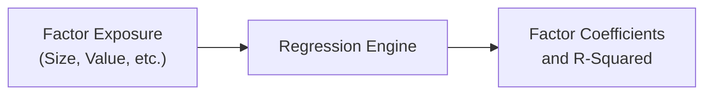

When you see a bunch of charts, plots, and colorful dashboards in an Item Set (often called a vignette) on the CFA Exam, it can be a little overwhelming. You skim a scatter plot, try to figure out which lines matter in a time-series chart, and then wonder—should you check for disclaimers somewhere off to the side? If you’ve ever felt that panic, you’re certainly not alone (I definitely had that moment in my second mock exam, let me tell you!). The good news is that visual analysis, though it appears intimidating, follows a predictable routine once you master a few key habits. By methodically scanning charts, verifying the legends, carefully noting any disclaimers, and linking plots together to form an integrated data story, you’ll be able to tackle these questions efficiently.

Below, we’ll walk through three typical vignettes you might encounter at the Level II exam: (1) an equity factor model that’s chock-full of scatter plots and correlation heatmaps, (2) a set of residual diagnostics for a time-series model, and (3) a pension fund performance dashboard with multiple metrics. We’ll also examine how to read each visual step-by-step, which metrics to track, and how to manage your time when you’ve got six or more exam questions tied to a single data set.

Remember, the main objective is to spot the story behind the data—since, at Level II, the examiners love crafting visual narratives that test your ability to interpret quantitative relationships correctly.

Understanding How to Read Vignette Visuals  
One of the scariest moments in an exam scenario is turning the page and seeing multiple color-coded charts with cryptic things like “Factor 1,” “Factor 2,” or “PACF (Partial Autocorrelation Function).” But, if you slow down and systematically approach each chart, you’ll find it’s usually quite logical. Start by asking:

• What’s on the axes?  
• Is there a chart legend or color scale indicating categories?  
• Are there notable patterns such as a big cluster, a heavy slope, or a suspicious break?  
• Do you pin down any outliers that deviate from the main cluster of points?  
• Is something about the scale or axis labeling unusual?

A personal checklist for visuals is invaluable. I promise you’ll gain a sense of control and hopefully minimize those exam-day jitters.

Vignette 1: Equity Factor Model Charts  
Imagine you’re handed a scenario about an asset manager exploring a multi-factor model for equities. The vignette includes a scatter plot for each factor, a correlation heatmap for factor loadings, and a table summarizing factor betas.

Reading the Visual
• Scatter plots: Each plot might show how a single factor (e.g., Momentum) correlates with each stock’s excess return. Look for slope direction and any obvious outliers.  
• Correlation heatmap: This is your big overview of how factors interrelate. Watch for cells displaying large positive or negative values; they can indicate that two factors are redundant or that your factor selection might be capturing overlapping risks.  
• Factor loadings table: Don’t forget the footnotes. If there’s a note that says “Factors are standardized,” that’s essential for interpreting the scale correctly.

Common Exam Questions
• “Which factor has the strongest correlation with Stock X’s returns?”  
• “Identify the outlier stock that might distort the regression coefficient for Factor Y.”  
• “Do you see any high pairwise correlation between factors, and what does that imply for potential multicollinearity?”  
• “Based on the chart, which factor might be incorrectly (or excessively) weighted in the model?”

Key Patterns to Watch
• Large or repeated factor correlations.  
• A scatter plot with one or two data points way off in the top-right corner—these might be your outliers.  
• Positive slopes vs. negative slopes.  
• R-squared or correlation values near ±1 that stand out like a beacon.

Time Management Tips
• Scan the entire set of charts: note any obvious anomalies.  
• Then read each question to see which chart is relevant. Resist the urge to deep-dive every plot before you know what the questions are asking.  
• Keep an eye on the footnotes—sometimes they reveal critical data transformations or weighting methodologies.

Example Diagram: Factor Model Flow  
Below is a simple Mermaid diagram illustrating the logical path from factor exposures to final regression output. Yes, it’s not exactly what you’d see in the exam, but it helps visualize how these pieces connect:

Vignette 2: Residual Diagnostics for a Time-Series Model  
Now, let’s say you have a time-series of monthly returns for an emerging market equity index. The item set shows Q–Q plots (quantile–quantile), partial autocorrelation plots, and a scale-location plot for residual variance.

Reading the Visual
• Q–Q plot: Typically compares the distribution of the residuals with a theoretical normal distribution. If data points lie close to the diagonal, residuals are approximately normal. Major deviations from the diagonal, especially in the tails, suggest non-normality or outliers.  
• Partial autocorrelation (PACF): Tells you if there’s correlation with a certain lag, once you account for correlations at shorter lags. Watch for bars that exceed the significance boundary lines. Large bars at a specific lag indicate potential autocorrelation.  
• Scale-location (or spread–location) plot: Helps you spot heteroskedasticity—if the red line is horizontal and the residuals are randomly dispersed, that’s good. If it forms a cone or a clear pattern, you likely have heteroskedastic variance.

Common Exam Questions
• “Does the Q–Q plot indicate that the model’s residuals are normally distributed?”  
• “Which lag in the PACF chart is showing significant autocorrelation, and how does it affect the validity of the model?”  
• “Based on the scale-location plot, do you suspect heteroskedasticity? Suggest a remedy.”

Key Patterns to Watch
• Curvature or “S-shape” in the Q–Q plot indicating normality issues.  
• PACF bars that sharply stick out at 1, 2, or more lags.  
• Residual variance that grows (or shrinks) systematically over time.

Time Management Tips
• Jot quick notes on each chart as you go. For example, “Q–Q: S-shape near tails.”  
• If there’s a mention of potential autocorrelation in the textual part of the vignette, check the PACF to confirm or refute it.  
• Weigh all the visuals collectively—maybe the Q–Q plot shows near-normal distribution, but the scale-location plot suggests weird variance. That contradiction might be the key to an exam question.

Vignette 3: Pension Fund Performance Dashboard  
Now, a more visually loaded scenario: a pension fund’s performance dashboard with multiple panels—like net returns over time, liability growth, funding ratio, risk exposures by asset class, etc. Usually, it’s displayed in a nice color-coded format.

Reading the Visual
• Performance over time graph: Check if the fund’s returns are above or below the custom benchmark. Watch for structural breaks, a big dip around a crisis, or outlier months overshadowing long-term trend.  
• Liability vs. assets line chart: Notice if liabilities are creeping up faster than assets.  
• Funding ratio gauge: Maybe a dial or bar that shows 90%, 95%, or 100%. See if that ratio changed recently.  
• Risk exposures: Possibly a pie chart or bar chart showing how assets are allocated across equity, fixed income, alternatives, etc. A sudden jump in equity allocation might be relevant to the risk profile.

Common Exam Questions
• “Has the pension fund’s funding ratio dropped below the recommended threshold?”  
• “Identify the main driver of the performance anomaly in Q2—equities or alternatives?”  
• “Based on the time-series of liabilities, how has the fund managed its interest rate exposure?”  
• “Does the data suggest a need for rebalancing or a shift in asset allocation?”

Key Patterns to Watch
• Rapid changes in asset mix.  
• A big delta between the benchmark returns and the fund returns over certain periods.  
• Periods where liabilities skyrocket: watch for times near major rate shifts or demographic changes.  
• Shifts in risk exposures that might not match the stated risk tolerance.

Time Management Tips
• Skim the entire dashboard: note each panel’s essential message.  
• Match each exam question to the relevant panel or segment.  
• If something in a footnote says “Data includes short-term bridging loan not reflected in official liabilities,” that could entirely change your interpretation of the chart.

Building Your Personal “Checklist”  
Because visuals are increasingly used in the exam to test your ability to interpret data, create a mental or physical checklist:

• Check Axis Labels & Scales: Are we in percentages, basis points, raw returns, or log scale?  
• Evaluate Legends & Colors: Are factors labeled consistently across charts? Is a black line the benchmark, but a red line the actual returns?  
• Identify Patterns or Trends: Does the chart show an increasing wedge between two lines, or a cyclical pattern that repeats?  
• Confirm Footnotes: Often, details like “Index returns are hedged to USD” or “Residuals are log-normal” appear in small print.  
• Corroborate Across Multiple Plots: For instance, if a factor is highly correlated with returns in a scatter plot, does that show up in a high correlation coefficient in the heatmap?

Anecdotally, when I started practicing item sets, I’d spend too long on the first chart, only to discover half the questions referred to a chart I hadn’t even looked at. Figuring out the “story” across multiple visuals from the start is a lifesaver. You can then zero in on relevant details as you read each question.

Glossary of Key Terms  
• Item Set (Vignette): A set of exam questions all linked to the same scenario or dataset.  
• Partial Autocorrelation: A measure of correlation between a time series and a lagged version of itself, controlling for the influence of shorter lags in between.  
• Factor Model Chart: Any visual representation (scatter, bar, or heatmap) showing how different factors (like Momentum, Value, Size) correlate with an investment’s returns.  
• Pension Fund Performance Dashboard: A dynamic set of plots covering returns, liabilities, funding status, and risk exposures in a single interface or set of charts.

References & Further Reading  
• CFA Level II Curriculum, “Quantitative Methods.” You’ll find official examples of item-set formatting, plus practice questions that feature data interpretation.  
• Practice Exams from CFA Institute. Look for item sets that include multiple visuals—especially ones about factor regressions or time-series analysis.  
• Kaplan Schweser or Wiley study guides often provide additional visual-based practice questions to strengthen your test-taking stamina.

--------------------------------------------------------------------------------

## Practice Questions on Visual Analysis in Vignettes



### Which of the following best describes the primary purpose of a correlation heatmap in an equity factor model vignette?

- [ ] To show the distribution of a single factor across time.
- [x] To highlight the pairwise relationships between multiple factors.
- [ ] To display the normality of residuals for each factor regression.
- [ ] To summarize the day-to-day volatility of a single stock index.

> **Explanation:** A correlation heatmap helps you see which factors are highly correlated with each other so you can identify redundant or overlapping risk exposures in your factor model.

### In interpreting a Q–Q plot for residual analysis, which pattern would most strongly suggest non-normal residuals?

- [ ] Points clustering around the diagonal line.
- [x] A strong S-shaped curve deviating from the diagonal.
- [ ] A perfectly horizontal line.
- [ ] No points in the lower or upper tails.

> **Explanation:** A Q–Q plot compares empirical quantiles of the residuals to theoretical quantiles from a normal distribution. An S-shaped curve indicates the actual distribution’s tails differ from a normal distribution’s tails.

### A partial autocorrelation function (PACF) plot for a time-series model indicates a spike at lag 1 that exceeds the significance threshold. Which of the following is the most likely implication?

- [ ] There is no serial correlation in the residuals.
- [ ] Residuals follow a normal distribution.
- [x] A first-order autoregressive term may be needed in the model.
- [ ] The time-series is likely stationary.

> **Explanation:** A notable spike at lag 1 in the PACF often suggests that adding a first-order autoregressive (AR(1)) term might help capture the correlation structure and improve the model fit.

### When dealing with a pension fund performance dashboard, which visual element typically indicates the proportion of total assets allocated to each major investment category?

- [ ] Q–Q plot
- [ ] Residual scale-location plot
- [ ] Scatter plot of net returns vs. liabilities
- [x] Pie or bar chart showing asset class breakdown

> **Explanation:** A pie chart or stacked bar chart typically depicts how the fund’s total assets are allocated across various categories (e.g., equities, fixed income, alternatives).

### If a scale-location plot of residuals shows an increasing funnel shape as we move along the x-axis, what issue is most likely present in the regression?

- [x] Heteroskedasticity of residuals
- [ ] Multicollinearity between predictors
- [ ] Stationarity in the time-series
- [ ] Normal distribution of errors

> **Explanation:** A funnel shape is a classic sign of heteroskedasticity, meaning the variance of the residuals is not constant across predictions.

### In a vignette containing multiple scatter plots of stock returns vs. factor exposures, an outlier is most likely to cause which error in regressions?

- [x] Distortion of the regression slope and intercept estimates
- [ ] An increase in sample size
- [ ] A decrease in correlation among factors
- [ ] Perfect collinearity in the factor model

> **Explanation:** Even a single extreme outlier can significantly shift the slope and intercept in a linear regression, affecting interpretation of factor significance.

### Reviewing a correlation heatmap that shows Factor A correlated 0.92 with Factor B might prompt which of the following steps?

- [x] Consider removing one of the factors to reduce the risk of multicollinearity.
- [ ] Retain both factors to enhance model complexity.
- [x] Check individual scatter plots for potential redundancy.
- [ ] Assume the factors are orthogonal by definition.

> **Explanation:** A correlation of 0.92 is quite high and suggests the two factors may be overlapping or capturing similar risk exposures. Removing one or using advanced regression techniques could help mitigate multicollinearity issues.

### A pension fund dashboard’s line chart reveals that liabilities have been rising more sharply than assets for three consecutive quarters. What might this imply?

- [x] The funding ratio is likely deteriorating.
- [ ] The plan is overfunded.
- [ ] Asset allocation has not changed.
- [ ] The discount rate for liabilities is too high.

> **Explanation:** When liabilities grow faster than assets, it typically erodes the funding ratio over time, implying that the pension’s financial health could be weakening.

### In reading a time-series residual diagnostics vignette, you note that the Q–Q plot is near-diagonal, but the scale-location plot shows a cone shape. What is the likely conclusion?

- [ ] Residuals are both normally distributed and homoskedastic.
- [x] Residuals are approximately normal but exhibit heteroskedasticity.
- [ ] Residuals are auto-correlated.
- [ ] The time-series lacks stationarity.

> **Explanation:** A near-diagonal Q–Q plot suggests normality of residuals, while a cone shape in the scale-location plot reflects non-constant variance (heteroskedasticity).

### True or False: In a visual analytics vignette, footnotes and disclaimers are generally unimportant for interpretation.

- [x] False
- [ ] True

> **Explanation:** Footnotes and disclaimers often contain crucial details—such as data adjustments, hedging, or weighting—altering how you read and interpret the chart or table.



--------------------------------------------------------------------------------

Final Exam Tips  
• Practice With Real Visuals: Seek practice vignettes that mirror the exam’s charts, especially those in official CFA resources.  
• Don’t Panic: If you see a complicated graph, step back. Think: “Okay, what’s on the x-axis? Y-axis? What stands out?”  
• Organize Time: Quickly skim all visuals, note obvious patterns, then relate them to the questions.  
• Use a Checklist: Consistency in your approach to analyzing visuals prevents you from missing key details like disclaimers or axis scales.

Hopefully these insights help you become more confident with those tricky visuals so you can focus on the real exam questions—rather than sweating over a color-coded correlation matrix!

Good luck out there, and keep up the practice. If you ever find yourself lost, remember you can often glean more information from the big picture than from hyper-focusing on a single small detail. Let the visuals tell you the story, then confirm it with the data labels, footnotes, and question prompts. Practice this, and you’ll be weaving through visual vignettes like a pro.
