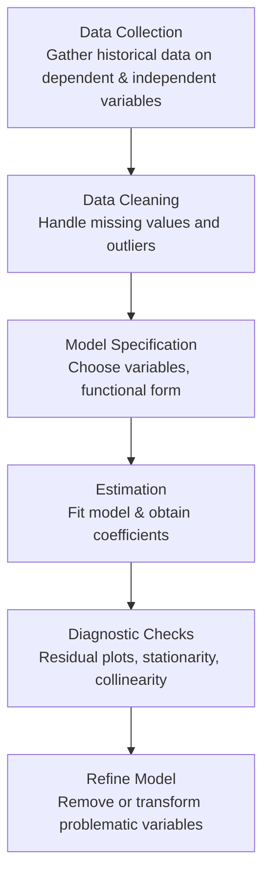

## Overview

Let’s say you’re just about ready to take on the CFA® Level II Quantitative Methods section. You’ve read through all the chapters on multiple regression, time-series analysis, machine learning, big data, and everything else that can make your head spin—especially if you’re up late at night, coffee in hand, trying to memorize tricky formulas. Well, fear not because in this full exam simulation, we’ll piece everything together in a realistic setting so that you can practice answering vignette-style questions under time constraints. 

It seems to me that the biggest challenge with the Level II exam is learning to manage your time across these item sets, each packed with details, data tables, and sometimes some sneaky wording. I’ve also noticed folks often overthink questions, or they might skip an important detail in the vignette. So here’s our chance to practice in a more controlled—but realistic—environment. 

We’re going to incorporate item sets that pull content from across the chapters in this volume—Chapters 1 through 15. Each vignette is designed to test a range of your skills: from basic multiple regression coefficient interpretation to advanced machine learning regularization concepts. We’ll also emphasize time-series stationarity checks, logistic regression modeling, and an occasional neural network question (yup, you read that right—machine learning is definitely fair game). 

Make yourself comfortable, set your favorite stopwatch or alarm, and attempt this practice exam under near-real conditions. That typically means no phone, no extra help from your friends (even though group study might be awesome at other times), and definitely no peeking at the solutions until after you finish each item set. I can’t promise you won’t be tempted, but remember, discipline goes a long way in mastering the CFA curriculum.

---

## Exam Format and Structure

Think of this as a mini version of the real thing. The standard recommendation for the CFA® Level II exam is about 18 minutes per item set—some folks say 15, but 18 is a decent average. Each item set typically has 4–6 questions. Here, we’ll give you a handful of vignettes, each with multiple-choice questions. The questions will mirror the immediate style of the actual exam:

• Data-rich vignettes that incorporate real or hypothetical financial scenarios.  
• Questions focusing on calculations (like forecasting with an Autoregressive model, or maybe constructing a confidence interval) and conceptual discussions (like how to recognize heteroskedasticity or when a time-series is nonstationary).  
• A consistent emphasis on explaining the “why” behind each question—once you reach the solutions.  

Treat each vignette in isolation. Carefully read the prompt, consider the data, maybe jot down formulas or relevant bullet points, and then attempt the questions. Once you’re done, you can review the solutions to see how well you scored and, perhaps more importantly, how well you reasoned through your approach.

---

## Timing Tips and Strategies

• Pace Yourself: Each vignette is designed to be answered in roughly 15–18 minutes. That includes reading the scenario, analyzing the data, responding to 4–6 questions, and double-checking your math. If you notice that you’re over time, practice triage. Triage basically means quickly identifying which questions you can solve right away and which ones are time sinks.  

• Read the Vignette Thoroughly: You might feel rushed to jump straight to the questions, but trust me, it’s more efficient to thoroughly read the entire item set once so that you understand the big picture. Then, start addressing the questions—each question might reference a different paragraph in the vignette, so keep your notes handy.  

• Watch Out for Sneaky Formulas and Concepts: For instance, if you see a question about a time-series model where the data might be nonstationary, check first for unit roots (like the famous Dickey-Fuller test). If you see a question about logistic regression, remember it’s about estimating the log-odds (or the logit) rather than a linear slope.  

• Deploy Your Calculator Skills: The exam does allow certain calculators. Be sure to practice each relevant calculation—whether that’s computing a Durbin–Watson statistic for autocorrelation or evaluating a p-value from a t-statistic. Usually, it’s best to have a small list of your go-to “button sequences” memorized. If you’re not comfortable with your calculator, you’re probably going to get stuck.  

---

## Content Coverage from Prior Chapters

Below is a quick refresher of what you’re expected to know (with some side notes where I think common pitfalls can pop up):

### Multiple Regression (Chapters 2 and 3)
• Formulating a regression model, interpreting coefficients, and understanding the assumptions.  
• Checking for significance: t-tests, p-values, confidence intervals.  
• R-squared vs. adjusted R-squared.  
• ANOVA table usage to test joint hypotheses.  
• Misspecification issues and residual analysis.  

### Model Misspecification (Chapter 4)
• Heteroskedasticity—inconsistent variance of residuals.  
• Autocorrelation, especially in time-series contexts.  
• Multicollinearity and how it distorts coefficient estimates.  
• Solutions like robust standard errors, transformation, or variable selection.  

### Extensions (Chapter 5)
• Dummy variables and interaction terms.  
• Logistic regression, outlier detection, and leveraging advanced features.  

### Time-Series Analysis (Chapters 6 and 11)
• Stationarity and unit root tests.  
• Linear and log-linear trend models.  
• Autoregressive (AR) models and ARMA, as well as ARIMA expansions.  
• Mean reversion and its investment implications.  
• Seasonality checks and corrections.  
• Cointegration, error correction models, and even vector autoregression.  

### Machine Learning (Chapters 7 and 12)
• Knowing the difference between supervised, unsupervised, and deep learning.  
• Regularization methods (e.g., Lasso, Ridge) to prevent overfitting.  
• Decision trees, random forests, gradient boosting.  
• PCA and cluster analysis for dimensionality reduction.  
• Neural networks, including a little about feedforward structures and reinforcement learning.  

### Big Data Projects (Chapter 8)
• Data wrangling, missing data imputation, normalization, and outlier handling.  
• Validation frameworks, cross-validation, and performance metrics.  

### Panel Data and Multivariate Techniques (Chapter 9)
• Fixed effects, random effects, and pooled OLS approaches.  
• Differences-in-differences for policy analysis or event studies.  

### Nonlinear Regression (Chapter 10)
• Polynomial terms, step functions, and regime-switching.  
• Probit, logistic expansions, or other nonlinear structures.  

### Simulation, Bayesian Methods, and Visualization (Chapters 13–15)
• Monte Carlo and bootstrap methods for risk analysis.  
• Bayesian updating and Markov Chain Monte Carlo.  
• Graphical methods to visualize data and residuals.  

---

## Operating Under Exam Constraints

1. Create a Quiet Environment: I’ve found that even the slightest distraction (like your phone buzzing) can break your flow during a practice exam. Set your devices aside, or put them on airplane mode.  

2. Strict Timer: Give yourself a total block of time. If you have, let’s say, 10 item sets, consider giving yourself no more than 180 minutes. Break it into intervals per vignette if needed, or just keep an eye on your watch.  

3. Simulate the Pressure: It may sound silly, but you might try to replicate exam day nerves. For instance, I sometimes used to hide a phone and have an alarm go off near the end “out of nowhere,” just to see if I could keep my focus despite the stress.  

4. After the Exam, Conduct a Post-Mortem: Check your answers carefully, see which ones you got wrong, and dig into why. Did you misread the question? Did you apply a formula incorrectly? Identifying the reason behind each slip-up is the magic behind improving your performance next time.  

---

## Detailed Vignette Approach

Reading and analyzing a vignette is a skill in itself. In each scenario, watch out for:

• Key Figures and Dates: If it’s a time-series question, watch how many observations you have and check for missing data or seasonality.  
• Trick Words: Words like “predict,” “forecast,” or “estimate” might signal a linear regression approach or a time-series approach. Words like “probability,” “classification,” or “log-odds” might hint at logistic regression or machine learning classification tasks.  
• Adjectives: Sometimes vignettes might say something like, “The data exhibits a pattern of residuals that consistently grow in magnitude as predicted values grow,” which is basically describing heteroskedasticity.  

Don’t skim. I know you might want to, but the real exam is all about reading comprehension plus domain knowledge.   

---

## Common Pitfalls

1. Misinterpreting the Vignette: One might misread a key assumption or fail to note that a variable was lagged in a time-series model, messing up the entire approach.  
2. Inappropriate Formula Usage: Particularly neglecting degrees of freedom in a t-test or ignoring the difference between one-tailed and two-tailed tests.  
3. Overlooking the Stationarity Requirement: Attempting to fit a linear regression when the series is nonstationary can lead to spurious regression results.  
4. Overfitting in ML Concepts: Attempting to memorize external frameworks for advanced machine learning. The exam typically tests conceptual understanding—like how Lasso handles features or how random forests average predictions across trees—rather than requiring you to code an entire neural net from scratch.  

---

## Short Example: AR(1) Forecast

Just to illustrate, let’s say you have an AR(1) model:

X_{t} = \phi_0 + \phi_1 X_{t-1} + \varepsilon_t 

And you’re forecasting \\( X_{t+1} \\). If you’re given \\(\phi_0 = 2, \phi_1 = 0.8\\), and \\(X_t = 10\\), then

\hat{X}_{t+1} = 2 + 0.8 \times 10 = 2 + 8 = 10.

Now, observe that your forecast at time \\( t+1 \\) is the same as the time \\( t \\) observed value. If you see a question like this, they might ask for a next-step forecast, or they might ask you to judge whether it’s mean-reverting (hint: if \\(|\phi_1| < 1\\), it’s mean-reverting to \\(\frac{\phi_0}{1 - \phi_1}\\)).  

---

## Visual Aid: Simple Workflow for a Multiple Regression

Below is a simplified Mermaid diagram to illustrate a typical multiple regression workflow:



This is a very simplified version, but it helps visualize the logical steps.  

---

## A Quick Python Snippet for Data Exploration

Sometimes, during your study or on-the-job tasks, you might use Python to do a quick regression or visualize data. For instance, if you have a Pandas DataFrame called df, you can do:

```python
import pandas as pd
import statsmodels.api as sm

# and 'x1', 'x2' are your independent variables.
X = df[['x1','x2']]
X = sm.add_constant(X)
y = df['y_variable']

model = sm.OLS(y, X).fit()
print(model.summary())
```

You’ll get an output with coefficient estimates, t-statistics, R-squared, and other relevant info. This is obviously more in-depth than the exam scenario (since you won’t be writing code there), but having personal experience with real data is often helpful for conceptual understanding.

---

## Tips on Reviewing Results

When you see your results, check:

• Coefficient signs: Are they logical given the domain knowledge?  
• Significance: Are the p-values small enough (under 0.05 or 0.1, depending on your threshold)?  
• Residual standard error: Is it small enough to be considered precise for predictions?  
• Adjusted R-squared: Does the model explain enough variance without being overly complex?  

---

## Post-Exam Reflection

After you finish your practice test:

1. Tally Your Score: See which item sets gave you the most trouble.  
2. Identify Patterns: Do you consistently falter on time-series forecasts, or maybe on logistic regression interpretation? That’s your cue to review those topics.  
3. Check Timing: Did you go over the allocated time for each vignette? If so, refine your strategy—maybe skip the hardest question and come back at the end if time allows.  
4. Keep a Running Journal: I personally used to keep a small notebook with “lessons learned” for each practice exam. It can be a goldmine of insight right before the actual test.  

---

## References for Further Reading

• CFA Institute. CFA® Program Curriculum Level II. (Focus on all official readings in Quantitative Methods, particularly the practice problems).  
• Gujarati, D.N. & Porter, D.C. (2009). “Basic Econometrics.”  
• Tsay, R. (2010). “Analysis of Financial Time Series.”  
• CFA Institute Learning Ecosystem: https://www.cfainstitute.org/en/programs/cfa/exam/learning-ecosystem  

---

## Practice Quiz: Full Simulation Drills on Quantitative Methods

Below, you’ll find 10 representative sample questions. They’re not a full exam on their own, but each question ties back to concepts spread across multiple chapters. Treat them as a quick litmus test or a final check on your readiness.

## Practice Questions: "CFA Level II Quantitative Methods Sample Exam"



### Which of the following best describes a common pitfall when reading vignette-style questions?

- [ ] Focusing primarily on the first and last paragraphs of the vignette.
- [x] Skimming the vignette too quickly and missing crucial details impacting calculations.
- [ ] Answering the conceptual questions before the calculation-based questions.
- [ ] Immediately looking up formulas without understanding the data context.

> **Explanation:** Many candidates rush through reading the vignette. This often leads to overlooked details that can directly affect calculations or assumptions.


### In a multiple regression model where heteroskedasticity is present, which correction would typically be most appropriate?

- [ ] Increasing the sample size to reduce sampling error.
- [x] Using robust (White) standard errors to adjust t-statistics.
- [ ] Dropping independent variables until the residuals become homoskedastic.
- [ ] Applying a Durbin-Watson statistic to check for autocorrelation.

> **Explanation:** Heteroskedasticity refers to non-constant variance of error terms. A common remedy is to adjust standard errors with techniques like White’s robust standard errors.


### You have the following AR(1) model: Xₜ = 2 + 0.9 Xₜ₋₁ + εₜ. Which statement is true regarding mean reversion?

- [ ] The model is mean-reverting to 0.
- [x] The model is mean-reverting to 20 if |0.9| < 1.
- [ ] The model will not mean-revert because the coefficient is less than 1.
- [ ] The process is not stationary because the coefficient is greater than 0.5.

> **Explanation:** For an AR(1) process Xₜ = φ₀ + φ₁ Xₜ₋₁ + εₜ, the long-run mean or mean-reverting level is φ₀ / (1 – φ₁), provided |φ₁| < 1. Here, 2 / (1 – 0.9) = 20.


### In logistic regression, the logit value corresponds to:

- [ ] The natural log of the linear regression slope.
- [ ] The predicted probability of success.
- [x] The natural log of the odds ratio (p/(1-p)).
- [ ] The rate of change of the logistic curve.

> **Explanation:** Logistic regression models the logit, which is ln(p/(1–p)), where p is the predicted probability.


### Which best defines multicollinearity in a multiple regression setting?

- [x] High correlation among independent variables that leads to unreliable coefficient estimates.
- [ ] Perfect correlation between the dependent and one independent variable.
- [ ] Uncorrelated error terms across observations.
- [ ] Regressing two correlated dependent variables without adjusting for degrees of freedom.

> **Explanation:** Multicollinearity occurs when two or more independent variables in a model are highly correlated, making it difficult to identify precise effects for each.


### To detect seasonality in a time-series, one might:

- [ ] Examine the t-statistic for the coefficient on a dummy variable representing global GDP.
- [x] Include seasonal dummy variables (e.g., monthly or quarterly) and check their significance.
- [ ] Perform only a Dickey-Fuller test for stationarity.
- [ ] Use a White test to confirm heteroskedasticity.

> **Explanation:** Seasonality is typically handled by introducing dummy variables for each season, then checking whether those coefficients significantly affect the model.


### In a multiple regression model with 10 independent variables and 200 observations, what are the degrees of freedom for the error term?

- [ ] 200
- [ ] 190
- [ ] 189
- [x] 189 if one coefficient is the intercept and 10 are slope parameters

> **Explanation:** Degrees of freedom = (n – k – 1), where n = number of observations and k = number of independent variables. Here, 200 – 10 – 1 = 189.


### For a neural network classifier, overfitting is best mitigated by:

- [ ] Using standard weekly retraining.
- [ ] Inserting dummy variables for each hidden neuron.
- [x] Employing regularization techniques such as dropout or L2 penalty.
- [ ] Switching to logistic regression instead of a neural network.

> **Explanation:** Neural networks can easily overfit. Methods like dropout, weight regularization (L2), or early stopping help prevent the model from memorizing noise.


### You want to test whether two independent variables jointly have zero coefficients. Which test is most appropriate?

- [ ] A two-tailed t-test on individual coefficients.
- [ ] The Durbin-Watson test for autocorrelation.
- [x] An F-test for joint significance.
- [ ] A White test for heteroskedasticity.

> **Explanation:** An F-test is used to determine whether multiple coefficients can be simultaneously set to zero, making it appropriate for joint hypothesis testing.


### True or False: In panel data models, random effects are more efficient than fixed effects only when the random effects assumption (i.e., that the unobserved individual effect is uncorrelated with the regressors) holds.

- [x] True
- [ ] False

> **Explanation:** Random effects models assume the unobserved individual effect is uncorrelated with the explanatory variables. If that assumption is violated, fixed effects models are typically preferred.



---

Use these questions under test conditions if you can: set a timer, answer them carefully, and then check your performance. While they’re just a brief sampling, they’ll let you know if you’re comfortable with the broad range of topics covered in prior chapters.

Good luck with your studies, and remember that mastery comes from practicing questions in a realistic setting, refining your approach, and learning from mistakes along the way!
