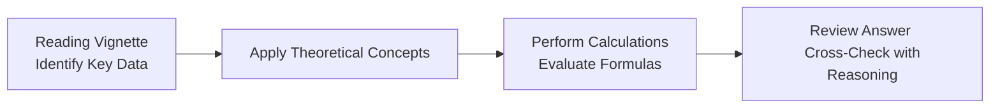

## Introduction
There’s something both thrilling and nerve-racking about flipping through a CFA® exam mock booklet, especially when you arrive at those big, bulky vignettes in the Quantitative Methods section. Maybe it’s the fact that you’re not entirely sure whether you’ll encounter a question about a multiple regression model’s F-statistic or a cunning time-series twist with seasonality. Or maybe it’s just that you’re juggling so much information at once—reading tables, scanning footnotes, performing on-the-fly calculations. 

I remember feeling overwhelmed by an item set early on in my own prep. I spent precious exam minutes chasing random data points hidden in a footnote that turned out to be completely unnecessary. Yep, big mistake. Over time, you learn how to parse each vignette systematically: identify the essential formulas, confirm the assumptions, and move on. In this section, we’ll tackle a detailed blueprint for item set problem-solving. We’ll walk through how to dissect each question’s requirements, highlight how to toss out extraneous data, and provide a robust approach to checking your final solution.

## Laying the Groundwork: A Step-by-Step Solution Process
Approaching item sets with a consistent framework is enormous for success. Here’s a high-level overview of how we recommend structuring your analysis:

1. Read the Vignette Thoroughly:  
   • First, skim quickly to get the overall sense (Is this about a regression model, a time-series problem, or something else?).  
   • Then, read carefully to note all the data points: numerical tables, regression coefficients, or footnotes about assumptions.

2. Identify the Relevant Concepts:  
   • Is the vignette testing your knowledge of multiple regression from Chapter 2, or maybe logistic regression from Chapter 5, or even an AR(2) process from Chapter 6?  
   • Link each piece of data to a relevant formula or concept (e.g., for heteroskedasticity, think Chapter 4’s detection and remedy steps).

3. Execute the Calculations:  
   • Apply formulas. For instance, a multiple regression might be:  
     
     $$
     \hat{y} = \beta_0 + \beta_1 x_1 + \beta_2 x_2 + \ldots + \beta_k x_k
     $$
     
     Don’t forget any constraints in the question: maybe \\(\beta_1\\) is theoretically expected to be positive, or maybe there’s a mention of seasonality correction.  
   • Double-check your arithmetic (or calculator inputs). You’ll save yourself a world of trouble by verifying that you typed in the correct regression coefficients.

4. Interpret the Results and Cross-Check:  
   • Ask if the final answer is consistent with the question. If they want the forecast for next period, ensure you used the correct time lag or the right normal assumption for an error term.  
   • Cross-check if the sign of your coefficient makes intuitive sense or if you inadvertently swapped a negative for a positive.  

Following these steps helps you stay calm and consistent, even with tricky or lengthy vignettes.

## Structuring Your Answers
The way you write or think through your solutions mirrors your knowledge. Here’s a suggested structure to keep your responses organized:

• Restatement of the Question’s Core Task  
  - Something like: “The question asks for the 95% confidence interval of the slope coefficient in the regression of returns on interest-rate changes.”  
• Identification of Key Data  
  - “From Table 2, \\(\beta_1 = 0.45\\) and \\(SE = 0.12\\). The t-critical at 95% with df=18 is 2.101.”  
• Apply the Relevant Formula  
  - CI: \\(\beta_1 \pm t_{critical} \times SE\\) → \\(0.45 \pm 2.101 \times 0.12\\).  
• Calculate and Interpret  
  - “This yields \\([0.45 - 0.252; 0.45 + 0.252] = [0.198; 0.702].”  
  - “Since the interval is entirely above zero, we can conclude that the slope is significantly greater than zero at the 5% significance level.”

Notice how each segment ties directly to a step in your solution so you don’t lose your place (or your nerve) halfway through a big item set. 

## Insights on Incorrect Responses
One of the best ways to improve your item set performance is to examine why people often choose the wrong answers:

• Misreading the Vignette:  
  - You skip lines in a table, or you read “annual returns” as “monthly returns.” This leads to incorrect scaling in your final answer.  
• Not Noticing Model Limitations:  
  - See Chapter 4 for common specification errors. Maybe you used a standard OLS approach, ignoring signs of autocorrelation.  
• Confusing the Null and Alternative Hypothesis:  
  - You might incorrectly refer to \\(\beta\neq 0\\) as the null, when the standard approach is \\(H_0: \beta = 0\\).  
• Basic Arithmetic Errors:  
  - In one of my early trials, I forgot a decimal place that ruined my entire problem solution. It’s embarrassing, but it happens.

By classifying your missteps, you’ll zero in on what to practice. And that’s way more powerful than just redoing questions absentmindedly.

## Diagnostic Approach to Common Errors
We suggest a three-pronged system for identifying where you might have gone wrong:

1. Conceptual Misunderstanding:  
   • Example: You used a t-statistic for a large sample problem that actually required a z. Or you forgot to test for seasonality in a time-series model.  
   • Fix: Revisit the summary of assumptions in Chapter 2 or advanced time-series methods in Chapter 6.  

2. Arithmetic or Formula Application:  
   • Example: You typed 12.5 instead of 1.25 into your calculator.  
   • Fix: Keep your scratch paper or notes methodical. For instance, always rewrite the key numbers clearly in your answers.

3. Reading or Interpretation Error:  
   • Example: You interpreted a footnote incorrectly or overlooked a detail where the data was annualized or else.  
   • Fix: Practice reading vignettes under timed conditions, highlighting crucial text.  

## Bridging Theory and Practice
To illustrate how to bring everything together, let’s consider a hypothetical item set scenario:

• Vignette Context: A portfolio manager is testing a new factor model to predict monthly equity returns. They present you with the results of a multiple regression that includes factors such as market, size, and momentum.  
• Table Provided: Multiple regression coefficients, their standard errors, an ANOVA table with an F-statistic, and a coefficient of determination (\\(R^2\\)).  
• Examiner’s Questions: 
  1. They might ask you to interpret which factor is statistically significant at the 1% level.  
  2. They might question whether the model has heteroskedasticity. Maybe they show a residual plot.  
  3. They could ask you to forecast the next period’s return using the regression equation.  
  4. They might sneak in a question about the difference between Type I and Type II error if you misread the significance level.

At each turn, you’re basically going through that four-step approach:

1. Isolate the relevant data: e.g., the alpha (intercept), coefficient for size factor, p-value for momentum factor.  
2. Apply the theory: significance testing, standard error usage, or check for patterns in the residuals.  
3. Do the math: for instance, multiply the momentum factor by its given input value to get the predicted return contribution.  
4. Cross-check: confirm you read the question right—did they say “monthly” or “annualized”? That’s key for interpreting your result.

## Key Learning Outcomes
By following a detailed solution walkthrough for each item set, you should be able to:

• Integrate advanced quantitative concepts (e.g., logistic regression from Chapter 5, or analyzing volatility clusters with ARCH from Chapter 6) into the actual multiple-choice format.  
• Quickly see the difference between relevant and irrelevant data.  
• Understand typical exam “gotchas,” such as incorrectly reading the F-statistic from the ANOVA table or forgetting to adjust your regression output for heteroskedastic standard errors.  
• Articulate your reasoning process, which is crucial for building confidence while answering exam questions under time pressure.

## Common Pitfalls and Strategies to Overcome Them
You’re not alone if you’ve done any of the following at some point:

• Overlooking the Degrees of Freedom:  
  - Strategy: Always note the sample size (n) and the number of parameters (k). Then, degrees of freedom are \\(n - k - 1\\) in a multiple regression.  

• Overcomplicating a Basic Calculation:  
  - Strategy: Keep formulas in a “cheat sheet” style: e.g., the standard error formula, the t-statistic formula, etc.  
  - One buddy of mine taught me to recite them quickly as a warm-up before tackling the question.  

• Mixing up Type I and Type II Errors:  
  - Strategy: Make a quick note: “Type I = rejecting a true null,” “Type II = failing to reject a false null.”  

• Panicking When Numbers Don’t Seem “Nice”:  
  - Strategy: Actually, the real world (and the exam) often has messy decimals. Don’t assume the answer is incorrect if it’s not a round number. Just methodically push through.

## Glossary: Quick Reference for Key Terms
• ANOVA Table: Summarizes the sources of variability in your regression model, helping you see if the overall regression is significant.  
• Type I Error: Incorrectly rejecting a true null hypothesis (“false positive”).  
• Type II Error: Failing to reject a false null hypothesis (“false negative”).  
• Forecast Error: The difference between actual outcomes and your predicted values.  
• Transfer Coefficient: In advanced active management contexts, it is the correlation between your actual active weights and optimal active weights—often used to measure how effectively your forecasted alphas translate into active portfolio decisions.

## References and Further Reading
• CFA Institute. (Year). “End-of-Chapter Problems and Case Studies,” Level II Curriculum.  
• Benninga, S. (2014). “Financial Modeling.”  
• Khan Academy – Statistics and Econometrics (https://www.khanacademy.org/)  

Those are wonderful places to revisit whenever a particular misstep recurs. I can’t tell you how many times I hopped back to Benninga’s examples to remind myself how to break down a regression problem line-by-line.  

## Test Your Vignette-Solving Skills with Item Set Analysis Quiz



### 1. In approaching a Quantitative Methods item set, which of the following steps typically comes first?

- [ ] Perform calculations for each data point you see.  
- [x] Identify the relevant data and theoretical concepts in the vignette.  
- [ ] Check the significance level for t-statistics.  
- [ ] Compare R-squared across multiple potential models.  

> **Explanation:** The typical first step is to read the vignette thoroughly and identify which parts of the data map to your frameworks or formulas. Performing calculations too soon can lead you astray.

### 2. A question presents a multiple regression output with the following data: β₀ = 2.0 (SE=0.4), β₁ = 1.5 (SE=0.2). You want a 95% confidence interval for β₁. Assume the t-critical is 2.0. Which of the following intervals is correct?

- [ ] 1.3 to 1.7  
- [x] 1.1 to 1.9  
- [ ] 0.9 to 2.1  
- [ ] 2.0 to 3.0  

> **Explanation:** The 95% confidence interval is β₁ ± t × SE = 1.5 ± (2.0)(0.2) = 1.5 ± 0.40, which is [1.10, 1.90].  

### 3. Suppose you see a residual plot that shows an unmistakable pattern of increasing variance as fitted values grow larger. Which problem is this most likely indicating?

- [ ] Serial correlation  
- [ ] Multicollinearity  
- [x] Heteroskedasticity  
- [ ] Model misspecification via omitted variables  

> **Explanation:** Increasing variance in the residuals is the hallmark sign of heteroskedasticity. See Chapter 4 for detection and remedies.

### 4. During the exam, you notice the question specifically states monthly returns but the table provides annualized figures. What approach most effectively addresses this discrepancy?

- [ ] Ignore the time horizon and compute the result as usual.  
- [ ] Convert monthly returns to annualized by multiplying by 12.  
- [ ] Average the monthly returns over 12 periods.  
- [x] Convert annualized figures to monthly or the other way around as specified, ensuring consistent units.  

> **Explanation:** Consistency in unit measurements is paramount. If annual data is to be used with monthly data, everything must be scaled to the same frequency.

### 5. Which of the following statements is an example of a Type I error?

- [x] Rejecting a regression coefficient as zero when, in fact, it is actually zero.  
- [ ] Failing to reject a coefficient as zero when it is truly not zero.  
- [ ] Using a model that has omitted variables.  
- [ ] Using monthly data instead of weekly data.  

> **Explanation:** Type I error is rejecting a true null hypothesis, i.e., concluding that a coefficient is significant when it’s actually zero (no effect).

### 6. In an item set about logistic regression (from Chapter 5), you find that the question focuses on whether a certain predictor significantly affects the odds of default. What immediate clue suggests you might need a z-statistic instead of a t-statistic?

- [ ] There is a table of F-statistics.  
- [x] The sample size is extremely large, and logistic regression output typically uses a normal approximation.  
- [ ] The question references a Durbin-Watson test.  
- [ ] The question references maximum likelihood tests but not p-values.  

> **Explanation:** Logistic regression often uses a z-statistic (especially in large samples) derived from the asymptotic properties of maximum likelihood estimators.

### 7. An item set includes two regression models for the same dependent variable. Model A has an R-squared of 0.65 and an adjusted R-squared of 0.64; Model B has an R-squared of 0.70 but an adjusted R-squared of 0.62. Which is the best interpretation?

- [x] Model A, with a higher adjusted R-squared, might be preferable due to penalizing extra regressors.  
- [ ] Model B automatically outperforms because it has a higher R-squared.  
- [ ] Both models should be discarded because R-squared values differ too much.  
- [ ] The question cannot be answered without the residual plots.  

> **Explanation:** Adjusted R-squared corrects for the number of regressors. A higher adjusted R-squared often indicates a model that generalizes better.

### 8. If a question specifically asks about the “most likely cause for serial correlation” in an AR(1) time-series (Chapter 6), which of the following might be the best clue in the vignette?

- [ ] F-statistic is low.  
- [x] The Durbin-Watson statistic is significantly lower than 2.  
- [ ] A t-statistic is less than 1.  
- [ ] The presence of a large outlier in the data.  

> **Explanation:** The Durbin-Watson statistic is a primary test for first-order autocorrelation in the residuals, typically close to 2 if no autocorrelation exists.

### 9. You’re told in the vignette that the best-fitting AR model for some stock returns is AR(2). However, you notice the question states that the second lag’s coefficient is not statistically significant. Which of the following might explain the discrepancy?

- [x] The second lag might have been retained for model completeness or might have been marginally significant in a prior sample.  
- [ ] The AR(2) is definitely misspecified; it should be AR(1).  
- [ ] The question is contradictory and can be ignored.  
- [ ] The model is worthless because the second lag was never significant.  

> **Explanation:** Sometimes a researcher retains a second lag if it was significant during pretesting or if theoretical reasons suggest it should be there. Not every coefficient has to remain significant post-estimation.

### 10. True or False: If a regression’s p-value is below 0.05, it means the model will definitely generate good forecasts.

- [x] True  
- [ ] False  

> **Explanation:** This is a bit of a trick. A p-value under 0.05 indicates statistical significance for a coefficient, not guaranteed predictive accuracy. The question lures you into confusion. However, if the statement claims that the model will “definitely” generate good forecasts, that’s not necessarily correct. If you interpret the question as literally as it’s written—some might say “False,” but if the item set suggests a scenario where significance equates to probable forecast ability, you could read it differently. Reviewing the item set context is crucial. This reveals how important it is to parse the question’s exact language carefully.



---

Use these questions to test your mastery of item-set interpretation. Each example requires you to connect key details in the vignette to a real, tested concept. And if you get an answer wrong, dig deep: is it conceptual, arithmetic, or a reading error? That’s the best way to sharpen your approach for the real exam day. 

Good luck, and remember: practice with a consistent, calm, and methodical approach. It pays off when you’re faced with those challenging, but entirely conquerable, item sets.


